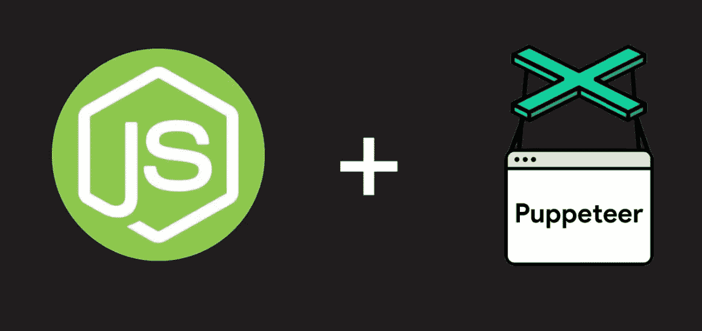
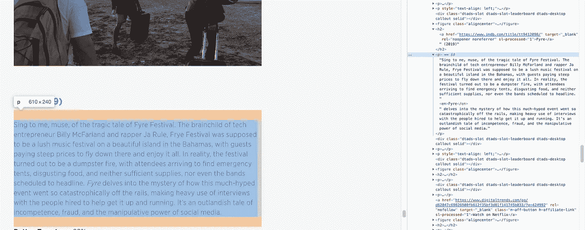
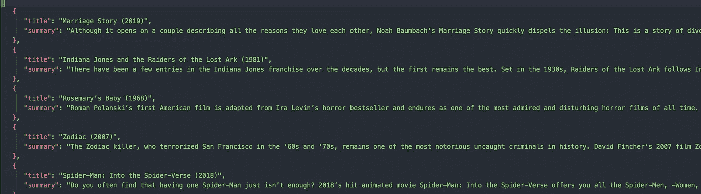

# 使用 Node.js 中的 Puppeteer 进行网页抓取

> 原文：<https://javascript.plainenglish.io/web-scraping-with-puppeteer-in-node-js-4a32d85df183?source=collection_archive---------7----------------------->



你是否曾经想使用你最喜欢的公司或网站的 API 来开发一个新的应用程序项目，却发现他们要么 a)从一开始就没有这样的 API，要么 b)已经根除了它的 API 供公众使用？(我正看着你，网飞)嗯，这就是发生在我身上的事，作为一个坚持不懈的人，我发现了解决这个问题的方法:网络抓取。

网络抓取是一种使用软件从网站自动提取和收集数据的技术。收集数据后，您可以使用它来制作自己的 API。

有许多技术可以用于网络抓取；Python 是一种流行的语言。然而，我是一个 JavaScript 类型的女孩。因此，在这篇博客中，我将使用 Node.js 和 Puppeteer。

Puppeteer 是一个 Node.js 库，允许我们在后台运行 Chrome 浏览器(称为无头浏览器，因为它不需要图形用户界面)，并帮助从网站提取数据。

因为我们大多数人都被新冠肺炎扣在家里做人质，所以看网飞狂欢成了很多人的流行消遣(除了哭我们还能做什么？).为了支持我那些优柔寡断、无聊透顶的网飞观众，我找到了一个网站，[https://www . digital trends . com/movies/best-movies-on-网飞/](https://www.digitaltrends.com/movies/best-movies-on-netflix/) 列出了 2020 年 4 月可以观看的最佳电影。一旦我抓取了这个页面并检索了数据，我想把它存储在一个 JSON 文件中。这样，如果我需要一个最新的网飞电影 API，我可以从这个库中获取数据。

# 入门指南

首先，我在我的 VSCode 中创建了一个名为`webscraper`的文件夹。在这个文件夹中，我将创建一个名为`netflixscrape.js`的文件。

在终点站，我们需要安装木偶师。

```
npm i puppeteer
```

接下来，我们需要导入所需的模块和库。`netflixscrape.js`中的第一行代码将是:

```
const puppeteer= require('puppeteer')
const fs = require('fs')
```

`fs`是 Node.js 文件系统模块。我们将需要使用它从我们的数据中创建一个 JSON 文件。

# 编写抓取函数

让我们开始编写我们的`scrape()`函数。

```
async function scrape (*url*) {
const browser = await puppeteer.launch();
const page = await browser.newPage();
await page.goto(url)
```

`scrape()`将接受一个 url 的参数。我们使用`puppeteer.launch()`启动浏览器。在浏览器上打开一个空白页。然后，我们告诉浏览器转到指定的 url。

## 如何检索我们想要抓取的数据

为了从站点中抓取我们想要的数据，我们需要使用特定的 HTML 元素来抓取数据。进入[https://www . digital trends . com/movies/best-movies-on-网飞/](https://www.digitaltrends.com/movies/best-movies-on-netflix/) 并打开 Inspector/Chrome DevTools。为此:

Mac 上的“command + option + j”或 Windows 上的“control + shift + j”

由于我想从文章中获取电影的标题和摘要，我看到我必须选择`h2`元素(标题)和它的“兄弟`p`元素(摘要)。


h2 for movie title



p for movie summary

## 如何操作检索到的数据

继续我们的代码:

```
var movies = await page.evaluate(() => {
   var titlesList = document.querySelectorAll('h2');
   var movieArr = []; for (var i = 0; i < titlesList.length; i++) {
      movieArr[i] = {
     title: titlesList[i].innerText.trim(),
     summary: titlesList[i].nextElementSibling.innerText.trim()
   };
}
return movieArr;
})
```

`page.evaluate()`用于进入网站的 DOM，并允许我们运行定制的 JavaScript 代码，就像我们在 DevTools 控制台中执行它一样。

`document.querySelector('h2')`选择页面上所有的`h2`元素。我们将它们全部保存在`titlesList`变量中。

然后，我们创建一个名为`movieArr`的空数组。

我们希望将每部电影的标题和摘要保存在各自的对象中。为了做到这一点，我们为循环运行一个**。循环表明`movieArr`中的每个元素都等于一个具有`title`和`summary`属性的对象。**

要得到电影片名，我们要经过`titlesList`，都是`h2`元素节点。我们应用`innerText`属性来获取`h2`的文本。然后，我们应用`.trim()`方法来删除任何空白。

如果您仔细浏览过 DevTools 控制台，您会注意到该页面有许多没有唯一类或 id 的`p`元素。因此，很难准确地抓住我们需要的 summary `p`元素。为了解决这个问题，我们调用了`h2`节点上的`.nextElementSibling`属性(titlesList[i])。当您仔细查看控制台时，您会看到摘要的`p`元素是标题的`h2`元素的兄弟。

## 将抓取的数据存储到 JSON 文件中

现在我们已经完成了主要的数据提取部分，让我们将所有这些存储在一个 JSON 文件中。

```
fs.writeFile("./netflixscrape.json", JSON.stringify(movies, null, 3), (*err*) => {
if (err) {
console.error(err);
return;
};
console.log("Great Success");
});
```

`fs.writeFile()`创建一个新的 JSON 文件，包含我们的电影数据。它接受 3 个参数:1)要创建的文件的名称

2) **JSON** 。 **stringify** ()方法将 JavaScript 对象转换为 **JSON** 字符串。这里有三个参数。对象:`movies`、replacer(过滤掉你做的或者不想做的属性):`null` ，以及 space(用来在输出的 JSON 字符串中插入空格以增加可读性):`3`。这种方式本质上使 JSON 文件更漂亮、更干净。

3) `err`，以防出错

`err`采用一个回调函数，声明如果有错误，console.log 错误。如果没有错误，console.log“大获成功”

最后，将整个代码放在一起:

我们添加`browser.close()`来关闭木偶浏览器。我们用 url 调用最后一行中的`scrape()`函数。

# 最后一步:运行 scrape()函数

让我们通过在终端中键入`node netflixscrape.js`来运行这段代码。

如果一切顺利(这是应该的)，您将在您的控制台中获得“巨大成功”，您将看到一个新创建的 JSON 文件，其中包含所有网飞电影的标题和摘要。



恭喜你。！👏你正式成为黑客了！开玩笑的。但是现在你知道了如何从网络上获取数据并创建你自己的 API，这更令人兴奋。

## **用简单英语写的 JavaScript 笔记**

我们已经推出了三种新的出版物！请关注我们的新出版物:[**AI in Plain English**](https://medium.com/ai-in-plain-english)，[**UX in Plain English**](https://medium.com/ux-in-plain-english)，[**Python in Plain English**](https://medium.com/python-in-plain-english)**——谢谢，继续学习！**

**我们也一直有兴趣帮助推广高质量的内容。如果您有一篇文章想要提交给我们的任何出版物，请发送电子邮件至[**submissions @ plain English . io**](mailto:submissions@plainenglish.io)**，并附上您的 Medium 用户名，我们会将您添加为作者。另外，请让我们知道您想加入哪个/哪些出版物。****