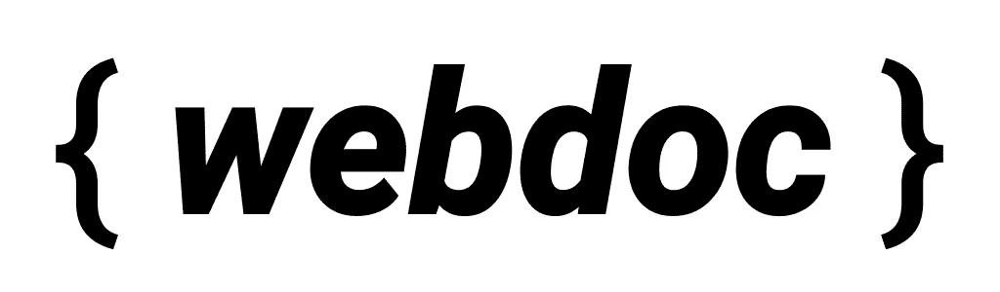

# webdoc:下一代文档工具

> 原文：<https://javascript.plainenglish.io/webdoc-the-next-generation-documentation-tool-3e32b5f50c3e?source=collection_archive---------4----------------------->

## 它提供什么？

我很高兴本周推出 webdoc 1.0.0-RC。它的目标是成为一个无所不包的解决方案，用于记录用面向 web 的语言构建的库。

webdoc’s simple logo!

# 为什么？

无论你的软件多么有用，没有令人信服的文档，没有人会检查它。文档成为最后优先的项目是没有意义的。JSDoc、ESDoc、documentation.js、YUIDoc 都是*不主动维护的*也无济于事。

显然，创新在这一领域已经跌落悬崖 webdoc 旨在填补这一空白。

与竞争对手相比，webdoc 有什么优势？

*   它比 JSDoc 快得多——构建 PixiJS API 文档的速度比 JSDoc 快 67%！(从大约 30 秒到不到 10 秒)
*   与 JSDoc 和 TypeDoc 不同，它*不依赖于特定的语言*，它的解析器可以很容易地与其他语言集成。它将默认支持 JavaScript、JS+Flow 和 TypeScript。这意味着当迁移到另一种语言时，你不需要改变你的文档工具。
*   与 JSDoc 不同，它支持类型注释。与 TypeDoc 不同，它支持所有 JSDoc 标签。它汇集了所有世界的精华！

这只是一个描述 1.0.0 版本的小列表。我也有很多东西在待办事项中等待着——包括文档覆盖和质量度量。

> 在下一个版本中，PixiJS 也将迁移到 webdoc 来生成 API 文档！

# 它是如何工作的

webdoc 在以下阶段运行管道:

*   解析阶段:使用 Babel 或任何语言解析器，创建一个初步的符号元数据树。符号以未加工的形式代表任何可记录的实体。它还有与之相关的元数据——类型信息、方法签名、扩展类、实现的接口、类型参数等等。
*   汇编阶段:来自每个文件的所有符号元数据树被合并成一个大的项目级树。这里隐藏着一个优化— **并行解析文件**，尽管这并没有计划在 1.0.0 版本中实现！
*   转换阶段:然后将每个符号转换成一个“文档”。这包括阅读文档注释和组织其中包含的信息。然后验证这些信息并与元数据合并。
*   文档树修改:在文档树上发生一系列有序的修改，包括:解析`@memberof`标签；链接超类、实现的接口、混合的 mixins 修剪未记录/忽略的符号，继承类方法&属性等。
*   呈现阶段:一个“模板”包将获取文档树并生成一个文档网站。

符号元数据和文档的分离是 webdoc 与众不同的地方。**解析符号是语言相关的，转换是语言不可知的**。

将另一种语言与解析器集成只需要为该特定语言生成一个符号树 webdoc 的解析器会处理剩下的事情。

# 移民

webdoc 支持完整的 JSDoc 标签集，还具有 TypeDoc 的类型推断能力。作为最终用户，您*除了将您的* `jsdoc.conf.json` *文件重新配置为* `*webdoc.conf.json*` *之外，不需要做任何更改。*

然而，您的模板将需要移植到使用 webdoc 的 API。

JSDoc 默认模板上的`@webdoc/legacy-template`包移植&你可以在这里预览:[https://webdoc-js . github . io/example-documentation/index . html](https://webdoc-js.github.io/example-documentation/index.html)

遗留模板在 JSDoc 提供的基础上增加了这些特性:

*   将源位置链接到 GitHub 存储库
*   源代码已经过重构以提高清晰度，因此定制它比以往任何时候都更容易

# 进一步的工作

在 webdoc 的背后，有许多新的概念等着被推出。这包括:

*   将其他流行的 JSDoc 模板如 [docstrap](https://github.com/docstrap/docstrap) 、 [JaguarJS](https://github.com/davidshimjs/jaguarjs-jsdoc) 、 [TUI](https://github.com/nhn/tui.jsdoc-template) 、 [minami](https://github.com/phase-software/pixi-renderer/blob/248546b5496e76dd034e2b18a3a369a442ef4c15/src/Node.js#L167) 和 [argon](https://github.com/Oza94/jsdoc-template-argon) 移植到 webdoc
*   为 webdoc 创建默认模板。它看起来会像谷歌为安卓系统编写的文档。
*   为覆盖率和质量测量创建一个插件。我甚至计划创建一个 GitHub 应用程序来报告 PRs 上的覆盖差异。
*   增加对 CoffeeScript、Elm、ClojureScript 和其他新的 web 语言的支持。

嘿，伙计们，这个 Shukant 的朋友——一个在 [PixiJS](https://github.com/pixijs/pixi.js) 的 WebGL 开发和维护者。关注我这里获取我的内容:[https://twitter.com/ShukantP](https://twitter.com/ShukantP)