# WebGL 框架:Three.js vs Babylon.js

> 原文：<https://javascript.plainenglish.io/webgl-frameworks-three-js-vs-babylon-js-36975d915694?source=collection_archive---------0----------------------->

## 争夺最佳 WebGL 框架:我讲述的故事

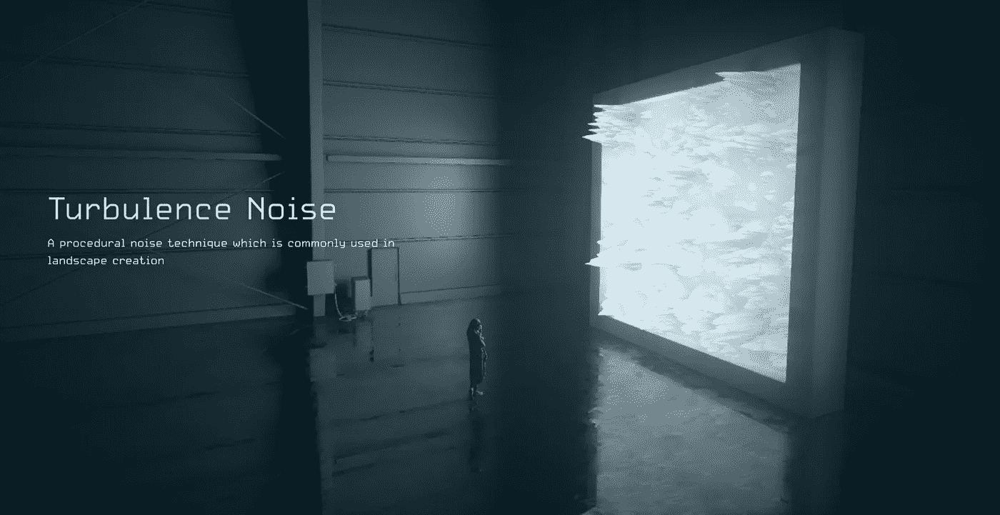

CineShader.com, a website featured on threejs.org

也许你已经研究过了 *slack* 和 *Github* ，并且你已经仔细研究了一长串的利弊，但是你仍然不能确定哪一个适合你。

然后，你会选择一个。在许多情况下，这可能没那么重要。因为条条大路通罗马，对吧？

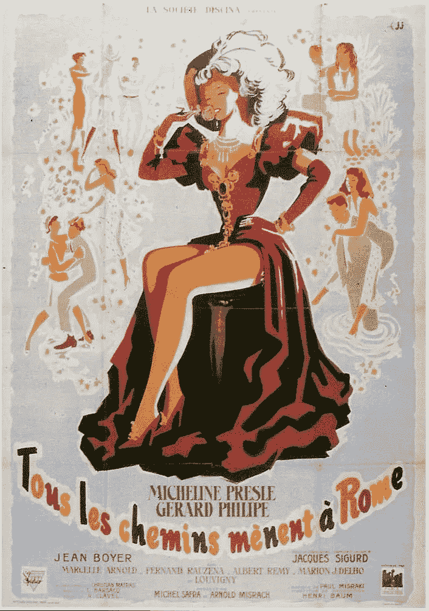

[Tous les chemins mènent à Rome](https://www.imdb.com/title/tt0041977/) All Roads Lead to Rome (Movie 1949)

我就是这么做的。我很勇敢，在鸟类迁徙路线可视化项目的截止日期前，选择了一个新的开发工具。

# 如何选择

如果你同意的话，这不是一个基于完全信息的决定。

简单介绍一下决策理论的背景。象棋是一个完全信息的博弈；德州扑克不是，因为它有隐藏的信息，你的牌不会透露给其他玩家。

当情况复杂时，你需要根据你收集到的不完善的信息来决定什么对你最重要。这意味着你做的决定可能不是最好的；不过，你知道的越多，你的决定可能就越好。

# 第一印象

网站被认为是给我的第一印象。threejs.org*的登陆页面很干净，展示了一些非常令人印象深刻的项目；babylonjs.com 的网站是极简主义的，展示了实时渲染的最佳功能，但并不立即吸引人。*

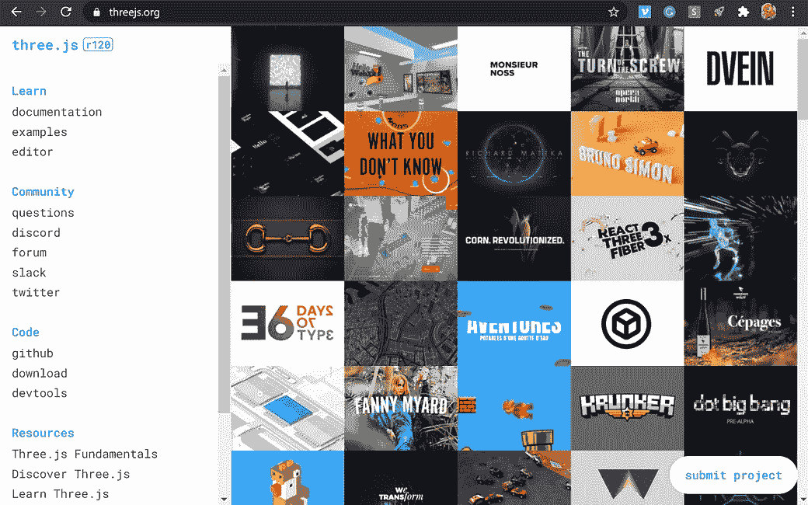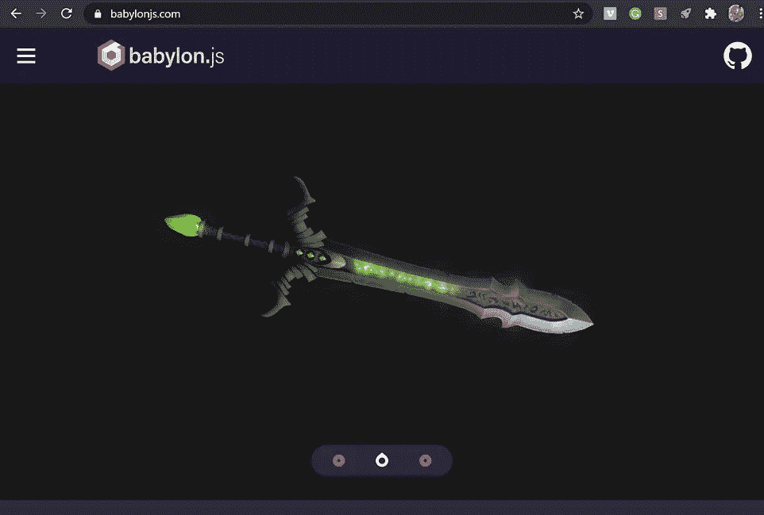

# 证明文件

如果你对你的项目有点认真，你应该注意软件工具的文档。事实上，three.js 和 babylon.js 都有非常好的文档，**在**之后你定位到你要找的东西。

Three.js 以你期望的方式组织文档，就像其他软件一样；babylon.js 有一些创新的想法，特别是当它大量地将 Playground 作为文档示例时，但对您来说导航并不容易。如果您想使用 CatmullRom，请尝试一下，您可以比较一下在 three.js 上找到它有多容易，以及 babylon.js 的文档系统有多混乱。

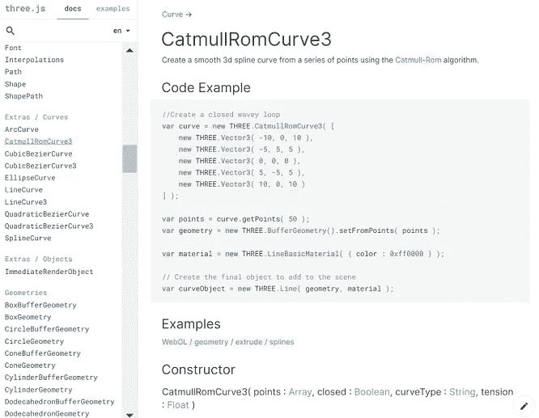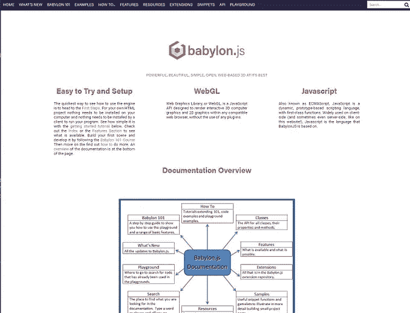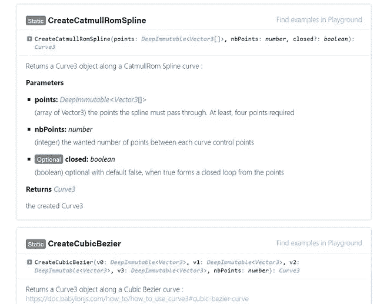

# 入门指南

Babylon.js 有 three.js 没有提供的东西，*游乐场*。它让你很快开始了解这个程序能做什么，但是有一点还不清楚，那就是如何将 *Playground* 翻译成你自己的应用程序。开发人员的目标是构建他们自己的。

Babylon.js 似乎提供了不止一种学习方式，但却是非线性的。你必须不断地选择下一步要读什么，但是对于一个新人来说，知道她/他应该学什么并不容易。

Three.js 提供了正常的学习步骤。对于具有一定编程背景的人来说，这似乎很容易理解。

# 第一章:三. js

基于以上种种原因，我选择了 three.js。

我有一个截止日期，所以我直接开始我的项目。我将非常简短地描述这个项目，然后回到对 three.js 的讨论。

我想根据卫星追踪器的数据创建一个交互式 3D 地图，显示鸟儿的飞行路线。地形的 3D 模型很重，所以我想用等高线作为风景的风格化展示。

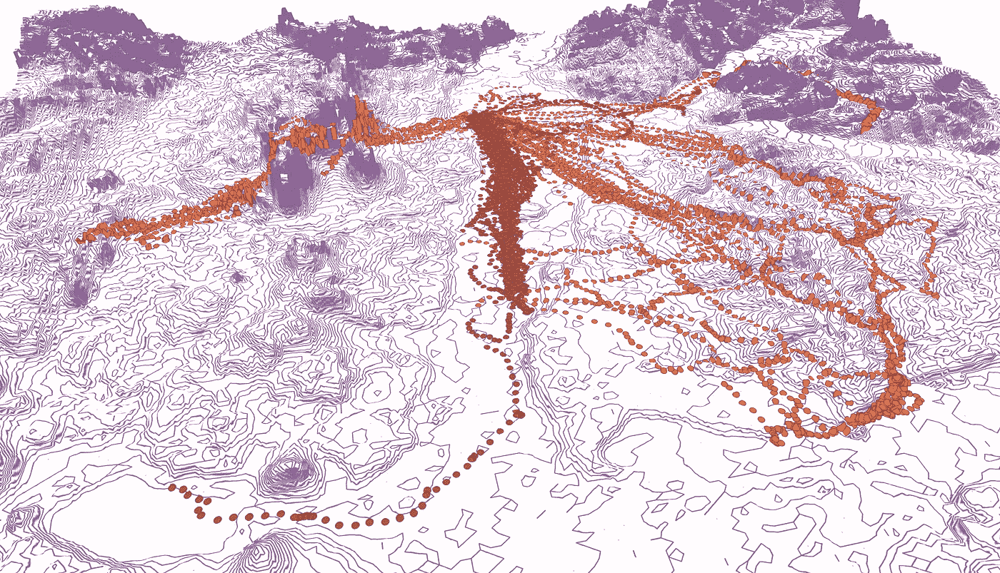

Love Birds in Poland (Data Visualization, Rebecca Xu, Sean Zhai)

在 three.js 工作期间，我发现以下事情不太理想。

*   它需要许多设置步骤。此外，似乎一个新的项目应该运行这些步骤，以获得最佳定制的设置；可能这就是为什么人们一次又一次地经历这些步骤。一个非常有用的教程是由*红色订书机*提供的，在他的 three.js 系列中，每次都使用新的设置。

Three.js tutorial by Red Stapler

*   它暴露了不必要的底层技术复杂性。WebGL 是 three.js 的底层支持，但它不应该给开发人员带来额外工作或理解 OpenGL 渲染循环细节的负担。
*   设计您的类并编写干净的代码有些困难。虽然你不应该为此(完全)责怪 three.js，但我认为这与 three.js 的结构有关。

快速地看一下这个序列，这是典型的，经常在 three.js 中看到。从逻辑上讲，这里没有错，但当你的一天包括这样冗长的例程时，它是乏味和无聊的。

```
// [https://discoverthreejs.com/book/first-steps/first-scene/](https://discoverthreejs.com/book/first-steps/first-scene/)// create a geometry 
const geometry = new THREE.BoxBufferGeometry( 2, 2, 2 ); // create a default (white) Basic material 
const material = new THREE.MeshBasicMaterial(); // create a Mesh containing the geometry and material 
const mesh = new THREE.Mesh( geometry, material ); // add the mesh to the scene 
scene.add( mesh );

// create the renderer 
const renderer = new THREE.WebGLRenderer();  
renderer.setSize( container.clientWidth, container.clientHeight ); renderer.setPixelRatio( window.devicePixelRatio ); // add the automatically created <canvas> element to the page container.appendChild( renderer.domElement ); // render, or 'create a still image', of the scene 
renderer.render( scene, camera );
```

*   调试并不总是容易的。这可能是一个普通的 JavaScript 问题。作为一种主要用于 web 的语言，JavaScript 希望尽可能健壮，所以有时它会默默地处理错误并忽略它们。运行 three.js 的体验打上了 JavaScript 的烙印。

我知道我应该停止抱怨 JavaScript，因为没有办法避免它。我最喜欢的编程语言其实是 Python。当你知道 Python 是如何工作的时候，你很难爱上 JavaScript。

也就是说，使用 three.js 是可能的，我也能够为鸟的飞行路线创建 3D 插图，但是我的进度比我预期的要慢。更重要的是，我不喜欢这种体验，感觉很乱。

# 第二章:巴比伦

我决定重新审视 babylon.js，试图理解它的设计理念。

作为一个微软项目对开源社区来说并不是一个好的形象，即使微软在这些年里已经变得更加友好了。Babylon.js 的创始人大卫·卡图赫(David Catuhe)讲述的一个有趣的故事是，微软并不知道 Babylon.js 是由自己公司的人作为一个爱好项目开发的。

Babylon.js 是用 TypeScript 写的。你可能会阅读这篇写于 2014 年的博客，这篇博客解释了 Babylon.js 采用 TypeScript 的决定。

[](https://www.eternalcoding.com/why-we-decided-to-move-from-plain-javascript-to-typescript-for-babylon-js/) [## 为什么我们决定从普通 JavaScript 转向 Babylon.js 的 TypeScript

### 一年前，当我们决定牺牲所有的业余时间来创建 Babylon.js 时，我们有一个非常有趣的…

www.eternalcoding.com](https://www.eternalcoding.com/why-we-decided-to-move-from-plain-javascript-to-typescript-for-babylon-js/) 

# 设计原理

这是我做的事情之一:在我使用开源库之前，我会找出是谁写了这个工具。了解项目背后的人可以给你信心，偶尔改变你的想法去寻找其他东西。

我以前看过 Ricardo Cabello 的演示，印象非常深刻。下面是它的发明者 three.js 的故事。

在艺术家[米歇尔·鲁索](https://michelrousseau901.wixsite.com/mitch/portfolio)的帮助下，David Catuhe 和 Dave Rousset 发明了 Babylon.js。

[](https://medium.com/@amsterdamjs/microsofts-spm-david-rousset-driving-an-open-source-project-is-not-only-about-writing-code-but-94d40702f938) [## 微软的 SPM David Rousset:推动一个开源项目不仅仅是写代码，而是…

### 我们采访了 David Rousset，他是微软 EPIC/PAX 部门的高级项目经理，也是 Babylon.js 和…

medium.com](https://medium.com/@amsterdamjs/microsofts-spm-david-rousset-driving-an-open-source-project-is-not-only-about-writing-code-but-94d40702f938) 

然后我读了大卫·鲁塞在他的博客 [*Dans ma Bulle*](https://facecacheeduhandicap.com/2019/04/05/dans-ma-bulle/) 中的这段话，他用法语写道(下面有英文翻译):

> 我们倾向于相信我们都生活在同一个星球上，但我觉得我们实际上都生活在同一个地方的一个泡泡里。这些气泡有时会纠缠在一起或包含在彼此之中，有时，幸运或不幸的是，它们与其他气泡完全隔离。那时，我们几乎就像生活在平行宇宙中一样。我们可以瞥见远处的一些，有点模糊，没有进入与他们的互动。

这篇博客的日期是 2019 年 4 月 5 日，在新冠肺炎疫情之前。这是他的个人故事，没有什么技术性，但它深深打动了我。

# 以打字打的文件

有那么一瞬间，Babylon.js 决定用 TypeScript 重写它的代码库。你仍然可以使用 JavaScript 来开发 Babylon.js，但值得弄清楚 Babylon.js 是何时做出这样的举动的。

打字稿是安德斯·海尔斯伯格发明的。名字中的 *type* 可能会引发一些关于计算机编程中严格执行的数据类型的痛苦感受，(还记得 *unsigned long* 中有多少位吗)，但是 TypeScript 其实好很多。这是一个强类型的编程。

也许大多数负责任的 JavaScript 程序员都听说过道格拉斯·克洛克福特的《JavaScript:精彩部分》,这本书是一本经典读物。

> 在 JavaScript 中，有一种美丽、优雅、极具表现力的语言，它被掩盖在一大堆善意和错误之下。

TypeScript 是 JavaScript 的超集，它建立在好的部分之上。如果处理不当，JavaScript 可能会非常混乱。即使它已经有了很大的改进，人们在编程时也必须注意语言本身。

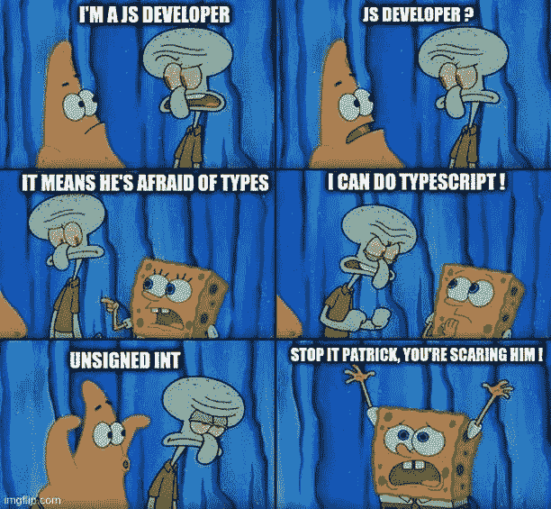

Perhaps Not Even a Good Joke …

不确定有多少人会投票支持 JavaScript。我的怀疑是 JavaScript 是一个选择，但不是其他选择的结果。现在 TypeScript 为您提供了另一种选择。你会试一试吗？

好消息是你不需要担心学习它。可以一起学 TypeScript 和 Babylon.js。这是一个无法拒绝的提议。

对 TypeScript 有一点点了解是有帮助的，也许只是一个简单的介绍。如果你忍受过 JavaScript，这相比之下不算什么。

然后，可以设置一个环境，用 TypeScript 开发 Babylon.js。

[](https://medium.com/the-innovation/babylon-js-typescript-project-setup-for-the-impatient-d8c71b4a57ad) [## Babylon.js TypeScript 项目设置

### 快速启动项目，享受 TypeScript 开发的自动化构建过程。

medium.com](https://medium.com/the-innovation/babylon-js-typescript-project-setup-for-the-impatient-d8c71b4a57ad) 

之后，在操场上尝试一些例子。Babylon.js 在操场上并排提供了每个例子的 JavaScript 和 TypeScript 版本。

# 场景图

计算机图形借用电影工作室的术语似乎是很自然的，因为人们已经理解了相机、照明和材质的概念。3D 场景可能非常复杂，你可以通过浏览动画软件的界面来了解这一点。

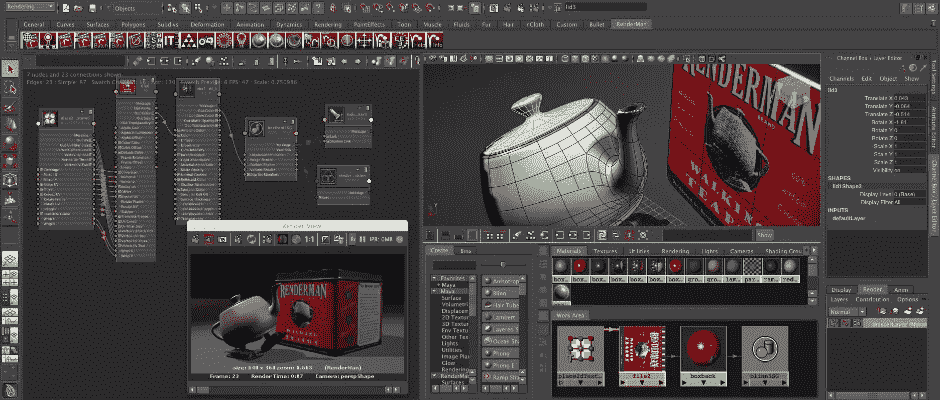

Maya and RenderMan

产生最终图像的过程通常称为*渲染*。三维场景由场景图描述。构建场景是创建项目的主要部分。与 Three.js 相比，Babylon.js 需要一些额外的步骤来帮助你创建场景。

先看一下 Three.js。Three.js 为你编程提供了所有必要的手段，但它做到了这一点。对于任何有 OpenGL / WebGL 知识的人来说，你可以期待熟悉。不过，为调整数字而编写 3D 程序的工作流程可能会很慢。

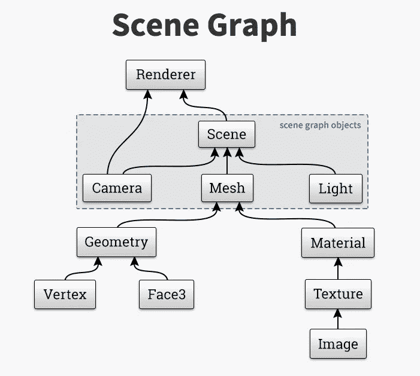

Scene Graph

Babylong.js 真的是想给你更多的帮助。它为您提供了一套工具和更多使用 Babylon.js 的方法。尽管目的很好，但对于第一次使用 Babylon.js 的人来说，这可能会非常混乱。

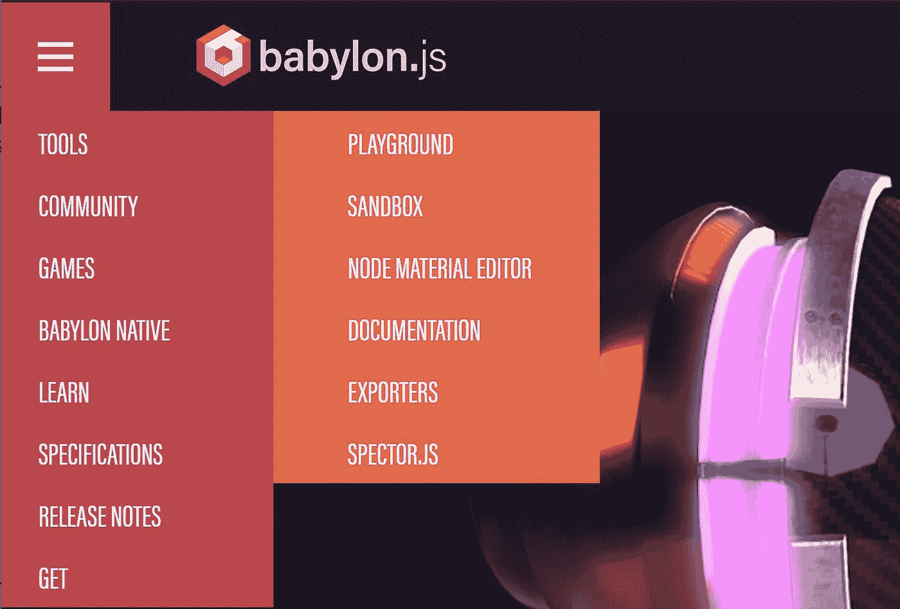

*   操场是你可以做现场编码的地方。它有一个内置的版本控制系统，并且它似乎保留了曾经创建的所有东西。请记住，在保存您的游乐场时添加一些标签，否则您可能永远也找不到它。
*   如果需要从 Maya 或 Blender 等软件加载模型，沙盒是您可以检查 3D 模型的地方。
*   当你已经很擅长 Babylon.js 时，NME(节点材质编辑器)确实很棒，它是一个开发着色器的生产质量可视化编程工具，类似于 Maya 的着色网络。
*   出口商允许出口到其他软件。
*   Spector.js 是一个 WebGL 检查工具。

刚开始的时候，操场大概是你消磨时间的地方，babylon.js 的文档也是用操场举例的。

# 为场景图优化的语法

相比 three.js，同样的任务，babylon.js 需要的代码更少。

这就是在 three.js 中创建圆柱体的方法。

```
var geometry = new THREE.CylinderGeometry( 5, 5, 20, 32 ); 
var material = new THREE.MeshBasicMaterial( {color: 0xffff00} ); 
var cylinder = new THREE.Mesh( geometry, material ); 
scene.add( cylinder );
```

这是一步一个脚印。没毛病。

在 babylon.js 中，圆柱体被视为顶部和底部大小相等的圆锥体。

```
**var** cone = BABYLON.MeshBuilder.CreateCylinder("cone", {diameterTop: 0, tessellation: 4}, scene);
```

在整个 babylon.js 中，语法是以类似的方式组织的。第一个参数是对象的名称，第二个是它的细节，最后一个是场景。它给你一个非常清晰的概念，让你知道你在建造什么，也让你知道它在场景图中的位置。我认为这更有意义。

# 结论

每一次比较都需要一个结论。

但这真的取决于你想做什么。有些项目只需要一个 WebGL 包装器。对于这一点，这并不重要。随便用 three.js 或者 babylon.js。


Littlest Tokyo (Glen Fox)

项目 *Littlest Tokyo* 就是 three.js 中的一个例子，建模和动画都是由外部软件完成的，而 three.js 只是加载和呈现。

如果你想做大量的编程来构建你的场景，我会推荐 babylon.js 而不是 three.js。一旦你知道如何在 babylon.js 中走动，用 TypeScript 编写 babylon.js 是令人愉快的。

最开始的时候，babylon.js 感觉有些陌生。也许是法语。你可能会觉得有点失落，但事情很快就变得容易多了。它比 three.js 编程更快，你可以用更简洁的方式编写几行代码。


French in Action, the Capretz method (1987)

# 收场白

在一个阳光明媚的下午(新冠肺炎之前或之后)，我正坐在桌旁，有人走进来开始询问 WebGL。我讲述了整个故事，我觉得有人理解我。

干杯。

*(请分享你的经验，尤其是如果你碰巧是我一名程序员。但愿程序员说话。)*