# Webhooks 用 Node.js，IFTTT 和 Twitter 解释

> 原文：<https://javascript.plainenglish.io/webhooks-explained-with-node-js-ifttt-and-twitter-ddc7b09379f0?source=collection_archive---------5----------------------->

*了解 webhooks 如何工作，并在不到一小时的时间内将一个简单的 Webhook 与 Node、IFTTT 和 Twitter 集成在一起。*

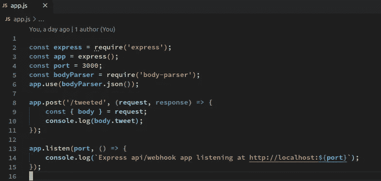

在本指南中，你将了解什么是 webhooks 以及它们是如何工作的。然后，您将使用 Node 和一个简单的 Express 应用程序，为 IFTTT 和 Twitter 组装一个简单的 Webhook 集成。

# 什么是 webhooks？

Webhooks 就像反过来的 API。使用 API，您可以向 API 提供者发出请求。Webhooks 逆转了这一流程。

不是您向 API 提供者发出请求，而是 Webhook 提供者向您发出请求。您的代码接收请求，然后用它做一些事情。webhook 请求的例子包括 Stripe 向您发送一个关于新付款的通知，或者 IFTTT 向您发送一个关于您的 Twitter 帐户的新 tweet 的通知。

这个图表是对 webhooks 如何工作的一个快速的高层次概述

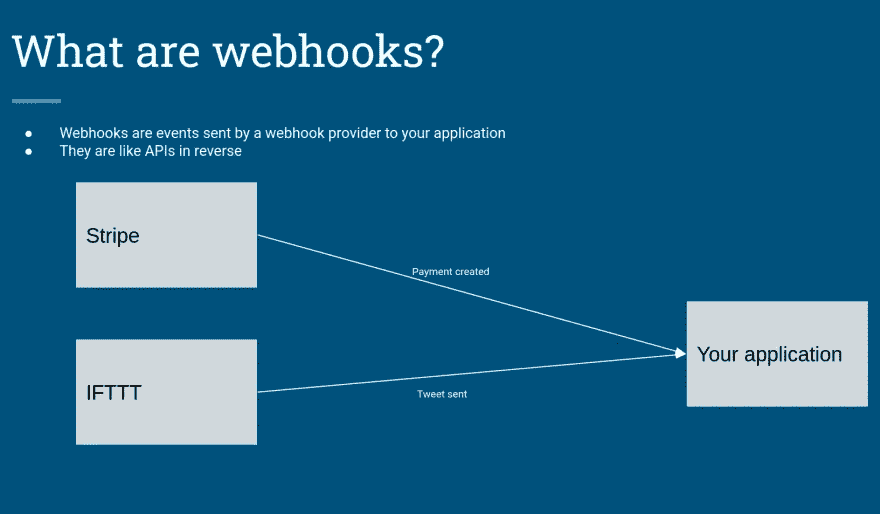

# 获取代码并运行应用程序

从 [Github](https://github.com/cipher-code/express-api-webhook-example) : `git clone [https://github.com/cipher-code/express-api-webhook-example.git](https://github.com/cipher-code/express-api-webhook-example.git)`中克隆源代码

然后运行`npm install`来设置项目。

打开`app.js`。它应该是这样的:

```
const express = require('express');
const app = express();
const port = 3000;
const bodyParser = require('body-parser');
app.use(bodyParser.json());app.post('/tweeted', (request, response) => {
    const { body } = request;
    console.log(body.tweet);
});app.listen(port, () => {
    console.log(`Express api/webhook app listening at http://localhost:${port}`);
});
```

这是一个非常基本的 express.js 应用程序，只有一个`/tweeted`端点，它将从请求中获取 tweet 文本并将其记录到控制台。它基本上是 express.js hello world 示例，但具有不同的端点。

在代码的顶部，你可以看到所有的`require()`语句都是导入 express 并设置依赖关系。

这部分代码允许 express 解析 JSON 格式的请求。我们将配置 IFTTT 以这种格式向我们发送请求。

```
const bodyParser = require('body-parser');
app.use(bodyParser.json());
```

在底部，`app.listen()`启动节点的内部 web 服务器，它将在`[http://localhost:3000](http://localhost:3000.)` [监听。](http://localhost:3000.)

运行`npm start`启动应用程序，您将看到如下输出:

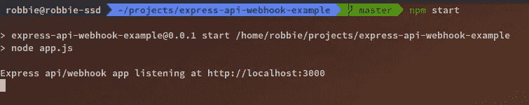

# 配置 IFTTT

前往 [IFTTT](https://ifttt.com) 。如果您还没有帐户，请注册。

登录并点击右上角的创建


然后在如果这旁边，单击添加


搜索 twitter，然后点击 Twitter

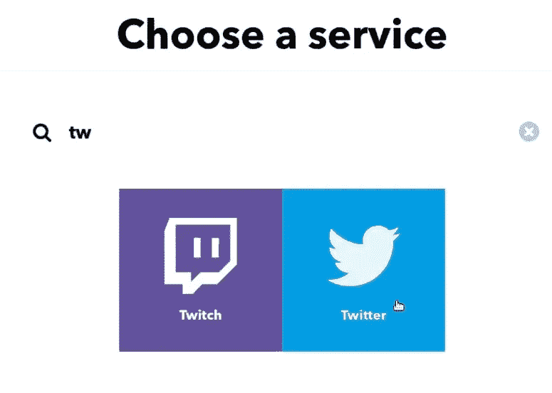

点击“您的新推文”

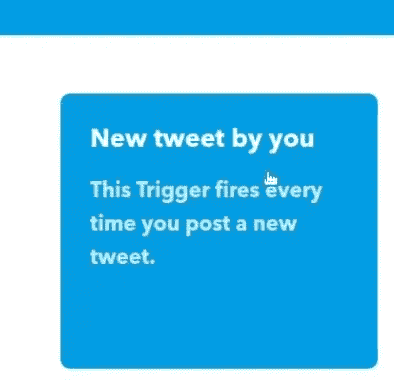

单击“创建触发器”

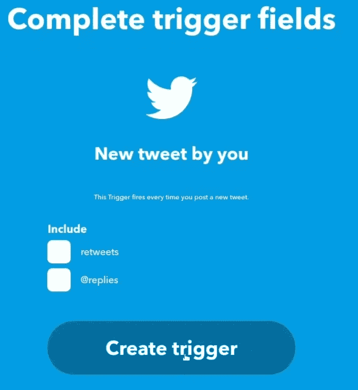

在“然后”旁边，单击添加

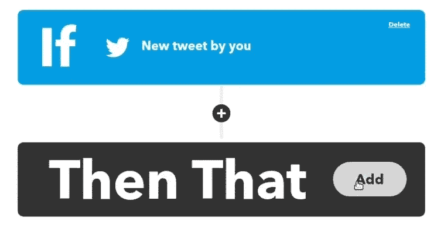

搜索 webhooks，然后单击 Webhooks

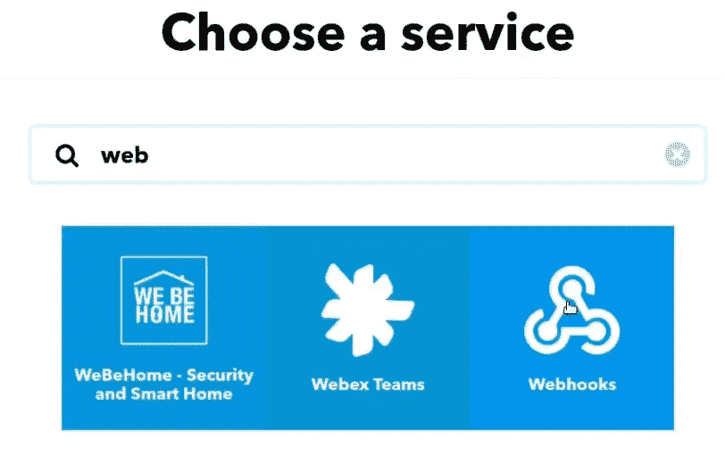

单击发出 web 请求


你现在会看到这样一个表单

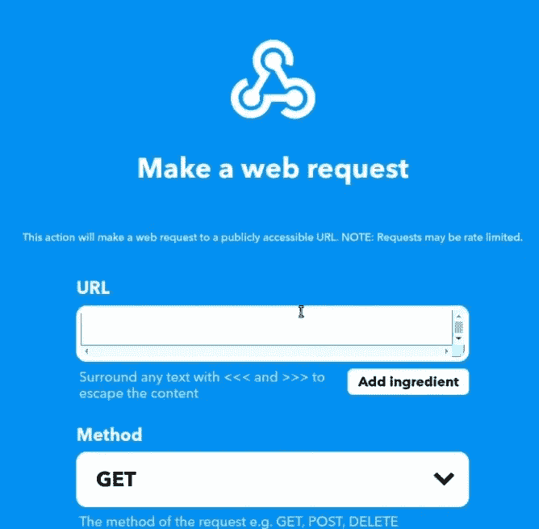

您可以看到有一个 URL 字段。IFTTT 将把 webhook 请求发送到这里。

你可能还记得，你启动 app 的时候，它给了你一个`http://localhost:3000`的网址。如果你不熟悉 webhooks，你可能会认为可以在这个 URL 字段中输入`http://localhost:3000/tweeted`。

然而，这是行不通的。这是因为你的`localhost`只对你的机器可见。如果它看不见。您需要使用公共 URL 运行您的应用程序。你可以把你的代码部署到一个远程服务器上，然后通过这种方式获得一个公共的 URL，但是这需要花很多时间来设置和配置，你想在一个小时之内学会 webhooks，对吗？。

为了快速获得一个公共 URL，我们可以使用我构建的一个简单工具`expose`，它将创建一个公共 URL，通过隧道将请求转发到您的本地机器。前往[https://expose.sh/install](https://expose.sh/install?utm_source=jsInPlainEnglish&utm_campaign=learnWebhooksInUnderAnHour)并遵循你的操作系统的指示。将显示的适当代码复制并粘贴到适用于 Linux/Mac OS X 的终端中，或者下载适用于 Windows 的压缩 exe 文件。

该应用程序正在端口`3000`上运行。要获得一个公共 URL，你需要运行`expose 3000`(或者`expose`后跟你的应用程序运行的端口号)。

Expose 将为您生成一个公共 URL

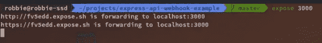

使用以`https://`开头的 URL，在 URL 字段中输入 URL，后跟`/tweeted`

选择`POST`作为方法。

对于内容类型，选择`application/json`。

在正文字段中，复制并粘贴以下文本:

```
{"tweet": "<<<{{UserName}}>>> tweeted <<<{{Text}}>>>"}
```

填好的表格应该看起来像下面的图片。确认所有设置都已输入后，单击底部的“创建操作”。确保它们都是正确的，尤其是方法(`POST`)和内容类型(`application/json`)。否则应用程序可能会忽略 IFTTT 的 webhook 请求。

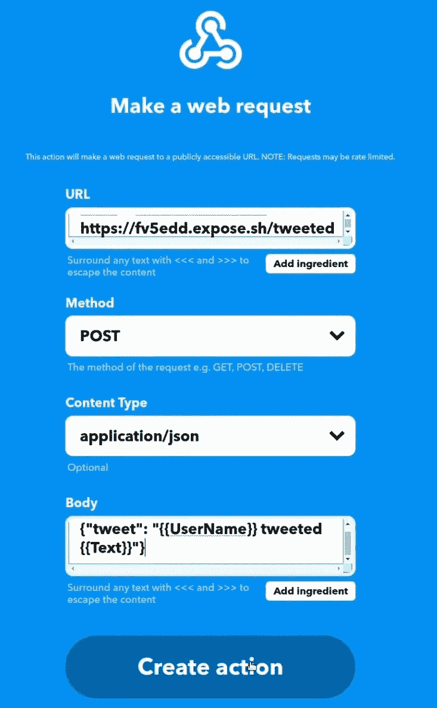

在下一个屏幕上，单击“完成”

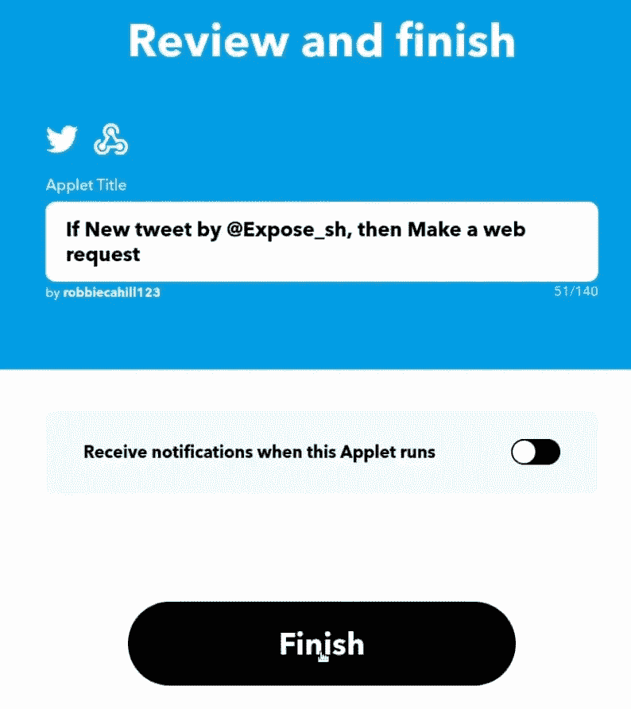

现在，单击“设置”来查看新 IFTTT 小程序的设置。让设置页面在标签页中保持打开状态，稍后您将回到该页面

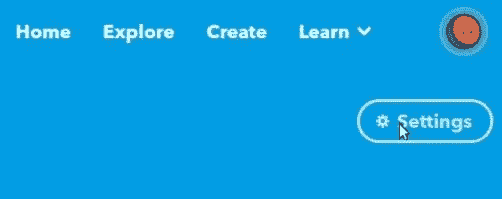

然后发微博

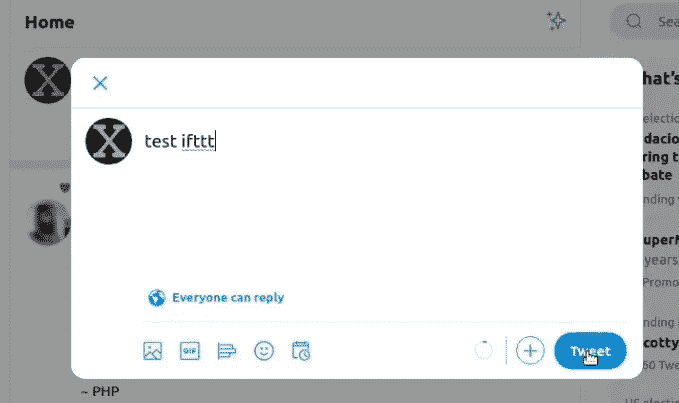

通常 IFTTT 可能需要一个小时来调查新的推文，但我们打算踢它一脚，因为我们不想等那么久。返回之前在标签页中打开的设置页面，然后点按“立即检查”。这将触发 IFTTT 检查新的 tweet，并使用您刚刚发布的新 tweet 向您的应用程序发送一个 webhook 通知。

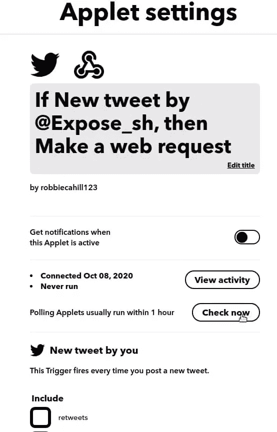

如果您已经正确地完成了所有操作，现在您应该可以看到记录到控制台的 tweet

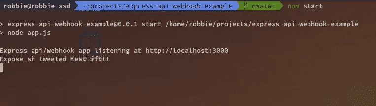

现在你都准备好了😀。

# 回顾:关键点

*   Webhooks 是由 webhook 提供者发送的请求，由您的应用程序使用
*   它们就像反过来的 API。通过 API 提供者，您可以向他们发送请求。通过 Webhook provider，他们向您发送一个请求
*   您的应用程序需要一个公共 URL 来端到端测试 webhook 集成。有几个工具可以给你一个，但是我建议使用 [expose](https://expose.sh?utm_source=jsInPlainEnglish&utm_campaign=learnWebhooksInUnderAnHour) ,因为它的语法比其他需要指定协议和端口的工具更容易使用。

# 结论

既然您已经设置了您的第一个 webhook 集成，那么您可以进一步扩展它。IFTTT Twitter 集成支持发送通知，比如转发你的推文和其他有用的东西。还有数以千计的 IFTTT 触发器可以插入“If This ”,从天气信息到脸书。你可以设置你的智能灯泡在黄昏时打开，让你的智能洒水器在不下雨的时候给你的草坪浇水，还有很多其他很酷的东西。

# 视频指南

这是本指南的视频版本，带有工作演示