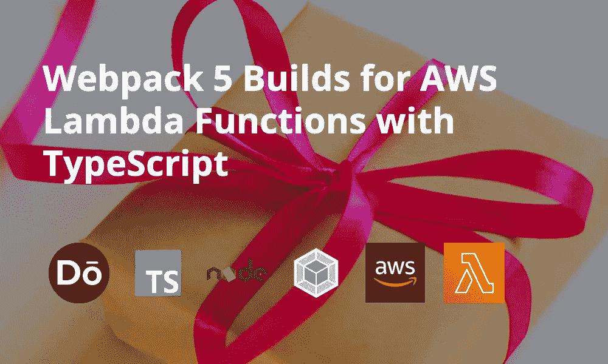

# Webpack 5 使用 TypeScript 为 AWS Lambda 函数构建

> 原文：<https://javascript.plainenglish.io/webpack-5-builds-for-aws-lambda-functions-with-typescript-6603533c85cb?source=collection_archive---------4----------------------->

在之前的一篇帖子中，我写了关于每天午夜作为 AWS Lambda 函数运行的[自毁推文](https://blog.dennisokeeffe.com/blog/2020-10-05-self-destructing-tweets/)。

虽然那篇文章是关于代码本身的，但大多数 AWS CDK 基础设施信息已经写在以前的一篇文章中，关于[发送无服务器 Slack 消息](https://blog.dennisokeeffe.com/blog/2020-06-22-cdk-lambda-to-send-slack-message/)，演示如何在 cron 计时器上运行 AWS Lambda。

今天的帖子将是一个将这些联系在一起的简短概述:它展示了我如何将 Twitter 帖子中的 TypeScript 代码与节点模块捆绑在一起，并为部署做准备。

## 文件夹结构

我在这里做假设。我通常为 Lambdas 设置的最“复杂”的设置是用 TypeScript 编写它们，并用 Babel 进行翻译。

鉴于这将是大多数人熟悉的立场，让我们一起工作。

以下是我的大多数 lambdas 在函数文件夹中的外观:

[https://gist . github . com/okeeffed/9 B1 e 7 EDC 86 caff 76179d 434850 f 063 c 0 . js](https://gist.github.com/okeeffed/9b1e7edc86caff76179d434850f063c0.js)

你可能还注意到我有一个`index.ts`和`index.local.ts`文件。在我的项目中，`index.ts`通常是 lambda 的入口点，这里的`index.local.ts`文件通常只用于本地开发，在这里我将 lambda 处理程序换成让我运行的代码。

两者一般都从另一个文件(这里表示为`function.ts`)导入主函数，然后调用它。

> Webpack 稍后会将所有内容打包到一个文件中，所以我可以按照自己认为合适的方式构建文件夹。
> 还要注意:正如 Maximilian 在评论中指出的，如果您的 npm 包需要二进制文件，那么将节点模块捆绑到 Webpack 的输出中并不总是一个好主意。这同样适用于任何需要在运行时动态导入的构建。使用您的判断是否将您的节点模块捆绑到 Webpack 构建中，但是我将写另一篇关于使用 Lambda 层的文章，以避开构建单个输出的需求。

## 设置您自己的项目

在包含 TypeScript lambda 的新 npm 项目中，我们需要添加所需的 Babel 和 Webpack 依赖项:

[https://gist . github . com/okeeffed/83313 ff 75 f 314653 c 67760251571320d . js](https://gist.github.com/okeeffed/83313ff75f314653c67760251571320d.js)

## Babel 运行命令文件

在`.babelrc`内部增加以下内容:

[https://gist . github . com/okeffed/6640 da 43291 DD 9 BF 3 ea 0 FBC 88105d 0 c . js](https://gist.github.com/okeeffed/6640da43291ded9bf3ea0fbc88105d0c.js)

## 设置 TypeScript

这一部分需要根据具体情况进行调整，但我为 Twitter bot 提供的配置如下:

[https://gist . github . com/okeffed/2f2 ce 20124863 B1 b 0 B2 ff 1153158 b01b . js](https://gist.github.com/okeeffed/2f2ce20124863b1b0b2ff1153158b01b.js)

## Webpack

在这个例子中，我期望您使用的是 Webpack 5。

在`webpack.config.js`中:

[https://gist . github . com/okeffed/d 63721 DDC 9715 a 181 a 5129 cf 14d 00955 . js](https://gist.github.com/okeeffed/d63721ddc9715a181a5129cf14d00955.js)

在这里，我们告诉 Webpack 将`src/index.ts`设置为入口点并转换为`commonjs`。

我们设置了 Babel 和 Cache 加载程序来测试和编译从该入口点找到的任何`ts`或`js`文件。

假设我们没有使用避免绑定节点模块的 Node Externals，那么所需的任何节点模块也将被编译到输出中。

这意味着在`dist/index.js`的输出，其中运行我们的项目没有节点模块安装，这是完美的 AWS Lambda！

## 运行内部版本

一个`"build": "webpack"`到你的`"scripts"`钥匙在`package.json`文件里，你就可以滚了！

运行`npm run build`，让 Webpack 发挥它的魔力，然后在`dist/index.js`中看到单文件输出。

## 测试项目

在部署 AWS CDK 之前，我使用 [lambda-local](https://github.com/ashiina/lambda-local) 来测试构建。它的目标是 Nodejs，这是完美的类型脚本/JavaScript 项目！

按照网站上的说明进行安装并试一试！如果一切顺利，您就可以对自己的部署充满信心。

## 结论

本文仅关注构建过程。正如介绍中所提到的，我的其他一些文章将涉及编写 lambda 函数和实际的 AWS CDK 部署。

## 资源和进一步阅读

1.  [自毁微博](https://blog.dennisokeeffe.com/blog/2020-10-05-self-destructing-tweets/)
2.  [发送无服务器空闲消息](https://blog.dennisokeeffe.com/blog/2020-06-22-cdk-lambda-to-send-slack-message/)
3.  [λ-local](https://github.com/ashiina/lambda-local)

*图片来源:* [*杰斯贝利*](https://unsplash.com/@jessbaileydesigns)

*原贴于我的* [*博客*](https://blog.dennisokeeffe.com/blog/2020-10-15-webpack-for-lambdas/) *。*