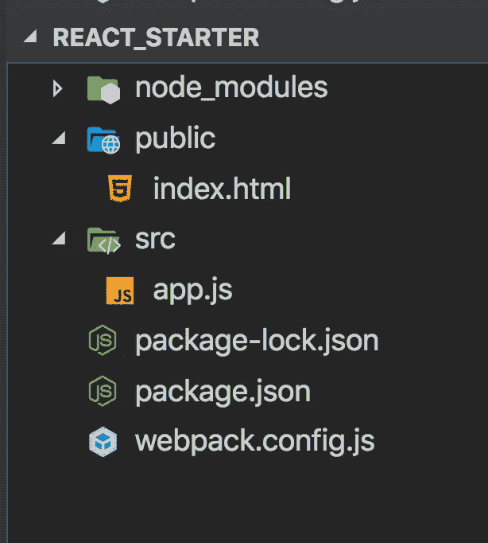
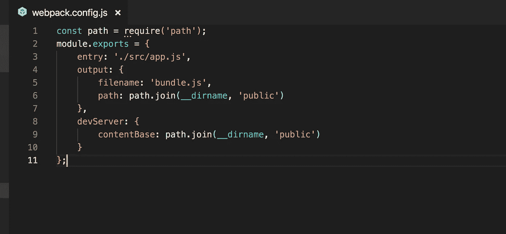
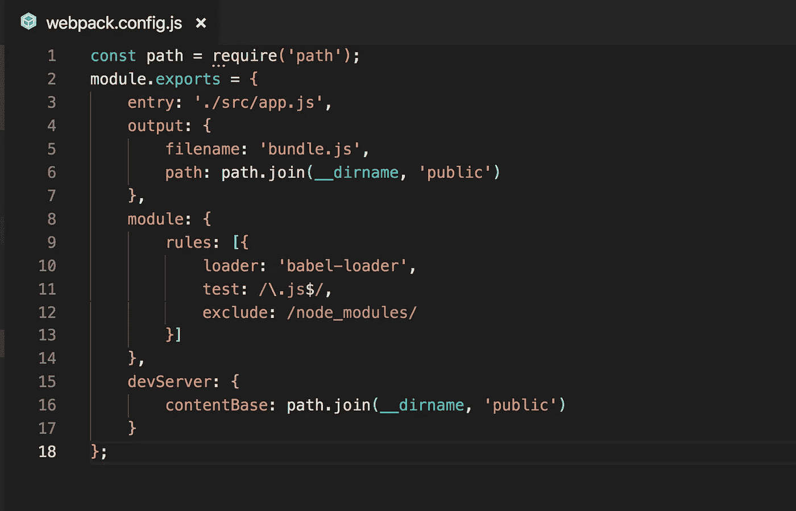
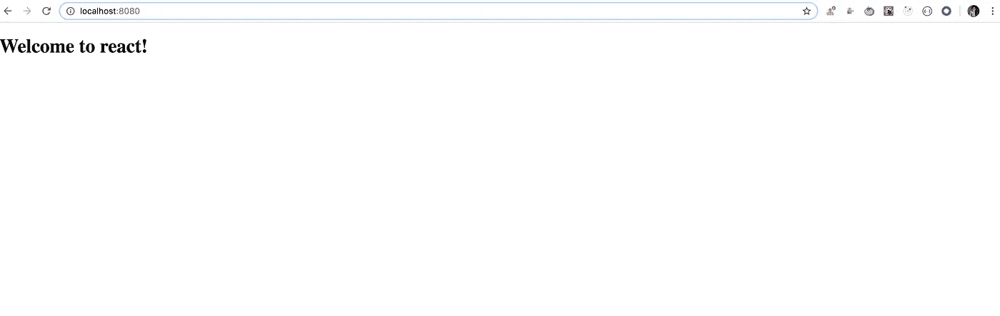

# 从头开始 React 的 Webpack 和 Babel 设置

> 原文：<https://javascript.plainenglish.io/webpack-and-babel-setup-with-react-from-scratch-bef0fe2ae3e7?source=collection_archive---------0----------------------->

## 不使用 create-react-app 运行 React 应用程序


Photo by [Artem Sapegin](https://unsplash.com/@sapegin?utm_source=medium&utm_medium=referral) on [Unsplash](https://unsplash.com?utm_source=medium&utm_medium=referral)

`React`是世界上最受欢迎的 javascript 库，用于创建前端应用程序。React 出名是因为以下几个原因。

*   React 在语法方面的简单性使得对于具有良好 HTML 工作知识的开发人员来说，学习起来更加容易。这是 React 与 Angular 和 Vue 比较中 React 得分领先的主要因素之一。
*   React 具有很高的灵活性和响应能力。
*   React 使用虚拟 DOM，这允许快速更改 DOM，并使应用程序更快。
*   React 是一个 100%开源的库，由于世界各地开发人员的贡献，它每天都有许多改进和更新。

创建 react 应用程序的简单方法是使用脸书团队开发的 **create-react-app** 工具。这是一个很好的开始工作的反应，但它隐藏了很多细节

1.引擎盖下发生了什么

2.使用最新功能需要什么配置

3.从 ES6 到 ES5 的转换是如何发生的

为了理解所有这些，在本文中我们将设置`webpack + Babel`与`React`一起工作。

所以不浪费太多时间，让我们从配置开始。

1.创建一个名为`react_starter`的新文件夹(您可以随意命名)。

2.在终端中运行以下命令，创建一个`package.json`文件

```
npm init -y
```

3.通过运行以下命令安装 babel 和使用 babel 所需的插件

```
npm install @babel/core@7.7.4 @babel/preset-env@7.7.4 @babel/preset-react@7.7.4
```

让我们了解一下这些包是做什么的。
*@babel/core —提供基本的核心 babel 配置*

*@babel/preset-env —它允许使用最新的 ES6/ES7/ES8 功能*

*@ babel/preset-react——它允许使用 JSX 的 react 语法*

4.创建一个名为`public`的新文件夹，并在其中创建一个包含以下内容的新文件`index.html`。

index.html

5.创建一个新文件夹`src`和一个名为`app.js`的新文件

6.在`react_starter`目录下创建一个名为`webpack.config.js`的新文件，并在其中添加以下内容

webpack.config.js

这里我们告诉`webpack`，应用程序的入口点是什么，并将生成的输出文件`bundle.js`放在`public`目录中。

这就是你的文件夹结构现在的样子



Folder Structure

7.现在安装`webpack`、`webpack-cli`和`webpack-dev-server`(用于服务`public`目录，并在我们对代码进行任何更改时在浏览器中重新加载更改)

执行以下命令来安装它

```
npm install webpack@4.41.2 webpack-cli@3.3.10 webpack-dev-server@3.9.0
```

8.现在通知`webpack-dev-server`从`public`目录加载文件，在`webpack.config.js`中添加以下代码

```
devServer: {
 contentBase: path.join(__dirname, 'public')
}
```

现在，您的`webpack.config.js`文件将如下所示



webpack.config.js

9.现在要安装`react`、`react-dom`和`babel-loader`，在终端中运行以下命令

```
npm install react@16.12.0 react-dom@16.12.0 babel-loader@8.0.6
```

10.现在我们将设置`babel-loader`，它将把你的 ES6 和 React 代码转换成 ES5。
在`output`属性后的`webpack.config.js`中添加以下代码。

```
module: {
 rules: [{
  loader: 'babel-loader',
  test: /\.js$/,
  exclude: /node_modules/
 }]
}
```

这里我们告诉`babel-loader`只寻找`.js`文件来转换成 ES5 代码，但是从`node_modules`目录中排除`.js`文件。

现在，您的`webpack.config.js`文件将如下所示



webpack.config.js

11.现在创建一个名为`.babelrc`的新文件(注意文件名以点开始)，并在其中添加以下内容

.babelrc

该文件将告诉`babel-loader`在将 ES6 转换为 ES5 时使用`env`和`react`预设(只是插件)

瞧，我们现在都完成了设置。

让我们编写一些 React 代码来检查应用程序。

在`src`目录下的`app.js`文件中增加以下内容

app.js

现在要运行这个应用程序，我们需要做两处修改

a)将由`webpack`生成的`bundle.js`文件包含在`index.html`中

在 div 标签后的`index.html`中添加下面一行

```
<script src="bundle.js"></script>
```

所以最终的`index.html`会是这样的

index.html

b)将以下两个脚本添加到`package.json`(替换旧脚本的条目)

```
"scripts": {
 "build": "webpack",
 "start": "webpack-dev-server --watch"
}
```

所以`package.json`现在会是这个样子

现在通知`webpack`，它应该以开发模式(默认为生产模式)运行，以加快构建过程，在`webpack.config.js`中添加以下行

```
mode: 'development'
```

现在，最终的`webpack.config.js`文件将是这样的

要运行该应用程序，请从终端执行以下命令

```
npm start
```

现在导航到 [http://localhost:8080/](http://localhost:8080/) ，您将看到来自`app.js`的内容，如下所示



Application

恭喜你！你做到了

现在，尝试在`app.js`中做一些改变，比如将`"Welcome to REACT!"` 改为`"Welcome to REACT!!"`，然后保存。

现在你会看到`webpack-dev-server`会自动重启你的应用程序，你会看到浏览器中反映的变化。

**注意:** `webpack-dev-server`将直接为`bundle.js`服务，不会在公共文件夹内创建本地文件来加速页面加载。

如果需要，您可以通过执行以下命令手动创建`bundle.js`

```
npm run build
```

请注意，我们之前在`package.json`中添加的构建脚本

你可以在这里找到这个应用程序的完整源代码

今天到此为止。我希望你喜欢这篇文章。

**别忘了直接在你的收件箱** [**这里**](https://yogeshchavan.dev) **订阅我的每周时事通讯，里面有惊人的技巧、诀窍和文章。**