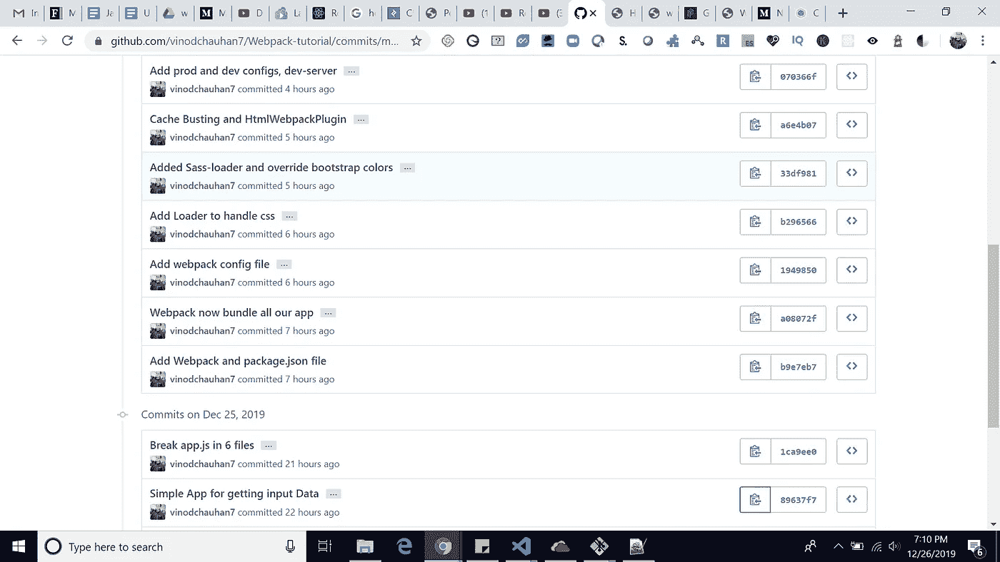

# Webpack:从零到生产(第 1 部分)

> 原文：<https://javascript.plainenglish.io/webpack-zero-to-production-via-react-part-1-b478be7b7f29?source=collection_archive---------6----------------------->

Webpack Image

# Webpack:入门

我们今天编写 JavaScript 的方式不同于浏览器可以执行的代码。我们经常依赖其他类型的资源、编译过的语言和实验性的特性，这些在现代浏览器中还没有得到支持。Webpack 是 JavaScript 的一个模块捆绑器，它可以弥合这一差距，并在开发者体验方面免费产生跨浏览器兼容的代码。

在我们开始之前，您应该记住，本 Webpack 教程中的所有代码也可以在 [GitHub 上以完整的 Webpack 示例配置文件的形式获得。](https://github.com/vinodchauhan7/Webpack-tutorial)如果您有任何问题，请随时参考那里的内容并回到本文。

为了一步一步地理解 webpack，我在 repo 中做了几次提交。你可以在这个[链接](https://github.com/vinodchauhan7/Webpack-tutorial/commits/master)上看到细节。以及对那些提交的检验，例如:

> 请通过回购了解以下示例[链接](https://github.com/vinodchauhan7/Webpack-tutorial/commits/master)。

> git check out 89637 f7ed 458d 8280 c 4542 a 2a 87 a6b 2397594 e7d

GitHub Webpack tutorial commits

# **第一次提交:简单应用**

= >***git check out 89637 F7 ed 458d 8280 c 4542 a2 a87 a6b 2397594 e7d***

我做了一个简单的应用程序，它从最终用户那里获取用户名和用户标识，并将其打印在屏幕上。它还对名称和 userId 进行一些验证，并向最终用户显示错误。还有一个 webpack 徽标的图像，我们将在以后的提交中使用 webpack 对其进行优化。

WebPack Tutorial Example

Index.html

[https://gist . github . com/vinodchauhan 7/497643664382 ace 761034 ee 6 AE 080 AFE](https://gist.github.com/vinodchauhan7/497643664382ace761034ee6ae080afe)

**打开 index.html 文件。**

# **第二次提交:将 Js 代码分成 6 个文件**

***=>git check out 1 ca 9 ee 0 e 85566146 f 477 c 530 f 4d 4114 f 5e 22372 f***

在这次提交中，我将 js 代码分成了 6 个文件，这样我们就可以模拟一个大的例子，这个例子有很多 js 文件，可以用 webpack 制作一个捆绑文件。

## 第三次提交:添加 Webpack 和 package.json 文件

= >***git check out b 9 e 7 EB 70469 D5 F6 BD 11 c 64 CD 54 ba 8 a 94532 fb8 a 2***

在这次提交中，我添加了 package.json 文件，然后添加了 webpack。对于**package . JSON**:**NPM init-y**然后添加:**NPM install—save-dev web pack web pack-CLI。**为了使用 webpack 启动我们的应用程序，我们在 package.json 文件中添加了一个脚本:

> " scripts": { "start": "webpack" }

当我们在终端上点击 **npm 启动命令时。**它会告诉我们需要包含“src/index.js”文件，webpack 才能工作。在成功运行 **npm start 后，**将会有一个包含 main.js 的 **dist 的新文件夹。我们可以将那个 **main.js** 包含在我们的**index.html 中。它将工作，webpack 正在处理我们的应用程序。在浏览器上打开 index.html 查看。****

## 第四次提交:Webpack 现在捆绑我们所有应用程序

= >***git check out a 08072 f 552066 e 02859 a21c 170 AE 243112 bbcb0d***

在这个提交中，我们使用了导入/导出将依赖项从一个文件注入到另一个文件，并且还从 html 中删除了

# 第五次提交:添加 webpack 配置文件

= >***git check out 194985095 f6e 24628 A8 c 69 e 05 F2 d 586 bea 96634 c***

在这个提交中，我们添加了自己的 **webpack.config.js 文件**来进行配置。

1.  **路径模块**用来获取系统的路径，这样我们就可以动态的获取用户系统的路径，不会有任何混淆。这是 npm 给我们的。
2.  **module.exports** 是 webpack 将寻找的配置。
3.  **模式:**可以有两个值【开发】&【生产】。我们现在使用“开发”,使事情工作起来没有任何复杂性。
4.  **条目:**是 webpack 需要查找的条目文件。
5.  **output.path :** 它会告诉 webpack 在哪里创建输出文件夹。 **__dirname** 是获取你的项目当前在你系统中的路径的东西。您可以给输出文件夹取任何名称。我给了‘dist’。
6.  **output.filename :** 这里我们将告诉 webpack，我们的输出文件名是什么。

我们也正在更新 **package.json**

> **"脚本":{ " start ":" web pack—config web pack . config . js " }**

# 第六次提交:添加加载程序来处理 css

=> ***git 结账 b 296566130 db 6559264 BDA 7 e 7423 F2 feab 64 a 782***

在这个提交中，我们引入了加载器。

> webpack 只理解 JavaScript 和 JSON 文件。加载器允许 webpack 处理其他类型的文件，并将它们转换成有效的[模块](https://webpack.js.org/concepts/modules)，这些模块可以被您的应用程序使用并添加到依赖图中。

我们正在添加一个新的 css 文件' **index.css'** ，在其中我们正在改变网页的背景&前景色，并将其包含在我们的 **index.js** 文件中。为了将它加载到我们的 webpack 中，我们需要使用一些可以在 webpack 网站上找到的加载器。我们用的是***【CSS-loader】【风格-loader】***。

> npm 安装-保存-开发 CSS-加载器样式-加载器

css-loader : 将 css 转换成 commonJs。

**style-loader :** 将 js 注入 dom。

将以下代码包含在 **package.json** 中

模块:{
规则:[
{
测试:/\。css$/，
使用:["style-loader "，//将 commonjs 注入 DOM
" css-loader "//将 CSS 转换成 commonJs
]
}
]
}

在模块标签中，包含**规则**标签。

1.  **测试**:这里我们需要添加那些需要为 webpack 添加 loader 的文件的扩展名，以构建其依赖图。
2.  使用:这是一个依赖数组，我们需要在其中添加所有的加载器。注意:我们需要以正确的顺序添加加载程序，以便它们能够工作。

## 第七次提交:添加了 Sass-loader 和覆盖引导颜色

= >***git check out 33 df 9811 E8 ba 4c C2 e 886 D3 ea 3 E4 aa 3d 2c 9 b 27 BF 8***

在这次提交中，我们转换了 sass 样式，并在 webpack 配置中添加了 sass-loader 来处理。scss 文件扩展名。为了在我们的 webpack 中支持 sass，我们需要下载两个加载器。

> npm 安装-保存-开发 sass-加载器节点-sass

更新 webpack.config.js 的规则集:

**{测试:/\。scss$/，使用:["style-loader "，" css-loader "，" sass-loader"] }**

## 第八次提交:缓存破坏和 HtmlWebpackPlugin

=> ***git 结账 a6e4b 0746 b 85d 63 ff 1d 82d 99867 e 09645222 ab 69***

**缓存破坏**:当一个静态文件被缓存时，它可以被存储很长一段时间，直到过期。然而，如果你更新了一个网站，这可能是一件令人烦恼的事情，因为文件的缓存版本存储在你的访问者的浏览器中，他们**可能看不到所做的改变**。这是因为如果您的网站配置为[利用浏览器缓存](https://www.keycdn.com/support/leverage-browser-caching)，访问者的浏览器将在本地存储您静态资产的缓存副本。

缓存破坏通过使用唯一的文件版本标识符来告诉浏览器文件的新版本可用，从而解决了浏览器缓存问题。因此，浏览器不会从缓存中检索旧文件，而是向源服务器请求新文件。

为了在 **webpack** 中实现**缓存破坏**，我们将在我们的文件名中包含**‘内容散列’**，这样当我们每次重新构建我们的应用程序时，它都会给出新的名称。它帮助我们实现了浏览器的缓存和应用程序文件的更新。

> Output.filename : "main。[内容哈希]。js "

到目前为止，我们使用 index.html 在浏览器中看到我们的结果。但是现在我们希望 webpack 在 dist 文件夹中动态地创建 index.html，这样它就可以动态地包含我们的 main。[内容哈希]。js，而不需要手工去做。为此，我们在 src 文件中创建了一个 index.html，其中没有包含

为了创建一个新文件，我们使用 HtmlWebpackPlugin。并更新我们的 **webpack.config.js** 。

**插件:【新 HtmlWebpackPlugin({ template:"。/src/index.html" }) ]，**

# 第九次提交:添加生产和开发配置，开发服务器

= >***git check out 070366 F8 f 133 e 50 ff a5 CBC 1 bad 6 CD 049 be 5b 6858***

到目前为止，我们使用的是 webpack 的'**开发**模式。如果你有机会看一下 dist 文件夹中的 **main.js** 文件，它没有被缩小，可以很容易地阅读。这是因为我们没有使用“生产”模式。

在此提交中，我们将生产和开发文件以及两者通用的配置分开，放在 webpack.common.js 中。我们使用 **webpack-merge** 包来合并 webpack 文件。

此外，我们还包括' webpack-dev-server '进行开发，这样我们就不需要手动重新加载文件。

> npm 安装-保存-开发 web pack-开发-服务器 web pack-合并

# 第十次提交:添加 html-loader、file-loader 和 clean-webpack-plugin

= >***git check out 1 F5 ce 61 e 7493 ed 020 c 0d 67 ed 48 f 7 f 9762 dcbe 94 c***

到目前为止，你已经看到我们给出了我们的 svg 图像的路径。但是在这个提交中，我们将使用 webpack 动态设置图像的路径。

1.  我们将从 index.html 删除图像 src
2.  我们用 rules 标记中的以下命令更新我们的 webpack.common.js。

{测试:/ **\。** html$/，使用:["html-loader"] }，

{测试:/ **\。** (svg|png|jpg|jpeg|gif)$/，使用:{ loader: "file-loader "，选项:{ esModule: false，name: "[name]. "。[哈希]。[ext]"，outputPath: "imgs" } }

在文件加载器中，我们给出了图像的选项，并使用哈希编码设置了图像的扩展名。输出文件将位于“imgs”文件夹中。

接下来，我们在 **webpack.prod.js** 中使用 **CleanWebpackPlugin()** ，这样我们就不需要每次为我们的新构建手动删除 **dist** 文件夹。

Example app

# 第十一次提交:添加供应商 js 文件的入口点，添加引导 js

= > git check out 6 F4 a5 AFC 2 fa 1894 b 7737020007 CB 7 c 7 aeba 1157 f

假设我们有一些第三方供应商的库，它们在不久的将来不会经常改变。使它们作为缓存一部分可用，以便最终用户将它们存储在浏览器中，从而提高应用程序的性能。我们需要在我们的 webpack 中给出一个新的入口点，它可以被命名为 vendor，我们可以在那里包含 bootstrap。为了使它有用，我们从 bootstrap 添加了

,在我们的应用程序中需要 jquery 和 popper.js。因为这些是第三方，我们不需要他们被用户一次又一次地重建和下载。为了满足这个需求，我们需要在 webpack.common.js 中创建一个条目

条目:{ main:"。/src/index.js "，供应商:"。/src/vendor.js" }，

和 output . filename:filename:“[名称]。[contentHash].bundle.js "

以便可以动态加载。

# 第十二次提交:在生产中缩小 JS、CSS 和 HTML。

=> ***git 结账 5 f87d 427 df 21d 045 cfe 0965 B2 ff 803 DD 97360 a80***

正如我们看到的，我们将 css 包含在 js 中，并在将 JS 注入 DOM 时加载它。这可能会给互联网连接速度较慢的用户带来样式问题。如果你重新加载，你可能会看到闪烁的 css 没有被加载。为了独立提取 css 和缩小 css，我们需要**mini-CSS-extract-plugin&optimize-CSS-assets-web pack-plugin。**

在 webpack.prod.js 中

prod.js

如果你检查上面的快照，我们正在使用优化字段来优化和缩小我们的 css 代码，使用**优化-css-assets-webpack-plugin。为了优化我们的 js 代码，我们使用了**新的 TerserPlugin()，它已经存在于 webpack 提供的节点模块中。这里使用它是因为我们正在更改 webpack 配置的默认实现。

此外，我们正在优化我们的 html 文件与 HtmlWebpackPlugin 删除空白和评论等。

# 第十三次提交:添加图像优化。

= >***git check out dff 7 ab 12 dad 31 e 14 C2 ef 75 e 48587 CCF 5 af 7a 52 f 9***

在这一部分中，我们在应用程序中优化我们的图像，因为如果我们的图像没有正确优化，应用程序的性能会下降一半。在这里，我们使用的是**image-web pack-loader&SVG-URL-loader。**

我们将图像的大小设置为 20 kb，这样它们就可以被压缩并用作 URL 编码。

到目前为止，我已经介绍了 webpack 的所有基本知识，在第 2 部分中，我将介绍 webpack-react。