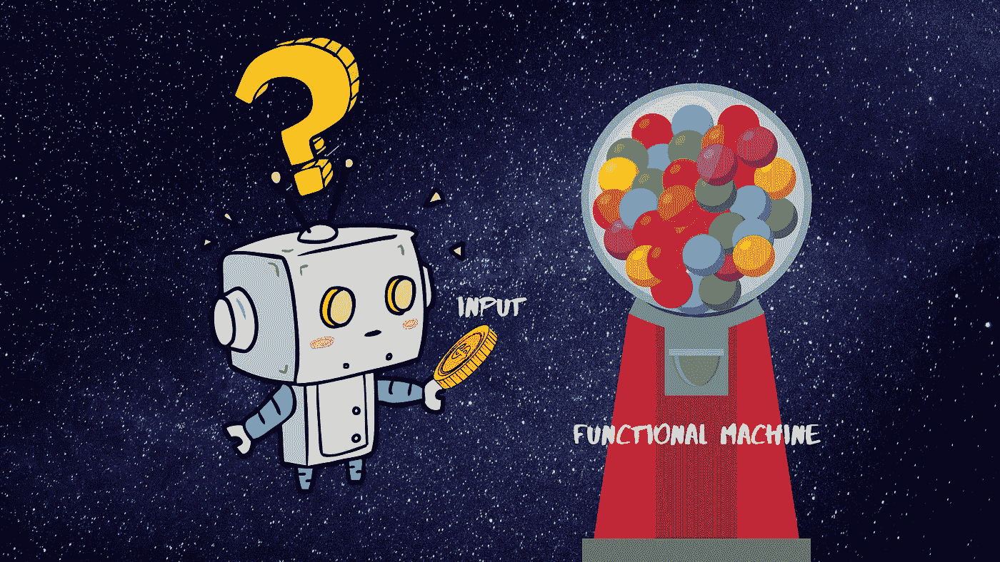

# 如何打破 JavaScript 中的循环？

> 原文：<https://javascript.plainenglish.io/weird-part-how-to-break-the-loop-in-javascript-8bba3e658267?source=collection_archive---------5----------------------->

JavaScript 不仅奇怪，而且令人困惑和含糊不清。你工作和调试得越多，你就越能发现新事物。JavaScript 的怪异之处在于如何打破循环。以下是几种打破 JavaScript 循环的方法。


[https://medium.com/the-write-club/weird-things-writers-do-52994d847812](https://medium.com/the-write-club/weird-things-writers-do-52994d847812)

首先，我们来看看创建循环和打破循环的方法有哪些。

1.  **传统的** `***for***` **，** `**while**` **，** `**do-while**` **循环:**创建一个 **for-loop** 非常容易，也非常常见。

如何打破:在这里打破一个循环是非常容易的。您可以使用`**break**`关键字来中断循环。

```
for (let i = 0; i < a.length; i++) {
  if (a[i] === theValue) {
    **break**;
  }
}
```

这是一种更优雅的打破循环的方式。如果你有一个嵌套循环(循环中的循环)。您可以使用**标记的语句**来中断循环。

这里**外**是给外环的标签。每当条件匹配时，我们使用标记的条件来打破外部循环。

**有趣的部分:**使用**标签的声明**是一个不错的方法，但是对开发者来说有点困惑。这就像是应该避免的 **goto** 语句。通过引入正常的条件变量，我们可以得到同样的结果。

样本:

如果你看到突出显示的代码，我已经引入了一个变量 **breakOuterLoop** ，并且在外部循环的每次迭代之后检查它的值。

**基准**:你可能会说引入一个变量和条件可以让代码变慢。然而，当我说`**conditionalBreak**`比`**labeledLoop**`更快时，你可能会感到惊讶。

```
// **benchmark:**labeledLoop x 9,295,537 ops/sec ±0.85% (87 runs sampled)
conditionalBreak x 9,349,901 ops/sec ±0.45% (89 runs sampled)
Fastest is conditionalBreak,labeledLoop// **Script**:
var { Benchmark } = require("benchmark");
var suite = new Benchmark.Suite();
suite.add("labeledLoop", function() {
  labeledLoop();
});
suite.add("conditionalBreak", function() {
  conditionalBreak();
});
suite.on("cycle", function(event) {
  console.log(String(event.target));
});
suite
  .on("complete", function() {
    console.log("Fastest is " + this.filter("fastest").map("name"));
  })
  .run({ async: true });
```

> **注意**:我正在使用[基准 js](https://benchmarkjs.com/)



[https://itnext.io/what-exactly-is-functional-programming-ea02c86753fd](https://itnext.io/what-exactly-is-functional-programming-ea02c86753fd)

**2。函数数组 API 方法:**现在我们每天使用`Array API`方法来循环遍历值。破坏函数数组方法是很棘手的。

```
const data = [1, 2, 3, 4, 5, 6, 7];
const printValueTill5 = (v) => {
  if(v % 5 == 0) {
    **break; //Error here: Illegal break statement**
  }
  console.log(v)
}
data.forEach(printValueTill5)
```

不能在函数中使用`break`关键字。要么是**命名的**函数的**匿名的**函数。

```
// using return
const data = [1, 2, 3, 4, 5, 6, 7];
const printValueTill5 = (v) => {
  if(v % 5 == 0) {
    **return false**
  }
  console.log(v)
}
data.forEach(printValueTill5)**// Output: 1 2 3 4 6 7**
```

如果试图返回 false 或任何值。它被认为是从给定的函数返回。因此代码将表现得像一个**延续的**语句。

**通过投掷:**您可以使用投掷语句来打破循环。然而，这不是一种优雅的方式。

```
const data = [1, 2, 3, 4, 5, 6, 7];
**const BREAK_LOOP_ERROR = Symbol("BREAK_LOOP");**
const printValueTill5 = v => {
  if (v % 5 == 0) {
    **throw BREAK_LOOP_ERROR;**
  }
  console.log(v);
};
try {
  data.forEach(printValueTill5);
} catch (e) {
  **if (e !== BREAK_LOOP_ERROR) throw e;**
  console.debug(e);
}
```

如果你注意到我们每次要写多少**样板**代码。

**经** [**列阵#隔**](https://developer.mozilla.org/en-US/docs/Web/JavaScript/Reference/Global_Objects/Array/every) **:** 较干净的方法是使用**列阵#隔**法。

```
// using 
const data = [1, 2, 3, 4, 5, 6, 7];
const printValueTill5 = v => {
  if (v % 5 == 0) {
    **return false; // return false to break**
  }
  console.log(v);
  **return true; // Else continue.**
};
data.every(printValueTill5)
```

方法`every`将循环直到您返回`true`。一旦你`return false`。它会打破循环。

**趣事**:使用`every`是`break`循环的最佳方式之一。然而，这个解决方案有很多缺点。

> **a.** 每一个方法在最后都会返回`boolean`，这样你就可以进一步链了。

```
const data = [1, 2, 3, 4, 5, 6, 7];
const printValueTill5 = v => {
  if (v % 5 == 0) {
    return false;
  }
  console.log(v);
  return true;
};
data.every(printValueTill5) **// returns false**
  .map(console.log) **// Error: data.every(...).map is not a function**
```

> **b.** 您必须更改 printValueTill5 的功能。难以进一步重用。
> 
> **c.** 难以调试和测试。

所以现在的问题是一样的,**“你如何打破 JavaScript 中的循环？”**

您可以创建如下`util`方法。它可能没有上述解决方案的性能好。但更干净、更可预测。

**用途:**

```
const data = [1, 2, 3, 4, 5, 6, 7];
const mapValue = v => {
  return v;
};
const till5 = v => v % 3 == 0;_.**tillWhen**(data, mapValue, till5)
  .**forEach**(x => console.log(x));**// Output: 1 2 3 4 5**
```

塔达。！看起来我们实现了我们想实现的目标。😂😂如果你有更多的建议。请在评论中告诉我。

请做**订阅/跟随/鼓掌**支持我。谢谢。！！🙏🙏

**参考**:[Loops _ and _ iteration](https://developer.mozilla.org/en-US/docs/Web/JavaScript/Guide/Loops_and_iteration)，[短路-阵列-foreach-like-call-break](https://stackoverflow.com/questions/2641347/short-circuit-array-foreach-like-calling-break)

## 来自简明英语团队的一份声明

你知道我们有四个出版物和一个 YouTube 频道吗？你可以在我们的主页[、T42、上找到这些——关注我们的出版物并订阅我们的 YouTube 频道、和**来表达爱意吧！**](https://plainenglish.io)