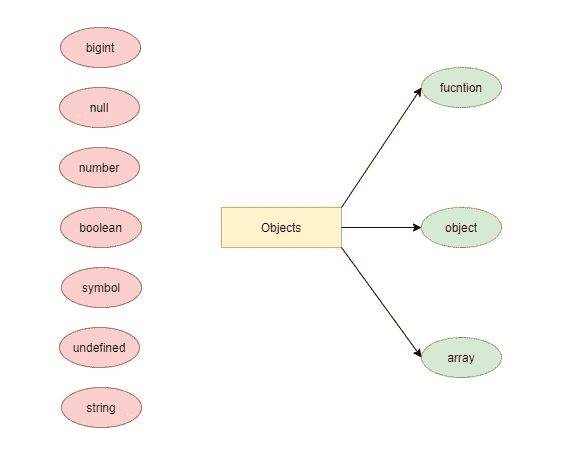

# 如何开始用 JavaScript 编写不易出错的代码

> 原文：<https://javascript.plainenglish.io/weird-parts-in-javascript-part-2-c9a918e34c50?source=collection_archive---------6----------------------->

## JavaScript 更奇怪的部分

Photo by [Christopher Gower](https://unsplash.com/@cgower?utm_source=unsplash&utm_medium=referral&utm_content=creditCopyText) on [Unsplash](https://unsplash.com/s/photos/coding?utm_source=unsplash&utm_medium=referral&utm_content=creditCopyText)

# JavaScript 中的对象类型

> 有些类型是子类型。

JavaScript 中的一切都是对象！。我们说这个断言是**假**。JavaScript 中的许多东西可以表现得像一个对象，但这并不意味着它就是对象。我们可以说 JavaScript 中有三种类型的对象(**对象**、**函数**和**数组**)。

在 ECMAScript 规范中，函数不在[类型列表](https://www.ecma-international.org/ecma-262/#sec-ecmascript-language-types)中。直观地说，函数值有一个特定的行为，它不同于数值，例如- **那么它不是一个类型吗？** JavaScript 将函数称为对象类型的子类型——有时将它们称为**可调用对象**。

结论:**函数是一种类型，但是是一种子类型——而不是顶级类型。**

另一种类型是数组。我们一直在使用它们，看起来它们有着有趣的行为。它们有自动更新的长度属性，并且它们是数字索引的。数组也有很多方法。那么，他们是一个类型吗？是的，但是子类型，和函数一样，这是我们在考虑数组时必须采用的心理模型。数组是具有“神奇”属性长度的对象，我们用它来度量数组成员的数量。**我们需要能够分辨，并专有技术来确定它是不是这个阵列。**

结论:**它们是一类特殊的对象，语法上是糖-数字索引。**

最后，我们如何确定所有这些事情？阅读规格！说明书上怎么说的？对象有**对象**、**函数**和**数组**。原语类型有**未定义**、**数字**、**字符串**、**布尔**、**符号**、 **null** 和 **bigint** 。

看看我们有多少非对象类型！所有这些类型可能有一个类似行为的对象，但它们不是对象。不像静态类型语言(Java，C 等。)，在 JavaScript(和其他动态类型语言)中，**不是变量有类型，而是值本身有类型(思考值而不是类型的主要原因)**。

Drawn with [draw.io](https://medium.com/u/9ce34d1dcdce?source=post_page-----c9a918e34c50--------------------------------)

结论:**变量没有类型，但值有。**

# 如何理解未定义？

> Undefined 是默认值。

首先，我们将为变量赋值，然后我们将使用操作符的*类型:*

返回的是什么类型的*？它返回“*字符串”*，该字符串引用了当前位于*名称*中的值的类型。*

结论:**我们不是问变量*名称*的*类型是什么我们是问当前在*名称*中的值的*类型是什么。****

在下一个例子中，我们不会赋值，这是一种默认的。我们将再试一次的*型:*

当前在*姓*的是什么类型的值？你可以注意到的*类型返回了“*未定义”*。这很有趣，因为我们可以把*未定义的*想象成**默认值**。**是在没有别的东西的时候存在的值(真空已经把一切都抽走了)**。当没有其他值时，你有*未定义(值)*。**姓氏变量被初始化，*未定义*。***

我们很多人认为:**未定义意味着还没有值**。那不是事实！为什么？你需要有正确的心智模式。最合适的思考方式是什么？**目前，它没有任何价值！**为什么会这样？在许多情况下，你会遇到，你将不得不'重置'价值的状态。

如果你用过库/框架(React.js，Vue.js，AngularJS 等。)有时你必须“隐藏”一些用户界面。您的变量或属性有一个值(代表 UI 的一部分)。当要隐藏它时，你会回到没有价值的状态——将它设置为*未定义的*。不要把这个动作想成删除，移动，想想回到开始——**回到不再有价值的状态**。

结论:**不要把*未定义*想成还没有价值，想想目前还没有价值。**

# 运算符的类型重要吗？

> 我们能代表不存在的东西吗？

在上一篇文章中，我们谈到了*未定义的*值和运算符的*类型(**可以引用一个不存在的东西**)。那么，*运算符的*类型是什么呢？让我们举几个例子:*

当我们分配一个数时，我们得到“*数”*。给*布尔*赋值，得到*布尔*。你会注意到所有这些来自*类型的*操作符的**返回值都是字符串**。当我们谈到**强制**时，这一点很重要(在接下来的一个故事中会有更多)。我们需要理解的主要事情是，operator 保证它总是返回一个字符串。 *Typeof* 可以返回八个(字符串)值(*未定义*、*布尔*、*数字*、 *bigint* 、*字符串*、*符号*、*函数*和*对象*)。这是一个可以返回的字符串的简短枚举列表。

***的类型永远不会返回空字符串。除了 string 之外，考虑返回其他任何东西是一个常见的错误。因此，您可以很容易地预测输出。了解编程中的输入和输出会让你成为编程之王。让我们考虑下一种情况:***

*正如我们在数组的情况下所能预料的那样， *typeof* 正在返回 *"object"* 。函数来了。函数不是官方类型(如果你不相信我，请阅读[规范](https://www.ecma-international.org/ecma-262/#sec-ecmascript-language-types))，但是结果呢？*类型*操作器正在返回*功能*？！这是一个很好的特性，但是为什么它不适用于数组呢？历史原因——未来在为过去而痛苦！许多代码依赖于这个 bug，所以我们无法修复它。如果我们尝试，我们会破解一堆代码。没有抱怨的地方，要知道事情是怎样的。*

*想出解决这个问题的办法。为了确定它是否是一个数组，使用 array 的实例方法 *isArray():**

# *我们需要 null 吗？*

> *null 是历史 bug 吗？*

*我们讨论了对象类型，但是这里有一个特殊的类型存在- *null* 。 *Null* 表现为类对象类型:*

*我们找回了*【对象】*。为什么？先说史实。此时此刻，仍然有来自 ES1 的‘傻’(对于今天的标准)声明:*

> *如果你想取消一个常规值(数字，字符串等。)-使用*未定义，但是如果你想取消设置对象的引用，使用 *null* 。**

*这就是 *typeof* 返回*“object”的历史原因。* **说到底，那只是一个 bug！**返回*“null”就好了。*不幸的是，它返回*“对象”*。当我们做*类型的*检查时，我们必须非常小心。 *typeof* 返回“*object”*时有哪两种可能的类型？是对象(对象或数组)或类对象类型— *null* 。**一定要先检查类型！***

## *来自简明英语团队的说明*

*你知道我们有四份出版物和一个 YouTube 频道吗？你可以在我们的主页[**plain English . io**](https://plainenglish.io)找到所有这些信息——关注我们的出版物并 [**订阅我们的 YouTube 频道**](https://www.youtube.com/channel/UCtipWUghju290NWcn8jhyAw) **来表达你的爱吧！***