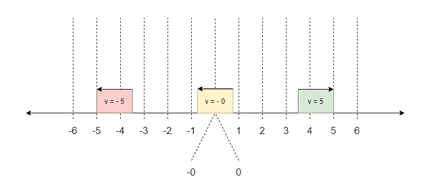

# JavaScript 中的负零？

> 原文：<https://javascript.plainenglish.io/weird-parts-in-javascript-part-3-5d5c0687c434?source=collection_archive---------10----------------------->

## 如何智胜 JavaScript 极限案例

Photo by [Émile Perron](https://unsplash.com/@emilep?utm_source=unsplash&utm_medium=referral&utm_content=creditCopyText) on [Unsplash](https://unsplash.com/s/photos/programming?utm_source=unsplash&utm_medium=referral&utm_content=creditCopyText)

# 什么是负零？

> 负零不存在！

当你问数学家负零存在时，这将是一个答案。那么，负零到底是什么？艾萨克·牛顿会怎么想呢？嗯，我们不能问他，但是我们可以看说明书！如果我们查看 IEEE 754 ( [2019 — IEEE 浮点运算标准](https://standards.ieee.org/standard/754-2019.html)，我们可以找到一些关于负零的有用信息。根据规范，**负零是一个前面有符号'-'的零值-零的负表示。负零是一个错误吗？不，我们稍后会找出原因。让我们用我们的知识来测试一下:**

例如，如果我们给一个变量赋值-0，然后我们用三重等于(===)测试它，它将返回 true - **一个期望的结果，对吗？是的，但是如果我们试图将一个值强制转换成一个字符串(stringify it)会发生什么呢？让我们试试:**

我们在这里使用了 *toString* 方法，得到了预期的结果。那不好，标志在哪里？你能预测这个吗？和其他情况一样，历史原因是最引人注目的原因。在语言的早期，JavaScript 贡献者认为这看起来像是一个 bug，所以他们决定用“0”代替“-0”。

结论:**编程语言要做有意义的事情，而不是开发者想要的！**

另一个流行的特性是**惰性分号**特性(表达式末尾的自动分号)——一个奇特的东西。没有必要这样，让开发人员做他们的工作。让我们用一些数学特征来测试这种怪异:

现在的负零你该怎么看？不是数字，对吧？不，在这种情况下，**小于和大于运算符撒谎。**

[ECMAScript 6](https://www.w3schools.com/js/js_es6.asp) 引入了一个新的超级智能实用程序——[*object . is()*](https://developer.mozilla.org/en-US/docs/Web/JavaScript/Reference/Global_Objects/Object/is)([Kyle](https://medium.com/u/5dccb9bb4625?source=post_page-----5d5c0687c434--------------------------------)Simpson 称之为四倍等于)。使用这个工具，您可以最终确定两个值是否相同。以前没有内置的(本机方式)方法来做到这一点。看下一个例子:

我们何不试试用*号()*:

做着正确的事情，却对我们的需求毫无用处。您不能用它来进行比较，因为:

我讲了很多史实，大大小小的错误，但是**负零有什么意义？**怎么才能用上那个诡异的东西？

在数学中，通常会有可能的值作为结果——相同值的正负表示。在数学中，有两个可能的值是很常见的事情。你可能有一个负的和正的数值表示，这是我们讨论二次方程时的惯例。下一个问题至关重要！什么是唯一一个不能有相同值的双重表示的数？**当然是零度。**

在编程中，情况并非如此。那怎么用负零呢？我举个简单的例子。我们有一个可以前后移动的项目。向前运动更常见，但我们必须处理反方向的运动。我们要在值前面加-号，案子就解决了！是的，但是在零的情况下呢？感谢 JavaScript 贡献者为**负零**。当值为零时，我们仍然可以借助负零来表示运动方向。如你所见，**负零在某些情况下是有帮助的！物品可以代表任何东西:人工智能，全球定位系统等。**

请看下图，让事情变得更清楚:

Drawn by [draw.io](https://medium.com/u/9ce34d1dcdce?source=post_page-----5d5c0687c434--------------------------------)

另一个真实的例子是证券交易所！用负零来实现一个股票交易所的趋势利率是相当有用的。有了这个功能，我们可以区分积极和消极的趋势:

这个函数是我们在股票交易中使用的跟踪工具的一个简单例子。我们可以继续跟踪这些趋势和它们的起伏…有了这个超级酷的零负功能，即使当前是零，我们也可以表示趋势(-0 表示下降，0 表示上升)。

结论:**如果没有负零特性，实现股票交易逻辑将非常困难。如果我们跟踪一个负零，我们可以显示它一直在下降。与零值时上升相反。**

# 数学可以有它的警告！

> 我们只能知道我们一无所知！

这是列夫·托尔斯泰的名言。数学也许是一门完美的科学，但在编程中却不是！

你现在在问自己什么问题？为了把事情说清楚，我举个例子:

**如果是正值，它将返回 1，如果是负值，它将返回-1。**这些 1 和-1 的结果可能很棘手，但这是有历史原因的。这种做法是从数组中采用的。数组原理很简单:如果它不包含值，它将返回-1。这里有一个例子:

在编程方面，40 年前的情况有些不同。描述事物的唯一方法是用数字。**表示不存在的唯一合理方式是用-1。**[JavaScript 的创造者](https://twitter.com/brendaneich)有一个更好的方案来解决这个问题。不幸的是，他坚持用这种老方法。**返回 *NaN* (无效数字表示)而不是-1 不是更合理吗？**

这是 JS 的一点历史。现在，我们要回到我们的会话。 *Object.is()* 应该能够告诉我们是否有负零，但是:

这是真的吗？他们为什么这么做？对此没有合理的解释。最简单的方法是像第一个例子一样返回 1(或-1)。这个工具很有前途，但最终让我们失望了。

幸运的是，JavaScript 有一个强大的社区，他们找到了这个问题的解决方案。我们可以“修正”这个方法，使其表现得更合理:

如果参数不是零值(0 或-0)，我们将使用内置的 *Math.sign()* 。如果参数是零值(0，-0)，我们将使用 Object.is 进行比较。让我们来测试一下:

我们也可以在原型对象上修改这个方法:

请记住， [ECMAScript 标准](https://www.ecma-international.org/ecma-262/)不建议修改原型链。

结论: **Math.sign()不会帮助我们确定负零。为了区别 0 和-0，编写一个你自己的 *sign()* 方法。**

那些是我们经常遇到的一些棘手的情况。我们不需要回避它，我们可以让它做正确的事情。程序中会出现特殊值。我们的目标是理解它们并以适当的方式使用它们。一个好的方法将帮助我们使我们的代码更具可读性、语义性，最重要的是要易于理解。

## **简明英语笔记**

你知道我们推出了一个 YouTube 频道吗？我们制作的每个视频都旨在教给你一些新的东西。点击此处 查看我们，并确保订阅该频道😎