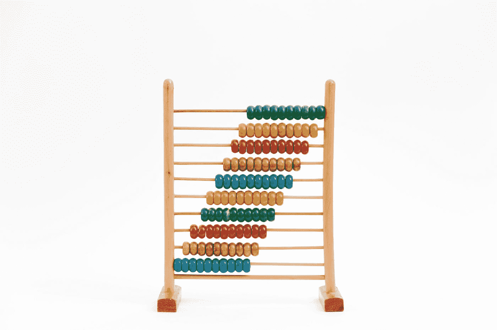

# JavaScript 奇怪的部分——数学运算

> 原文：<https://javascript.plainenglish.io/weird-parts-of-javascript-math-operations-9dcdbb4f690?source=collection_archive---------8----------------------->



Photo by [Crissy Jarvis](https://unsplash.com/@crissyjarvis?utm_source=medium&utm_medium=referral) on [Unsplash](https://unsplash.com?utm_source=medium&utm_medium=referral)

JavaScript 是一种编程语言，由于它的过去，它有很多奇怪的行为。它未经询问就对我们正在做的事情做了许多假设。

在本文中，我们将看看 JavaScript 数学运算中奇怪的部分，这样我们就不会陷入导致错误的陷阱。

# `undefined`和`Number Function`

JavaScript `Number`函数用于将任何东西转换成数字。

如果我们不向`Number`函数传递任何东西，它将返回数字 0。然而，如果我们传入`undefined`，那么它将返回`NaN`。

我们调用`Number`的时候要小心这种边缘情况。

如果没有参数传入函数，那么它假设参数`value`是`+0`。否则，参数将被调用`ToNumber(value)`。

所以如果参数是`undefined`，那么就会调用`ToNumber(undefined)`，返回`NaN`。

# `parseInt`

`parseInt`用于通过将其参数解析为整数来将某物转换为数字。

它接受任何值并试图返回一个数字。第一个参数是我们要转换成数字的内容，第二个参数是基数，它是数字的基数。例如，2 是二进制，10 是十进制，16 是十六进制。

基数可以是 2 到 36。否则，它将返回`NaN`。这是因为我们数中的数字集合是由数字 0 到 9 和字母 a 到 z 组成的。

例如，如果我们有基数 2，那么数字是 0 到 1。如果我们以 11 为基数，那么我们有 0 到 9 和字母“a”作为可能的数字。

如果我们以 12 为基数，那么我们有 0 到 9 和字母“a”和“b”作为可能的数字。

`parseInt`会根据基数将任何有效数字的字符转换成数字。

例如，我们可以写类似于`parseInt('abc', 13)`的东西，我们得到 1845，因为所有的数字都被转换成它们的 13 进制等价物。

我们还会得到类似于`parseInt(null, 24);`返回 23 的结果，因为基数为 24，`n`是第 14 个字母，是字符集中的最后一个数字。由于“u”在基数为 23 的数字系统中不是有效的数字，它将在`n`处停止。

因此，`null`是 23，因为它被转换为`'null'`，然后试图将‘n’转换为一个数字并停止，所以我们得到 23。

此外，我们必须小心地将分数转换成数字。例如，`parseInt`将通过删除小数点后的所有内容来截断数字。

例如，如果我们有下面的表达式:

```
parseInt(1 / 22222222);
```

我们得到 4，因为`1 / 22222222`返回`4.5000000450000004e-8`，然后它被转换为 4，因为小数点后的所有内容都被截断。

# 使用`true`和`false`进行数学运算

如果对`true`和`false`应用各种运算符或函数，它们将被转换为数字。

例如，如果我们调用`Number(true);`，它返回 1，因为它是真的，所以它被转换为 1，因为它是真的。

另一方面，如果我们使用一元加号将`true`转换为数字，我们也将 1，因为除了`true`、`false`和`null`之外，它只转换数字和浮点数的字符串表示。

否则，它将返回`NaN`。这意味着`true`由于其真实性也被转换为 1。

另一方面，`false`将与两者一起转换为 0。


Photo by [Benjamin Lizardo](https://unsplash.com/@benji3pr?utm_source=medium&utm_medium=referral) on [Unsplash](https://unsplash.com?utm_source=medium&utm_medium=referral)

# `0.1 + 0.2`

在 JavaScript 中，所有的数字都是浮点数，所以当我们编写像`0.1 + 0.2`这样的表达式时，它会返回一些像`0.30000000000000004`这样我们意想不到的数字。

0.1 和 0.2 接近其真实值。近似值 0.2 大于其有理等效值，但最接近的近似值 0.3 小于有理数。

那么我们最后得到的是 0.1 和 0.2 之和，比有理数 0.3 略大，因为 0.2 的近似值在近似时略大。

# 结论

当用`parseInt`和`Number`转换数字时，我们必须小心。他们都有意想不到的边缘情况。

尝试根据基数转换任何可能包含有效数字的字符串，所以我们应该确保我们的字符串实际上是数字。

对于`Number`函数，如果我们传入`undefined`，我们得到`NaN`，因为它会调用内部`ToNumber`函数，试图将其转换成一个数字。

`true`和`false`将分别用`Number`和一元`+`运算符转换为 1 和 0。

## **简单英语注释**

你知道我们有四种出版物吗？给他们一句话来表达爱意: [**JavaScript 简单明了**](https://medium.com/javascript-in-plain-english) 、[、 **AI 简单明了**、](https://medium.com/ai-in-plain-english)、[、UX 简单明了、T21 简单明了](https://medium.com/ux-in-plain-english)[、 **Python 简单明了**、](https://medium.com/python-in-plain-english)、**、**——谢谢你们，继续学习吧！

此外，我们一直对帮助推广好的内容感兴趣。如果您有任何想提交给我们的出版物的文章，请发邮件至[**submissions @ plain English . io**](mailto:submissions@plainenglish.io)**并附上您的 Medium 用户名和您感兴趣的文章，我们会回复您的！**