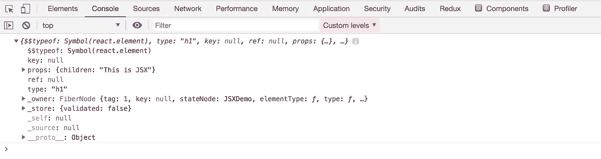
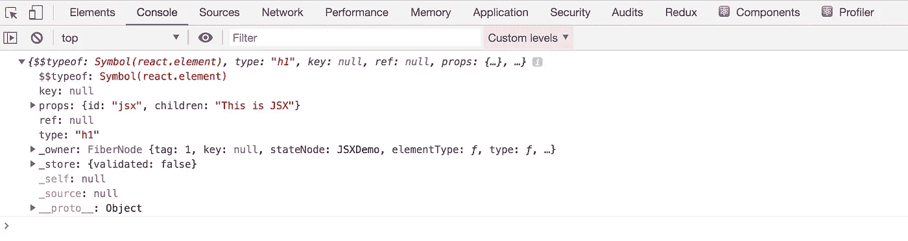
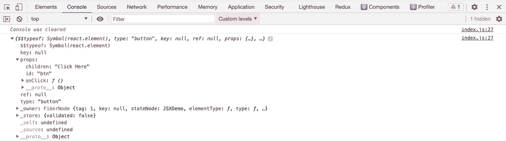
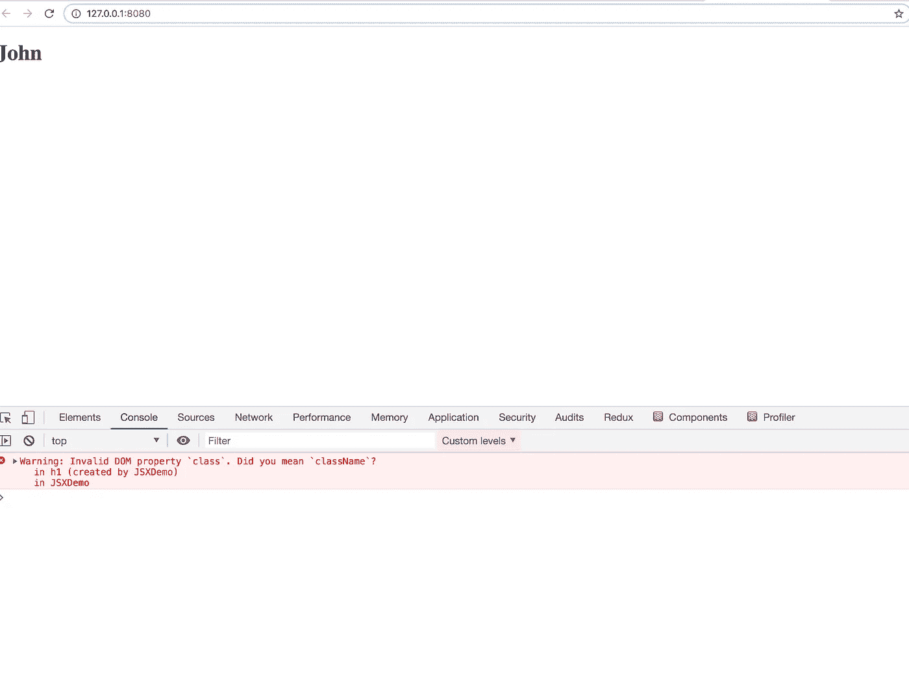
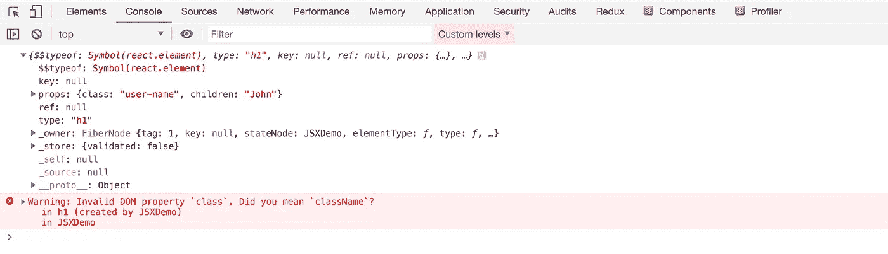
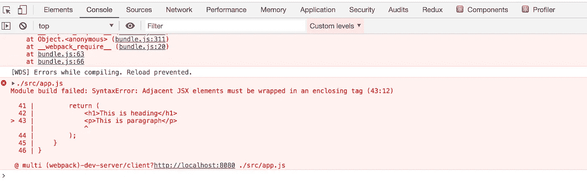
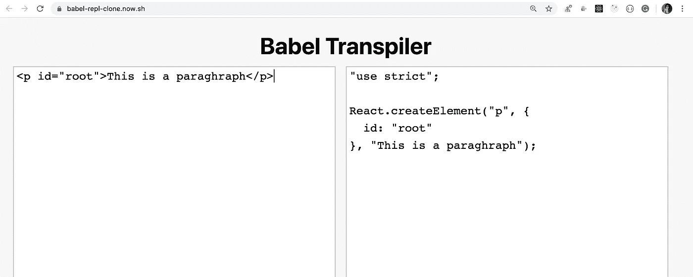

# 当我们渲染一个 React 组件时会发生什么

> 原文：<https://javascript.plainenglish.io/what-actually-happens-under-the-hood-when-we-render-a-react-component-2bfa4d594a78?source=collection_archive---------2----------------------->

## 更好地理解 React 工作原理的关键


Photo by [Filiberto Santillán](https://unsplash.com/@filijs?utm_source=medium&utm_medium=referral) on [Unsplash](https://unsplash.com?utm_source=medium&utm_medium=referral)

与其他前端框架相比，React 是构建单页面应用程序(SPA)的首选库。如此受欢迎的原因之一是因为它可以即时更新 DOM，并且只呈现 DOM 中发生变化的部分。

React 用于呈现组件的 DOM 被称为虚拟 DOM。

它类似于浏览器 DOM，但它有一些特殊的特性，这使得它非常快。

在本文中，我们将讨论，当我们呈现一个 react 组件时会发生什么。

所以让我们开始吧

让我们编写一个 React 组件，如下所示

React Component

看看上面的代码，我们从渲染函数中返回了下面的 JSX

```
<h1>This is JSX</h1>
```

浏览器不理解这段代码，因为它不是 javascript 代码。所以为了让它在浏览器中工作，我们使用了一个类似于`Babel`的编译器，它会将这些代码转换成浏览器可以理解的代码。(`create-react-app`工具内部使用 babel 进行转换)

但是浏览器可以理解的代码是什么呢？

当巴别塔执行上述 JSX 时，它会将其转换为以下代码

Babel Generated JSX

每个 JSX 都被转换成浏览器能理解的`React.createElement`调用。

`React.createElement`的语法如下

```
React.createElement(type, [props], […children])
```

让我们看看`createElement`函数的参数。
1。类型可以是一个 HTML 标签，如 h1、div 等，也可以是一个 React 组件

2. **props** 是您希望元素拥有的属性

3.**子**包含其他 HTML 标签或者可以是一个组件

`createElement`调用将最终被转换成如下的对象表示

```
{   
 type: 'h1',   
 props: {     
   children: 'This is JSX'   
 }
}
```

如果您将 JSX 赋给某个局部变量并记录下来，您可以看到这个对象表示，如下所示

您将看到如下所示的日志



Object Representation

现在考虑一下下面的 JSX

```
<h1 id="jsx">This is JSX</h1>
```

这将被转换为

```
React.createElement("h1", {
 id: "jsx"
}, "This is JSX");
```

它的对象表示看起来像这样

```
{ 
  type: 'h1', 
  props: { 
   children: 'This is JSX', 
   id: 'jsx'
  } 
}
```



Object Representation of Props

现在考虑下面的代码

With OnClick Handler

为此，`createElement`调用将看起来像这样

```
React.createElement("button", 
 {
  id: "btn", onClick: function() {}
 }, "Click Here" )
```

它的对象表示如下



Object Representation

现在，你明白了。

现在让我们看看下面的代码

Component With Props

如果您运行这段代码，您将会看到名称`John`显示在屏幕上，如下所示



JSX with Class

您还会注意到控制台中有一个警告，写着`“Invalid DOM property `class`. Did you mean `className`?”`

为了理解为什么会出现警告，如果打印它的对象表示，您会看到



Object Representation

如您所见，props 对象具有值为`user-name`的`class`属性，javascript 类中的**是保留关键字，因此访问 props.class 将导致错误**

这就是为什么`React`将`class`更名为`className`。

如果您将代码中的`class`更改为`className`，该代码将生效，如下所示

```
<h1 className="user-name">{this.props.name}</h1>
```

您可以在这里得到所有支持属性的完整列表

现在，看看下面的代码

如果您保存代码并运行应用程序，您将在控制台中看到一个长错误，说`“Adjacent JSX elements must be wrapped in an enclosing tag”`



Adjacent Elements

您知道吗，
***< h1 >这是标题</h1>*** *会被转换为
***作出反应。create element(h1，null，这是标题)*** 和
***p>这是段落</p>T38****

*正如您在转换后的代码下面看到的*

*在这里，我们从渲染方法返回两件事，这将不起作用。*

*为了使其工作，显而易见的解决方案是将它们都包装在某个父元素中，很可能是`div`之类的元素*

*但也有其他方法让它发挥作用。*

*1.通过如下将它作为数组返回*

```
*render() {
 return (
  [ <h1>This is heading</h1>, <p>This is paragraph</p> ]
 );
}*
```

*这将完成工作，但正如您在浏览器控制台中看到的，您将收到一条警告，说`“Warning: Each child in a list should have a unique “key” prop”.`*

***因为在反应中，数组中的每个元素都需要添加一个唯一的键。***

*我们可以通过在相邻元素之间添加一个唯一的键来修复它*

```
*render() {
 return (
 [ <h1 key="heading">This is heading</h1>, <p key="paragraph">This is paragraph</p> ]
 );
}*
```

*2.另一种固定方式是使用`React.Fragment`组件*

```
*render() { 
 return ( 
  <React.Fragment> 
   <h1>This is heading</h1> 
   <p>This is paragraph</p> 
  </React.Fragment> 
); 
}*
```

*`React.Fragment`被添加到版本 16.2 中，因为我们必须在类似 div 的标签中包装多个相邻的元素。这将添加额外的不必要的标签。*

*这在大多数时间都很好，但在某些情况下并不好。*

*如果我们在渲染中生成带有 tr 和 td 标签的表格结构，那么我们必须将它们包装在 div 中，但是这是不正确的，因为`<table>`标签应该只包含`tr`和`td`而不是 div*

*所以下面的代码变得不正确*

```
*render() { 
 return ( 
  <div> 
   <td>Name</td> 
   <td>Age</td> 
  </div> 
); 
}*
```

*今天到此为止。我希望你今天学到了新东西。*

***注意**:如果你想看到`JSX`到`React.createElement`的转换代码，你可以越过[这里](https://babel-repl-clone.now.sh/)，这是我们在[这篇文章](https://levelup.gitconnected.com/create-a-clone-of-babel-repl-site-to-convert-es6-react-code-to-es5-93cdc9ad98ea)中创建的，你可以在左边写 JSX 代码，在右边看到转换后的代码，如下图所示*

**

*Babel conversion*

***别忘了直接在你的收件箱** [**这里**](https://yogeshchavan.dev) **订阅我的每周简讯，里面有惊人的技巧、窍门和文章。***

## *进一步阅读*

*[](https://bit.cloud/blog/-extracting-and-reusing-pre-existing-components-using-bit-add-l28qlxpz) [## 使用位添加提取和重用预先存在的组件

### 最后，您完成了为应用程序中的输入创建一个奇妙的输入字段的任务。你对……很满意

比特云](https://bit.cloud/blog/-extracting-and-reusing-pre-existing-components-using-bit-add-l28qlxpz) 

*更多内容请看* [***说白了就是***](https://plainenglish.io/) *。报名参加我们的* [***免费每周简讯***](http://newsletter.plainenglish.io/) *。关注我们关于* [***推特***](https://twitter.com/inPlainEngHQ) ， [***领英***](https://www.linkedin.com/company/inplainenglish/) ***，***[***YouTube******，***](https://www.youtube.com/channel/UCtipWUghju290NWcn8jhyAw)*[***不和*** *对成长黑客感兴趣？检查出*](https://discord.gg/GtDtUAvyhW) [***电路***](https://circuit.ooo/) ***。*****