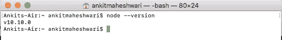
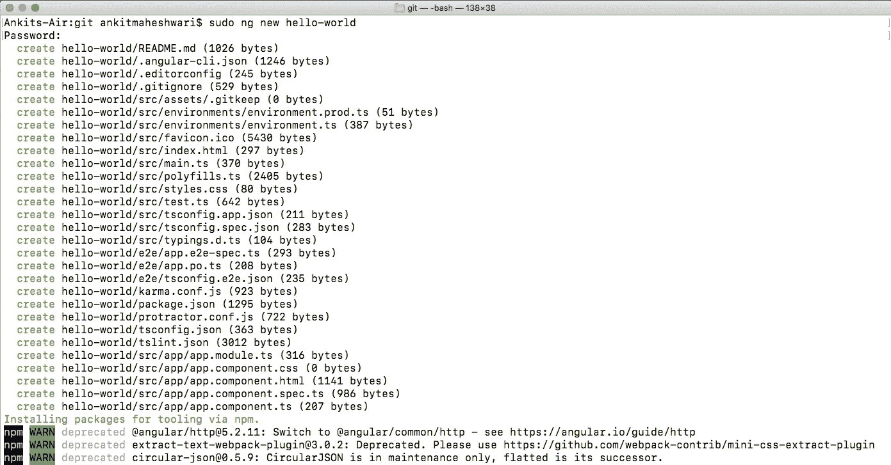
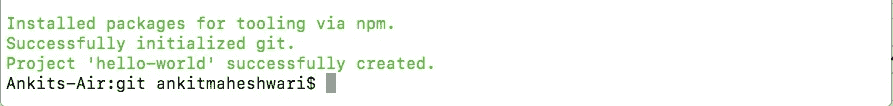

# 什么是有角？

> 原文：<https://javascript.plainenglish.io/what-angular-is-5d27bffb1fb1?source=collection_archive---------3----------------------->

## 什么是有角？(第 1 部分)|设置开发人员环境|创建新的 Angular 项目。


# 先说什么是角形？

Angular 是一个用 HTML、CSS 和 Javascript / Typescript 构建客户端应用程序的框架。

***Typescript*** *:是编译成 Javascript 的语言。使用 Angular 时，Typescript 是非常常见的——因为即使 Angular 也是用 Typescript 编写的。*

**我们为什么需要棱角分明？**

复杂的应用程序很难用 Javascript 和 Jquery 来维护。我们需要一种方法来构建我们的应用程序。这就是为什么这些框架(Angular，React 等。)都用上了。

**使用 Angular 的好处？**

*   给我们的应用程序一个清晰的结构:易于理解和维护
*   包括许多可重用的代码
*   使我们的应用程序更易测试

**建筑的棱角？**

*前端(客户端)*👇 *←→后端(web 服务器)*👇

*用户界面*👇 *←→数据+API 和处理(业务逻辑)*👇

*(HTML，CSS，Typescript，JS，Angular)* 👇 *←→ (Java，Python，Node.js 等。)*👇

*前端(客户端)使用 API 向/从服务器发送/接收数据*

***A*** *应用* ***P*** *编程* ***I*** *接口(API)/HTTP 服务*

*在 API 中，可以通过 HTTP 协议访问端点(GET & POST 方法)*

*端点是访问 API 和 HTTP 请求的 URL，从/向服务器获取/发送数据。*

***Angular 的作用在前端，即客户端——用户界面。***

# 第一个角度应用程序

# 设置开发人员环境

**1。安装** [**节点**](https://nodejs.org) **的稳定版本。**

[**N** ode](https://nodejs.org) :它基本上是一个在浏览器之外执行 Javascript 代码的运行时环境。*在这个项目中，我们基本上不使用 Node，但是 Node 提供了一些我们构建 angular 项目所需的工具。*

访问:[https://nodejs.org](https://nodejs.org/en/)/下载并安装推荐的 Node 稳定版。

安装完成后，检查以确保安装成功->打开命令提示符& type: **node — version** 以确保节点安装成功。(构建 angular 应用程序所需的节点最低版本是 6.9 版)

```
**node --version**
```

在我的 Mac 电脑上，它显示节点版本:v10.10.0👇



Node Version in Terminal (Command Prompt)

**2。安装**[**A**ngular**CLI**](https://cli.angular.io/)**。**

* *一旦我们安装了节点*，那么我们就可以使用 **N** ode 包 **M** anager 或者 **NPM** *来安装第三方库。* *

我们要为这个项目安装的一个库是[**A**ngular**CLI**](https://cli.angular.io/)**或[**A**ngular**C**ommand-**L**ine**I**interface](https://cli.angular.io/)。这是一个命令行工具，我们用它来创建新的 Angular 项目或生成一些样板代码来开始新的项目。**

**[**A**ngular**CLI**](https://cli.angular.io/):安装 Angular CLI… |打开**C**ommand**P**rompt 或 **T** 终端，输入以下命令:**

```
**sudo npm install -g @angular/cli**
```

**(放置`sudo`以管理员身份执行此命令-对于 **Mac/Linux 用户**和 **Windows 用户** *→搜索命令提示符→右键然后单击‘以管理员身份运行’*|`**sudo**`对于 Windows 用户是不需要的)(`-g`代表全局)(`@angular/cli`是包的名称)和(`npm`是 **N** ode 包 **M****

*   **如果我们不放置 `*-g*` *，angular cli 将只安装在当前文件夹中，在其他任何地方都无法访问。***
*   ***按下* `sudo` *或打开“命令提示符”，管理员会提示我们输入系统密码。***

**安装完成后，检查以确保安装成功->打开命令提示符& type: **ng — version** 以确保 Angular CLI 安装成功。**

```
**ng --version**
```

**在我的 Mac 电脑上显示 Angular CLI 版本:1.6.5 和 Node 版本:10.10.0👇**

****

**AngularCLIversion in Terminal (Command Prompt)**

*** *我们已经安装了节点、NPM 和 Angular CLI。现在，我们可以创建一个新的角度项目* ***

**如果 **您无法启动并运行您的环境，请在下面的评论框中提出您的问题/错误。****

# **创建新的角度项目**

****1。打开命令行并键入:****

```
**sudo ng new hello-world**
```

**(使用`**sudo**`避免权限错误-对于 **Mac/Linux 用户**和 **Windows 用户** *→搜索命令提示符→右键单击，然后单击‘以管理员身份运行’*|`**sudo**`对于 Windows 用户不是必需的)(`**ng new**`是启动新 Angular 项目的命令)(`**hello-world**`是项目的名称)**

*   **这个命令将生成一堆文件和文件夹(请看附件图片的顶部👇*)然后它使用 NPM 下载第三方库(看下面的图片*👇*)。***

**⭐️ ***重要提示:*** *在*上方运行时👆*命令*——*你可能会面临一个错误:***

***要消除* `*'git'*` *错误，您必须在您的系统中安装 git*——使用此链接👇要在您的系统中下载并安装 git，`click here for git *→* [https://git-scm.com/downloads](https://git-scm.com/downloads)`**

********

*   ***我们的项目已成功创建。***
*   **现在，要开始编码，我们需要一个代码编辑器。我们将要用到的编辑器是[***V****isual****S****tudio****C****ode*](https://www.google.com/url?q=https%3A%2F%2Fcode.visualstudio.com%2F&sa=D&sntz=1&usg=AFQjCNFfrd2nqbS9PitDdShdvXIIGWl04g)*或*[***VS******C****ode*](https://www.google.com/url?q=https%3A%2F%2Fcode.visualstudio.com%2F&sa=D&sntz=1&usg=AFQjCNFfrd2nqbS9PitDdShdvXIIGWl04g)**

**访问:[https://code.visualstudio.com/](https://www.google.com/url?q=https%3A%2F%2Fcode.visualstudio.com%2F&sa=D&sntz=1&usg=AFQjCNFfrd2nqbS9PitDdShdvXIIGWl04g)*下载安装[**VS****C**ode](https://www.google.com/url?q=https%3A%2F%2Fcode.visualstudio.com%2F&sa=D&sntz=1&usg=AFQjCNFfrd2nqbS9PitDdShdvXIIGWl04g)。***

***([***VS*******C****ode**](https://www.google.com/url?q=https%3A%2F%2Fcode.visualstudio.com%2F&sa=D&sntz=1&usg=AFQjCNFfrd2nqbS9PitDdShdvXIIGWl04g)**美观、跨平台的轻量级编辑器或者可以随意使用 sublime、atom 或者其他任何编辑器*)****

*   ****项目在[**VS****C**ode](https://www.google.com/url?q=https%3A%2F%2Fcode.visualstudio.com%2F&sa=D&sntz=1&usg=AFQjCNFfrd2nqbS9PitDdShdvXIIGWl04g)看起来很美。👇👇****

********

> ****点击这里👇for Part—2
> [*https://medium . com/@ ankitmaheshwarin/what-angular-is-Part-2-550954552 d89*](https://medium.com/@AnkitMaheshwariIn/what-angular-is-part-2-550954552d89)****

****如果你不介意给它一些掌声👏 👏既然有帮助，我会非常感谢:)帮助别人找到这篇文章，所以它可以帮助他们！****

****永远鼓掌…****

********