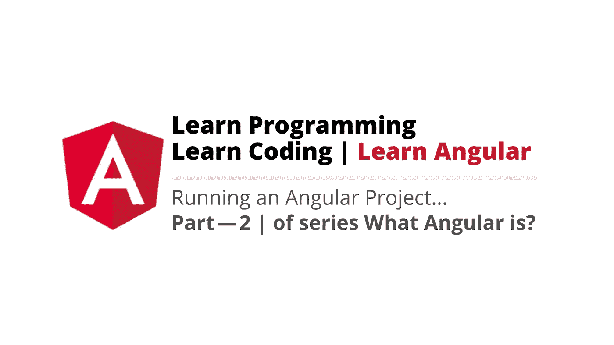
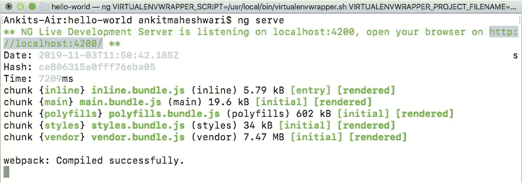
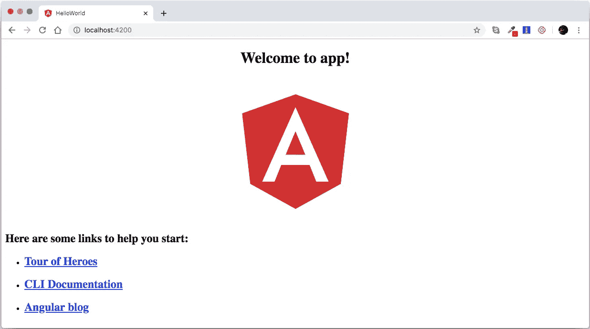

# 构建和运行角度项目。

> 原文：<https://javascript.plainenglish.io/what-angular-is-part-2-550954552d89?source=collection_archive---------6----------------------->

## 什么是角度(第二部分)

## 它是如何工作的……|如何开始……

> 如果您还没有涉及到本系列的[第-1 部分](https://medium.com/@AnkitMaheshwariIn/what-angular-is-5d27bffb1fb1)，建议您查看此链接*>*[什么是棱角？|第-1 部分](https://medium.com/@AnkitMaheshwariIn/what-angular-is-5d27bffb1fb1)



# 运行一个角度项目怎么样？

将我们的应用程序加载到 web 服务器中👉打开命令提示符或终端并输入👇

```
**ng serve**
```

Live development server 侦听 localhost 端口 *→* 4200

看👇它生成了捆绑包(main.bundle.js 等..)Javascript 和 CSS 文件(style . bundle . js)



Command: ng serve -> to run an Angular Project

打开 Chrome 并输入 [http://localhost](http://localhost) :4200/

输出👇这是我们的第一个角度应用程序👏👏



# 让我们看看我们的角度项目的结构——


the structure of our Angular Project

*   我们的第一个文件夹是**e2e**——它代表**端到端—** ，这是我们为应用程序编写端到端测试的地方。这些基本上是模拟真实用户的自动化测试，因此我们可以编写代码来启动我们的浏览器，导航到我们应用程序的主页，单击这里和那里的几个链接，填写一个表单，单击一个按钮，然后断言页面上有什么东西——这是一个端到端测试的例子。
*   下面是 **node_modules —** 它存储了我们的应用程序可能依赖的所有第三部分库。这个文件夹纯粹是为了开发，所以当我们编译我们的应用程序时，这些第三方库的部分被放在一个捆绑包中，并与我们的应用程序一起部署。所以我们不会将这个 node_module 文件夹部署到服务器上。
*   下面是**src**(**source**folder)**—**这就是我们应用程序的实际源代码。
*   其中，我们有 src/ **app 文件夹—** 该 app 文件夹包含一个模块和一个组件—每个应用程序至少有一个模块和一个组件。
*   其中有一个 src/ **assets 文件夹—** 用来存储应用程序的静态资产。所以，如果我们有任何图像文件，图标，所有这些都在这里。
*   在该文件夹中，我们有 src/ **环境文件夹—** 用于存储不同环境的配置设置。因此，我们有一个文件用于生产环境(environment . product . ts)，另一个用于开发环境(environment.ts)。
*   **src 文件夹**中的其他文件有—

(src/**fav icon . ico**-这是浏览器中显示的图标。)

(src/**index.html**—包含我们的应用程序的简单 html 文件，没有对脚本或样式表的引用，这些引用将被动态插入到该页面中。)

(src/ **main.ts** —这个主文件是一个类型脚本文件，这基本上是我们的应用程序的起点——这与许多编程语言的 main 方法相同——任何程序或应用程序都从这里开始。)

在 main.ts 文件内

```
platformBrowserDynamic().**bootstrapModule(AppModule)**.catch(err => console.log(err));
```

在这里，我们正在引导我们的应用程序的主模块，在这种情况下是 **AppModule** (看上面的☝️)和角加载这个主模块，一切都从那里开始。

(src/ **polyfills.ts** —这导入了运行 Angular 所需的一些脚本，因为 Angular 框架使用 Javascript 的特性，而目前 Angular 所需的大多数浏览器都不支持 Javascript 的大多数最新特性，所以这些 polyfills 填补了浏览器支持和 Angular 需求之间的空白。)

(src/ **styles.css** —这是我们应用程序的全局样式。此外，每个页面或每个组件可以有自己的风格。)

(src/ **test.ts** —用于发送测试环境。)

*   我们在 **src 文件夹外的文件**是—

(**。angular-cli.json** —它包含角度配置。)

(**)。编辑器配置**——编辑器设置——应该对团队中的每个人都一样。)

(**。gitignore** —该文件包含文件和文件夹名称，以从您的 git 存储库中排除某些文件和文件夹。)

(**karma . conf . js**——这是 karma 的配置文件——这是 Javascript 代码的测试运行程序。)

(**package . JSON**——这是⭐️的重要文件——这是每个节点项目都有的标准文件，其中包含我们的应用程序的设置，如名称、版本、依赖项，它们决定了我们的应用程序所依赖的库。它包含了所有的 angular 库和所有的第三方库。它在开发者机器中包含纯粹用于开发应用的 **devDependencies** 和用于生产的 **dependencies** 。)

(**量角器. conf.js** —这用于运行角度的端到端测试。)

( **tsconfig.json** —包含我们的 typescript 编译器的一系列设置。Typescript 编译器查看这些设置，并将 typescript 代码编译成浏览器可以理解的 Javascript。在复杂的项目中，您可能需要更改这些设置。)

( **tslint.json** —该文件包括 TS 链接的许多设置—是一个用于类型脚本代码的静态分析工具—它管理可读性、可维护性和功能性错误。)

这是角度应用程序的基本结构。

> 如果你还没有涉及到这个系列的 [Part — 1](https://medium.com/@AnkitMaheshwariIn/what-angular-is-5d27bffb1fb1) ，推荐你查看这个链接 *→* [什么是 Angular？| Part — 1](https://medium.com/@AnkitMaheshwariIn/what-angular-is-5d27bffb1fb1)
> 
> 下一次点击这里👇对于 Part-3
> [https://medium . com/@ ankitmaheshwarin/role-of-web pack-in-angular-Part-3-of-series-what-angular-is-5058d 445 e45c](https://medium.com/@AnkitMaheshwariIn/role-of-webpack-in-angular-part-3-of-series-what-angular-is-5058d445e45c)

如果你不介意给它一些掌声👏 👏既然有帮助，我会非常感谢:)帮助别人找到这篇文章，所以它可以帮助他们！

永远鼓掌…

