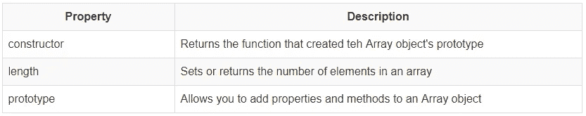
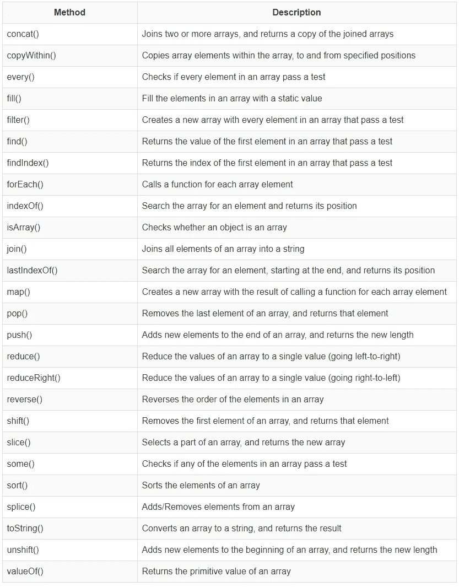

# 什么是 JavaScript 对象、方法和函数？

> 原文：<https://javascript.plainenglish.io/what-are-javascript-objects-methods-and-functions-c3a1890c7e44?source=collection_archive---------1----------------------->


Photo by [Maik Jonietz](https://unsplash.com/@der_maik_?utm_source=medium&utm_medium=referral) on [Unsplash](https://unsplash.com?utm_source=medium&utm_medium=referral)

# JavaScript 对象

在 JavaScript 中，对象是具有属性和方法的数据。

当您像这样声明一个 JavaScript 变量时:

```
var message="Hello World!";
```

创建一个 JavaScript 字符串对象。

String 对象有一个名为 length 的内置属性。对于上面的字符串，长度的值为 12。

String 对象也有几个内置方法。

# 访问对象属性

## 句法

```
objectName.propertyName
```

## 例子

```
var message = "Hello world!";
var messageLength = message.length; //12
```

# 访问对象方法

## 句法

```
objectName.methodName()
```

## 例子

```
var message = "Hello world!";
var newMessage = message.toUpperCase(); //HELLO WORLD!
```

# JavaScript 数组

数组是一个特殊的变量，它一次可以保存多个值。创建阵列有多种方法:

1.  规则的

```
var questions = [];
questions[ 0 ] = "1 + 1";      
questions[ 1 ] = "2 x 3";
questions[ 2 ] = "6 - 4";
```

2.文学的

```
var questions = [ "1 + 1", "2 x 3", "6 - 4" ];
```

# 数组属性



# 数组方法



Note: Each of the array methods will be demonstrated in the lecture using the Array Visualiser. For additional information on Javascript Arrays, in particular, if you missed the demos during the lecture, please check the [Mozilla Developer Network Array Section](https://developer.mozilla.org/en-US/docs/Web/JavaScript/Reference/Global_Objects/Array)

# 功能

函数是 JavaScript 语句的集合。这些语句通常只有一个目的，例如执行复杂的计算或验证输入到 HTML 表单中的数据。可以向函数传递对象或变量的副本来使用它们。这是在参数列表中完成的。

JavaScript 函数可以放在文档中任意位置的脚本标签中。但是，应该将它们放在文档的头部，以保证它们在被文档体中的脚本语句调用之前被加载。

## 句法

```
function functionName( parameter_1, parameter_2, ..  parameter_n ) {
   statement1;
   statement2;
   .
   .
   .
   statementn;
}
```

## 例子

这是一个寻找两个数的最大值的函数。

```
function getMax( n1, n2 ) {
   if ( n1 < n2 ) {
      return n2;
   } else {
      return n1;
   }
```

这是一个如何使用这个函数的例子。

```
<html>
  <head>
    <script>
    function getMax( n1, n2 ) {
       if ( n1 < n2 ) {
          return n2;
       } else {
          return n1;
       }
    }
    </script>
  </head>
  <body>
   <script>
     document.write( "<p>" );
     document.write( "The largest number of 5 or 6 is: " + getMax( 5, 6 ) );
     document.write( "</p>" );
    </script>
  </body>
</html>
```

一个检查学生用户名长度的功能

```
<html>
  <head>
    <script>
    function checkUserName( form ) {
       if ( form.reg.value.length != 8 ) {
          alert( "You have not entered an eight character string" );
          return false;
       } else {
          alert( "This is correct" );
          return true;
       }
    }
    </script>
  </head>
  <body>
   <p> Please enter your student username: <input type="text" name="reg" />
   <input type="button" onclick="checkUserName(form);" value="check validity"/> 
  </body>
</html>
```

# 数组属性