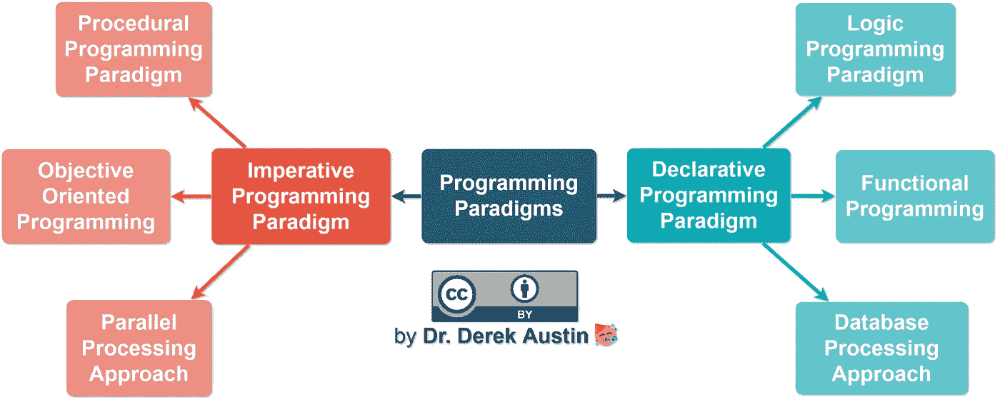

# 什么是 JavaScript 编程范例？

> 原文：<https://javascript.plainenglish.io/what-are-javascript-programming-paradigms-3ef0f576dfdb?source=collection_archive---------1----------------------->

## React 挂钩适用于哪里？

# 技术面试中你需要知道的:

*   知道什么是范式，为什么 JS 是多范式的
*   能够解释面向对象和原型继承
*   能够对比面向对象和函数式编程



Adapted from [this article](https://www.geeksforgeeks.org/introduction-of-programming-paradigms/) by Bhumika Rani by Geek for Geeks

# 对于 JavaScript 应用程序开发人员来说，哪两种编程范式是重要的？

JavaScript 是一种多范式语言，但这意味着什么呢？

让我们首先定义什么是编程范式。

现代编程语言分为两类:**命令式**(也叫**过程式**)和**声明式**(也叫**函数式**)。

面向对象编程(OOP)、过程化编程和并行处理都是命令式编程范例的例子。

函数式编程、逻辑编程和数据库处理都是声明式编程范例的例子。


(Photo by [Markus Spiske](https://unsplash.com/@markusspiske?utm_source=medium&utm_medium=referral) on [Unsplash](https://unsplash.com?utm_source=medium&utm_medium=referral))

## 为什么 JavaScript 是一种“多范例”语言

JavaScript 既支持具有原型继承的面向对象编程，也支持函数式编程。

Java 传统上是纯面向对象编程的一个例子，尽管 2018 版本以我们将讨论的称为 *lambdas* 的形式添加了函数式编程。

SQL 是纯声明性编程的一个例子，尽管供应商提供了添加过程元素的扩展。


(Photo by [Chris Ried](https://unsplash.com/@cdr6934?utm_source=medium&utm_medium=referral) on [Unsplash](https://unsplash.com?utm_source=medium&utm_medium=referral))

## 声明式(函数式)编程的特征

*   你宣布你想发生什么，而不是怎么做。
*   没有循环或条件语句(对于基于集合的语言，如 SQL，您认为数据是列而不是行)。
*   作为一个整体，数据上有大量的过滤器和操作，但是数据通常被认为是不可变的值(不可改变的)。

> *典型示例*:在 **SQL** 中，您描述了一个集合，并显示它或对每一列应用函数，如 sum、avg 或 count。因此，你可以在数据库中找到鸟类，方法是调出一个过滤过的鸟叫声列表，其中 AnimalType 等于“Bird”；然后通过参考鸟声来播放每一个的声音。


(Photo by [Kobu Agency](https://unsplash.com/@kobuagency?utm_source=medium&utm_medium=referral) on [Unsplash](https://unsplash.com?utm_source=medium&utm_medium=referral))

## 命令式(过程式/面向对象)编程的特征

*   你确切地指定如何做某事，而不仅仅是期望的结果。
*   变量、指针和存储过程是常见的，数据通常被认为是可变变量
*   继承是常见的，通常被用作可重用的干净代码的例子，以帮助未来的开发人员

> *典型的例子*:在 **Java** 中，你用一个. sound()函数创建一个 Animal 对象，这个函数产生一个声音，还有一个变量 lastMadeASound，保存最后一次调用的时间戳。声音()。您可能会编写一个 getLastMadeASound()函数。然后创建一个继承自 Animal 的 Bird 对象，并编写一个别名。简单地返回声音的 birdCall()。现在，你可以通过迭代(循环)你的鸟类数组来产生声音。每个上的 birdCall()。


(Photo by [Hitesh Choudhary](https://unsplash.com/@hiteshchoudhary?utm_source=medium&utm_medium=referral) on [Unsplash](https://unsplash.com?utm_source=medium&utm_medium=referral))

# 一种范式比另一种更好吗？

传统上，OOP 被认为更适合企业和可重用，尽管大型 OOP 应用程序可能存在与对象的嵌套继承相关的问题。

浏览 Medium，你会发现文章[讽刺函数式编程“愚蠢”](https://medium.com/better-programming/fp-toy-7f52ea0a947e)，但也有文章[解释函数式方法的好处](https://medium.com/@elizarov/functional-programing-is-on-the-rise-ebd5c705eaef)。

这两种方法可以实现许多相同的目标，我们在编写 JavaScript 时不必只选择一种，因为它是多范例的。


(Photo by [Aniq Danial](https://unsplash.com/@naxph?utm_source=medium&utm_medium=referral) on [Unsplash](https://unsplash.com?utm_source=medium&utm_medium=referral))

## JavaScript 允许我们在同一个项目中混合两种类型的编码。

但是用现代 JavaScript 编程，应该重点关注哪一个呢？

**现在让我们比较一下面向对象和函数式编程。**

然后我们将通过简单地检查 React 钩子来结束。


(Photo by [Namroud Gorguis](https://unsplash.com/@namroud?utm_source=medium&utm_medium=referral) on [Unsplash](https://unsplash.com?utm_source=medium&utm_medium=referral))

# **面向对象编程概述**

*   目标
*   班级
*   原型

## 什么是面向对象

面向对象的编程，通常缩写为 OOP，是将对象作为程序员提供的数据结构，可以用函数来操作的思想。要创建对象，您需要编写类，通常还需要一个构造函数。关键字 class 是在 ES6 (ECMAScript 2015)中引入 Javascript 的，以前的类是由函数在 JavaScript 中定义的。

## 原型和原型继承

**原型继承—** 是的，就是这么拼的——意味着普通的 Javascript 有没有类的对象。这种类型的继承有时被称为原型委托、行为委托模式或 OLOO(对象链接到其他对象)。

*   在 JavaScript 中，当我们创建对象时，它会创建一个链接。对于对象和类继承，它不复制，而只是链接属性和行为。
*   从图形上看，继承是沿着继承链向上流动的，因为它是一个行为委托链接，也称为原型链。

> *有点迷茫？可以理解！试试这条* [***原型*** ***链条***](https://codeburst.io/javascript-prototype-cb29d82b8809) *。*

## JavaScript 与其他编程语言有何不同

其他语言有“经典继承”，当我们扩展父类时，软件从父类创建一个行为副本到子类。此后，父类和子类成为独立的实体。

*   当我们使用构造函数创建一个类的对象或实例时，行为和属性被复制。在这一点上，两者都是独立的实体。
*   这是因为它们没有链接，只是从一个复制到另一个。
*   相比之下，在 Javascript 中，子类的行为只是父类行为的链接。

## JavaScript 中 OOP 工作方式的示例:

# 函数式编程概述

*   关闭
*   一级函数
*   兰姆达斯

## 什么是函数式编程？

函数式编程基本上意味着编写代码，让*做*某事(声明做了什么)，但不具体说明如何做(命令式)。

函数式编程对我来说最大的好处之一是，它有助于将**可变*变量*** 与**非可变*常量*。**

我喜欢能够清楚地知道在我的代码中我应该弄乱什么(变量)和不应该弄乱什么(常量)。这是个人喜好。

## 什么是一级函数和 lambdas？

函数是 JavaScript 中的一级对象，这意味着它们可以是:

*   存储在数组、变量或对象中
*   作为参数之一传递给另一个函数
*   从另一个函数返回

## Lambdas 使代码更加简洁

```
function (x) { return x * x };
```

与上面的传统函数声明相比，lambda 移除了*函数*和*返回*关键字。这使得这些表达式简洁。

```
range(1, 7).map(x => x * x); //-> [1, 4, 9, 16, 25, 36, 49]
```

JavaScript 中的 Lambdas 通常由“粗箭头”函数调用:

```
var square = x => x * x;
square(7); // 49
```

Lambda 表达式有时被称为块或闭包。

## 什么是了结？

每当您声明一个新函数并将它赋给一个变量时，您就存储了函数定义以及一个闭包。

闭包包含创建函数定义时范围内的所有变量。该词法范围得到了维护。

[闭合类似于背包](https://medium.com/dailyjs/i-never-understood-javascript-closures-9663703368e8)。这就像函数有一个小背包，在那个包里是所有在作用域内的变量。

## JavaScript 中函数式编程工作方式的示例:

# 那么 React 钩子适合在哪里呢？

React Hooks 是一种函数式编程方法，用于从管理应用程序的状态(即可变变量)中抽象出复杂性。

以下是使用和不使用 React 挂钩的 React 代码示例:

# 对于哪种模式更好，每个人都有自己的看法，以下是我的看法:

现在我们有了 React 钩子，如何编写 React 的巨大变化完全改变了我对代码可重用性的看法。

如果当您喜欢的语言或框架改变时，您编写代码的基本方式将会发生大规模和意想不到的变化(变得更好)，我们真的希望使用旧代码吗？

也许更好的方法是站在前沿，降低可重用性的优先级，这意味着支持函数式编程。


(Photo by [Fatos Bytyqi](https://unsplash.com/@fatosi?utm_source=medium&utm_medium=referral) on [Unsplash](https://unsplash.com?utm_source=medium&utm_medium=referral))

## 一个思想实验:你愿意有 100 行“可重用”的代码还是 10 行可以工作的代码？

假设你刚找到一个新的客户来重新开发一个 JavaScript 应用程序。

现在想象一下，您在一个企业级应用程序中发现了大量使用 jQuery 编写的面向对象的 AJAX 代码，而这个应用程序是用 React 编写的。

现在想象一下，同样的应用程序，通过使用 React 钩子，在 React 内部使用状态管理，清晰地分离可变和不可变级别。

你希望哪个进来？我宁愿自己去看后者。


(Photo by [Caspar Camille Rubin](https://unsplash.com/@casparrubin?utm_source=medium&utm_medium=referral) on [Unsplash](https://unsplash.com?utm_source=medium&utm_medium=referral))

## 代码越短越快，但不一定是更好的代码

作为一名新的程序员，是拼命编写更多的“优秀的、企业级的、可重用的代码”(即 OOP 代码)，这可能需要 100 多行代码来编写，更不用说测试了，还是赶上函数式编程的潮流，用 20 行代码编写经过测试的代码？

显然，每个组织都将有所不同，但我完全赞成具有最小继承的简短、可读的代码，因为原型继承需要研究和记忆，而函数式编程是显而易见的。


(Photo by [Kevin Ku](https://unsplash.com/@ikukevk?utm_source=medium&utm_medium=referral) on [Unsplash](https://unsplash.com?utm_source=medium&utm_medium=referral))

## 最后的想法:让我们两者都用一些

虽然每种方法都有好处，但是 JavaScript 让我们可以在相同的代码中轻松混合这两种范式，所以我认为我们应该这样做！

面向对象编程的最大优势是从一个类到另一个类的继承，这使得代码可以重复使用。(一个很好的经验法则是在编写 JavaScript 或 CSS 代码时将继承限制在不超过 3 级[的范围内](https://ladybug.dev/episode/css-part-2/)，以最大化应用程序的可重用性。)

根据定义，函数式编程是**声明式的**——你的代码准确地说出了你想要发生的事情，并且可能比命令式方法需要更少的文档或更少的代码行。但是，如果它不是内置的，您可能必须指定命令性的方法(即如何一步一步地做您想做的事情)，这自然会增加代码基数。

我认为函数式编程(尤其是使用 React Hooks)创建了更简洁、更短的代码，在大型企业应用程序中可能不太容易重用。

你同意还是不同意？请在下面的评论中告诉我！


(Photo by [Adi Goldstein](https://unsplash.com/@adigold1?utm_source=medium&utm_medium=referral) on [Unsplash](https://unsplash.com?utm_source=medium&utm_medium=referral))

# **了解更多:**

*   [编程范式介绍](https://www.geeksforgeeks.org/introduction-of-programming-paradigms/)—范式概述。
*   JavaScript 的两大支柱(第一部分 ) —原型面向对象。
*   [JavaScript 的两大支柱(第二部分](https://medium.com/javascript-scene/the-two-pillars-of-javascript-pt-2-functional-programming-a63aa53a41a4) ) —函数式编程。
*   [W3 学校 ECMAScript 2015(ES6)](https://www.w3schools.com/js/js_es6.asp)—JavaScript Class 关键字。
*   [简易反应钩](https://www.valentinog.com/blog/hooks/) —反应钩初学者指南。

德里克·奥斯汀博士是《职业规划:如何在 6 个月内成为一名成功的 6 位数程序员》一书的作者，该书现已在亚马逊上出售。