# TypeScript 和 JavaScript 之间的区别、优点和缺点是什么？

> 原文：<https://javascript.plainenglish.io/what-are-the-differences-advantages-and-disadvantages-between-typescript-and-javascript-492fb3764870?source=collection_archive---------9----------------------->

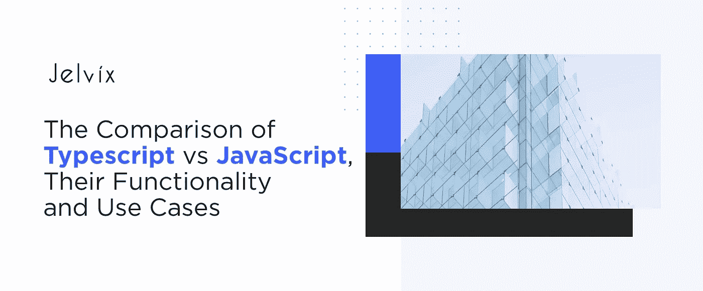

JavaScript 开发人员的生活是忙碌的。团队花了足够的时间来思考 Angular 和 Vue.js 以及 React/Redux，但创新不断进入市场。TypeScript 是最能改变游戏规则的工具之一——该工具于 2012 年发布，此后一直是技术话题。

我们经常被问到类似于 TypeScript 和 JavaScript 之间有什么区别这样的问题？所以，我们决定给出一个详细的答案，包括所有的优点、缺点和用例。

# JavaScript 是什么？

[JavaScript](https://www.w3schools.com/js/) 是一种专门为 web 开发设计的脚本语言。它支持交互式网页，是 web 应用程序的重要组成部分。应用程序不需要与硬件交互，因为所有操作都发生在浏览器中。JavaScript 通常与 XML、REST APIs 和其他技术相结合。

## **JavaScript 的目的是什么？**

JS 是目前最流行的软件开发语言。构建特定于 web 的语言背后的推理很有意义。随着 web 平台变得越来越复杂，他们需要同时处理大量的动作，并对用户的交互做出反应。使用为浏览器设计的特定语言使开发变得更加容易。

所以，使用 JavaScript 的主要原因是希望构建快速、响应迅速、高度交互的页面。

# 什么是 TypeScript？

TypeScript 可以被描述为 JavaScript 的改进版本，增加了可读性、静态编译、直观的界面和类型。创建 JavaScript 的目的是简化开发过程，并帮助开发人员交付更干净的代码库。它是 JS 的[超集，不是独立的语言。](https://en.wikipedia.org/wiki/TypeScript)

如果你使用过 Angular 2.0，你可能会看到这个子集。其他 JS 框架遵循 Angular 的例子，也实现了 TypeScript 支持。TypeScript 的主要区别在于它是强类型的或者它支持静态类型。这意味着静态类型允许在编译时检查类型的正确性。这在 JavaScript 中是没有的。

# 打字稿的优点

使用 TypeScript 并不是一个必要的改变。当然，包括我们在内的团队学习这个子集肯定是有原因的。对于我们的团队来说，我们定义了 TypeScript 的四个主要优点——实际上，这些是最有益的优点。

# 1.可选静态类型

问题 : JavaScript 是一种动态类型语言，这意味着软件直到运行时才会将类型差异视为错误。[动态类型](https://en.wikipedia.org/wiki/Type_system#Static_and_dynamic_type_checking_in_practice)非常灵活——团队不必担心将整个代码库放入同一类型中。

然而，可伸缩性成为一个问题。当开发人员不控制类型时，跟踪它们是困难的，代码缺乏清晰度并且难以维护。

**TypeScript 的解决方案** : TypeScript 非常聪明地处理了错误解决方案。用户可以切换到静态类型来限制变量的类型。您可以在不同项目的静态和动态类型之间切换——这是 JavaScript 和 TypeScript 之间的主要区别。

**静态类型的优势**

*   代码是结构化的、统一的；
*   在应用程序进入运行时阶段之前，系统会自动捕获错误输入的类型；
*   限制的严格性可以降低:您可以在某些功能中使用动态类型。

如果动态问题一直困扰着您的 JavaScript 代码团队，那么 TypeScript 将会改变游戏规则。

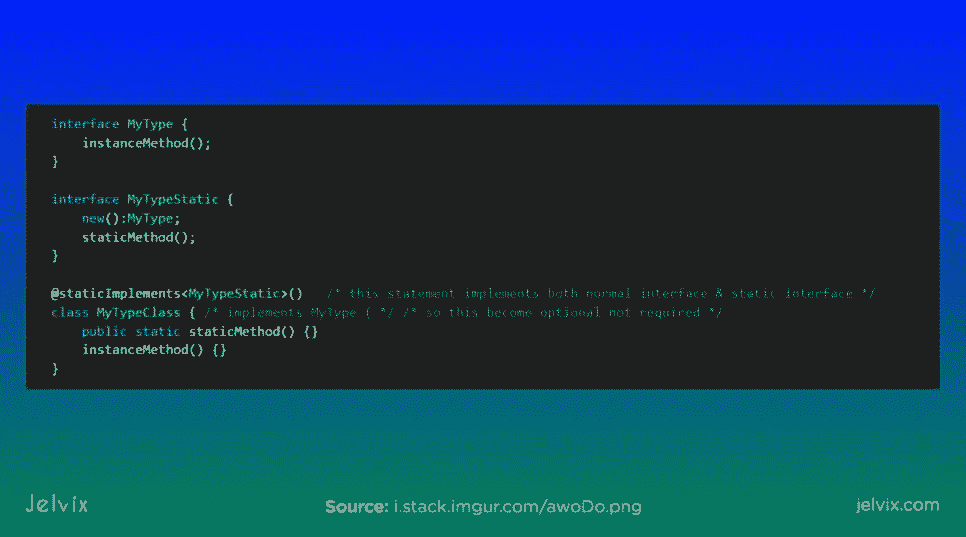

# 2.提高可读性

问题: JavaScript 提供的可读性插件很少，这意味着内置功能更少。许多错误需要手动检测。

**解决方案:**光靠静态阅读是朝着增加代码组织迈出的一大步。然而，这并不是 TypeScript 提高 JS 可读性的唯一方式。特别是，我们定义了另外三个变化。

*   早期缺陷检测。静态类型分析和逻辑监控允许实时减少 15%的错误。当然，这不是一个绝对的检测，但这比 JS 所能提供的要多得多。为了提高精度，开发人员可以运行编译器。
*   稳定的代码。静态类型允许开发人员确保变量将保持其声明的状态。
*   定义的类型。TypeScript 为变量声明提供了清晰的类别。基本的有数字、字符串、数组、对象、布尔、空、空和未定义。还有高级实体——泛型、接口和联合类型。每一个都描述了一个特定的功能。

**JavaScript 代码:**

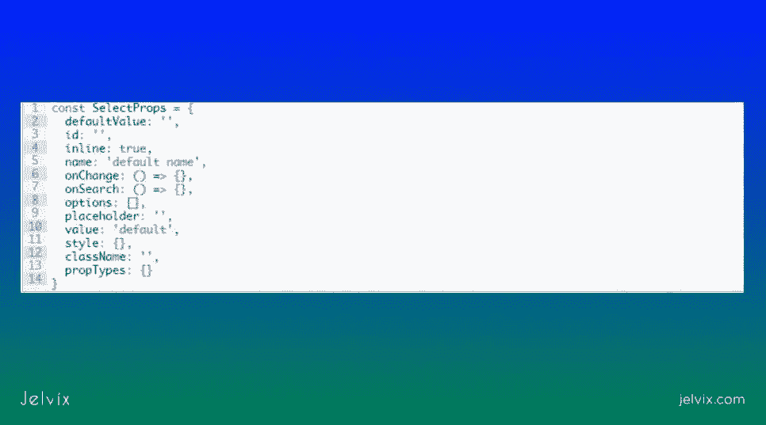

**打字稿代码:**

TypeScript 提供了内容更丰富的基本代码版本。它不需要开发人员编写和阅读大量的文档。

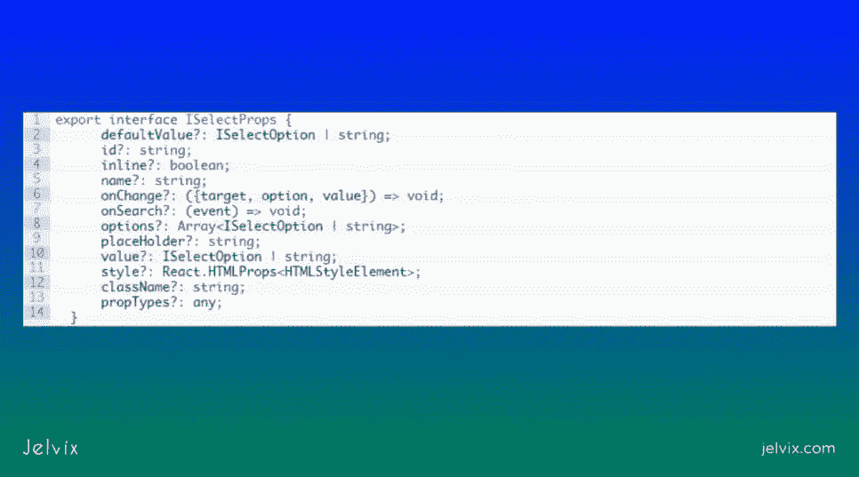

# 3.智能感知

**问题:**静态类型的存在可能会减缓产品的开发。幸运的是，情况并非如此，因为 TypeScript 生态系统提供了过度补偿潜在延迟的工具。

**解决方案:**随着代码质量的提高，TypeScript 也能够提高生产速度。微软开发了一种叫做智能感知的代码导航工具。

*   IntelliSense 提供自动代码完成选项；
*   将鼠标悬停在方法名称上，您将看到对象的属性和参数；
*   开发人员可以设置热键来访问仪器的详细描述。

这个工具的概念很棒，但它的执行现在还远非完美。开发人员经常面临将 IntelliSense 与其 JavaScript 代码库集成的问题。它通常不稳定，缺乏精确性。

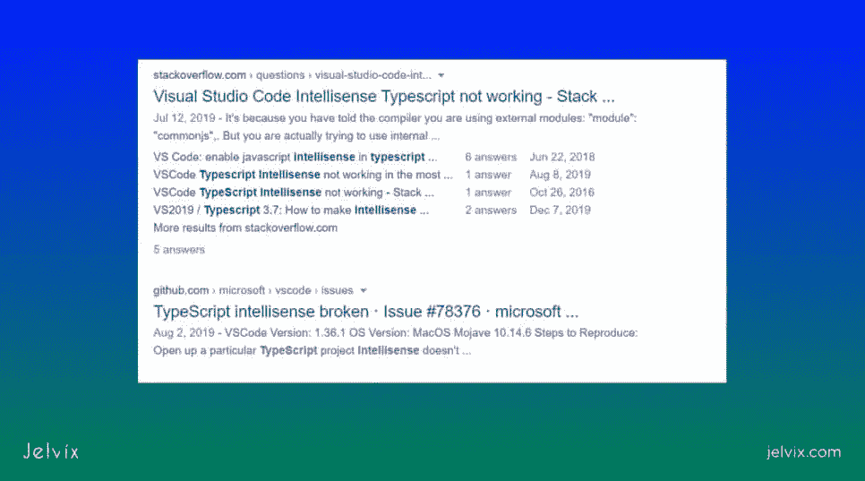

尽管如此，[智能感知](https://docs.microsoft.com/en-us/visualstudio/ide/using-intellisense#:~:text=IntelliSense%20is%20a%20code%2Dcompletion,with%20only%20a%20few%20keystrokes.)帮助我们加快了许多项目，所以即使它不是最可靠的解决方案，它也有很大的潜力。这就是为什么我们认为它仍然是一个有效的优势，尽管有一些明显的缺点。

# 4.新功能

**问题:** JavaScript 有很好的功能和生态系统，但是有几个重要的特性不存在。TypeScript 从其他语言(包括静态类型的语言)中获得灵感，以提供更高的可靠性。

**解决方案:**作为 JavaScript 的一个附加子集，TypeScript 提供了几个 JavaScript 完全没有的特性。我们已经回顾了其中的一些——比如可选的静态类型——但是还有其他一些重要的。

*   **类型注释**:TypeScript 自动检查每个静态类型的值。开发人员知道哪些参数不能赋给特定的参数。他们可以立即看到警报——这种自我记录使得管理和监控代码变得更加容易。
*   **泛型:** JavaScript 没有像 [Java 和 C#](https://en.wikipedia.org/wiki/Comparison_of_C_Sharp_and_Java) 那样的可重用组件的特定类型。TypeScript 通过提供泛型(存储为单个组件的类型组合)解决了这一缺点。开发人员可以通过一个动作键入许多类型。
*   **改进的 API 文档** : JavaScript 提供了基本的 jsdocs 和工具。TypeScript 有许多定制工具，这些工具在最初的 JavaScript 中是没有的。像 [VS 代码导航](https://code.visualstudio.com/docs/editor/editingevolved)这样的工具允许开发人员自动查看参数类型，跟踪变量，管理整个代码库，并放大特定的函数。

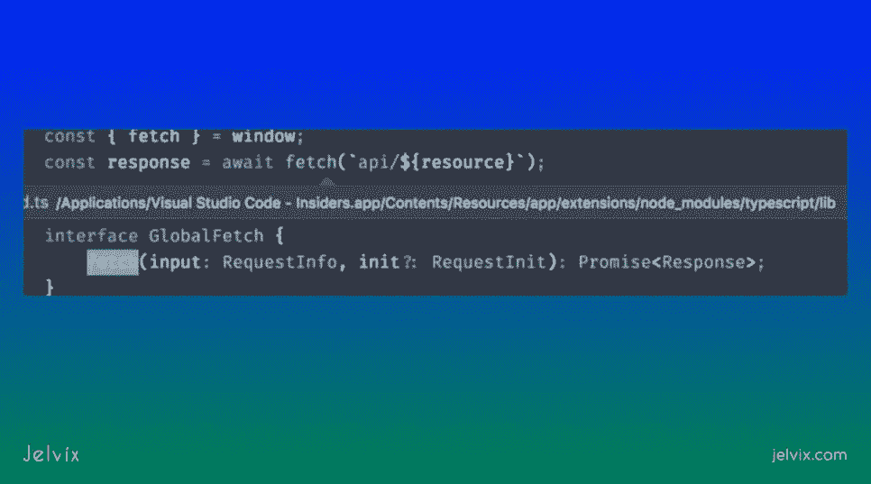

TypeScript 提供了许多普通 JavaScript 中没有的扩展和集成。这是对现有的非常丰富的 JS 生态系统的升级，允许开发人员更快。

# TypeScript 和 JavaScript 的区别

显然，JS 和 TypeScript 之间的区别并不完全有利于 TypeScript。有时增加功能和复杂程度是有代价的。再来看看其他技术方面。

## 生态系统

TypeScript 的生态系统在很大程度上基于 JS 的成就。静态类型等其他可能性为自生成文档、错误识别、改进的代码维护 API 创造了空间，并激发了开源开发人员构建多种类型脚本集成。

另一方面，典型的 JavaScript 是最流行的开发语言。JavaScript 的框架、[ide](https://atom.io/packages/ide-typescript)和 API 的数量肯定超过了支持 TypeScript 的工具的数量。

即使你正在寻找框架，你也会很快发现大多数框架并没有提供高质量的 TypeScript 支持。本质上，你将被限制在 Angular 2.0 和 Nest.js 中。因此，JavaScript 提供了更高的通用性。

## Npm 包

TypeScript 支持 Node.js 和 NPM 包。您可以安装 Node.js 组件来组合后端和前端代码库的视图。您还可以将 Typescript 与 Node.js 集成在一起—您将受益于相同的优势，如静态类型、自动化文档、垃圾收集—但是，仅限于后端。

## 样机研究

原型允许开发人员克隆对象及其值。原型允许用一个动作复制功能的全部存在。要在 TypeScript 中创建原型，开发人员需要了解哪些类将组成原型，为每个类定义角色，并找到连接不同模式的方法。

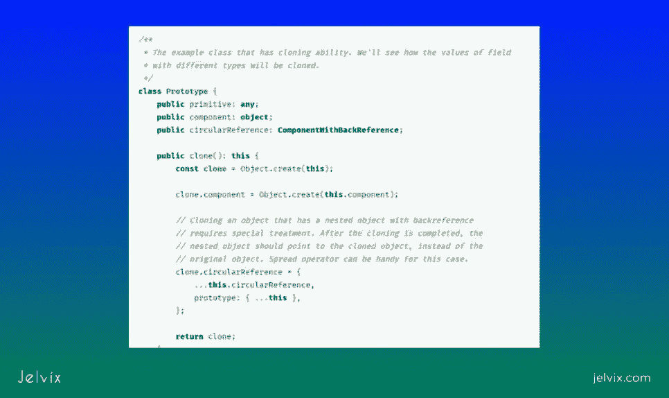

## 汇编

JavaScript 是一种网络专用语言，不需要像普通语言一样编译成机器码。另一方面，TypeScript 应该被编译成二进制代码。

幸运的是，对于 TypeScript 编译有许多解决方案。更流行的选择是通过[节点包管理器](https://www.npmjs.com/)安装 TypeScript。

当您结合 NPM 运行 TypeScript 时，该语言将自动编译为机器代码。不幸的是，用于 TypeScript 开发的流行平台 Microsoft Visual Studio 代码没有内置编译器。

## 社区

今年，TypeScript 排名第 9 位，首次进入 10 种最受欢迎的编程语言的名单。它比 Swift、Objective-C、Go 和许多其他产品都更受欢迎。TypeScript 市场的势头预示着快速增长，社区也变得更加活跃——您可以在 [StackOverflow 的问题](https://stackoverflow.com/questions/tagged/typescript)中看到。

JavaScript 的社区做得更好。这种语言已经连续几年被评为最受欢迎的软件开发语言——被 [StackOverflow](https://insights.stackoverflow.com/survey/2019) 和 [Red Monk](https://redmonk.com/sogrady/2020/02/28/language-rankings-1-20/) 所取代。有许多用户创建的工具和多余的。JS 的框架、API 和 ide 的选择比 TypeScript 丰富得多。

当您使用 TypeScript 时，并不存在传统的 JS 社区，但是，您会产生一个额外的限制。即使它在技术上是一种语言的子集，您也不能使用经典的 JS 工具，除非它们也支持 Types Script。

我们已经讨论了 TypeScript 和 JavaScript 之间的本质区别。这些方面相当于不同的用例，这两种工具会更适合。

# 类型脚本的用例

让我们从分析 TypeScript 的用例开始。毕竟，这个工具不太常见——所以您可能还不知道该把它放在哪里。我们已经定义了团队通常使用 TypeScript 的最常见场景。

## 当你有一个大的代码库时

当许多开发人员同时处理项目时，出错的空间会增加。由于 JavaScript 只支持动态键入，并且只在运行时检测错误，开发人员不能总是及时发现这些问题。

如果您与一个大团队一起工作，TypeScript 将帮助您将代码带到一个单一的标准。您将拥有统一的类型，能够编写更详细的代码库，并在代码进入运行时之前捕获错误。

也就是说，TypeScript 确实倾向于扩大代码库。由于额外的注释，代码本身变得更长。从 JavaScript 到 TypeScript 的转换可以将代码库大小[增加多达 30%](https://www.reddit.com/r/typescript/comments/7qtd6z/migrating_large_js_codebase_to_typescript_so_many/) 。

## 当您的团队习惯于静态键入时

技术堆栈的选择始终取决于可用资源。如果您与具有静态开发背景(如 Java 或 C#)的团队合作，那么习惯于管理动态类型的代码库可能是一个挑战。

TypeScript 可能处于过渡状态:开发人员可能已经习惯了 JS 类型，但是他们可以在任何使开发更容易的地方打开可选的静态类型。

此外，值得注意的是，TypeScript 的创造者受到了 C#的巨大启发。所以如果你的团队很懂 C#的话，熟悉 TypeScript 将是小菜一碟。

## 为了角的发育

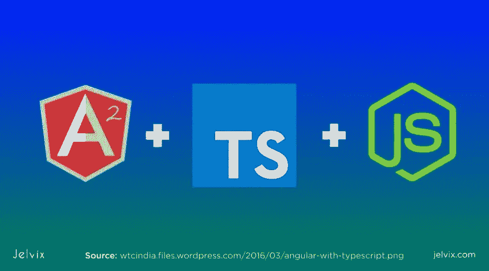

一些框架实际上与 TypeScript 一起工作比与典型的 JavaScript 一起工作更好。Angular 就是其中之一。框架在安装了子集的情况下效率要高得多。一些框架是用静态类型编写的。

可以用 TypeScript 使用其他 [JS 库](https://en.wikipedia.org/wiki/List_of_JavaScript_libraries)吗？从技术上来说，是的，但是你需要下载将动态构建的类型转换成静态类型的工具。有一些开源工具可以自动做到这一点——但它仍然不是本机支持的最终替代品。

## 当快速发展是主要优先事项时

TypeScript 通过在没有运行垃圾收集器的情况下实时捕获 bug 来加速开发过程。与垃圾收集语言不同，这种 bug 消除不会导致性能下降。重要的是要记住，内置的检测只能发现大约 15%的问题，对于完整的检查，您仍然需要偶尔运行一个收集器。

## 当行业需要特别关注细节时

如果您在金融或医疗保健等行业工作，JavaScript 代码需要大量检查。如果每个错误都可能导致严重的损害，那么您将不得不格外小心，到处扔注释。这显然会增加代码库的大小，降低可读性。

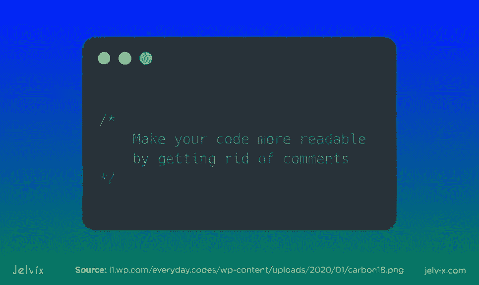

TypeScript 在普通的默认 JS 代码和详细的注释之间找到了一个中间点。它只提供关于代码错误的最重要的信息，这些信息足以识别问题。该代码信息丰富，但更短。

因此，TypeScript 最适合由大型团队处理的项目，尤其是那些错误成本太高的项目。如果一个团队习惯于静态类型学习，那么 TypeScript 开发将会更容易学习和快速执行。

# JavaScript 的用例

TypeScript 是一种高度通用的解决方案，但并不适合所有人。至少在几个场景中，团队应该认真考虑子集的使用。

## 当你负担不起额外的运输税时

TypeScript 不能像 JavaScript 一样直接在浏览器中运行。Google Chrome、Mozilla 或 Opera 还不提供对 Typecript 的原生支持。这意味着您需要首先编译代码——就像 Java 或 Ruby 一样。

这一方面导致了一系列额外的定制。您需要找到一个编译器，检查代码与浏览器的兼容性，性能也会受到影响。

## 当灵活性是优先事项时

动态类型可能会导致额外的错误，但它也是一个巨大的灵活性驱动因素。有可能在任何给定的时刻给任何类型分配一个新的变量，允许开发人员构建新的功能，而不总是坚持相同的规则。

随着项目的增长和需求的变化，能够动态地编辑代码并产生新的类型就变得很方便了。如果你和一个小团队一起工作，使用 JS 和它灵活的类型会比坚持传统的静态类型让你走得更远。

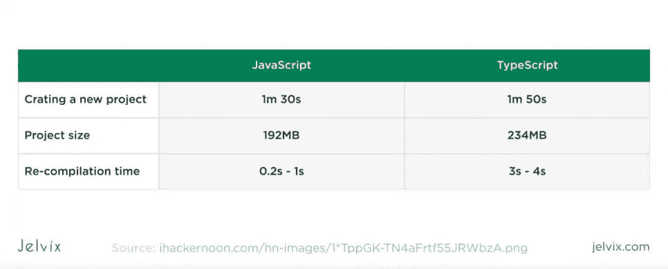

灵活性在 [MVP 阶段](https://jelvix.com/blog/what-is-an-mvp-and-why-should-you-build-one)和小型平台上非常重要。如果您正在构建一个小型服务，它不是为了一次托管数十万用户而设计的，那么 JS codebase 无论如何都很容易维护。

## 当您选择的框架不提供 JavaScript 的本地支持时

目前大多数框架都属于这一类。尽管您可以使用 JS 库来编写 TypeScript，但这并不方便。React 和 Vue.js 确实提供了对 TypeScript 的官方支持，但是，用户仍然需要安装额外的包和工具。

重要的是要记住，TypeScript 代码库通常比 JS 代码文件大。它提供了更多的注释，而且它们会占用空间。还有，需要编译。所有这些因素使得 JS 相比之下更小更快——也就是说，如果你没有添加太多注释的话。

# TypeScript 比 JavaScript 好吗？

技术上，略胜一筹。考虑到 TypeScript 是对 JS 的补充，您不会损失太多的核心 JS 功能。作为交换，您可以切换到静态类型，创建信息丰富的代码库，并在处理代码时检测错误。

然而，实际的答案总是取决于用例。我们准备了一份清单来总结所有的主要方面。

## TypeScript 和 JavaScript 有什么区别？

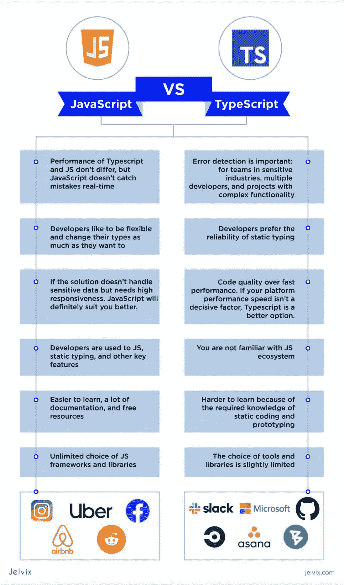

# TypeScript 会长期存在吗？

显而易见，TypeScript 不是一个[过去的趋势](https://github.com/trending/typescript)。越来越多的框架正在采用这个工具，越来越多的公司认识到了它的价值。我们可以从统计数据中追踪到的模式清楚地表明，TypeScript 已经获得了很高的发展势头。

这在就业市场和开发人员中都很受欢迎。产品所有者对这项技术越来越感兴趣——我们可以证实这一点。

因此，如果您是一名想知道学习 TypeScript 是否值得努力的开发人员，答案是肯定的。如果您以前没有使用过静态类型，您可能会惊讶地发现它的许多好处。

另外，这些知识最终可能对其他静态语言有用——比如 Java。最重要的是，你将能够有效地与大型团队一起工作，并构建高质量的代码，这是最终目标。

如果你是产品所有者，在 [JavaScript 和【TypeScript 之间选择，我们建议你分析用例并确定你的优先级。TypeScript 可能非常适合您的团队规模和行业。](https://en.wikipedia.org/wiki/TypeScript#Compatibility_with_JavaScript)

# 结论

如果您正在计划一个 web 开发项目，在 JavaScript 和 TypeScript 之间进行选择是正确的起点。需要做出许多其他的决定——框架、ide、管理工具和方法。尽管如此，知道使用哪种技术是一个好的开始。

如果你不确定你的项目更适合哪些用例，我们总是很乐意帮助你。只要给我们写封短信，简单描述一下这个想法，我们会分享我们在类似项目中的工作经验，并提供我们合理的意见。如果你已经知道使用哪个工具，你可以联系我们的开发团队来执行。

*最初发表于*[T5【https://jelvix.com】](https://jelvix.com/blog/typescript-vs-javascript)*。*