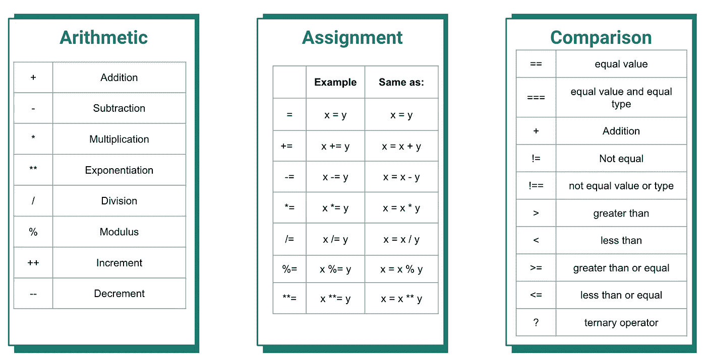
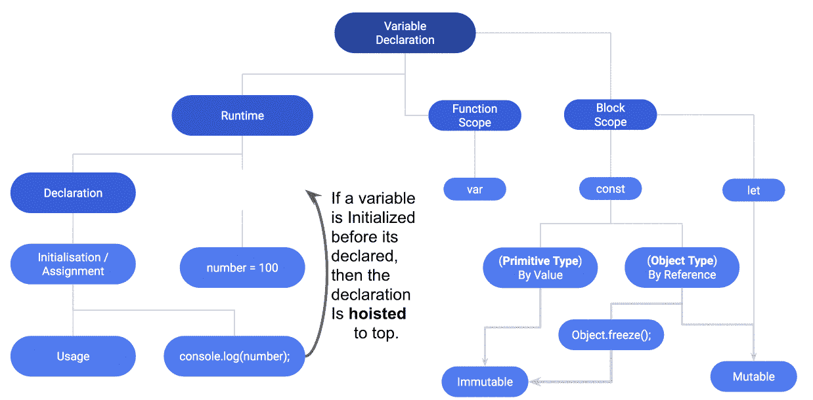
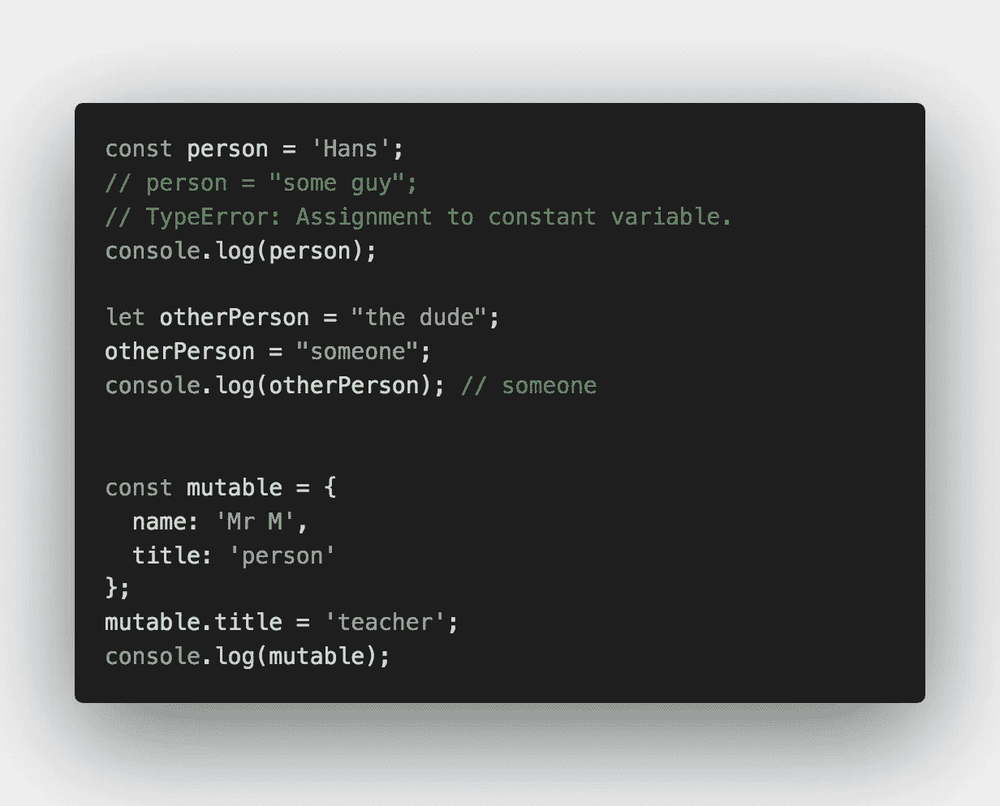
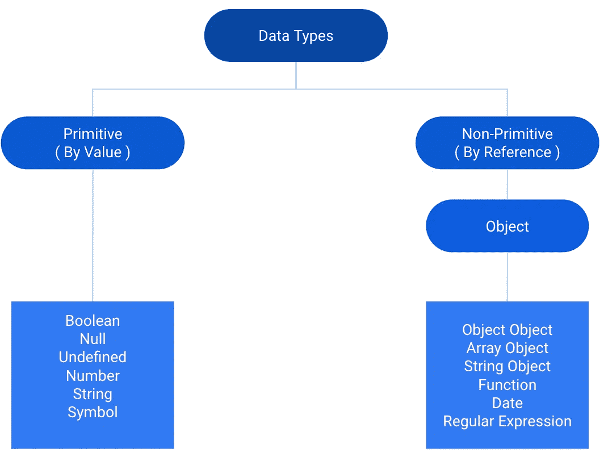
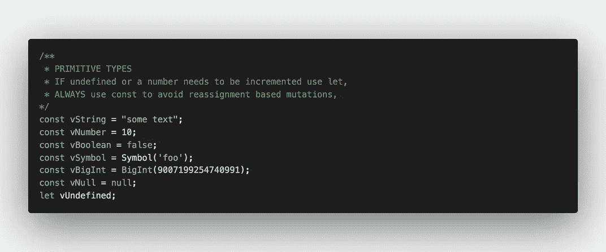
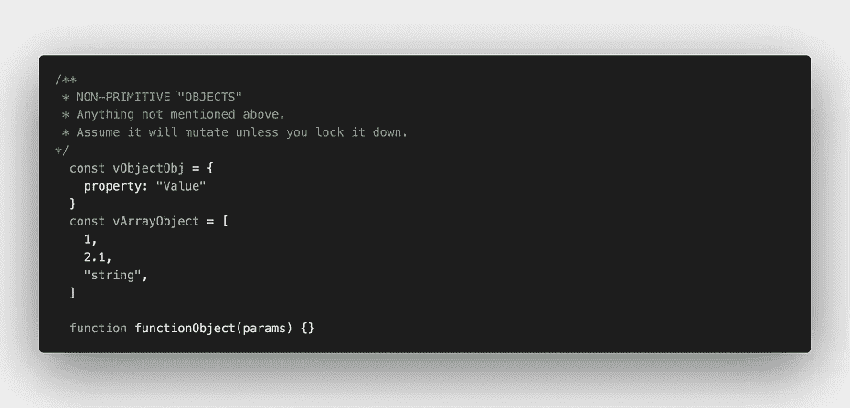
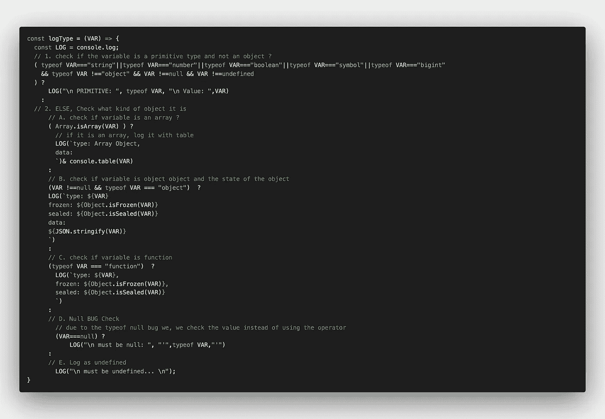
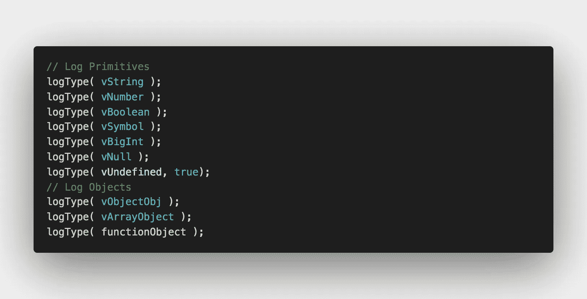
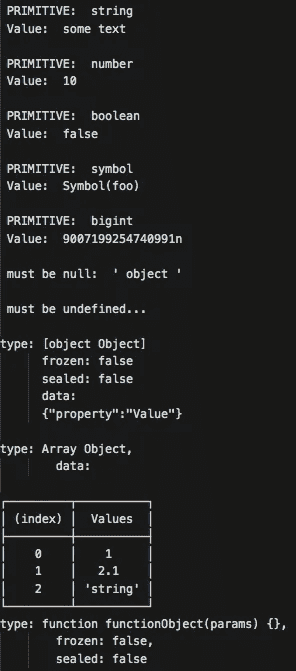
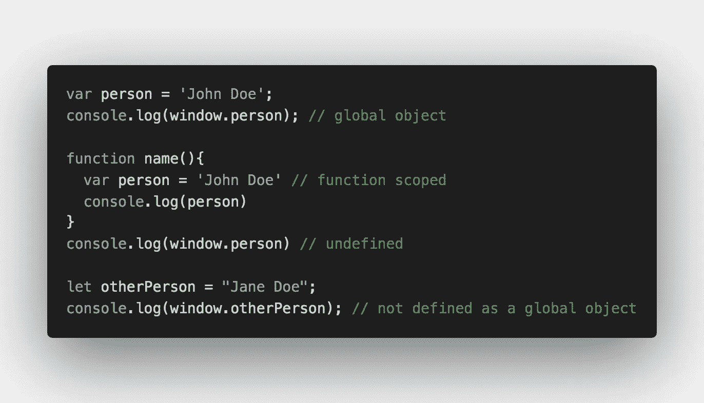

# 你对 JavaScript 中的变量、数据类型和不变性真正了解多少？

> 原文：<https://javascript.plainenglish.io/what-do-you-really-know-about-variables-data-types-and-immutability-in-javascript-1730835a9e87?source=collection_archive---------5----------------------->

## 2020 年教授 JavaScript 基础知识

## 2020 年学会如何编码:第二部分

与之前的文章不同，这将是一个更高的层次，因为我想通过重新教授一些核心基础知识来填补入门级和中级开发人员之间的知识空白。

```
This article is part of an ongoing educational series that will be [turned into a book](https://medium.com/@HansOnConsult/learn-how-to-code-in-2020-52bed38a2987) and therefore is considered a "**living article**" subject to change.If you have question, want to contribute or just wanna chat about the content, **leave a comment**! **If you have a find a bug, typo, DM me on twitter** [**@HansOnConsult**](https://twitter.com/HansOnConsult)**.** If you want to contribute to the book, see the GitHub page: [https://github.com/HansUXdev/UniversalJavaScript](https://github.com/HansUXdev/UniversalJavaScript)
```


Fancy Fancy Mandatory Image — Photo by [Markus Spiske](https://unsplash.com/@markusspiske?utm_source=medium&utm_medium=referral) on [Unsplash](https://unsplash.com?utm_source=medium&utm_medium=referral)

本文的目标不是详尽地解释 JavaScript 的所有内容，而是尽可能简单地总结要点，并链接到其他资源，供想要更彻底地探索这些主题的读者使用。

本文还将把 ES6 视为标准 JavaScript，因为它在所有现代浏览器中都受支持，除非您支持的是像 Internet Explorer 这样的[不安全浏览器(您不应该支持)。为了鼓励读者输入，它还会对大多数代码示例使用截屏。](https://www.zdnet.com/article/microsoft-security-chief-ie-is-not-a-browser-so-stop-using-it-as-your-default/)

总之，您将学习如何:

1.  用吊装等概念解释`var`。
2.  在数据类型、范围和不变性的上下文中解释变量声明，如`var`、`let`和`const`。
3.  将变量标识为基本类型或非基本数据类型
4.  使用 JavaScript 操作符来分配变量并理解数据类型。
5.  通过对比变量声明和它们的赋值数据类型来解释不变性

对于有经验的 JavaScript 开发人员来说，这篇文章可能看起来有点多余和基础，因为我也是为完全的初学者写的。话虽如此，不变性仍然是一个令人困惑的话题，甚至对于许多中高级开发人员来说也是如此，这很大程度上是由于一个神话，即`const`神奇地让事情变得不可变(事实并非如此)。

# 变量

一般来说，编程语言使用变量有 3 个步骤:

1.  *声明，*创建变量。
2.  *赋值，*为变量提供一个值。
3.  *用法，*代码运行时变量。

## 用运算符赋值

在 JavaScript 中，有许多[运算符](https://en.wikipedia.org/wiki/Operator_(computer_programming))，最常用的有[赋值运算符](https://developer.mozilla.org/en-US/docs/Web/JavaScript/Guide/Expressions_and_Operators#Assignment)、[比较运算符](https://developer.mozilla.org/en-US/docs/Web/JavaScript/Guide/Expressions_and_Operators#Comparison)、[算术运算符](https://developer.mozilla.org/en-US/docs/Web/JavaScript/Guide/Expressions_and_Operators#Arithmetic)。



3 most common categories of JavaScript operators

然而，还有一些其他的[我们不会深入讨论，比如按位等等。](https://developer.mozilla.org/en-US/docs/Web/JavaScript/Guide/Expressions_and_Operators#Comma)

当学习任何新的编程语言时，开始学习变量是有用的，特别是[赋值](https://developer.mozilla.org/en-US/docs/Web/JavaScript/Reference/Operators/Assignment_Operators)操作符，因为这是我们给变量赋值的方式，比如数据类型。之后，使用[比较](https://developer.mozilla.org/en-US/docs/Web/JavaScript/Reference/Operators/Comparison_Operators)操作符有助于使用三元操作符轻松过渡到基本控制流。最后，对于数学，我们有[算术](https://developer.mozilla.org/en-US/docs/Web/JavaScript/Reference/Operators/Arithmetic_Operators)操作符和[数学对象](https://developer.mozilla.org/en-US/docs/Web/JavaScript/Reference/Global_Objects/Math)。

> 在谷歌上搜索如何用 JavaScript 写各种数学方程不仅可以帮助解决学生的家庭作业，还可以成为以应用的方式学习编程和数学的一种有趣方式……我可以补充一点，这是各级教育机构非常缺乏的。

这里有一个使用 JavaScript 函数和算术运算符定义一个[勾股定理函数](https://www.w3resource.com/javascript-exercises/javascript-math-exercise-35.php)的例子。


JavaScript [Pythagorean theorem function](https://www.w3resource.com/javascript-exercises/javascript-math-exercise-35.php)

这里我们有一个使用 JavaScript 的简单的**应用**数学函数。在这里，我们使用 JavaScript 内置的数学对象来获得 sideA 和 sideB 的平方值，然后使用加法运算符将它们相加并获得平方根。所以(16) + (9) = 25。然后使用`Math.sqrt(25);//5`。

> 作为一个**编码练习**，当你读完这篇文章后，看看这个[等式列表](https://en.wikipedia.org/wiki/List_of_equations)，试着写尽可能多的简单 JavaScript 函数。

## 带“var”的吊装

如上所述，我们通常需要声明一个变量，然后通过赋值来初始化它，最后，我们在某个地方使用它。在 JavaScript 中，我们实际上可以跳过第一步，声明，只给一个变量赋值，然后在一个叫做**提升**的过程中使用它。当`var`被添加到顶部，或者*被提升到顶部*时，该过程如下图所示。



Photo by [Hans McMurdy](https://medium.com/u/1d679de5005f?source=post_page-----1730835a9e87--------------------------------) — JavaScript Hoisting variables & scope

> [提升](https://medium.com/javascript-in-plain-english/https-medium-com-javascript-in-plain-english-what-is-hoisting-in-javascript-a63c1b2267a1)的过程是指在编译代码让机器读取的时候，变量声明是如何被提升到顶部的。

现在我们已经描述了在提升的上下文中创建变量的过程，让我们把它放到范围和不变性的上下文中。我还想从 gif 中快速指出几件事:

1.  托管只对`var`有效，所以它不会用`let` & `const`提升一个声明，这意味着*提升的变量永远不会是块范围的*。
2.  一般来说，您应该尝试并避免故意提升变量，因为这被认为是不好的做法，因为它会创建不需要的全局变量并导致应用程序膨胀
3.  `let`和`const`都是**块范围**并且都不是不可改变的。带有`const`的变量必须被 ***声明并赋值*** 否则它将保持*空*，因为声明类型禁用重分配并在您尝试时抛出类型错误。
4.  “真正的”不变性只发生在我们使用`const`、原语类型或者我们对非原语使用额外的方法时，比如[冻结、密封等](https://itnext.io/javascript-prevent-objects-from-being-changed-d1ca82f02975)。这意味着`var`、`let`和`const`、**都可以是不可变的**，唯一的区别是变量的范围以及是否可以重新赋值。
5.  最后但同样重要的是，浏览器中的`var`与 nodeJS 环境中的【】的区别。两种环境都允许提升，但是`var`绑定的全局对象是不同的。我们将在本文后面讨论范围时对此进行更多的讨论。

## 什么是不变性？

在我们讨论不变性之前，首先删除任何关于`const`和不变性的先入为主的想法。这是关于一个**变量(重新)赋值**。[不变性](https://en.wikipedia.org/wiki/Immutable_object)是指“一个[对象](https://en.wikipedia.org/wiki/Object_(computer_science))的状态**创建后不能**修改”，而 [*可变性*](https://developer.mozilla.org/en-US/docs/Glossary/Mutable) 是指到，“一个对象的*状态* **创建后可以**修改。“弱不变性和强不变性也是有区别的。

作为一种语言，JavaScript 默认是弱不可变的，原因有两个:

1.  默认情况下，原语是弱不可变的，除非使用了`const`。
    这意味着虽然当使用像`toUpperCase();`这样的方法时，原始值不会改变，但是它可以被**重新分配**到一个*新值*，从而对其进行弱变异。`const`解决了这个问题，使变量不能被重新分配，同时也改变了作用域。
2.  非原始对象或者基本上任何有引用值的东西都是可变的，除非你使用`const`和其他方法，比如[密封](https://developer.mozilla.org/en-US/docs/Web/JavaScript/Reference/Global_Objects/Object/seal)或者[冻结](https://developer.mozilla.org/en-US/docs/Web/JavaScript/Reference/Global_Objects/Object/freeze)方法。

我们将在整篇文章中更多地讨论这个话题，但是为了更深入地理解，我非常认真地阅读了 Gabriel Lebec 的下面这篇文章:

[](https://dev.to/glebec/four-ways-to-immutability-in-javascript-3b3l) [## JavaScript 中实现不变性的四种方式

### 本文介绍了在 JavaScript 中不变地更新数据结构的四种不同技术:许多代码…

开发到](https://dev.to/glebec/four-ways-to-immutability-in-javascript-3b3l) 

# 变量声明

> **变量声明**最重要的部分是你如何管理变量的**范围** **。**换句话说，你用变量做什么？在应用中会用到哪里？应该如何确定变量的范围？价值应该被允许改变、变异或重新分配吗？最后，您如何跟踪和防止应用程序中的突变？

每种编程语言都有不同的声明变量的方式。在像 JavaScript 这样的[动态类型语言](https://en.wikipedia.org/wiki/Dynamic_programming_language)中，我们用`[var](https://developer.mozilla.org/en-US/docs/Web/JavaScript/Reference/Statements/var)`、`[let](https://developer.mozilla.org/en-US/docs/Web/JavaScript/Reference/Statements/let)`和`[const](https://developer.mozilla.org/en-US/docs/Web/JavaScript/Reference/Statements/const)`声明一个变量。最后两个变量声明是该语言标准化 2015 年更新的一部分，称为 [ECMAScript](https://en.wikipedia.org/wiki/ECMAScript#6th_Edition_-_ECMAScript_2015) 。然而，这是我最后一次使用这个词，取而代之的是，我将把这些部分称为**现代 JavaScript、**或简单的 JavaScript，因为已经过去 5 年了，是时候忘记这个时髦词了。



Photo by [Hans McMurdy](https://medium.com/u/1d679de5005f?source=post_page-----1730835a9e87--------------------------------) — Const & Mutable Object in JavaScript Example

到目前为止，大多数人应该已经知道，`var`是**函数作用域**，而`let` & `const`是**阻塞作用域**，`const`的"*棘手之处"*在于它不能被"*重新分配"*一个值或者被"*重新声明"*。

看起来很简单，对吗？
但是等等，如果你运行镜像中的代码，为什么`mutable.title`的值是“老师”，如果它不能被重新分配的话？

> `const`不是应该是一个**定值**吗？它应该是不可改变的，对吗？这本书、认证、文章或者 YouTuber 都是这么告诉我的。

希望你读过的书和文章，你看过的视频和你的老师，没有让你误入歧途。但如果是这样，你并不孤单。我也经历过。
这实际上是 JavaScript 社区中一个相当大且正在进行的讨论，普遍的共识是从`const`开始，然后向`let`发展。

> 那么我们如何让有这种误解的开发者回到正轨呢？谁能指出不变性是如何被教授的？嗯，我们没有从声明变量不变性的角度讨论数据类型。
> 为什么我们会用动态语言呢？嗯，这正是为什么。

在上面的例子中，值没有被重新分配，而是属性发生了变异。这再次表明 JavaScript 是一种弱不可变的语言。变量仍然是一个对象，对象是可变的，除非你用 [seal](https://developer.mozilla.org/en-US/docs/Web/JavaScript/Reference/Global_Objects/Object/seal) 或 [freeze](https://developer.mozilla.org/en-US/docs/Web/JavaScript/Reference/Global_Objects/Object/freeze) 方法显式地使它们不可变。

# Javascript 中的数据类型

> 在 JavaScript 和其他[动态语言](https://en.wikipedia.org/wiki/Dynamic_programming_language)中，变量的类型是在 ***运行时*** 或者代码实际运行/执行时确定的。这意味着当你把一个变量指定为一个原语或非原语变量后，它可能会改变。

更具体地说，这些数据类型分为两类，**基本类型**，和**非基本类型**。理解每一个对于理解不变性是必不可少的，因为**原语类型是不可变的**，而**非原语类型是可变的。**

如果你和足够多的 JavaScript 极客呆在一起，你可能听过下面的表达:

> “JavaScript 中的一切都是对象”

这有点老生常谈，但基本上是真的，因为甚至许多原始类型也是标准内置对象。这就是为什么我选择使用术语“非原始的”而不是“对象”,因为“对象”基本上是一切事物，对初学者来说也是令人困惑的。下图说明了每一类基元和非基元的数据类型。



Photo by [Hans McMurdy](https://medium.com/u/1d679de5005f?source=post_page-----1730835a9e87--------------------------------) — JavaScript Primitives VS Non-Primitives

根据 [MDN](https://developer.mozilla.org/en-US/docs/Web/JavaScript/Data_structures) ，有七种 [*原语*数据类型](https://developer.mozilla.org/en-US/docs/Glossary/Primitive):

*   [布尔](https://developer.mozilla.org/en-US/docs/Glossary/Boolean)、`true`或`false`。
*   [Null](https://developer.mozilla.org/en-US/docs/Glossary/Null) ，一个不存在或无效的[对象](https://developer.mozilla.org/en-US/docs/Glossary/object)或地址。
*   [未定义](https://developer.mozilla.org/en-US/docs/Glossary/undefined)，无值或未赋值。
*   [数字](https://developer.mozilla.org/en-US/docs/Glossary/Number)，整数，浮点数，或双精度数在这里都属于一个类别。
*   [字符串](https://developer.mozilla.org/en-US/docs/Glossary/string)，认为这是任何文本值，例如:你正在阅读的文本。
*   [符号](https://developer.mozilla.org/en-US/docs/Glossary/Symbol)，2015 年引入的新数据类型。它的一个常见用途是在对象属性上，我们将在以后的文章中讨论。
*   BigInt 是 2020 年引入的最新数据类型之一，本质上是一个非常大的数字。

> 请注意，一个常见的混淆点是基元类型也有包装对象，因此并不存在如图所示的“真正的”字符串对象，而是存在一个临时的“包装对象”，它在使用后由垃圾收集器处理掉。

接下来，还有*对象*或者如我所说的，六种*非* - *原始*数据类型:

*   [包装对象](https://medium.com/@codewithmosh/javascript-wrapper-objects-d2bdd3b4bbdc)是*创建的临时对象*,为原语提供对属性和方法的访问。
*   [Object Object](https://developer.mozilla.org/en-US/docs/Web/JavaScript/Reference/Global_Objects/Object/Object) 你可以用两种方式声明一个对象，字面上是`let obj = {};`或者用一个[构造函数](https://developer.mozilla.org/en-US/docs/Web/JavaScript/Reference/Global_Objects/Object/constructor) `let o = new Object`。
*   [数组对象](https://developer.mozilla.org/en-US/docs/Web/JavaScript/Reference/Global_Objects/Array)，在 JavaScript 数组中是对象。用外行的话来说，你可以把它们想象成一个“列表”。有两种方法可以声明一个数组，字面上是`let groceryList = ['Apple', 'Banana'];`，或者用构造函数方法`const cars = new Array(“Saab”, “Volvo”, “BMW”);`。
*   [RegEx 或正则表达式](https://developer.mozilla.org/en-US/docs/Web/JavaScript/Guide/Regular_Expressions)是“用于匹配字符串中字符组合的模式”。
*   [函数](https://developer.mozilla.org/en-US/docs/Glossary/Function)是一个可以重用、修改等的代码片段的包装器。`function foo() { /* code snippet*/ };`
*   [Date](https://developer.mozilla.org/en-US/docs/Web/JavaScript/Reference/Global_Objects/Date) ”以独立于平台的格式表示单个时刻。`Date`对象包含一个`Number`，表示自 1970 年 1 月 1 日 UTC 以来的毫秒数。

# 练习:记录 JavaScript 数据类型

在 JavaScript 中记录数据类型并不是一件简单的任务，因为不固定/不可固定的错误以及对初学者来说混乱的语义。即使经过 5 年以上的编码，这仍然会以意想不到的方式绊倒高级开发人员。

一般来说，使用 using `[typeof](https://developer.mozilla.org/en-US/docs/Web/JavaScript/Reference/Operators/typeof)`操作符在检查类型方面非常好，但是有一些奇怪的警告。本节旨在教授这些奇怪的内容，并提供一个小的实用函数来帮助您更好地记录它们。

## 奇怪的东西

*   数组//函数的类型
*   typeof [] //对象

无效错误

*   var N = nullN===null // true
*   空错误—空//对象的类型

## 步伐

1.  创建 7 个变量，每一个都有一个**不同的原始类型**，创建 3 个变量并将其设置为等于一个**对象**、一个**数组**和一个**函数**。
2.  创建一个记录这些数据类型的函数。
3.  测试您的功能

第一步:创建 7 个变量，每个变量有一个**不同的原语类型**并创建 3 个变量，并将其设置为等于一个**对象**、一个**数组**和一个**函数**。



Photo by Hans McMurdy — JavaScript Primitives & Objects

步骤 2:创建一个记录这些数据类型的函数。

这里我们使用 console.log、console.table、模板字符串、regEx、三元运算符和 typeof 运算符的组合来记录正确的数据类型(甚至是 null)。



Photo by Hans McMurdy — JavaScript Function checking Data Types

步骤 3:测试你的函数



Photo by Hans McMurdy — JavaScript Primitives & Objects

对于功能更丰富的模块日志记录数据类型，我强烈推荐:

[](https://www.npmjs.com/package/type-inspect) [## 类型检查

### 类型检查器

www.npmjs.com](https://www.npmjs.com/package/type-inspect) 

## 以下文章的进一步阅读:

Mathwarehouse 不使用 JavaScript，但它有一些很好的例子来帮助理解数据类型，尤其是内存如何通过值和引用来工作。

[](https://www.mathwarehouse.com/programming/passing-by-value-vs-by-reference-visual-explanation.php) [## 通过值传递与通过引用传递用动画和图表直观地解释

### 内存如何工作内存如何工作以及变量如何存储在内存中的基本知识将有助于更好地…

www.mathwarehouse.com](https://www.mathwarehouse.com/programming/passing-by-value-vs-by-reference-visual-explanation.php) 

Chris Geelhoed 的文章很好地讨论了 JavaScript 原语和对象引用。

[](https://medium.com/better-programming/intermediate-javascript-whats-the-difference-between-primitive-values-and-object-references-e863d70677b) [## 中级 JavaScript:原始值和对象引用有什么区别？

### 不可变和可变之间的关键区别

medium.com](https://medium.com/better-programming/intermediate-javascript-whats-the-difference-between-primitive-values-and-object-references-e863d70677b) 

# **JavaScript 中的范围**

JavaScript 中的主题[范围非常简单。在 JavaScript 中，范围主要可以通过三种方式定义:](https://en.wikipedia.org/wiki/Scope_(computer_science)#JavaScript)

1.  全局/模块
2.  本地(块和函数)
3.  词汇的

**全局** **作用域**是指整个程序或脚本之间可用的变量。与一些人教你的相反，`var`不是一个“真正的”全局变量，因为它基于运行时环境(nodeJS 与 browser)的工作方式略有不同。

在浏览器中，我们有[窗口对象](https://developer.mozilla.org/en-US/docs/Web/API/Window)，其中通过使用`var`或通过*提升*来创建全局:

```
console.log(window.value); // undefined
value=100; 
console.log(window.value); //100
```

> 注意，如果您是 JavaScript 新手，这不会在 nodeJS 中运行，因为 nodeJS 中没有**窗口对象。你自己试试吧。**

在 nodeJS 中，`var`由于[闭包](https://developer.mozilla.org/en-US/docs/Web/JavaScript/Closures)而被[限定为模块](https://stackoverflow.com/questions/19850234/node-js-variable-declaration-and-scope)的范围，这就是 nodeJS 中[模块范围](https://nodejs.org/api/modules.html#modules_the_module_scope)出现的地方。尽管 nodeJS 中没有 window 对象，但是仍然有一个全局对象，提升仍然工作得很好。最接近的例子是下面的代码:

```
testContext = 15;
console.log(global);
console.log(global.testContext); // 15
```

**函数范围**是指在那个**函数**中声明的任何变量，并且只能在那个**函数**和任何嵌套函数中访问。`var`是**函数作用域的**变量声明。



Photo by [Hans McMurdy](https://medium.com/u/1d679de5005f?source=post_page-----1730835a9e87--------------------------------) —JavaScript global window object vs function scope

请注意，`var`被绑定到窗口对象，可以作为属性记录。

`let`另一方面，它是块范围的，即使在花括号之外也不会绑定到窗口。

**块范围**指的是*块*或花括号`{}`可用的变量，在中定义。`const`和`let`变量都是块范围的变量声明。

[The Coding Train](https://www.youtube.com/channel/UCvjgXvBlbQiydffZU7m1_aw) — let vs var — Topics of JavaScript/ES6

但是`const`在*块范围内保留了这个字，所以* ***不能被重新分配*** 。

当`const`与一个基本类型一起使用时，它是不可变的，因为它永远不会改变，即使通过重新分配。

然而，非原语仍然是可变的，就像我们在一开始使用对象时演示的那样。这也适用于数组，所以您可能想阅读一下可变与非可变数组方法。

 [## JavaScript 数组方法:突变与非突变

### JavaScript 提供了几种方法来添加、删除和替换数组中的项目——但是其中一些方法会改变数组…

lorenstewart .我](https://lorenstewart.me/2017/01/22/javascript-array-methods-mutating-vs-non-mutating/) 

**词法范围**有点难定义简单，老老实实应该在自己的文章里。根据 google，词法范围的最简单定义是:

> 在函数外定义的变量可以在变量声明后定义的另一个函数内访问。但反之则不然，函数内部定义的变量在函数外部是不可访问的。”

要理解它，你需要理解 [**闭包**](https://developer.mozilla.org/en-US/docs/Web/JavaScript/Closures) 和 [**这个**](https://developer.mozilla.org/en-US/docs/Web/JavaScript/Reference/Operators/this) 。后一个概念可能是整个语言中最令人困惑和命名最笨拙的概念。下面是几个 youtube 视频，可以帮助你理解 JavaScript 中的词法作用域和其他作用域。

## 提升、范围、闭包和词法范围

[Tyler McGinnis](https://www.youtube.com/channel/UCbAn7pVK2VIyo-UysfWGdZQ) — The Ultimate Guide to Execution Contexts, Hoisting, Scopes, and Closures in JavaScript

Kyle Simpson on Lexical Scope

## THIS 和词法范围

`this`的五个用例:

Ilona Shub: What the hell is this?

1.功能调用
(1:28)
2。对象上的方法调用(1:56)
3。“新”关键词
(2:55)
4。显式绑定
(3:25)
5。箭头功能
(4:00)

## 这在课堂上

最后，当开发人员开始使用 JavaScript [*类*](https://developer.mozilla.org/en-US/docs/Web/JavaScript/Reference/Classes) 时，介绍了`this`关键字的一个更高级的用法。类的话题经常会导致混淆，当开发人员来自强类型、面向对象编程(OOP)语言(如 C#)时，这种情况尤其常见。

> *尽管许多 OOP 概念是可比较的，但有时仍然像比较一个只存在于中文*中的单词*并试图*将其翻译成字面英文*。* [*类*](https://developer.mozilla.org/en-US/docs/Web/JavaScript/Reference/Classes) *是一个完美的例子，因为它们是来自 OOP 语言的外来词，而在* JavaScript *中，继承模型是基于原型而不是真正的 OOP 继承，所以* `*this*` *处理起来有点棘手。*

要了解更多关于使用带有`this`关键字的类的信息，我推荐阅读由 [Michael Krasnov](https://medium.com/u/2119e4cdde96?source=post_page-----1730835a9e87--------------------------------) 撰写的这篇文章。实际上，您不必避免使用 JavaScript 类，但是，与 JS 对象和原型委托相比，理解如何以及何时使用它将在您学习 JavaScript 时对您有所帮助。

[](https://medium.com/javascript-in-plain-english/please-stop-using-classes-in-javascript-and-become-a-better-developer-a185c9fbede1) [## 请停止使用 JavaScript 中的类，成为一个更好的开发者

### 在这篇文章中，我将谈论为什么在 JavaScript 中使用类是一个坏主意，以及有哪些…

medium.com](https://medium.com/javascript-in-plain-english/please-stop-using-classes-in-javascript-and-become-a-better-developer-a185c9fbede1) 

# 结论

我们在这篇文章中讨论了很多。我希望它有助于澄清一些常见的误解，并为您提供本文以外的其他学习资源。现在继续，用今天的[后评估](https://create.kahoot.it/share/share/pre-assessment-js-fundamentals/efd5b0eb-e1c8-499a-ba95-846c6d23c8bc)来测试你的知识。

> 如果你在后评估中做得不好，请不要气馁，后评估进行得很快，所以很多人错过了他们知道的问题。这意味着你在速度上有更大的提升空间。

我也介绍一个 [**专家后评估**](https://create.kahoot.it/share/expert-pre-assessment-js-fundamentals-part-1/a4b132e9-1d6b-45eb-9a31-2247414dcb66) 。公平的警告，这很有挑战性，最后两个问题让来自大公司的中高级开发人员犯了错误，比如选择酒店和 Keap，所以如果你想要更多的挑战，试试这个测试。我已经对它进行了调整，但是不管你是初学者，还是有经验的开发者，都不要因为评估而自责。

# **附加资源**

> 最后，在下一篇文章发表之前，我有一些家庭作业给你，它们可能会也可能不会出现在本系列下一篇文章的评估中。

[**JavaScript 作业**](http://freecodecamp.org/learn/javascript-algorithms-and-data-structures/basic-javascript/)
在自由代码营上完成整个基础 JavaScript 课程，练习 JavaScript 基础知识，并通过练习一些 JavaScript 基础知识来填补本文没有涵盖的空白。我建议你做笔记，因为会有一个突击测验。另外，如果你认为 110 个问题太多，请记住，如果我的高中学生可以做到这一点，你也可以！

**探索 JavaScript** 的 [**真值表**](https://dorey.github.io/JavaScript-Equality-Table/)

 [## JS 对照表

### 当使用两个等号进行 JavaScript 等式测试时，会发生一些奇怪的转换。当使用三个等号时…

dorey.github.io](https://dorey.github.io/JavaScript-Equality-Table/) 

**JavaScript 变量生命周期:为什么 let 没有被提升** 这篇文章更深入地讨论了提升以及变量和声明的生命周期。

[](https://dmitripavlutin.com/variables-lifecycle-and-why-let-is-not-hoisted/) [## JavaScript 变量生命周期:为什么 let 没有被挂起

### 提升是虚拟地将变量或函数定义移动到作用域开始的过程，通常…

dmitripavlutin.com](https://dmitripavlutin.com/variables-lifecycle-and-why-let-is-not-hoisted/) 

[**JavaScript:怪异的部分**](https://charlieharvey.org.uk/page/javascript_the_weird_parts) **作者** [**查理·哈维**](https://charlieharvey.org.uk/)
哈维的文章将帮助你了解关于 JavaScript 比较运算符的一切，“真相”以及 JavaScript 所有怪异的部分。

[](https://charlieharvey.org.uk/page/javascript_the_weird_parts) [## Javascript:奇怪的部分

### Javascript。不管你喜不喜欢，Java 似乎已经成为互联网事实上的虚拟机…

charlieharvey.org.uk](https://charlieharvey.org.uk/page/javascript_the_weird_parts) 

# 本系列的后续文章

> 我还没有 100%决定我将要发表的下几篇文章的顺序，所以请对你喜欢/不喜欢或者将来想看的文章发表评论。

本系列目前正在起草或在我的待办事项列表中的几个主题:

1.  JavaScript 开发者路线图
2.  JavaScript 基础知识(本文后续)
3.  函数和条件(if/else、开关、try/catch、事件)
4.  数组、对象和迭代

关于节点教程的更多信息:

1.  节点基础
2.  堆栈、队列和事件循环
3.  用 NodeJS 编程泰洛无人机

# 关于作者

Brett“Hans”McMurdy 是一名自学成才的开发人员，在前端、后端以及两者之间的几个主要领域拥有 6 年多的经验。


他目前是一名全职爸爸，正在寻找一份全职工作，如果你有兴趣雇佣他，可以看看他的 Linkedin。

与此同时，他正在从事一些很酷的开源项目，这应该会让你考虑[赞助他](https://github.com/sponsors/HansUXdev/)。

1.他正在写一本关于 JavaScript 的开源书籍，用 node.js 而不是浏览器来教授这门语言。这也是一个由 GitPod 驱动的远程开发环境，因此您不需要一台昂贵的计算机，只需打开书本，在一个预配置的环境中开始学习。

2.他正在创建一些简单但强大的 [vscode 扩展](https://marketplace.visualstudio.com/publishers/HansUXdev)。

3.他想在 Twitch 上推出一个 [**免费**职业，当他拥有 50 个追随者时。](https://www.twitch.tv/hansoncoding)