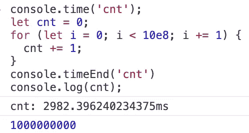
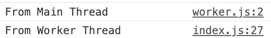
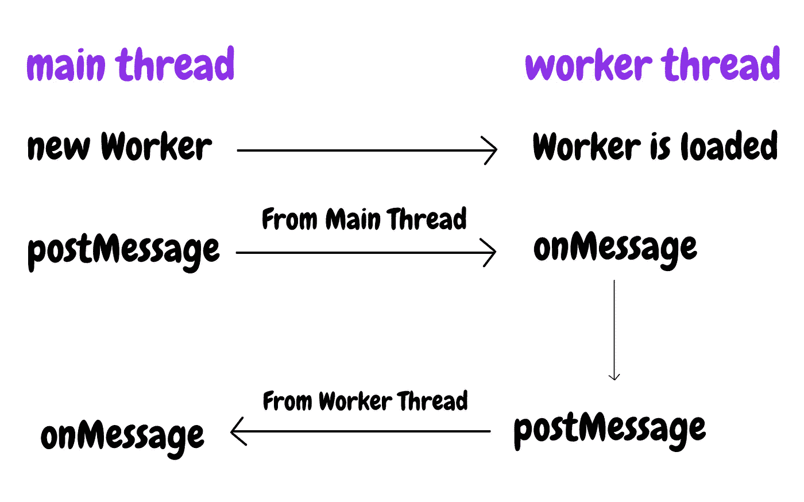

# 一个工人用 JavaScript 做什么？

> 原文：<https://javascript.plainenglish.io/what-does-a-worker-do-in-javascript-25b9449f22f1?source=collection_archive---------0----------------------->

## Java Script 语言

## 一个让你摆脱代码阻塞的新线程


Photo by [Kevin Bhagat](https://unsplash.com/@kevnbhagat?utm_source=medium&utm_medium=referral) on [Unsplash](https://unsplash.com?utm_source=medium&utm_medium=referral)

多年来，JavaScript 最不方便的特性之一是，一旦某个任务耗时太长，其余的代码就会被阻止执行。JavaScript 是一种单线程编程语言，它总是让你等待代码按顺序执行。但是实际上有一个解决方法——工人。我将在这篇文章中讨论如何使用它。

# 先前阅读

要知道 JavaScript 是单线程语言。如果你不熟悉这个事实，在开始这篇文章之前，你应该阅读这篇文章。

# 同步码

让我们看看大家可能都知道的 JavaScript 代码的常见情况。

```
let cnt = 0;
for (let i = 0; i < 10e8; i += 1) {
  cnt += 1;
}
console.log(cnt);
```

`cnt`在 for-loop 的代码块中为 10e8 倍增加 1。并且`console.log`不会被执行，直到 for 循环完成增加`cnt`。

在 Chrome 浏览器的控制台中，这需要相当长的时间。



It took almost 3 seconds

`cnt`无论如何都不会打印，直到 for-loop 完成。

许多开发人员被困在这个问题中，因为它的用户必须等到当前正在执行的任务已经完成。

# 异步代码

对于可怜的我们来说，伟大的 JavaScript 设计者给了我们特殊的函数，这些函数不会阻塞流程。它们在不同于正常任务的队列中等待。基本上，它们可以在所有正常任务完成后执行。我们称之为异步任务。

```
let cnt = 0;
setTimeout(() => {
  for (let i = 0; i < 10e8; i += 1) {
    cnt += 1;
  }
  console.log(cnt);
});
console.log(cnt);
```

这段代码的结果与上面的第一个不同。


But this still takes quite a long time

for 循环在`setTimeout`。`setTimeout`在所有正常任务执行完毕后执行。

但是，这不是阻止代码流的最佳解决方案。即使`setTimeout`是一个不阻塞正常流程的异步函数，这里所改变的只是函数运行的顺序。

```
let cnt = 0;
setTimeout(() => {
  for (let i = 0; i < 10e8; i += 1) {
    cnt += 1;
  }
  console.log(cnt);
});
setTimeout(() => {
  console.log(cnt);
});
console.log(cnt);
```

看一下这个例子。现在有第二个`setTimeout`包含了一个函数，它立即打印`cnt`。但是，第二个`setTimeout`总是在第一个`setTimeout`运行完 for-loop 后运行`console.log(cnt)`。如果第一个`setTimeout`运行一些耗时太长的任务，第二个就没有机会运行代码。

为什么？因为 JavaScript 是单线程的。异步函数在不同的任务队列中，但是它们仍然遵循单线程规则。

我在这篇文章中写了更多关于异步故事的细节，如果你感兴趣的话可以看看这个。

[](https://medium.com/better-programming/be-the-master-of-the-event-loop-in-javascript-part-1-6804cdf6608f) [## 成为 JavaScript 中事件循环的主人(第 1 部分)

### 宏任务、微任务、执行上下文、事件队列和 rAF

medium.com](https://medium.com/better-programming/be-the-master-of-the-event-loop-in-javascript-part-1-6804cdf6608f) 

# 工人

Web Worker 是一个 Web API。这意味着工作人员根本不能访问或操作 DOMs。工人生活在一个完全不同的线程中，它从不打扰主线程。它所能做的是从创建新工人的地方接收消息，并向其发送消息。

```
let worker;
if ('Worker' in window) {
  worker = new Worker('file_name');
}
```

我们如何创建一个新的 Worker 实例非常简单。`new Worker`将字符串或 URL 作为第一个参数。它通常应该是如下所示的文件名。

```
new Worker('/worker.js');
```

创建实例后，可以向线程的另一端发送消息。

```
worker.postMessage('From Main Thread');
```

当然，您可以在工作线程中收到这条消息。

```
// worker.jsthis.addEventListener('message', event => {
  console.log(event.data);
});
```


The worker got the message successfully

如果你看好日志，你会发现文件名是`worker.js`，而不是什么`main.js`或者`app.js`。这意味着工人可以很好地接收信息。

现在，让我们命令工作线程一收到来自主线程的消息就向主线程发送另一条消息。

```
// main.js
worker.addEventListener('message', event => {
  console.log(event.data);
});// worker.js
this.addEventListener('message', event => {
  ...
  this.postMessage('From Worker Thread');
});
```

代码看起来相当多余。我会给你看工作流程，但在此之前，我们先看看结果。



Now we can see two messages

这是如何运作的呢？



`onMessage`是你可以接收到来自线程另一端的消息的事件，而`postMessage`是你可以将消息发送到线程另一端的事件，如此而已！

# 代码测试

在这个测试中，你可以看到两件事。

*   运行 for 循环的总时间。
*   代码阻塞

这个例子是用 React 做的。状态消息应该像预期的那样打印出来，但是同步和异步操作除了总运行时间之外不打印任何消息。因为在 React 中，改变状态也是一个异步动作。因此，它们也应该等待正常任务和其他预先排序的异步任务。

相反，Worker 不需要等待任何东西，因为它在不同的线程中。For 循环在工作线程中，异步任务在主线程中，所以它们不会互相中断。

# 结论

通常，工人是用于一些需要大量 CPU 资源的东西，例如 2D 画布或 SVG 图形。由于 Workers 生活在一个不同的线程中，它不会阻塞主线程中的任何东西，比如 UI 渲染。如果你用得好，这是非常强大的。而且浏览器支持也不错——支持 event IE10。

下一次，我将介绍新的神奇的技术，特别是为 PWA，一名服务人员。

# 资源

*   [工人— MDN](https://developer.mozilla.org/en-US/docs/Web/API/Worker)