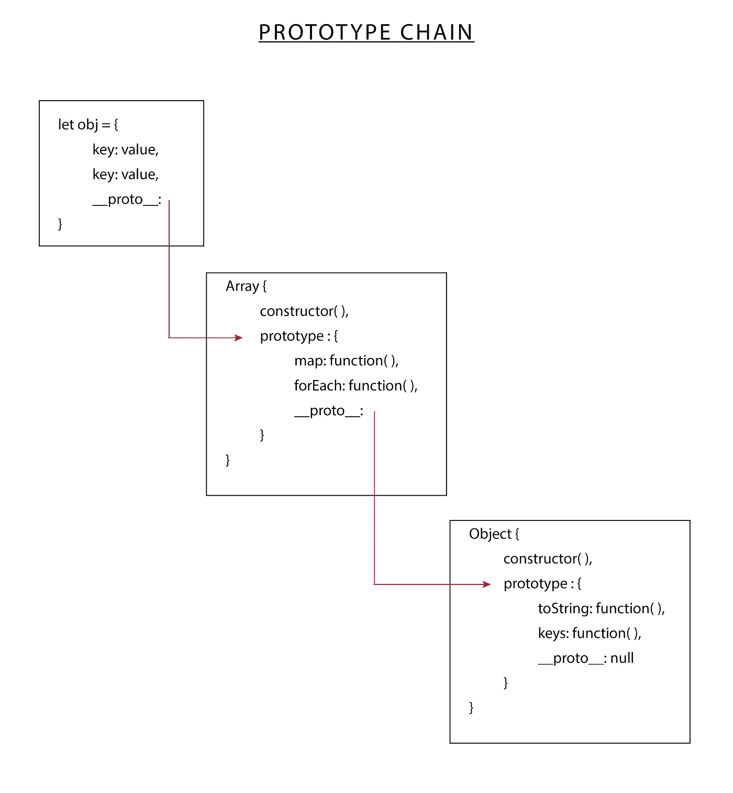
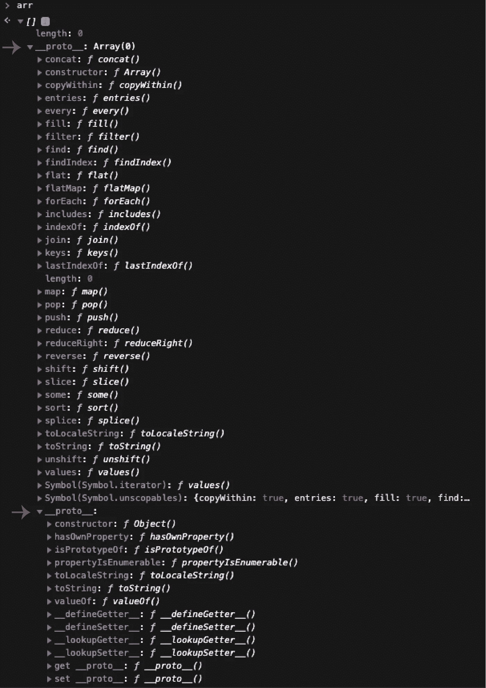

# JavaScript 基于原型是什么意思？

> 原文：<https://javascript.plainenglish.io/what-does-it-mean-that-javascript-is-prototype-based-1974a5e8be49?source=collection_archive---------8----------------------->

## __proto__ 到底是什么


Photo by [Jeswin Thomas](https://unsplash.com/@jeswinthomas?utm_source=medium&utm_medium=referral) on [Unsplash](https://unsplash.com?utm_source=medium&utm_medium=referral)

当我刚开始学习 JavaScript 和 OOP 时，我一遍又一遍地听说 JavaScript 是一种面向对象的语言，尽管它不是基于类而是基于原型。
在这篇文章中，我们将试图理解这意味着什么，以及为什么知道原型是什么对于认识我们正在做的事情很重要。

在其他面向对象的语言中**当你声明一个类时，你正在创建一个新的复杂数据类型**，也就是说，一个由原始数据类型组成的数据类型。但这并不是 JavaScript 中发生的事情，即使我们从 ES2015 开始使用关键字类。类是蓝图，**原型是对象实例。在 JavaScript 中，默认情况下，对象直接从其他对象继承。**

## **要理解这意味着什么，我们需要理解原型链是什么。**

原型链是一个连接对象功能的**树形结构，在这个树的根部是 Object.prototype 所在的位置。Object.prototype 提供了一些在所有对象中都出现的方法，比如 toString()、hasOwnProperty()或 keys()。**

如果我们遵循原型链，JavaScript 中的几乎每个对象都是 object 的实例。您可能知道，JavaScript 中的几乎所有东西都是对象，[甚至一些原始数据类型(特别是字符串、布尔和数字)在很短的时间内也可以是对象](https://javascriptweblog.wordpress.com/2010/09/27/the-secret-life-of-javascript-primitives/)。所以，数组是对象，函数是对象，当然，对象是对象。

例如，原型链允许我们创建数组的实例，这些实例可以访问数组的所有可用方法，如 map、forEach、reduce、filter 和 big 等。但是数组也可以访问所有 Object.prototype 功能。

## **这是怎么发生的？**

在我们继续之前澄清一下，因为我们在这个例子中使用了数组，所以数组是 JavaScript 中的语法糖。它们是具有特殊行为的对象，使它们看起来和感觉起来像一个数组，但在本质上它们是这样的:

```
{
  '0': value,
  '1': value,
  '2': value
}
```

原来每个对象都有一个名为 __proto__ 的属性，它保存了对构造函数的原型对象的引用。因此，以数组为例，数组可以访问 Object.prototype 中的所有方法，因为每个数组都是数组对象的一个实例，而数组对象又是 Object 对象的一个实例。**并且这个链继续下去，直到我们命中 Object.prototype 的原型，它将是 *null* 。**



这样，当我们试图在一个对象上执行一个方法时，第一个 JS 将查找对象本身的属性。如果它没有找到同名的属性，它将查找它的 __proto__ 属性，该属性包含对其构造函数的原型对象的引用。如果它没有在那里找到它，它将在这个构造函数对象的 __proto__ 属性中查找。这将继续下去，直到它找到或没有找到它，并抛出一个类型错误。

这意味着，例如,**每次我们声明一个数组时，我们都在创建一个该语言附带的 array 对象的实例。**如果我们在控制台中查看它，我们会看到它的 __proto__ 属性链接到了 Array 对象:

如果我们继续往下看兔子洞，我们会看到,【_ _ proto _ _ object 本身就有一个 _ _ proto _ _ property，它保存了对 Object.prototype 的引用(它是一个引用，尽管您可以在控制台中看到所有的属性，因为您知道，DRY)。



## **那么，有没有办法在 JavaScript 中创建一个没有原型的对象呢？**

是的，有。创建对象的方法之一是使用`Object.create()`，我们可以将我们希望该对象具有的原型作为参数传递给它，默认情况下该原型是`Object.prototype`。如果我们将它作为参数传递为 null，我们将得到一个对象，一个哈希表。

```
const objectWithoutPrototype = Object.create(null);
```

我写这篇文章的主要资源是 Marijn Haverbeke 的[雄辩的 JavaScript](https://eloquentjavascript.net/) 和 Will Sentance 的课程 [JavaScript:面向对象 JavaScript 的难点](https://frontendmasters.com/courses/object-oriented-js/)。

谢谢你阅读❤