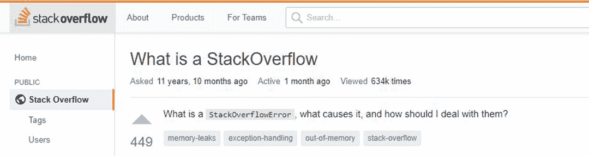
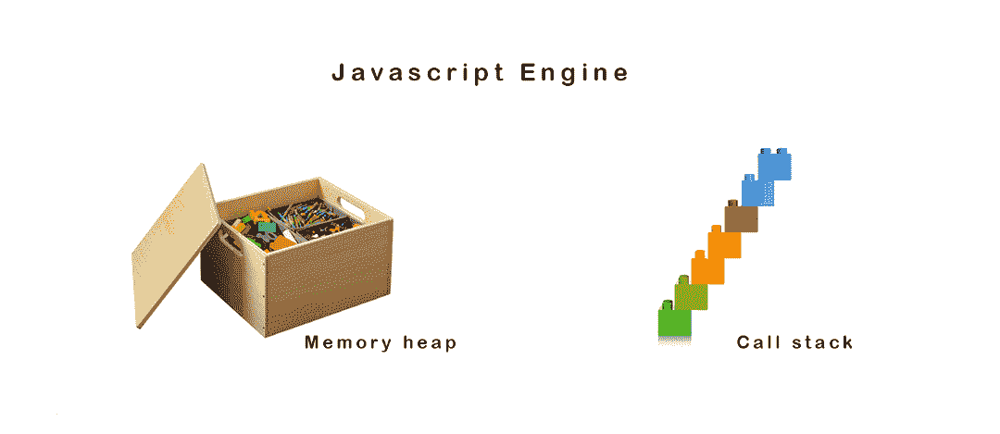
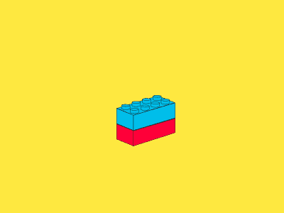
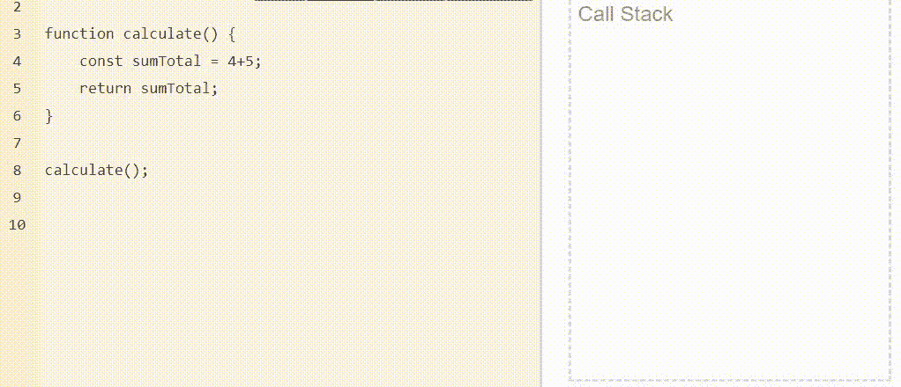
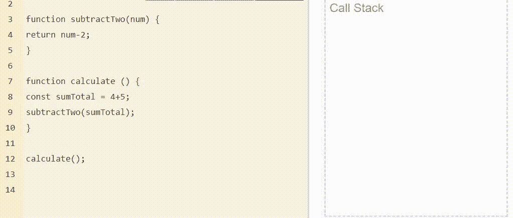
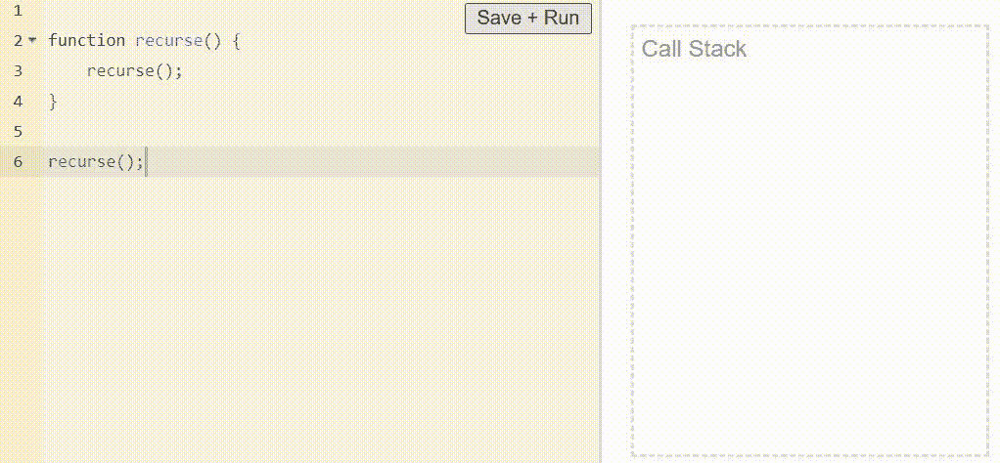

# 编程中栈溢出是什么意思？

> 原文：<https://javascript.plainenglish.io/what-does-stack-overflow-mean-in-programming-37c896e1ecdd?source=collection_archive---------9----------------------->

## 找出堆栈溢出的真正含义

screenshot from [st](https://stackoverflow.com/questions/214741/what-is-a-stackoverflowerror)ackover[flow](https://stackoverflow.com/questions/214741/what-is-a-stackoverflowerror) edited by Toluwani Elemosho

当你想到堆栈溢出时，你会想到什么？网站吗？好吧，跟我来解释堆栈溢出的真正含义。

一天结束时，JavaScript 程序做两件事:将信息写入内存和从内存中读取信息。

两个存储区域用于读取或写入这些信息:

1.  许多
2.  堆

image by via [tidyboks](https://fr.tidybooks.com/produit/coffre-a-jouet-enfant/) (right) and [Modern Teaching Aids](https://www.pinterest.com.au/mtaau/)(left)

## 什么是堆栈？

可以把 stack 想象成一个内存区域，在逐行运行时跟踪并存储函数或变量。

堆栈以后进先出(LIFO)模式运行。想象一下，乐高积木从上到下垂直堆叠在一起，更多的乐高积木放在顶部，从底部移除。

Images by [Amman Vedi](https://dribbble.com/AmmanV) via [https://dribbble.com/](https://dribbble.com/)

## 如何添加到堆栈？

下面的代码图说明了添加到堆栈的想法。每当在第 8 行调用`calculate()`函数时，calculate()被推到堆栈的最顶层。第 5 行的下一个`*const sumTotal = (4+5)*`将被执行，也将被压入堆栈。随着更多代码的运行，它们被压入堆栈。

source: [loupe](http://latentflip.com/loupe/?)

## 怎么从栈中减去？

当一个函数、变量或对象被执行时，它被从堆栈中清除。在上面的例子中，因为`const sumTotal = (4+5)`在`calculate()`函数之前完成了它的任务，所以它被从堆栈中删除。

## **考虑另一个例子:**

source: [loupe](http://latentflip.com/loupe/?)

考虑上面代码图中的步骤:

1.  `Calculate()`第 12 行调用的函数被推到堆栈的第一层。
2.  第 8 行中的`(4+5)` 接下来运行，并且也被推到 calculate()函数顶部的堆栈中，但是很快被从堆栈中移除，因为它已经完成了它的任务。
3.  要执行的下一个函数`subTractTwo()`被添加到堆栈中。
4.  `(return num-2)`已经在`subTractTwo()`中被处理，然后被添加，但是因为它已经完成了它的任务，所以立即被删除。
5.  现在`subTractTwo()`已经完成了它的进程，它被从堆栈中移除。
6.  最后，`calculate()`结束执行并从堆栈中移除。

综上所述，stack 是一个在每行代码执行时跟踪和存储数据的容器。

## 什么是堆栈溢出？

有可能在不释放内存的情况下，不断向容器(栈)添加和添加，由于栈的大小是有限的，最终会耗尽内存，使程序崩溃。

image by [Improv Utopia](https://www.improvutopia.com/author/improvutopiamaster/)

让我们做些有趣的事，好吗？从前面的例子中，我们发现当调用`calculate()`时，代码被放入堆栈并从堆栈中移除。

如果我们一直增加堆栈，直到它变得越来越大，最后会耗尽内存(stack)怎么办。这被称为**堆栈溢出**。

source: [loupe](http://latentflip.com/loupe/?)

上面的代码显示了一个在自身内部调用的函数。这叫做**递归。**如果我们在第 6 行调用`recurse()`会发生什么？`recurse()`将继续调用`recurse()`和，并不断将`recurse()`添加到堆栈中，直到堆栈填满，应用程序崩溃。这称为堆栈溢出。

递归是导致堆栈溢出的最常见方式之一。它只是一个在自身内部调用的函数，用来创建一个不断增长的堆栈，直到堆栈填满。

## 结论

总之，本文解释了 JavaScript V8 引擎用来存储和读取信息的两个内存: **Stack 和 Heap** 。它还描述了什么是堆栈，如何在堆栈中添加或删除信息，以及什么是堆栈溢出。

我希望您在学习这些概念的过程中获得了乐趣，因为它们有助于您编写更好的 JavaScript 代码。