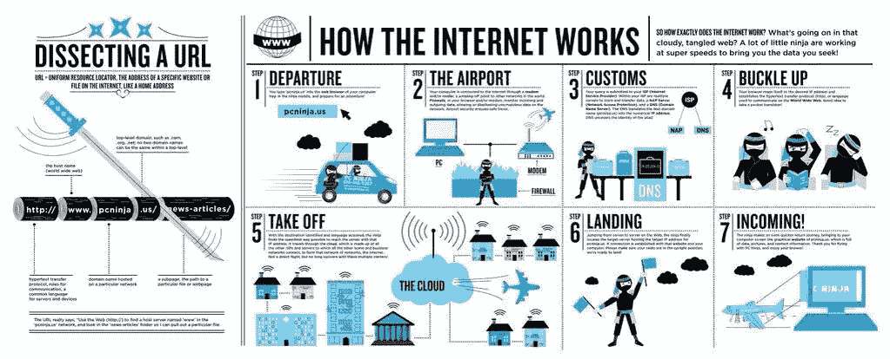
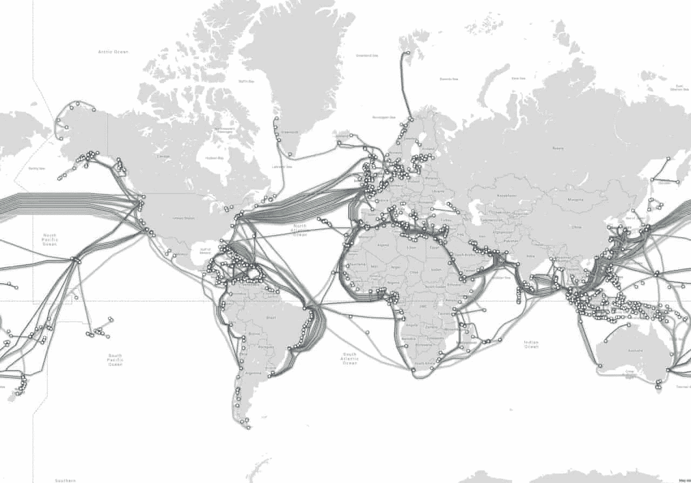

# 每一个新的软件开发人员需要了解的互联网知识

> 原文：<https://javascript.plainenglish.io/what-every-new-software-developer-needs-to-know-about-the-internet-da5d5c7ed84c?source=collection_archive---------3----------------------->

## 一个快速的纲要，对面试准备很有用。

Photo by [Sergey Zolkin](https://unsplash.com/@szolkin?utm_source=medium&utm_medium=referral) on [Unsplash](https://unsplash.com?utm_source=medium&utm_medium=referral)

# 互联网是如何工作的

作为一名 web 开发人员，了解互联网的基础知识以及其组件与您的工作有何关联是非常重要的。在这篇文章中，我收集了所有你需要知道的关于互联网的基本信息。这篇文章的想法是在问了许多人这三个基本问题后产生的:用你自己的话来说，我们称之为互联网的这个东西到底是什么？它的大部分组件是如何协同工作的？回答前两个问题有多容易？

Photo by [fabio](https://unsplash.com/@fabioha?utm_source=medium&utm_medium=referral) on [Unsplash](https://unsplash.com?utm_source=medium&utm_medium=referral)

我收到过像“比尔·盖茨从中致富的东西”这样古怪的答案，也有像“数据的移动”这样简单的答案。虽然第二个答案没有错，但我肯定会详细说明更多。我保证你会得到很好的照顾。这篇短文将为你提供足够的信息，让你自信地正确回答上述问题。即使你没有参加面试，了解这些基础信息也会让学习其他 web 开发主题变得容易得多。

在我们开始讨论这一切是如何一起工作之前，让我们先从一些定义开始。

1.**互联网:**由数十亿电子设备组成的全球网络。它由大量独立运营的网络组成。没有中央操作中心。所有用户都受到激励，以确保有端到端的活动来保持事情的高效运行。其结果是大量的电缆、计算机、数据中心、路由器、服务器、中继器、卫星和 wifi 塔，使数字信息能够在世界各地传播。更多关于这个话题的可以在这里找到**。**

*2.**客户端:**访问由称为服务器的存储系统提供的数据的硬件或软件。客户包括笔记本电脑、电话和智能电子产品等等。这些设备不像服务器那样直接连接到互联网。它们直接连接到您的互联网服务提供商(下面解释)。*

*3.**互联网服务提供商(ISP):** 提供互联网通信服务的组织，通常通过计算机进行通信。例子包括康卡斯特、AT & T 和威瑞森。*

*4.**浏览器:**客户端中用于访问万维网信息的软件应用程序。(谷歌浏览器、Safari 浏览器、火狐浏览器)*

*5.**服务器:**也称为后端，是一台存储数据(网页、网站或应用程序)的计算机(有时存储在大型数据中心)，客户可根据请求访问这些数据(如上所述)。*

*6.**域名:**用于可行性目的的易读地址。我们通常使用域名，而不是直接使用数字 IP 地址。之所以采用这种做法，是因为对人类来说，记住单词比记住一串数字更容易。例子包括， [MelanieHarris.dev](https://www.melanieharris.dev/) 或 Google.com。*

*7.**域名服务器(DNS**)——接收域名，查找域名，然后提供相应的 IP 地址的中介。把这想象成一本电话簿，或者对阅读这篇文章的千禧一代来说是一个更好的例子，一个破译。它破译域名，并提供数据存储的实际 IP 地址。*

*8.**互联网协议地址(IP 地址):**直接或间接连接到互联网的所有设备(客户端、服务器等)的唯一标识符。).请将此想象为一个家庭地址，它唯一地定义了您或邻居的位置。*

*9. **URI 和 URL:** 统一资源标识符和统一资源定位符。URIs 是浏览器用来检索 web 上任何已发布资源的机制。理论上，每个有效的 URI 都指向一个唯一的资源。这种资源可以是 HTML 页面、CSS 文档、图像等。URL 是一种 URI。URI 可以是在线资源的名称(URN)、定位器(URL)或两者兼而有之，而 URL 只是定位器。URL 的例子包括 https://protocol 或 mailto:protocol。URI 的例子[https://example/path/to/author-image . png，](https://example/path/to/author-image.png,)其中//example/path/to/image.jpg .是名字(URN)。*

*10. **HTTP / HTTPS:** 超文本传输协议(S 代表安全)定义了一种客户端和服务器之间相互交流的语言。该协议定义了消息如何格式化和传输，以及 web 服务器和浏览器应该采取什么行动来响应各种命令。安全协议增加了安全加密层。任何处理敏感信息的网站都会使用 HTTPS。*

***11。** **防火墙:**防止未经授权访问或来自私有网络的软件程序。防火墙是一种工具，可用于增强连接到网络的计算机的安全性，例如局域网(LAN:在有限区域内互连计算机的计算机网络)或互联网。*

*12.**路由器:**可以说是邮件载体。它是一种在计算机网络之间转发数据(称为数据包的网页片段)的联网设备。它将确保正确的信息到达正确的地址。路由器在互联网上执行流量导向功能。如果您通过光纤电缆接收互联网，路由器将光脉冲转换为电信号，通过以太网电缆将信号发送给客户端。如果您使用的是蜂窝数据，脉冲会被发送到信号塔，然后通过电磁波到达手机等客户端。*

*在我们深入了解一切是如何协同工作的之前，这里有一个非常适合视觉学习者的图表:*

**

*Image source: [https://www.helloitsliam.com/2014/12/20/how-the-internet-works-infographic/](https://www.helloitsliam.com/2014/12/20/how-the-internet-works-infographic/)*

***“梅勒妮，谢谢你的定义，但是这些是如何一起工作的呢？”很高兴你终于开口了，我们开始吧。***

*虽然有许多方法可以接收互联网，但最快的方法之一是通过光纤电缆，它利用光信号来传输数据包。在继续之前，让我们花一分钟来想象这个概念。想象一下，一艘船在大海中央放下一条条电缆从一个地方到另一个地方。这一过程不会自动完成，通常会有一个互联网服务提供商(ISP)拥有或使用将您的客户端连接到互联网的电缆。如果你还记得我们之前的谈话，ISP 的例子包括，你可能对康卡斯特、ATT 电话电报公司或他们的竞争对手又爱又恨。*

**

*[https://www.theguardian.com/technology/2018/oct/22/what-is-the-internet-13-key-questions-answered](https://www.theguardian.com/technology/2018/oct/22/what-is-the-internet-13-key-questions-answered)*

*在这里多包涵，因为互联网流程比上面的可视化要复杂的多，我会用通俗易懂的英语分解重要步骤。让我们把客户端移到浏览器。*

*→客户端是面向用户的设备(笔记本电脑、电话等)。)允许显示互联网传输的数据。→浏览器(Safari、Google Chrome、Firefox)是客户端中的一个平台，用于显示互联网收集的服务器端信息。→这是通过网址 URI(https://Melanie Harris . dev)完成的。→浏览器使用位于 URI 内的域名或 IP 地址(域名的原始形式)发送信息请求。请记住，IP 地址类似于邮寄地址。为了将包裹递送给某人，您必须有具体的位置信息。*

*→ DNS 代表域名服务器，它在向域名发出请求后立即发挥作用，您的请求发送到中介 DNS，它查找您的域名并将其转换为 IP 地址。→网络浏览器通过 URI 信息连接到网络服务器，并发送 HTTP 或 HTTPS(安全)请求。通过 HTTP 或 HTTPS，可以找到或找不到所请求的信息。→一旦数据被定位并传输回来，它就会到达您的防火墙。防火墙将监控传入和传出的网络流量，并根据一组安全规则允许或阻止数据包(在最终目的地相似的分解数据片段),以阻止病毒和黑客等恶意流量。*

*→下一站，路由器。您的路由器将通过唯一的 IP 地址准确识别数据应该到达的位置。换句话说，它标识哪个客户端请求了数据。把你的路由器想象成你的邮差。他们的工作是确保包裹被送到正确的名称和地址。→一旦正确的客户端浏览器收到请求，连接就会关闭。浏览器将解析数据，寻找完成页面所需的元素，可以是音频、图像等形式..这一步需要额外的请求，直到页面完全加载。*

*我们结束了。喜欢你读过的吗？请喜欢我的帖子，并随时查看我的其他一些文章。更多即将推出…*

**

*Photo by [Leon Seibert](https://unsplash.com/@yapics?utm_source=medium&utm_medium=referral) on [Unsplash](https://unsplash.com?utm_source=medium&utm_medium=referral)*