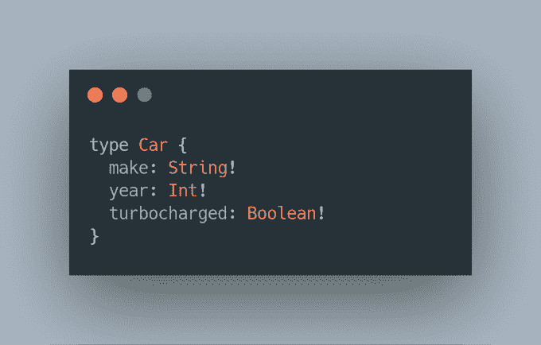
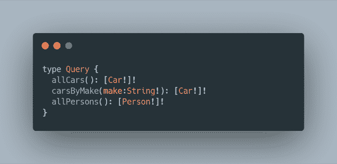
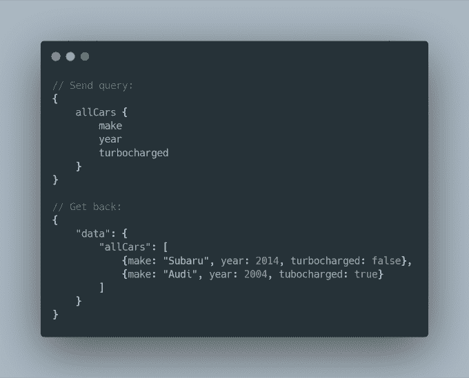
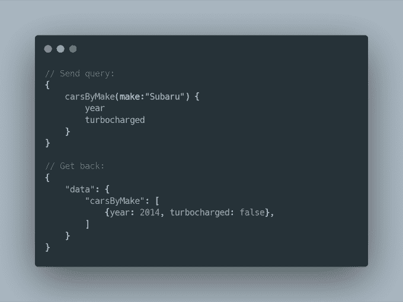
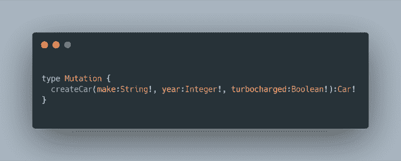
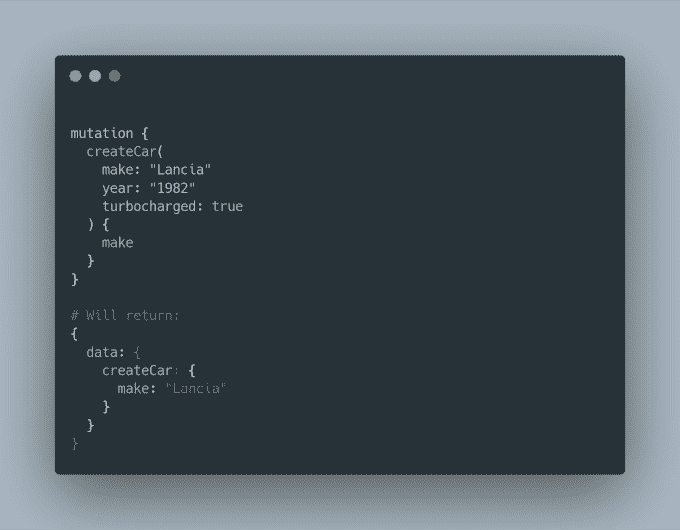

# GraphQL 到底是什么？

> 原文：<https://javascript.plainenglish.io/what-exactly-is-graphql-7a4fc930eae7?source=collection_archive---------6----------------------->

脸书于 2012 年开始开发 GraphQL，并于 2015 年发布。从 2018 年开始，Linux 基金会负责该项目。GraphQL 的目的是为数据获取和操作提供一种查询语言。它不完全是 SQL，也不是 REST。它介于两者之间，允许开发人员以直观和安全的方式查询、改变和组织数据。

# 替代方案:休息

要理解什么是 GraphQL，首先要理解什么是 graph SQL**不是**。首先，这不是休息。REST 代表表述性状态转移，多年来它一直是 API 开发的行业标准。REST 允许您使用 HTTP 请求的子集执行客户机/服务器通信。此外，它还提供了如何组织和命名这些请求的规则和一般原理。最常见的是，JSON (JavaScript 对象符号)用于发送数据。

那么，休息有什么不好呢？很多事情。一个主要原因是服务器和客户端之间没有强有力的契约协议。这意味着不能保证您将收到的数据的类型或结构。此外，不同 HTTP 状态代码之间的模糊性。例如，您应该因为请求成功而返回 200，还是因为创建了一个项目而返回 201？

# 肥皂

SOAP(简单对象访问协议)通常在 REST 之前使用。与 REST 不同，SOAP 是一个标准化的协议，由微软开发，W3C 批准。它使用 XML 符号来发送和接收数据。SOAP 后来被扩展并应用于支持远程过程调用。它也不仅限于 HTTP。SOAP 消息可以通过其他协议发送，比如 SMTP，也可以直接通过 TCP 发送。

虽然 SOAP 非常健壮，但它被批评为过于冗长和缓慢。这就是为什么开发人员转向更底层的协议，比如 REST。

# 结构化查询语言

SQL 代表结构化查询语言。它主要用于数据库环境中。虽然它与 API 和客户机/服务器通信无关，但它非常值得注意，因为它与 GraphQL 有许多共同之处。

它们都提供了合同协议和定义明确的规范。SQL 和 GraphQL 的主要目标都是查询和操作数据。不同之处在于，SQL 是为处理关系数据库而设计的，而 GraphQL 是为 NoSQL 解决方案而开发的。GraphQL 还指定了双方应该如何通过网络进行通信，而 SQL 没有做这样的假设。

你也可以说 SQL 比 GraphQL 有更丰富的特性。它支持对数据的更多操作，以及通常为编程语言保留的函数和其他方面。

# 核心概念

有了替代方案，我们可以开始研究 GraphQL 了。为了能够有效地使用 GraphQL，理解它的一些核心概念是很重要的。

## (计划或理论的)纲要

GraphQL API 的基础是一个**模式**。模式是 API 可以处理的所有可能数据以及这些数据的类型的定义。它通常位于服务器端，所有传入的查询首先根据模式进行验证。

## 田

正如 GraphQL 官方文档所说，“[GraphQL]基本上是关于选择对象上的字段”。字段是你可以从 API 请求的最基本的数据单元。它还必须是标量，这意味着没有关系或复杂性。

## 履行

GraphQL 中的**实现**就像 OOP 中的继承。它允许您定义一些将在不同对象间共享的公共字段。

## 关系

**连接**就是 GraphQL 中的图的来源。它让您可以将不同的对象相互连接起来，就像图表中的节点一样。这些连接让您可以在一次调用中查询多个对象，而在其他情况下，您可能需要多次调用。

# 例子

现在让我们看一些 GraphQL 的例子。我们从定义一个类型开始。它是用 SDL(模式定义语言)编写的:

你可以看到它的名字是`Car`，它有字段`make`、`year`和`turbocharged`。每个字段都有特定的类型。此外，感叹号表示该字段是必填的。

但是要真正探索 GraphQL 的思想，我们需要引入一些关系。让我们定义另一种类型，并将它与`Car`联系起来:

您可以看到`Car`现在通过`owner`字段引用了`Person`，并且`Person`在`cars`字段中保存了一个`Car`列表。

# 问题

为了能够查询汽车和人员，我们现在需要定义一些`Queries`:

您可以看到我们已经定义了 3 个查询。`allCars`不接受任何参数，返回汽车列表。`carsByMake`取一串，通过`make`过滤汽车。最后，`allPersons`将返回一个`Person`的列表。

现在，我们可以向 API 发送查询，并得到如下结果:

将变量传递给查询:

*n December 20, 2019.*

# 突变

查询数据很好，但是我们首先还需要一种创建数据的方法。GraphQL 使用**突变**来做到这一点。您可以像查询一样定义突变:

这是一个接受数据并创建一个`Car`对象的变异的例子。你可以这样称呼它:

*n December 20, 2019.*

# 履行

GraphQL 本身不是一个库或框架:它仅仅是一个规范。不同语言的许多库都实现了这个规范，允许您使用 GraphQL 支持来构建自己的 API。以下是其中的一些:

*   **JavaScipt:**[graph QL](https://github.com/graphql/graphql-js/)和 [express-graphql](https://github.com/graphql/express-graphql)
*   **Java**:[graph QL-Java](https://github.com/graphql-java/graphql-java)
*   **Python** : [石墨烯](https://github.com/graphql-python/graphene)

对于前端来说， [Apollo](https://github.com/apollographql/apollo-client) 库最为常见。

# 利弊

那么，为什么应该使用 GraphQL，为什么要避免使用它呢？以下是支持 GraphQL 的一些理由:

*   **强合同约定** —你再也不用去猜测服务器会给你发什么样的数据了。使用 GraphQL，您可以得到您想要的东西
*   **更少的请求—** 与 REST 或 SOAP 相比，GraphQL 可以用更少的请求来做事情
*   直观的 — GraphQL 比 REST 或 SOAP 更直观、更易于使用。

但是 GraphQL 并不完美。以下是 GraphQL 的缺点:

*   **开销**——graph QL 附带了相当多的设置，这对于小项目来说可能效率不高
*   **年龄** — GraphQL 比 REST 或 SOAP 年轻得多，这意味着它的学习材料和最佳实践更少

我希望现在您对 GraphQL 是什么以及它能解决什么问题有了一个坚实的理解。感谢您的阅读，请在评论中告诉我您对 GraphQL 的看法！