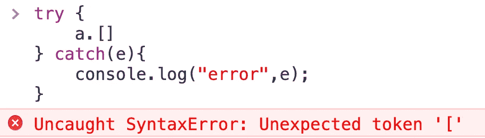
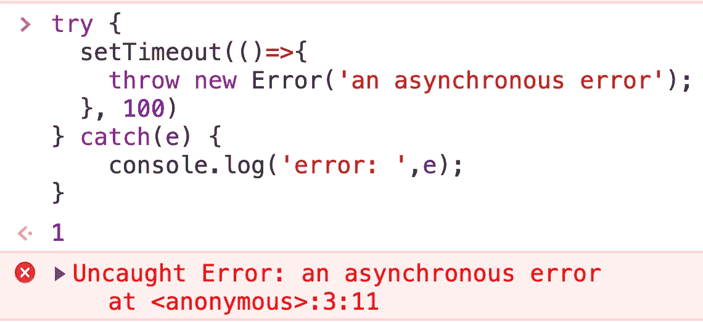
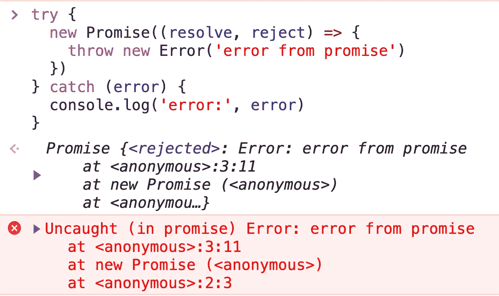
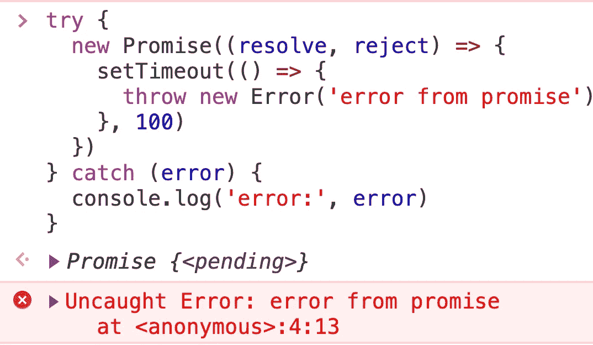

# try-catch 不能捕获哪些异常？

> 原文：<https://javascript.plainenglish.io/what-exceptions-cannot-be-caught-by-try-catch-b33ecd9b5d74?source=collection_archive---------8----------------------->

## 掌握 try-catch 边界，使您的代码更加安全。


Photo by [Sarah Kilian](https://unsplash.com/@rojekilian?utm_source=medium&utm_medium=referral) on [Unsplash](https://unsplash.com?utm_source=medium&utm_medium=referral)

我们习惯于将代码包装在 try-catch 中，以防止程序由于各种可能的错误而中止。但是试捕不是万能的，我们要知道试捕不能做什么。

# 1.无法捕捉语法错误

当代码报告错误时，如果线程尚未进入 try-catch 块，则无法捕获异常。

比如 syntaxError，因为语法异常是在语法检查阶段报告的，线程执行没有进入 try-catch 代码块，自然无法捕捉到异常。

示例:

```
try {
    a.[]   
} catch(e){
    console.log("error",e);
}
```

在上面的例子中，`a.[]`不是有效的语法，所以在语法的解析阶段会抛出一个异常。



# 2.无法捕获异步代码中的异常

示例:

```
try {    
  setTimeout(()=>{
    throw new Error('an asynchronous error');
  }, 100)
} catch(e) {
    console.log('error: ',e);
}
```

在此示例中，调用 setTimeout 回调函数时，try-catch 语句结束，因此无法捕获异步回调函数中引发的异常。



# 3.无法捕捉承诺的例外

示例 1:

```
try {
  new Promise((resolve, reject) => {
    throw new Error('error from promise')
  })} catch (error) {
  console.log('error:', error)
}
```

示例 2:

```
try {
  new Promise((resolve, reject) => {
    setTimeout(() => {
      throw new Error('error from promise')
    }, 100)
  })
} catch (error) {
  console.log('error:', error)
}
```

Promise 对象中生成的所有异常(无论同步还是异步)都被 Promise 对象本身捕获，并交给`Promise.prototype.catch`处理。我们永远不能接受承诺之外的例外。



## **用简单英语写的 JavaScript 笔记**

我们已经推出了三种新的出版物！请关注我们的新出版物: [**AI in Plain English**](https://medium.com/ai-in-plain-english) ，[**UX in Plain English**](https://medium.com/ux-in-plain-english)，[**Python in Plain English**](https://medium.com/python-in-plain-english)**——谢谢，继续学习！**

**我们也一直有兴趣帮助推广高质量的内容。如果您有一篇文章想要提交给我们的任何出版物，请发送电子邮件至[**submissions @ plain English . io**](mailto:submissions@plainenglish.io)**，使用您的 Medium 用户名，我们会将您添加为作者。另外，请让我们知道您想加入哪个/哪些出版物。****