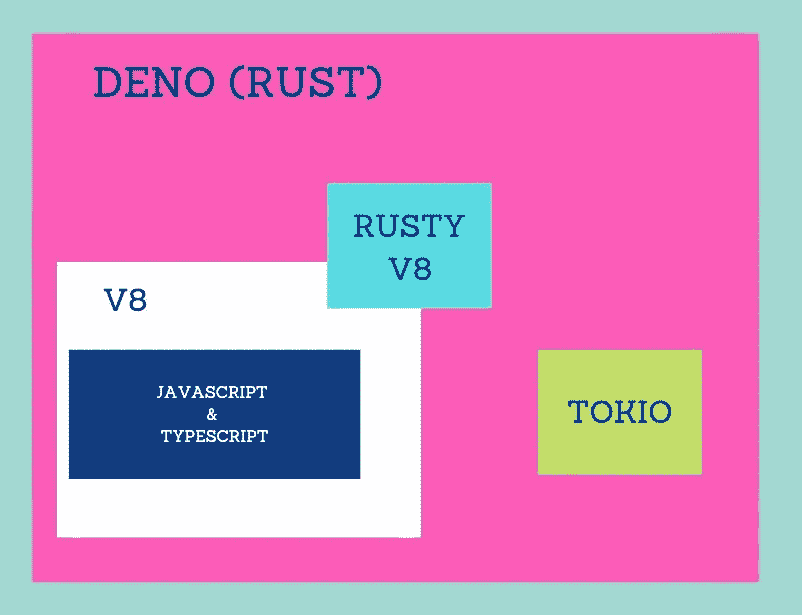

# Deno 的幕后发生了什么？

> 原文：<https://javascript.plainenglish.io/what-happens-behind-the-scenes-with-deno-3cf111d8004c?source=collection_archive---------3----------------------->

## Deno = Rust + Tokio + V8

The building blocks of Deno

在 JSConf 2018 年的演示中，Ryan Dahl 解释了他在开发 Node 时的遗憾，比如没有坚持承诺、安全问题、构建系统(GYP)、package.json 和 node_modules。在同一场演讲中，他宣布了自己的新作《Deno》。它不是 Node 的一个分支，它完全是一个新编写的实现。

Deno 1.0 正式版于 2020 年 5 月 13 日发布。它超级年轻，事情是要变的，但 Deno 的内部不会变。我们将探索 Deno 的内部。它建立在 V8⁴、Rust⁵和 Tokio⁶.之上

> 我们可以把它想象成 Deno 的前端是 JavaScript 或者 TypeScript，后端是 Rust。

The architecture of Deno

# Deno 前面有 **JavaScript 和 Typescript**

它采用 V8 引擎，这是谷歌的开源高性能 JavaScript 和 WebAssembly 引擎，用 C++编写。它还有一个内置的 TypeScript 编译器，你不需要设置或配置任何东西。所以 Deno 可以通过编译成 JavaScript 文件来运行 TypeScript 文件。

> 它是一个安全的 TypeScript 运行时，构建于 V8 之上，V8 是用于 JavaScript 的 Google 运行时引擎。

因此，在前端，我们编写 JavaScript 和类型脚本文件。如果我们是用 TypeScript 编写的，那么它首先会被编译成 JavaScript，但是如果我们的代码是 JavaScript，那么它会完全忽略编译过程，直接进入 V8。

# **Deno 在后端已经生锈**

Rust 是一种让每个人都能够在不使用垃圾收集的情况下构建可靠而高效的软件的语言。Node 是用 C 和 C++编写的，但 Deno 是用 Rust 编写的，它使用 Rusty V8，这样 V8 引擎就可以与 Rusty 后端通信。

> 如果有 JavaScript 之外的东西，就把它发给 Rust

当 V8 引擎在 JavaScript 之外有任何需要做的事情时，它会通过 Rusty V8 发送给 Rust，就像访问文件或设置超时一样。

# Tokio 允许 Deno 使用威胁池和工人为我们工作

Tokio 是一个开源库，为构建快速、可靠和轻量级的网络应用程序提供了一个异步、事件驱动的平台。它利用 Rust 的所有权和并发模型来确保线程安全。因此，Deno 将 Tokio 库用于事件循环、异步 io 等等。

> 请记住，Tokio 库只是一个 rust 项目，rust library。

对于熟悉 node.js 结构的人来说:

*   在作为 Node.js 一部分的 Node.js 绑定的等效项中信任 V8。
*   Tokio 库相当于 node.js 语言中的异步 IO LIBUv。

最后，Deno [v1.2.0](https://github.com/denoland/deno/releases/tag/v1.2.0) 已经在 4 天前发布了。

# 参考

[1][node . js 我后悔的 10 件事— Ryan Dahl — JSConf EU 2018](https://www.youtube.com/watch?v=M3BM9TB-8yA)

[2][https://nodejs.org](https://nodejs.org/en/)

[3] [https://deno.land](https://deno.land)

[4] [https://v8.dev](https://v8.dev)

[5][https://www.rust-lang.org](https://www.rust-lang.org)

[6] [https://tokio.rs](https://tokio.rs)