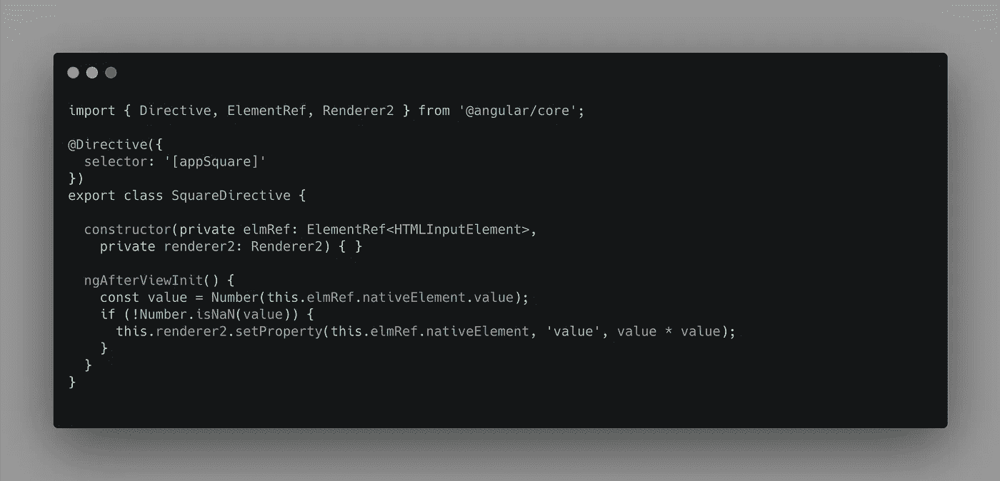
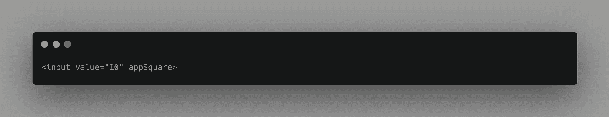
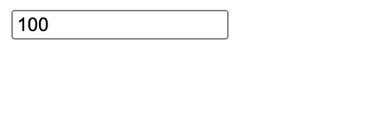
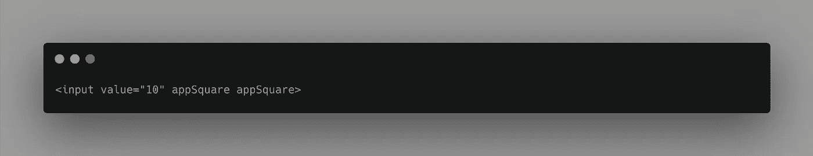
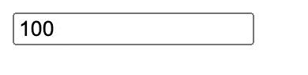
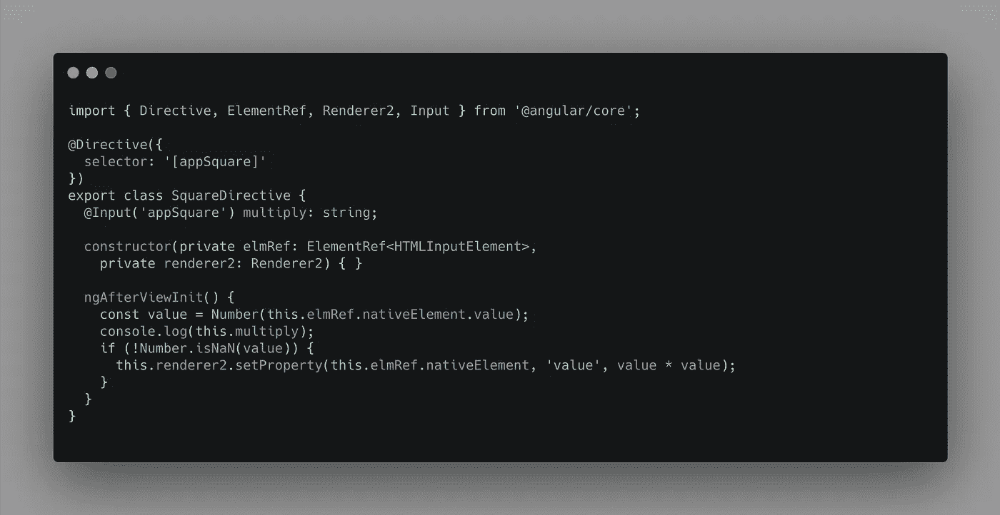
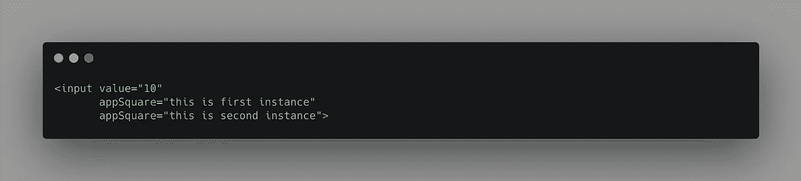
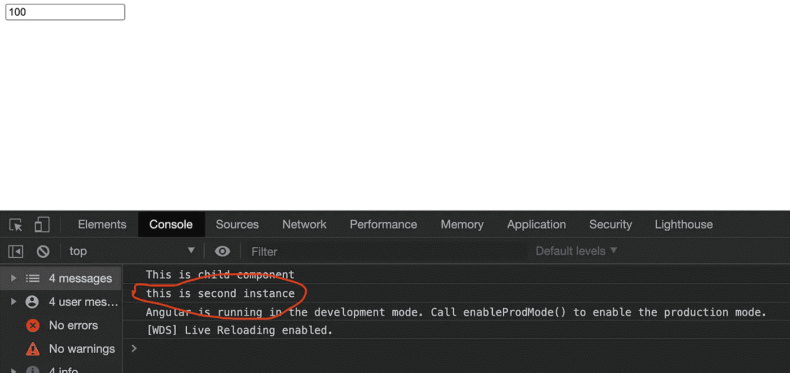

# 在元素上多次使用角度方向

> 原文：<https://javascript.plainenglish.io/what-happens-when-an-angular-directive-is-used-more-than-once-on-an-element-1e709cbead2f?source=collection_archive---------3----------------------->

Photo by [Emily Morter](https://unsplash.com/@emilymorter?utm_source=unsplash&utm_medium=referral&utm_content=creditCopyText) on [Unsplash](https://unsplash.com/s/photos/question-mark?utm_source=unsplash&utm_medium=referral&utm_content=creditCopyText)

解释 Angular 如何处理具有多次实例化的指令的元素

当我们想要变换或调整一个元素的外观时，Angular 中的指令就派上了用场。此外，使用指令对于抽象来说更好，因为所有的实现逻辑都在指令实现中被抽象出来，并且可以在任意数量的元素上使用这些逻辑，只需添加指令选择器以及输入(如果有的话)。

在这篇文章中，我将解释在一个元素上不止一次使用一个指令的场景，以及 Angular 如何处理这种情况。

像往常一样，让我们建立一个简单的例子。我将创建一个指令`square`，它将主机元素的值更新为其值的平方。下面是该指令的一个简单实现:

Implementation of square directive

为了在输入元素上使用它，下面是示例代码:

Using appSquare directive on an input element

因此，我们为 input 设置了一个值 10，但是在初始化过程中，调用了`appSquare`指令，并将 input 上的值更新为其值的平方 100。

以下是渲染后输入的样子:

Input after rendering

现在，举例来说，如果我们想要平方值，例如如果我们传入`10`，那么输入应该用`10000`更新，那么，我们可以在这个元素上使用两次`appSqaure`指令来实现吗？

让我们通过更新上面的例子来解决这个问题

更新输入后，模板现在看起来像这样:

Input with appSquare directive twice

用户界面上呈现的结果如下所示”

UI rendered value

是的，价值仍然和以前一样。

# 这里发生了什么事？

让我们后退一步，理解当一个指令在一个元素上被多次添加时，Angular 编译过程是如何工作的。

在 Angular 编译过程中，Angular 编译器检查每个元素的定义，并设置原生元素的属性。这部分的实现如下所示

> **源代码:**[https://github . com/angular/angular/blob/master/packages/platform-browser/src/DOM/DOM _ renderer . ts # L184](https://github.com/angular/angular/blob/master/packages/platform-browser/src/dom/dom_renderer.ts#L184)

由于属性在本地元素上被设置为`Map`，不可能多次定义相同的属性(因为如果键是文字，那么它们在 Map 中是惟一的，在这种情况下，它们通过值进行比较)。

当角度按照元素上定义的所有属性的放置顺序循环时，元素上某个类型的最新属性将保持不变。

让我们修改前面的指令示例，接受一个输入值，并为指令的每个实例传递不同的值。在这种情况下，放在最后的指令具有优先权。

Square directive that takes in an input

现在让我们更新模板，为两个指令实例传入值。因为我们用与指令选择器相同的名称定义了`@Input`，所以我们不需要传递额外的输入，相反，我们可以直接将值传递给声明它自己的`directive`(它完成两个任务。指示选择器和输入装饰器)。

它看起来是这样的:

Input element with multiple instances of directives

如果我们现在运行我们的应用程序，我们会在控制台中看到:

Only second instance of directive message gets logged

正如我上面所说的，在上面的例子中可以看到，指令的后一个实例删除了前一个。

就是这样。感谢阅读！更多有趣的文章请关注我。