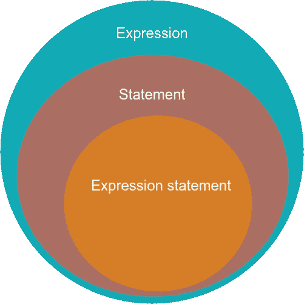

# JavaScript 中的表达式和语句之间有什么区别？

> 原文：<https://javascript.plainenglish.io/what-is-an-expression-and-what-is-a-statement-in-javascript-and-how-to-remember-it-4d6920ee7b08?source=collection_archive---------0----------------------->

在 JavaScript 中，我们有表达式和语句。尽管我多次阅读了关于它的定义，过了一会儿，我还是忘记了哪个是哪个。因此，这篇文章提醒像我这样混淆这两者的人，所以你永远不会忘记它，但要记住表达和陈述之间的区别。

Photo by [bruce mars](https://unsplash.com/@brucemars?utm_source=medium&utm_medium=referral) on [Unsplash](https://unsplash.com?utm_source=medium&utm_medium=referral)

JS **表达式**是任何解析为值的有效代码，并且可以在您期望值的任何时候编写。通常表达式只写在一行。例如:

*   42/a/数字
*   “你好，世界”//一串
*   42 + 1 // a 计算
*   x = 42 + 1 //计算
*   myVar // a 变量
*   my dun()//一个返回值的函数
*   …

但它比你想象的要复杂。有不同类型的表达式:

*   算术:归结为一个数字，例如

`42`

`42 + 1`

等等。

*   字符串:解析为字符串，例如

`"Hello World"`

`"123"`

等等。

*   合乎逻辑的:归结为`true`或`false`并且经常使用逻辑运算符，例如

`true`

`1 === 0`

等等。

*   主要表达方式:基本关键词和通用表达方式，如

`this`

分组运算符`(...)` : `(1 + 2) * 3`

等等。

*   左侧表达式:左侧值是赋值的目的地，例如

`var x = 42 + 1`

`new`操作员:`var myVar = new Object()`

`super`调用对象父对象的关键字:`super.functionOnParent`

等等。

**语句**可以跨越代码中的多行。在 JS 中，语句比表达式更难描述，因为语句不是关键字，而是关键字的集合。声明可以是:

*   控制流程:一段代码，`if … else`、`switch`、`try … catch`、`break`、`continue`、`throw`等。
*   功能及类别:`function myFunction() { ... }`、`function*`、`async function`、`class`等。
*   迭代:`while`、`do ... while`、`for`、`for ... of`等。
*   杂项:`debugger`、`import`、`export`、`with`等。

当需要语句时，可以编写一个表达式。这种表达式被称为**表达式语句**。但是反过来就不对了，也就是说，你不能在需要表达式的时候写语句。这里有几个表达式语句的例子:

*   三元运算符:`... ? ... : ...`
*   函数调用:`alert("Hello World")`

所以表达式、语句和表达式语句是以如下方式联系起来的:

现在我们详细知道了什么是表达式，什么是陈述，我们是怎么记住它的？

表达很简短。声明很长。我想象表达就像*联邦快递*。简短、快速、易懂。而政客们则发表声明。它们很长，可以跨越多行，而且你经常重构语句而不是表达式。

你有更好的方法来记住表达和陈述吗？在下面留下评论，让我知道。