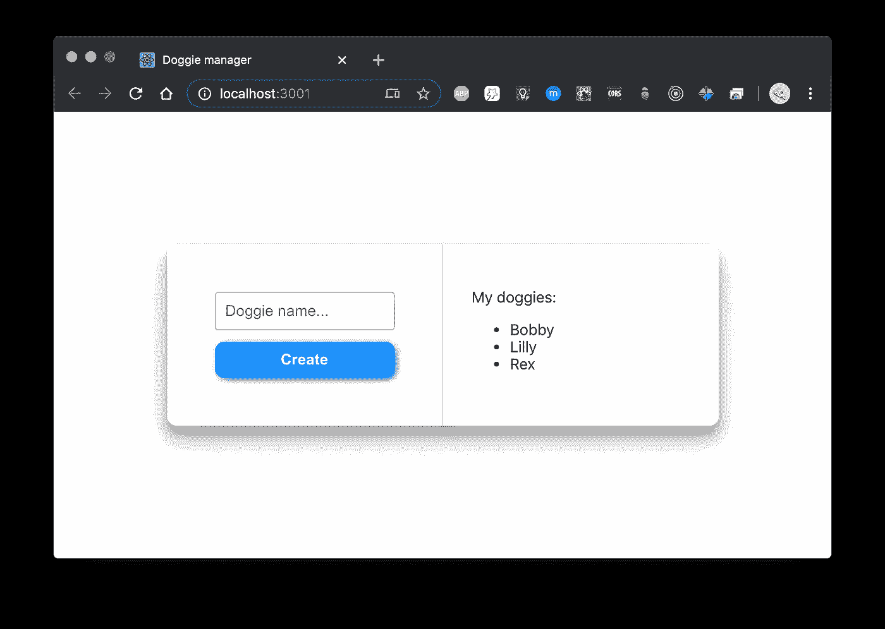

# 什么是 Axios 以及如何使用它与“反应”🚀

> 原文：<https://javascript.plainenglish.io/what-is-axios-and-how-to-use-it-with-react-1470d19e1b83?source=collection_archive---------1----------------------->

Photo by [Emile Perron](https://unsplash.com/@emilep?utm_source=medium&utm_medium=referral) on [Unsplash](https://unsplash.com?utm_source=medium&utm_medium=referral)

从事网络开发很有趣，而且很多时候都很有挑战性。

我们必须将我们的应用程序与许多外部服务集成起来。最有可能的是，当使用前端应用程序时，您必须做的事情之一是调用后端服务来获取一些数据(通过发送一个 HTTP 请求)。

**Axios** 、作为一个 HTTP 客户端库，可以帮助您发送 HTTP 请求和管理响应🔥。

# 一点历史⏳

在时代之初(嗯，实际上，在*网络开发的开始*)只有同步请求-响应模型。

每当您访问一个链接(URL)时，一个 HTTP 请求就会发送到服务器(通过您的浏览器)，服务器会返回一个 HTML 文档，其中包含用户会看到的所有内容，直到他/她导航到另一个网页。

就这样。在用户交互过程中没有更新网页，也没有在不重新加载页面或导航到另一个页面的情况下从服务器获取一些数据。

于是， **XMLHttpRequest** 诞生了🎉。

## 创建交互式、快速动态网页应用的网页开发技术

AJAX 代表**异步 Javascript 和 XML** 。如今，这是一种常见的做法，但在当时，这是一种新鲜、酷的做法🚀。

基本上，AJAX 是一种编程技术，其中网页内容异步更新，无需重新加载。

**XMLHttpRequest** 是让 AJAX 茁壮成长的技术。通过使用这个伟大的新功能，您可以调用服务器从前端获取或发送数据(使用 Javascript)，并动态更新页面内容。哇，欢迎顺畅互动！🎆

> 有了 **XMLHttpRequest** 可以获取各种资源，它不一定是 XML！(你好，JSON)

## “那个”拿取

XMLHttpRequest 走了很长一段路，它仍然是相关的。

然而，对于大多数用例来说，它太复杂和麻烦了，很难使用。这就是**取**诞生的原因。

Fetch(另一个浏览器 API)让您发送 HTTP 请求，并使用 Promises(一种处理异步行为的更现代的方法)来处理它们。

## 当前日期🌏

如今，在大多数情况下，从获取开始就可以了。

但是，为了更完整和成熟地管理 HTTP 请求，建议使用另一个 Javascript 库，这也是常见的做法。

欢迎使用 [**Axios**](https://github.com/axios/axios) ！🌠

# axis 基本 API

Axios 提供了一个非常简单的 API 来开始处理 HTTP 请求。

在上面的例子中，您可以看到一个正在发送的`HTTP GET`请求(通常用于从服务器获得数据)和一个`HTTP POST`请求，请求体描述了小狗🐶我们想要创建(通过使用一个简单的 Javascript 对象，该对象将被序列化为一个`JSON`对象)。

> Axios 假设客户机和服务器之间的通信采用 **JSON** 格式(请求和响应体)。这是可以改变的，但是可以肯定的是，在 99.9%的情况下，JSON 都是您想要的。

# 让它与 React 一起工作

说够了！让我们来看一个 React 应用程序，它利用 Axios 来获取和提交一些数据。

The app we’ll build — DoggieManager 🐕

我们将看到一个简单的 React 应用程序，让我们可视化并添加一只新的狗。

你可以在 GitHub 右边的[这里](https://github.com/adamkss/react-with-axios)找到这个项目。

## 安装 Axios

引导 React 应用程序后(通过使用 Create React App、Next.js 或任何您喜欢的方式)，您可以使用您最喜欢的包管理器轻松添加 Axios 库——我在这里使用的是`npm`:

`npm install —-save axios`

这将在您的`node_modules`文件夹中安装 Axios，并将其添加到`package.json`中，因此它被列为您的应用程序的依赖项。

酷！现在我们可以使用它了。

## 发出简单的 GET 和 POST 请求

在我们的 DoggieManager 应用程序中，我们从服务器查询 dogs 列表，并将其显示在`DogManager` functional React 组件中。

`DogManager`是一个简单的组件，它通过一个 prop 接收狗的列表，还接收一个 prop 回调函数，每当用户想要创建一只新的小狗时，它都会调用这个函数。

该组件本身不进行任何 Axios 调用。我们试图在这里做一点抽象，将实际的网络调用放在父组件`App.js`中。

`loadDogs`函数(第 12 行)调用 Axios API，该 API 向我们的狗的 URL 发送 GET 请求。然后，它用 HTTP 请求的结果设置内部组件状态的狗列表，这个结果又作为一个属性传递给`DogManager`。不错！🔥

> 这里使用了`useCallback` React 钩子，因为我们想记住`loadDogs`函数，而不是每次渲染都重新创建它。

在`App.js`的第 23 行，我们定义了一个函数，它将启动我们的 Axios POST 请求，以便将新狗的名字发送到服务器。让我们再来看看这段代码:

通过使用 Axios API，我们告诉 Axios 发送一个 HTTP POST 请求到请求体中带有`name`的`${myDogServerBaseURL}/dogs` URL。

之后，我们将设置承诺处理器:`then`用于成功的请求，而`catch`用于失败的请求。

如果请求通过并且一切正常(处理程序`then`),我们重新加载我们的狗的列表。在失败的情况下(`catch`处理程序)，我们分析服务器返回的 HTTP 状态代码。应该是`409 — Conflict`，我们知道一只同名的小狗已经在我们的名单里了。

***注意*** *:在这个例子中，我们假设前端和后端之间有某种接口契约(某种 API 文档)，这样我们就知道状态码* `*409*` *在我们的 DogManager 上下文中意味着什么。*

太好了！现在我们已经看到了一个简单的请求和响应处理是什么样子的！💪

## 使用异步/等待

在上面所有的例子中，我们使用了承诺来处理异步 HTTP 响应。

让我们看看如何利用 async/await 使我们的代码(可能)更简洁、可读性更强。

另外，你可以在 DoggieManager 项目的 GitHub 页面上查看`async-await` [分支。](https://github.com/adamkss/react-with-axios/tree/async-await)

好了，让我们去掉一些回调！

下面是用 async-await 重写的`loadDogs`函数:

如您所见，我们正在等待请求完成，然后处理结果。

好吧，但是有错误的情况呢？让我们重写添加新小狗的函数:

这里我们也处理一个不成功的请求(只要 HTTP 响应状态代码不在 2xx 区域内)。

在这个场景中使用 async-await 也非常简单。我们通过`try-catch`捕捉错误，并以与之前相同的方式继续🎆。

## 配置 Axios

Axios 也非常容易配置。

您很可能不希望每次请求基本 URL 时都要重新键入。没问题，Axios 会帮你搞定。您可以很容易地全局设置基本 URL，或者通过创建一个 Axios“实例”来设置。

想要为每个请求设置标题吗？当您必须为 oAuth 方案/安全性发送一个`Authorization`头时，这很方便。

# 其他很酷的 Axios 事实

这个小巧的库的以下功能也值得了解:

1.  嘿，它也能在**服务器端**上工作！是的，不需要浏览器环境。因此，你也可以在你的节点应用中使用 Axios。
2.  Axios 具有**拦截器**的功能。您可以在回调(`then` / `catch`)处理请求之前拦截它们。在会话过期的情况下，如果您得到一个`440-Login Time-out` HTTP 状态码，想要总是重定向用户到登录页面吗？简单，设置拦截器🔎。
3.  监控上传和下载进度很容易，只需在请求配置中设置一个回调:

4.可以取消请求！非常适合处理快速的事情，比如实时服务器查询搜索字段。

# 最后

感谢您从头到尾阅读这篇文章！你真棒🚀。

如果你还没有尝试过 Axios，那就试试吧，它会让你的生活变得更轻松，也会让你在专业上成长为一名开发者。

干杯！

## **用简单英语写的 JavaScript**

喜欢这篇文章吗？如果有，通过 [**订阅我们的 YouTube 频道**](https://www.youtube.com/channel/UCtipWUghju290NWcn8jhyAw) **获取更多类似内容！**