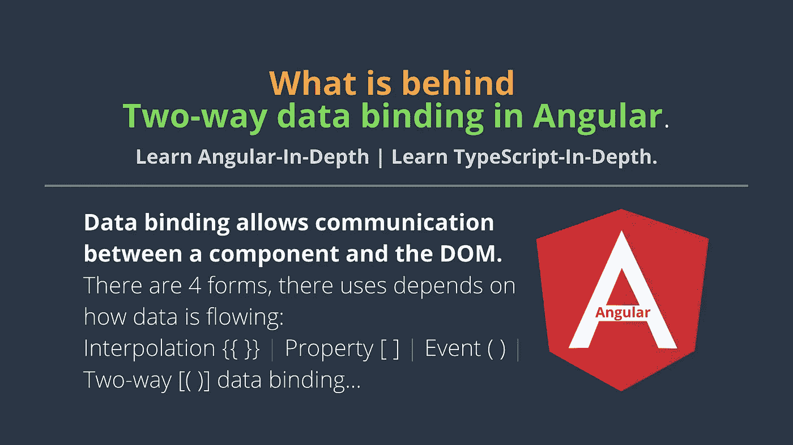
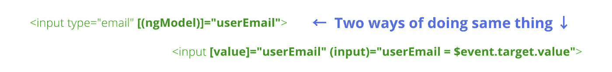
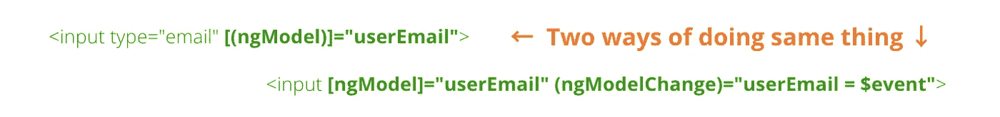

# Angular 中双向数据绑定的背后是什么？

> 原文：<https://javascript.plainenglish.io/what-is-behind-two-way-data-binding-in-angular-36dfe310b539?source=collection_archive---------0----------------------->

数据绑定允许组件和 DOM (HTML 模板)之间的通信。数据绑定有四种形式，它们的用途取决于数据的流动方式。

[](https://medium.com/codechintan/everything-you-need-to-know-about-angular-framework-typescript-10049b858ae0) [## 关于 Angular framework/TypeScript 你需要知道的一切。

### 完整的角度系列-什么是角度/类型脚本？|为什么我们需要有棱角？|使用 Angular 的好处？|…

medium.com](https://medium.com/codechintan/everything-you-need-to-know-about-angular-framework-typescript-10049b858ae0) 

# #1 插值:{{ value }}

插值允许我们从组件到 DOM (HTML 模板)显示属性(变量)的值。

```
<li>Name: {{ userName }}</li><li>Email: {{ userEmail }}</li>
```

# #2 属性绑定:[属性]= "值"

属性绑定允许我们将变量的值从组件传递到指定的属性——在这里，术语属性意味着简单的 html 属性:

```
<input type="email" [value]="userEmail">
```

在这个 example☝️中，`type`和`value`是一个`<input>`标签的属性。

再举两个属性绑定的例子:
1。应用于背景色的。
2。第二个应用于类名，如果`isSelected`评估为真。

# #3 事件绑定:(事件)=“函数”

当事件发生时(例如: *click* ， *change* ， *keyup* )，从 DOM 中调用组件的指定方法。

```
<button (click)="registerUser()"></button>
```

在这个 example☝️中，当按钮被点击时，组件的`registerUser()`方法将被调用——因为按钮有`(click)`事件。

# **#4 双向数据绑定:[(ngModel)]="value"**

盒子里的香蕉语法[( )]
*其中盒子是→ [ ]
*其中香蕉是→()

双向数据绑定允许数据双向流动。
在这个例子中↓

```
<input type="email" [(ngModel)]="userEmail">
```

*   数据属性`userEmail`(在组件中定义)被用作输入标签的值。
*   (反过来)→但是如果用户改变输入的值(通过在输入域中键入)，组件属性`userEmail`(在组件中定义)将自动更新。
*   意味着来自组件→的属性值更改将更新到输入。并且从输入→的改变将被更新到组件属性。

# 到目前为止，我们已经看到了使用 ngModel 的‘双向数据绑定’。

```
<input type="email" [(ngModel)]="userEmail"> <p>Hello {{userEmail}}!</p>
```

# 这一切是如何运作的？

Angular 中的双向数据绑定，使用[(ngModel)]可以分解为两个步骤→ `Property binding`和`Event binding`。

> 实际上不存在双向数据绑定这种东西。
> 
> 即使没有“ngModel”指令，我们也可以轻松实现双向数据绑定。
> 
> 是的有可能，看这个例子↓



# 让我们仔细看看这里发生了什么:
(我们正在分解上面的代码)

*   **[value]="userEmail"** —将表达式`userEmail`绑定到 input 元素的`value`属性。看到区别了吗↓
*   ↓在 value 属性中添加框[ ]之前。
    `<input value="userEmail">` **←** 这里的`value`是一个属性，实际上有它的 value="userEmail "。
*   ↓在 value 属性中添加框[ ]后。
    `<input [value]="userEmail">`**↓**这里的`[value]`是一个以‘user email’为表达式(不是值)的属性，意思是‘user email’本身就是一个有值的变量。
*   **(input)="expression"** —是一种将“事件表达式”绑定到`input`元素的声明方式。看到这个↓
*   在将 banana()添加到输入属性↓
    `<input [value]="userEmail" input="Its of No Use">`**↓**之前，此`input`属性对其普通属性没有任何用处。
*   将 banana()添加到输入属性↓
    `<input (input)="userEmail == $event.target.value">`**↓**后，banana 中的这个`(input)`属性非常有用，它总是从`$event.target`中取值并赋值给`userEmail`。意味着变量`userEmail`将具有我们在`<input>`标签中输入的值。
*   **user email = $ event . target . value**—当`input`事件被触发时，即当我们在`<input>`标签中输入值时，该表达式被执行。
*   **$event** —是 Angular 在事件绑定中公开的表达式，它具有事件有效负载的值。

**现在，`input`事件的有效载荷**是多少？这是一个[输入事件对象](https://developer.mozilla.org/en-US/docs/Web/Events/input)。
`**$event**` 带有一个`target`属性，从中我们可以得到输入的实际`value`。比如`**$event.target.value**`

当一个`[<input>](https://developer.mozilla.org/en-US/docs/Web/HTML/Element/input)`、`[<select>](https://developer.mozilla.org/en-US/docs/Web/HTML/Element/select)`或`[<textarea>](https://developer.mozilla.org/en-US/docs/Web/HTML/Element/textarea)`元素的`value`被改变时，触发`**input**`事件。

# 对“ngModel”的理解

实际上`ngModel`也带有`property`和`event`绑定。下面是我们使用`ngModel` ↓

```
<input [ngModel]="userEmail" (ngModelChange)="userEmail = $event"><p>Hello {{userEmail}}!</p>
```

这就是我们使用 box [ ]和 banana()的原因，banana()是具有 event()绑定的属性[ ]。看下面↓同样的双向数据绑定的代码。
在这种情况下，不需要`(ngModelChange)`。

```
<input [(ngModel)]="userEmail"> <p>Hello {{userEmail}}!</p>
```



# 结论

**#1** 插值:**{ { value } }**
**# 2**属性绑定:**【Property】= " value "**
**# 3**事件绑定:**(Event)= " function "**
**# 4**双向数据绑定: **[(ngModel)]="value"**

👉 **#4 = #2 + #3** 👈

# 搞定了。🤩理解 Angular 中的双向数据绑定’就是这么简单。

再见👋👋

> 请在评论框中随意评论…如果我错过了什么，或者什么是不正确的，或者什么对你不起作用:)
> 
> 更多文章敬请关注:
> [https://medium.com/@AnkitMaheshwariIn](https://medium.com/@AnkitMaheshwariIn)

如果你不介意给它一些掌声👏 👏既然有帮助，我会非常感谢:)帮助别人找到这篇文章，所以它可以帮助他们！

永远鼓掌…


*最初发表于 2020 年 1 月 2 日*[*https://www.codewithchintan.com*](https://www.codewithchintan.com/two-way-data-binding-in-angular/)*。*

# 了解更多信息

[](https://www.codewithchintan.com/crud-in-firebase-with-firestore/) [## 如何用 Firestore 在 Firebase 中进行 CRUD 与查询操作？(角形/离子形/网状)

### 额外收获:你将学会创建角度模型、服务和组件]。CRUD -创建、读取、更新、删除操作在…

www.codewithchintan.com](https://www.codewithchintan.com/crud-in-firebase-with-firestore/) [](https://www.codewithchintan.com/javascript-callbacks-promises-async-await/) [## 使用' Promises' | Async/Await |代替 JavaScript 回调。

### 我们应该使用允许我们访问异步方法并将值返回给同步方法的承诺。还有…

www.codewithchintan.com](https://www.codewithchintan.com/javascript-callbacks-promises-async-await/) [](https://www.codewithchintan.com/two-way-data-binding-in-angular/) [## Angular 中双向数据绑定的背后是什么？

### 数据绑定允许组件和 DOM (HTML 模板)之间的通信。数据绑定有四种形式…

www.codewithchintan.com](https://www.codewithchintan.com/two-way-data-binding-in-angular/) [](https://www.codewithchintan.com/angular-async-pipe/) [## Angular:使用异步管道来管理可观察的订阅并防止内存泄漏。

### Async-Pipe 是一个 Angular 内置工具，用于管理可观察订阅。我们可以轻松简化的功能…

www.codewithchintan.com](https://www.codewithchintan.com/angular-async-pipe/) [](https://www.codewithchintan.com/angular-route-guards/) [## 使用角形护线板保护角形页面。允许/拒绝/重定向。

### 路由保护是 Angular 路由器的一个重要功能，它允许或拒绝用户访问路由页面…

www.codewithchintan.com](https://www.codewithchintan.com/angular-route-guards/) [](https://www.codewithchintan.com/angular-routing/) [## 角度组件的布线|角度布线。

### 路由意味着从一个页面移动到另一个页面。角度使用户能够从一个视图导航到下一个视图…

www.codewithchintan.com](https://www.codewithchintan.com/angular-routing/)