# Angular 中的组件和模块是什么？

> 原文：<https://javascript.plainenglish.io/what-is-components-and-modules-in-angular-f473c386f717?source=collection_archive---------3----------------------->

## 什么是有角？(第 7 部分)/理解角度中分量的概念，了解角度模。

> *如果*你还没有涉及到本系列的[第 6.5 部分](https://medium.com/@AnkitMaheshwariIn/properties-and-modules-in-typescript-angular-a86ee23f12aa)，我推荐你查看这个链接→[TypeScript/Angular](https://medium.com/@AnkitMaheshwariIn/properties-and-modules-in-typescript-angular-a86ee23f12aa)中的属性和模块

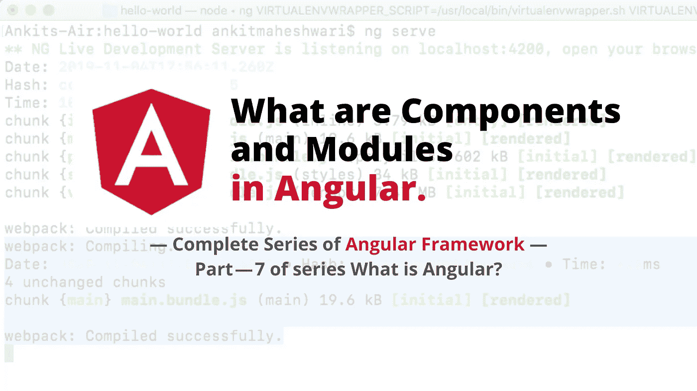

# 组件:

**组件**是 **Angular** app 最基本的 UI 构建块。一个**角度**应用包含一个**角度组件**树。

在每个角度项目中，我们可能有一个或多个组件，在大型应用中，我们有几十个组件。

```
**Component encapsulate the data, logic, and HTML for a view - means everything user sees on screen.**
```

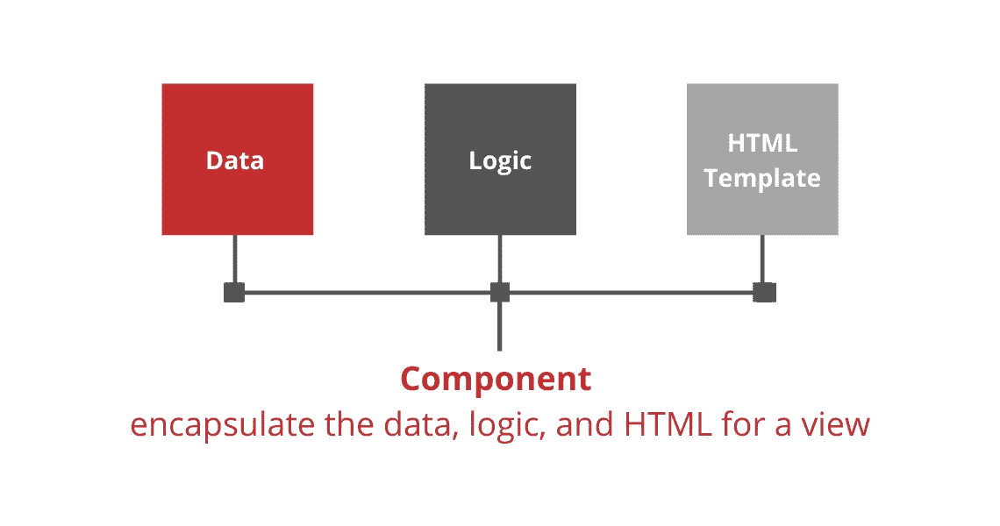

我们可以来一首单曲`Component {} for Navigation bar, Side bar and Content area`。

或者我们可以为每个区域设置单独的组件— `Nav bar component {}, Side bar component {} and Content area component {}` —即`Smaller, Maintainable and Reusable Components.`

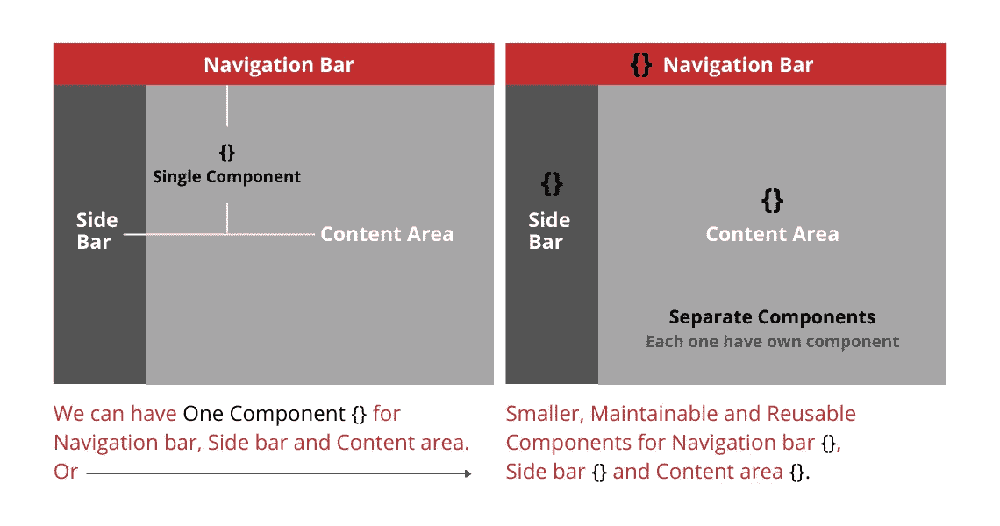

甚至我们可以将内容区域划分成许多更小的组件。看下面👇内容区域有许多组件。

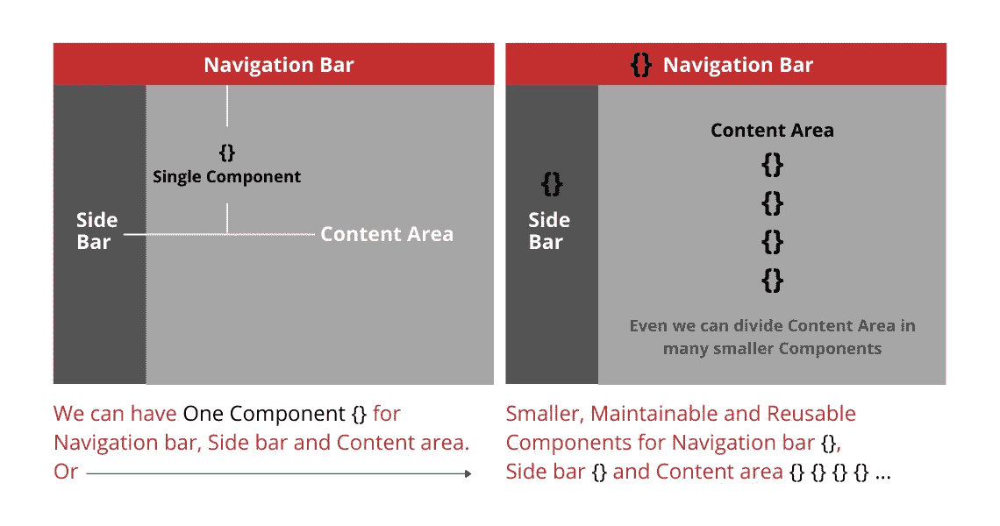

我们可以将我们的应用程序分成许多组件，以便在应用程序或其他应用程序中重用它们。在每个角度应用中，我们至少有一个组件是 App 组件或 Route 组件。从 app component 开始查看组件树下方。

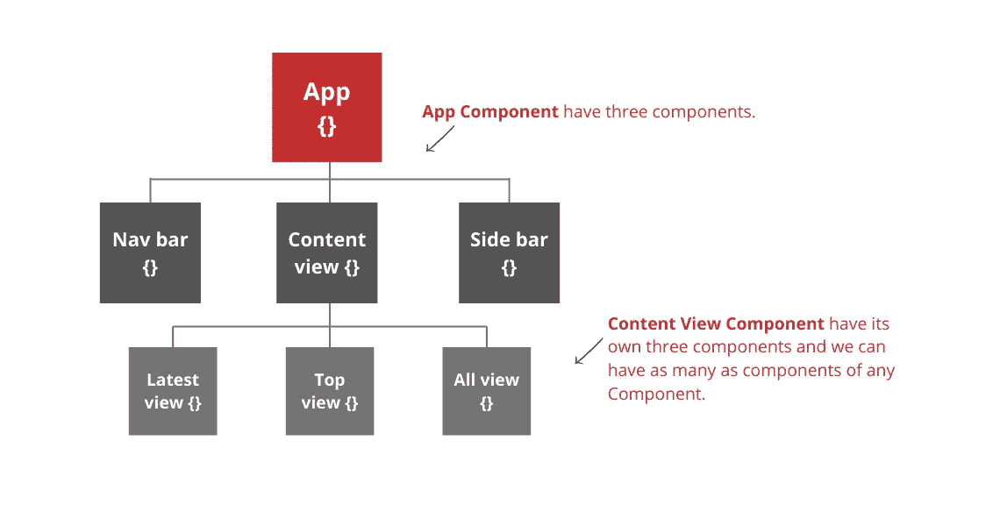

# 模块:

```
**Modules is a container for a group of related components.** Every Angular app has at least one module called App module.
```

对于较大的应用程序，我们可以将模块分解成更小、更易维护的模块。在前面的例子中，我们可以为内容区域的组件创建一个模块。

我们还可以将应用程序其他部分分解成模块。

*   `**Component encapsulate the data, logic, and HTML for a view.**`
*   `**Modules contains the group of those components which are related to each other.**`

较大的应用程序被分成不同的区域，这些区域有许多段。这里，区域是一个模块，段是组件。

> 第一件大事…

# ⭐使用组件的 3 个步骤:

*   **创建**组件。
*   **在模块中注册**一个组件。
*   在 HTML 标记中添加一个元素。

看看下面是怎么做的…

在终端中运行 `ng serve`来运行我们的 Angular app。(创建新的角度应用程序👉[点击这里](https://medium.com/@AnkitMaheshwariIn/what-angular-is-5d27bffb1fb1)

*   创建一个组件——我们将创建一个组件来显示公司列表。

在 `src/app`文件夹和 `create New File`上单击鼠标右键，组件文件的名称将会是 `companies.component.ts`，因为我们需要在这个组件中显示公司列表。

现在，**假设如果我们需要一个组件为** `**create a company**` **该组件的命名对流将是** `**companies-form.component.ts**` 或 `**companies-create.component.ts**`

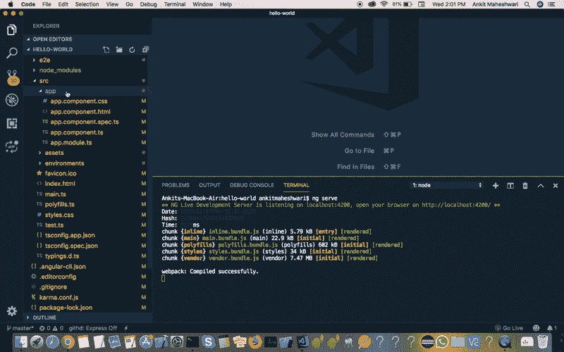

`Try this yourself`

现在，创建一个类👇

```
*// pascal naming conviction - first letter of every word of class name should be capital.
// we use suffix 'Component' with the name of class - [Companies + Component].
// export keyword is required in class - so that Angular can access the class.***export class CompaniesComponent {****}**
```

👆上面是普通的 typescript 类——不是组件。我们在普通的 typescript 类中使用 decorator，以便 Angular 可以理解它是一个组件。使其成为组件的两个步骤:

```
**(Step 1)** 1\. First we need to **import the decorator 'Component'** from '@angular/core' library.**(Step 2)** 2\. Register this component in a module (Angular application comes with app.module.ts)
```

**(如何执行步骤 1) —导入装饰器“组件”。**

```
import { Component } from "@angular/core";
```

接下来在类中应用装饰器，这被称为装饰器函数。装饰函数接受一个参数作为对象{}。我们可以在这个对象中添加一个或多个属性来告诉 Angular 这个组件是如何工作的。我们经常使用的几个属性是“选择器”、“模板”和“样式”。

组件`app.component.ts`应用于您的`index.html`中的`<my-app></my-app>`标签。如果你的`index.html`没有那个标签，Angular 会在启动时失败。你可以控制你的角度应用将发挥。检查你的`app.component.ts`文件——必须有这个代码👇

```
@Component({
  selector: 'app-root',
  templateUrl: './app.component.html',
  styleUrls: ['./app.component.css']
})
```

选择器就像 CSS 选择器。它们可以是标签选择器(比如你的`index.html`中的`<my-app></my-app>`标签)、属性选择器、类选择器、id 选择器以及它们的组合。也支持`:not(...)`。

**更简化的选择器…**

简单地说，术语选择器就是我们的视图中使用的名称，就像 html 标签一样。众所周知，Angular 是基于组件的。因此**选择器**只是在另一个组件或**的视图中提供选择器**正在调用的组件的名称，该组件在另一个组件**的指令列表中被其类名调用。请看下面的例子👇**

假设我们有一个组件`MyComponent`，它有一个名为“`mycomponent`的选择器

```
@Component({
  selector : '**mycomponent**'
  ....
})export class MyComponent { }
```

现在我们可以把这个组件用在另一个组件中，就像这样—

```
@Component({
  selector : 'anothercomponent',
  directives: [MyComponent], 
  template: '**<mycomponent></mycomponent>**'
})export class AnotherComponent { }
```

或者我们可以说`selector`是一个在视图中用作 html 标签的名字。

```
companies.component.ts 👇
```

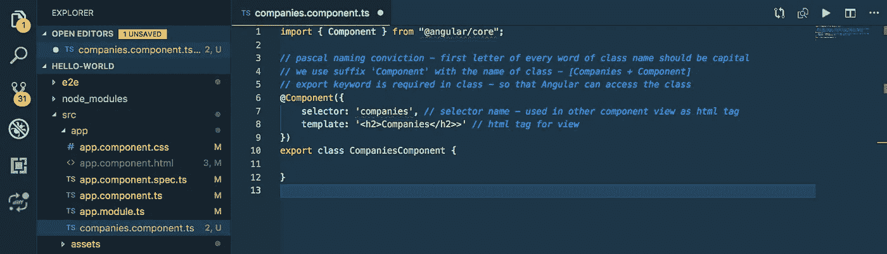

`Try this code yourself`

**(如何执行步骤 2) —在模块中注册该组件。**

```
import { CompaniesComponent } from './companies.component';
```

我们添加到`@NgModule`装饰者 **—** l *的`declarations`属性中的所有`components`在下面的第 9、10、12 行👇*

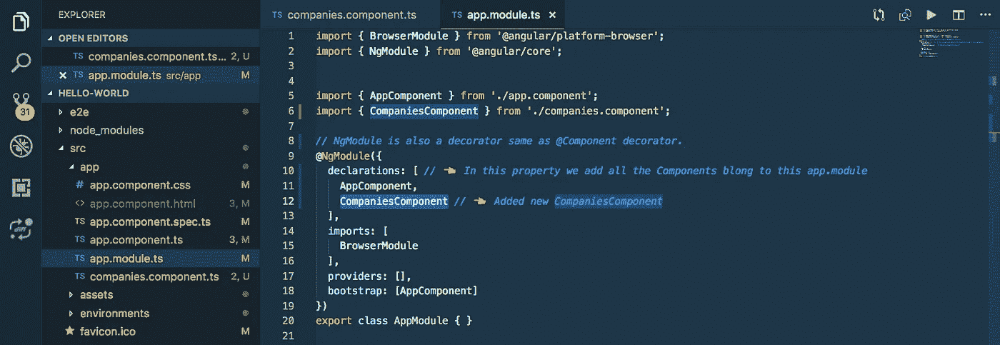

`Try this code yourself`

**使用** `**companies.component**` *👇*

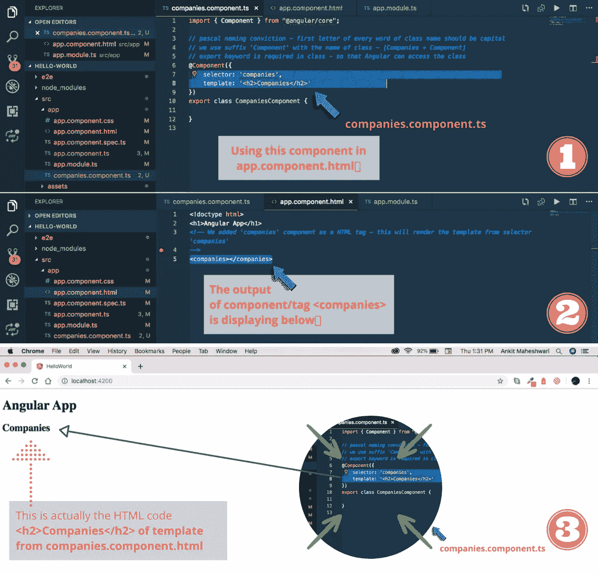

我们实际上可以通过 inspect 元素看到 HTML 页面的代码。我们可以清楚地看到这里的`<companies>`元素*👇在那个`<companies>`元素中，我们有`<h2>Companies</h2>`元素。我们在 body 元素中也有`<app-root>`元素，它包含在`index.html`中。*


我们称这些元素为自定义元素，我们应该在组件中为这些元素设置一个选择器。就像我们在 `*app.component.ts*` 中有一个 `*<app-root>*` *元素的选择器——看看 index.html(自定义元素)的第 12 行和`*app.component.ts*` *的第 4 行就是一个选择器。**

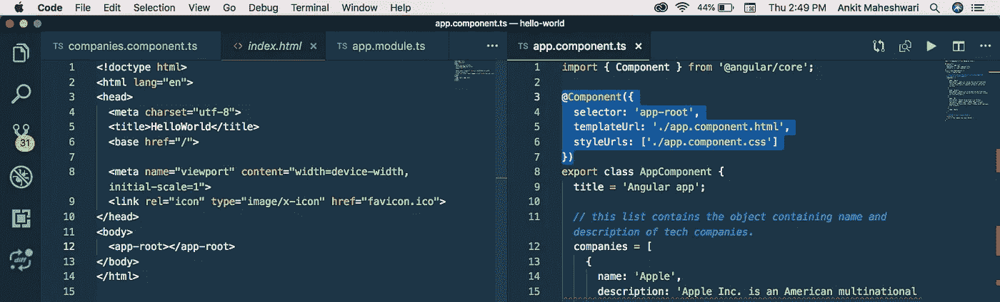

> 下一件大事…

# ⭐使用 Angular CLI 创建组件:

*使用 Angular CLI 创建组件* ***要简单可靠得多*** *。所以命令是…*

```
ng generate component <component-name>
```

或者使用缩写形式`g for generate`和`c for component`

```
ng g c <component-name>
```

示例:

`ng g c company`或 `ng generate component company`

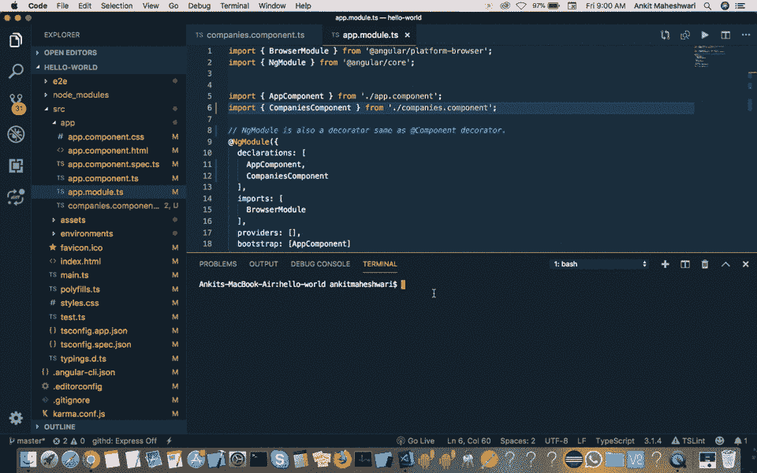

`Try this code yourself to see the output!`

看起来这个组件命令创建了 4 个文件:

*   src/app/company/**company . component . CSS**—用于存储该组件的样式。
*   src/app/company/**company.component.html**——用于存放模板。
*   src/app/company/**company . component . spec . ts**—用于编写该组件的单元测试。
*   src/app/company/**company . component . ts**—实际类组件。
*   更新 src/app/app.module.ts —这已经自动更新了 app.module.ts 并在 app.module.ts 文件*中注册了这个新组件—请看下面的第 14 行。*

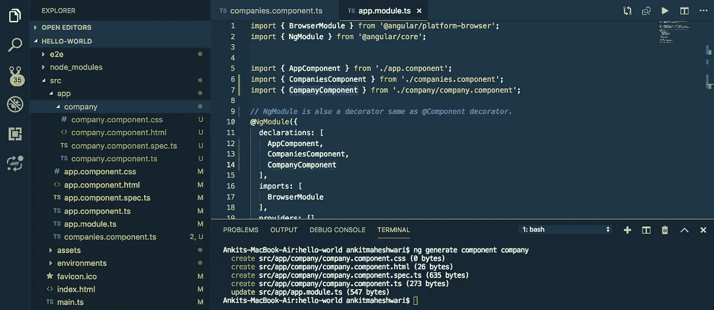

这是关于组件和模块的——下一部分见👋👋

> *如果*你还没有涉及到本系列的[第 6.5 部分](https://medium.com/@AnkitMaheshwariIn/properties-and-modules-in-typescript-angular-a86ee23f12aa)，我推荐你查看这个链接→[TypeScript/Angular](https://medium.com/@AnkitMaheshwariIn/properties-and-modules-in-typescript-angular-a86ee23f12aa)中的属性和模块
> 
> *敬请期待 Part—8* [*https://medium.com/@AnkitMaheshwariIn*](https://medium.com/@AnkitMaheshwariIn)

如果你不介意给它一些掌声👏 👏既然有帮助，我会非常感谢:)帮助别人找到这篇文章，所以它可以帮助他们！

永远鼓掌…


## 进一步阅读

[](https://bit.cloud/blog/meet-component-driven-content-applicable-composable-l24cw7ku) [## 满足组件驱动的内容:适用的、可组合的

### 自从 React 和 Angular 等技术出现以来，我们经常将术语“组件”与…

比特云](https://bit.cloud/blog/meet-component-driven-content-applicable-composable-l24cw7ku) 

*更多内容看* [***说白了就是***](https://plainenglish.io/) *。报名参加我们的* [***免费每周简讯***](http://newsletter.plainenglish.io/) *。关注我们* [***推特***](https://twitter.com/inPlainEngHQ) ， [***领英***](https://www.linkedin.com/company/inplainenglish/) ***，***[***YouTube***](https://www.youtube.com/channel/UCtipWUghju290NWcn8jhyAw)***，****[***不和谐*** *对成长黑客感兴趣？检查出*](https://discord.gg/GtDtUAvyhW) [***电路***](https://circuit.ooo/) ***。****