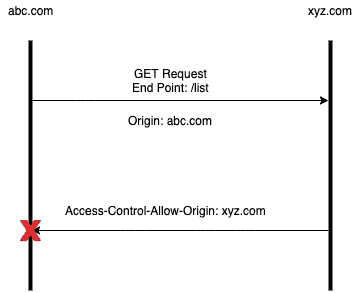
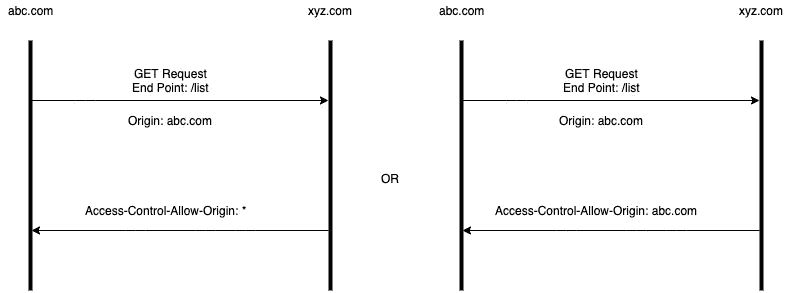
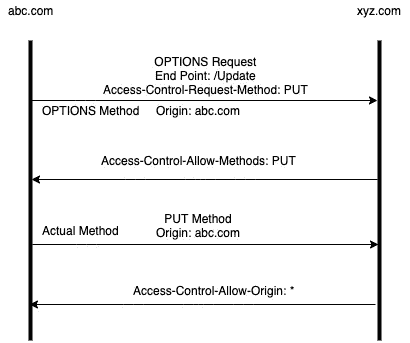
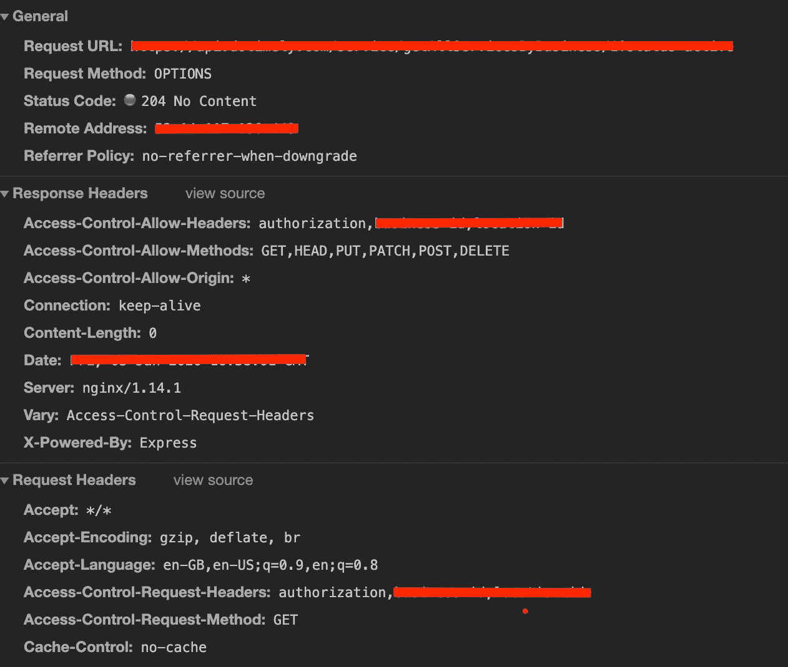

# 什么是 CORS(跨源资源共享)？

> 原文：<https://javascript.plainenglish.io/what-is-cors-cross-origin-resource-sharing-98df12d0f7db?source=collection_archive---------6----------------------->

## 跨来源资源共享指南。


Photo by [Chris Ried](https://unsplash.com/@cdr6934?utm_source=unsplash&utm_medium=referral&utm_content=creditCopyText) on [Unsplash](https://unsplash.com/s/photos/code?utm_source=unsplash&utm_medium=referral&utm_content=creditCopyText)

CORS 允许我们打破浏览器的 ***同源策略*** 。它允许从不同的来源加载资源。当 javascript 试图使用`XMLHttpRequest`或`fetch`对不同的域进行 API 调用时，这将是有用的，由于同源策略，它将被浏览器阻止。

## 什么是同源策略？

同源策略是定义来自一个源的资源如何与其他源交互的机制。默认情况下，浏览器允许从同一来源加载资源。这是出于安全目的，以减少可能的攻击。

当您从 abc.com 向 xyz.com 发出 AJAX 请求时。您一定会遇到以下错误。

```
No 'Access-Control-Allow-Origin' header is present on the requested resource
```

此错误是由于浏览器的同源策略造成的。通过使用 CORS，我们可以打破同源策略，使用来自不同域的资源。



当您从`abc.com`向`xyz.com`请求资源时，浏览器会自动在请求中添加`origin:abc.com`报头，作为响应，它会检查`Access-Control-Allow-Origin:xyz.com`报头以匹配原始报头。如果标头值不同于原始标头，它将由于浏览器上的相同原始策略而被阻止。**注意** —响应被阻塞，而不是请求被阻塞。

浏览器通过使用头`Access-Control-Allow-Origin.`来识别哪些资源可以被访问。这个头指定哪个源可以访问资源。

允许从任何来源访问— `Access-Control-Allow-Origin: *`

到特定的原点— `Access-Control-Allow-Origin: https://abc.com`

## CORS 请求类型

有两种类型的 CORS 请求:`“simple”`请求，`“preflight”`请求。浏览器会自动计算出哪个请求必须发送给服务器。通常，我们会在网络日志中看到不同种类的请求。

## 简单的请求

如果请求满足以下条件，则认为是简单请求。

1.  请求方法:`GET,POST`
2.  以下内容类型:`application/x-www-form-urlencoded`、`multipart/form-data`或`text/plain`
3.  [CORS 安全头球](https://fetch.spec.whatwg.org/#cors-safelisted-request-header)



上图显示了简单请求的请求和响应。

## 飞行前请求

在预检请求的情况下，浏览器将使用`OPTIONS`方法进行自动请求。这用于确定实际请求的确切能力。如果请求的响应表明不能发出请求，那么对服务器的实际请求将不会被执行。预检选项请求无数据。

飞行前请求自动设置几个标题，下面是几个重要的标题，

`Access-Control-Request-Method` —请求的实际方法。

`Access-Control-Request-Headers` —将随请求一起发送的自定义标题。

预检响应获得以下标题，

`Access-Control-Allow-Origin` —允许发起请求的来源。

`Access-Control-Allow-Methods` —允许发出请求的逗号分隔的 HTTP 方法。

`Access-Control-Allow-Headers` —允许在请求中设置逗号分隔的标题。

浏览器检查预检请求的响应，以决定是继续实际的请求还是放弃它。一旦飞行前请求成功，它将被视为一个简单的请求。



上图显示了预检请求情况下的请求和响应。假设网站 abc.com 想制作一个`Put Request`到 xyz.com，

1.  首先将`OPTIONS`请求发送到服务器，
2.  基于请求的响应报头

如果成功，实际的`PUT`方法将被发送到服务器。

否则，该请求将被浏览器丢弃。

## 样本飞行前请求



我希望这篇文章对你有用。非常感谢任何改进建议或反馈。

感谢阅读。