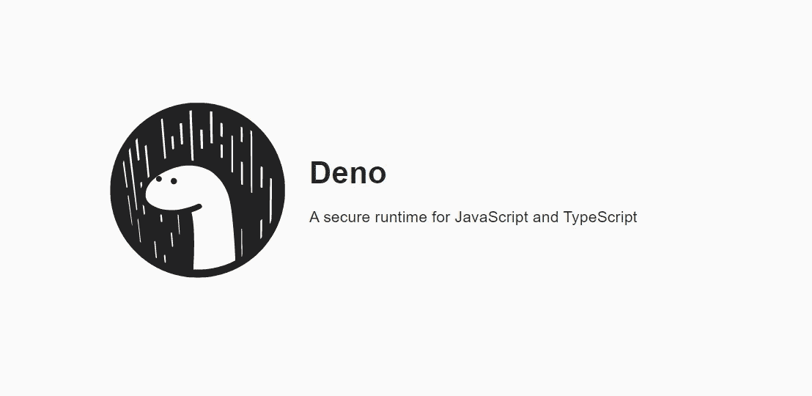
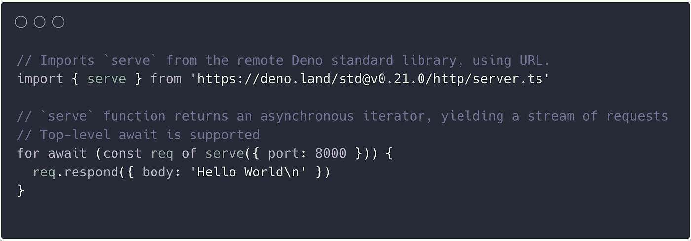

# 什么是 Deno，Node.js 现在怎么样了？

> 原文：<https://javascript.plainenglish.io/what-is-deno-and-what-happens-to-node-js-now-57aae2afa2bc?source=collection_archive---------10----------------------->

在这里，经过大量的炒作，终于有了 Deno，1.0.0 已经在 5 月 13 日发布了，在本文中，我想深入了解 Deno，并陈述一些在 Node.js 的未来可能扮演角色的有趣事实。



# 首先，什么是 Deno？

D 、 eno 是 **JavaScript** 和 **TypeScript** 的运行时，该脚本基于 **V8** JavaScript 引擎，并以 **Rust** 编程语言编写，基于 [Tokio](https://tokio.rs/) 平台(提供 JavaScript 所需的异步运行时)。

它是由 **Node.js** 的原始创建者 **Ryan Dahl** 创建的。这是达尔在 2018 年的演讲“我对 Node.js 感到遗憾的 10 件事”中宣布的，旨在解决 Node.js 中的设计问题。Deno 在一个可执行文件中明确承担了运行时和包管理器的角色，而不需要单独的包管理程序。

# Node.js 设计缺陷

根据 Dahl 的说法，Node.js 有三个主要的设计问题:

*   设计不良的模块系统，集中分布；
*   必须支持许多传统的 APIs
*   和缺乏安全。

迪诺打算解决所有三个问题…

> 考虑 Node.js API 是基于回调的这一事实也很重要，因为它是在承诺和异步/等待之前编写的。在 Node 中没有相应的改变，因为这样的改变将是巨大的，所以我们基本上坚持回调或者承诺 API 调用。

# Deno 安全执行

Deno 提高 Node.js 安全性的方式非常简单:本质上，Deno 不会让程序访问磁盘、网络、子进程或环境变量。当您需要允许这些选项时，您可以选择带有命令行标志的选项，例如`--allow-read=/tmp`或`--allow-net=google.com`。Deno 的另一个安全改进是它总是死于未捕获的错误，不像 Node.js，它允许在未捕获的错误之后继续执行，这可能会导致不可预测的结果。

下面运行一个没有任何读/写/网络权限的基本 Deno 脚本(沙箱模式):

```
deno run main.ts
```

需要显式标志来公开相应的权限:

```
deno run --allow-read --allow-net main.ts
```

除了文件系统的`--allow-write`标志之外，还有`--allow-net`、`--allow-env`和`--allow-run`标志，分别用于启用网络请求、访问环境和运行子进程。

# 为什么选择 Deno 模块？


在 Node.js 中，你使用关键字`require`加载 CommonJS 模块，它们，标准的和第三方的，都隐含地来自 npmjs.com。在 Deno 中，使用`import`关键字加载 ES 模块并显式声明 URL。例如:

```
**import** * **as** log **from** "https://deno.land/std/log/someModule.ts";
**import** { **Logger** } **from** "https://adesso.de/lib/logger.ts";
```

乍一看，您可能还记得 Node.js 导入看起来更简单，但是使用 Deno 样式有一些优点。Deno 模块可以托管在任何没有第三方模块集中存储库的地方。此外，模块总是在本地缓存和编译，除非您明确要求刷新，否则不会更新。

## 如果一个网站瘫痪了怎么办？

Deno 缓存下载的模块。由于缓存存储在我们的本地磁盘上，Deno 的创建者建议在我们的版本控制系统(即 g it)中检查它，并将其保存在存储库中。这样，即使当网站关闭时，所有的开发者仍然可以访问下载的版本。因此，只要所有的导入都被解析一次，即使你在没有连接的飞机上，你也应该能够运行已经在你的笔记本电脑上的 Deno 程序。

下面的 Deno 脚本实现了一个基本的 [**HTTP 服务器**](https://en.wikipedia.org/wiki/Web_server) **:**



Deno 包含了现代 JavaScript 的一系列新特性，比如 **promises** 或 **async iterable** 。如果这个 for 循环看起来很奇怪，那么它实际上是一个 for 循环，允许遍历无限多的传入数据和事件，以及来自服务器的无限多的传入请求。在异步函数之外使用`**await**`,也是因为我们可以使用顶级的 await，不仅可以在异步可迭代中使用，也可以在普通的承诺中使用。基本上，继续循环，直到数据源服务器说，我完成了，不会再有数据被发送，当然，在这里永远不会发生。

# 集成打字稿

如果你和我一样是 TypeScript 的狂热爱好者，那么 Deno 可以帮你搞定，不需要外部工具，默认情况下 Deno 被转换成 JavaScript。这是内部完成的，所以不需要担心。

虽然在默认情况下 Deno 负责很多事情，但是您可以使用自己的`tsconfig.json`文件来覆盖配置:

```
deno run -c tsconfig.json [your-script.ts]
```

默认配置是使用**严格**模式，因此任何不明智的编码实践都会被立即警告。

# Node.js 现在怎么样了？

好吧。Node.js 是一个巨人，被数百万人使用，存在于数百万个存储库中，是一项成熟的、得到良好支持的技术，拥有一个将会存在很长时间的伟大社区，这是毫无疑问的。

# **该不该用 Deno？**

学习新事物是困难的，但对任何开发人员来说，继续学习新事物也是必不可少的。我的建议是，如果您现在开始使用服务器端 JS，并且您还不知道 Node，并且从未编写过任何 TypeScript，那么您最好从 Node.js 开始(重要的是要考虑到您可以找到大量关于 Node.js 的学习资料和预先存在的 StackOverflow 问答)。

但是如果你已经熟悉 Node.js 和 TypeScript，我想是时候做一点小小的改变了，从长远来看，从一开始就进入 Deno 是非常有前途和有益的。

**Deno 亮点:**

*   Deno 是一个运行时，用于在浏览器外的单个可执行文件中执行 **JavaScript** 和 **TypeScript** 。
*   Deno 在默认情况下是安全的，除非明确启用，否则无法访问文件、网络或环境。
*   Deno 死于未被发现的错误。
*   Deno 中的所有异步操作都返回一个承诺。
*   Deno 脚本可以捆绑到一个 JavaScript 文件中。
*   Deno 有内置的工具，比如依赖检查器(`deno info`)和代码格式化器(`deno fmt`)。
*   Deno 提供了一组经过审计的标准模块。
*   Deno 被设计成一系列铁锈板条箱，以允许在不同的层上集成。
*   Deno 基于 JavaScript 语言的现代特性
*   Deno 有一个广泛的标准库
*   Deno 的核心是 TypeScript，这在许多不同的方面带来了巨大的优势，包括一流的 TypeScript 支持(您不必单独编译 TypeScript，它由 Deno 自动完成)
*   Deno 采用 es 模块
*   Deno 没有包管理器
*   德诺有一流的`await`
*   Deno 作为内置测试工具
*   Deno 的目标是尽可能地兼容浏览器，例如通过提供内置的`fetch`和全局的`window`对象

# 结论

Node.js 很棒，而且肯定会继续成为 JavaScript 世界的事实标准。但是很有可能我们会逐渐看到 Deno 被更多地采用，因为它有一流的类型脚本支持和现代标准库以及更多的特性。

但是老实说，作为回报，它提供的所有好的和美好的东西，将会有转移现有 npm 模块和代码库的巨大债务，我想这是迄今为止最大的限制。如何看待 **Deno** ？

和平！

# **简明英语团队的笔记**

你知道我们有四份出版物和一个 YouTube 频道吗？你可以在我们的主页 [**plainenglish.io**](https://plainenglish.io/) 找到所有这些内容——关注我们的出版物并 [**订阅我们的 YouTube 频道**](https://www.youtube.com/channel/UCtipWUghju290NWcn8jhyAw) **来表达你的爱吧！**