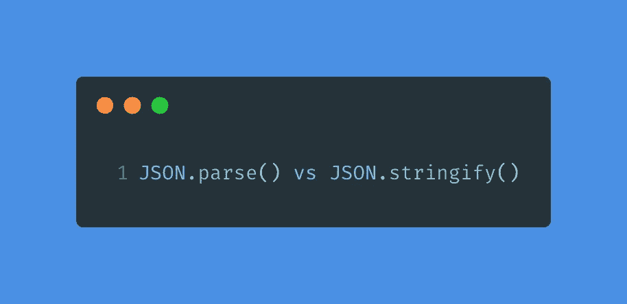
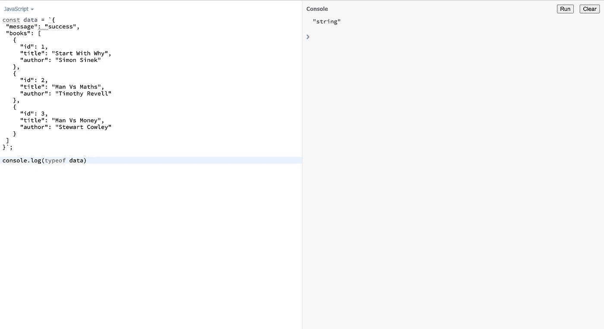
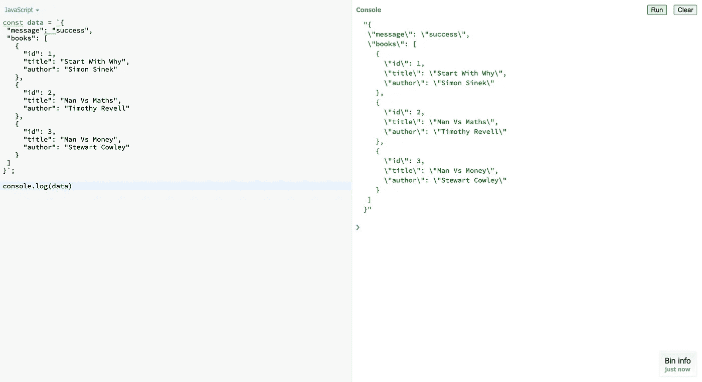

# JSON.stringify()和 JSON.parse()有什么区别？

> 原文：<https://javascript.plainenglish.io/what-is-difference-either-json-stringify-with-json-parse-e394a9ed7fc1?source=collection_archive---------9----------------------->

[https://bit.ly/344PUXd](https://bit.ly/344PUXd)

在写这篇文章的时候，我正在学习前端 web 开发的基础知识。在中间部分，我找到了关于 **JSON.parse** 和 **JSON.stringify** 方法的解释。

我有个好奇的问题:这两者有什么区别？什么时候应该使用 **JSON.parse** 函数？什么时候应该使用 **JSON.stringify** 函数？它们的使用案例是什么？还有其他方法可以破案吗？

所以…

## **JSON . parse()是什么？**

简言之， **JSON.parse()** 将一串 JSON 文本转换成一个 JavaScript 对象。在我看来，这个函数会在我从某处获取数据时使用。我必须先更改它，然后才能在 JavaScript 语法中使用它。答对了。您可以处理全部内容，也可以只处理您需要的部分内容。我从黛比·奥布莱恩那里找到了一个很好的解释。她说，

> **“当我们从 web 服务器接收数据时，数据总是一个字符串。我们使用 JSON.parse()解析数据，然后将数据转换成 JavaScript 对象。在解析它之前，它只是一个字符串，只是一些文本，你不能访问其中编码的数据。解析之后，它就变成了一个 JavaScript 对象，你就可以访问数据了。”**

谢谢你帮助我。

让我在下面的例子中展示给你看。假设我从服务器上的数据库中获取数据。我只想展示整个列表中的 3 个。数据是关于我读过的书单。代码是...

如果您从控制台中的**数据**变量开始复制代码，并在`parse`变量之前停止，或者您打开 [jsbin](https://jsbin.com) 、并控制台中的**数据**，您将看到类型为**字符串**作为输出。

看看吧…

你可以看到结果是里面的字符串集合。

## **JSON . stringify()是什么？**

然后 JSON.stringify 函数是什么？这与使用 JSON.parse 函数相反。如果您从某个地方获得结果时使用了它(JSON . parse)——比方说从服务器，您必须将 JSON 字符串文本转换为 JavaScript 对象。关键是，你从某个地方得到了一些东西，比如说，从服务器。这就是 JSON.parse()的定义。

但是如果你想把数据从客户机发送到服务器，你应该在把数据发送到服务器之前进行转换。

原因是如果你想发送数据到服务器，你不知道他们使用什么技术。为了确保数据正确运行和到达，您必须将其转换为 JSON 字符串。

## **结论**

因此，希望我们能够知道何时使用 JSON.parse()以及何时使用 JSON.stringify()。

这是我和我自己的一个小记录，我写的所有东西都是我个人的观点。如果出了什么问题，我很抱歉。

*别忘了关注我的* [*Beneteen*](https://www.instagram.com/beneteen/) *和*[*Pandhu wibo wo*](https://www.instagram.com/pandhu.wibowo/)*你也可以在 Twitter 上找到我*[*【Pandhu _ wibo wo*](https://twitter.com/pandhu_wibowo)

ref:
[https://www . tutorial Republic . com/JavaScript-tutorial/JavaScript-JSON-parsing . PHP](https://www.tutorialrepublic.com/javascript-tutorial/javascript-json-parsing.php)

 [## JSON 解析()

### 顾名思义，方法将 JSON 字符串表示反序列化为 JavaScript 对象。JSON 字符串是…

restfulapi.net](https://restfulapi.net/json-parse/)  [## JSON 解析 v JSON 字符串

### 我总是混淆 JSON 函数 parse 和 stringify。在准备微软证书考试的时候…

medium.com](https://medium.com/@debbie.obrien/json-parse-v-json-stringify-4b9d104c78d0)  [## JSON.parse()

### 该方法解析一个 JSON 字符串，构造由该字符串描述的 JavaScript 值或对象。可选的…

developer.mozilla.org](https://developer.mozilla.org/en-US/docs/Web/JavaScript/Reference/Global_Objects/JSON/parse) 

*更多内容请看*[***plain English . io***](http://plainenglish.io/)