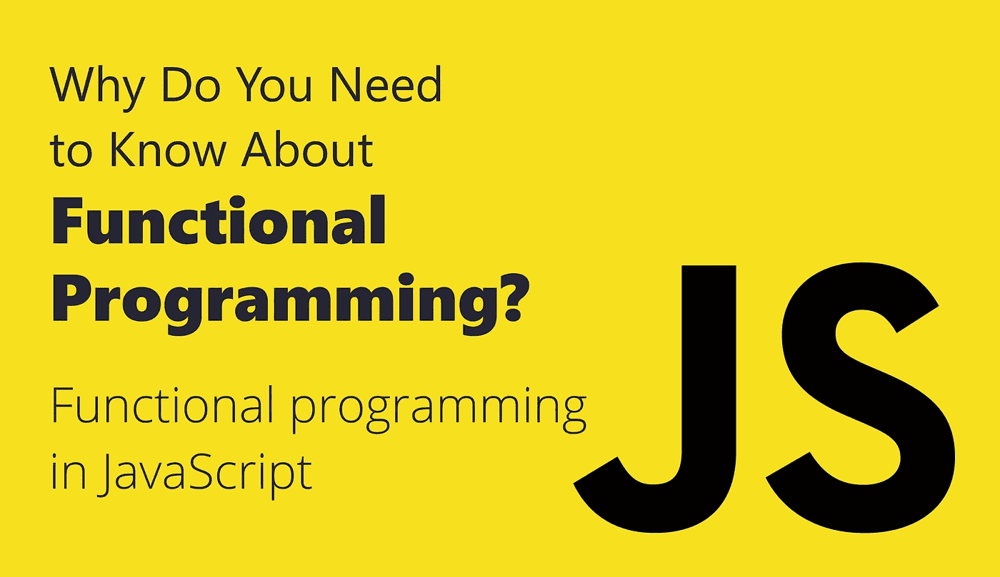
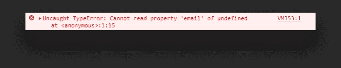

# 为什么需要了解函数式编程？

> 原文：<https://javascript.plainenglish.io/what-is-functional-programming-about-7568c66f1be5?source=collection_archive---------3----------------------->

## 简化代码的编程范例

当我刚开始学习函数式编程时，我很难理解它。我理解这个概念和主要原则，但我缺乏实践知识。在本教程中，我不仅想介绍概念，还想给你一些例子，向你展示如何在你自己的代码中应用函数式编程范式。

让我们首先从定义什么是函数式编程开始。

> 函数式编程是一种编程范式。

就像面向对象编程一样，函数式编程也有自己的概念。例如，一切都围绕着纯粹——函数总是在给定相同输入的情况下返回相同的输出。它们没有副作用，这意味着它们不会改变或弄乱其范围之外的任何数据。

它还主张不可改变——事物一旦被创造，就不能被改变。我们也可能经常听说函数式编程使用声明性方法，而不是面向对象范式也使用的命令性方法。

这些只是组成函数式编程的一些概念。但是为什么这些原则很重要呢？他们能给我们什么？

# 为什么函数式编程能让我们受益？

值得一提的是，函数式编程并不是一个新的范例。事实上，[在 20 世纪 50 年代末开发的 Lisp】功能强大。尽管如此，出于几个原因，我们今天仍能从中受益。](https://en.wikipedia.org/wiki/Lisp_(programming_language))

其中之一是它将使你的代码更容易推理。它更侧重于“*你的程序在做什么？*“而不是”*它是怎么做它的事的？*“—意味着你使用声明性的方法，而不是命令性的实现。为了演示，请看下面的两个例子。

在第一个例子中，你关注**程序如何**做它的事情，而在第二个例子中，你关注**程序正在做什么**:

## **命令式**

## **声明性**

这两个实现在做同样的事情；修改数组，使每个产品都有四舍五入的数字。对于这个小例子来说，看起来你正在编写更多的代码。但是在幕后，`map`还将返回一个全新的数组，这意味着您原来的`products`将保持完整。这就是行动中的不变性。

它也使你的代码更容易测试，因为它关注于被称为纯函数的小函数。如前所述，这些函数是确定性的。我们可以保证，如果我们继续传递相同的值，我们会得到相同的输出。

最后，函数式编程使您的代码更容易推理。它使你更容易阅读和遵循你的过程，并使你的应用程序不容易出错。如果仍然出现问题，则更容易进行故障诊断，因为您的代码更简洁。

为了演示如何在实际操作中使用函数式编程，我准备了一些代码示例，向您展示了如何声明性。

# 宣告你的意思

开始的最好方法之一是查看数组函数。高阶数组函数是函数编程方法的一个很好的例子。

## 数组函数

我有一整篇文章描述了这里提到的一些数组方法，您可以在下面的链接中查看:

 [## 每周网络提示

### 查找，一些，映射，减少，每个，过滤数组无处不在。从简单的矩阵到复杂的对象列表…

webtips.dev](https://www.webtips.dev/the-power-of-higher-order-array-functions) 

但是让我们快速浏览一些更重要的代码，看看它们是做什么的，以及它们是如何缩短我们的代码以使它更易读的。

**array . prototype . find** *用于查找通过测试的特定元素，返回第一个匹配项*

**array . prototype . filter** *用于返回通过测试的元素，返回所有匹配的*

**Array.prototype .凡** *若各元素符合条件，则返回真*

**array . prototype . some** *如果至少有一个元素符合条件，则返回 true*

**array . prototype . map** *用于对数组进行变换，得到新的数组*

**array . prototype . reduce** *用于从数组中产生单个值*

您已经看到这些数组方法如何缩短我们的代码，而不是用于循环，但是我们可以通过链接它们使它们更加强大。这些函数大多返回一个数组，我们可以在这个数组上调用另一个方法，并一直进行下去，直到得到我们想要的结果。

## 功能链接

函数链是另一个伟大的概念。它使您的代码更具可重用性，减少了噪音，并创建了一个更短、更简洁的代码，既更可读，又更容易调试。

在下面的例子中，您会看到，因为每个函数调用都会返回一个数组，所以您可以继续在它们上面调用新的函数来创建一个链。

我们可以简单地一个接一个地调用函数，并在 3 行内完成，而不是使用三个不同的 for 循环来获得所需的值。

最后但并非最不重要的一点是，通过为常见问题引入帮助函数，库可以帮助您避免一遍又一遍地写下相同的东西-*和重新发明轮子*。

## 图书馆

有许多库遵循函数式编程范例。一些比较著名的是 Lodash 和 Ramda。为了让您了解两者之间的一些视觉差异，让我们来看看如何在每一个中检索嵌套属性— *这是一个常见的问题*。如果其中一个对象不存在，我们将得到一个错误消息:

假设我们有一个用户对象，我们想要获取他们的电子邮件地址:

**Lodash** *Lodash 使用下划线*

**拉姆达** *拉姆达使用* `*R*`

在每个库中，如果`email`的父库不存在，我们可以避免出错。相反，它无声地以一个`undefined`失败了。

现在你对如何更好地陈述有了更好的理解。函数式编程中还有哪些重要的概念？—它在名称中，它是函数。

# 函数式编程中的函数

函数不仅是函数式编程的重要部分，也是 JavaScript 的重要部分。它们可以帮助你将代码分解成更小、更容易理解的部分。它通过将代码分成更小的部分(通常称为组件)来增加可读性，并使代码更容易测试。

关于如何利用函数为自己谋利，有很多概念。让我们看看在函数式编程中更常见的一些定义。

## 纯函数

如前所述，纯函数不依赖于传递给它们的数据之外的任何数据。除了返回的数据之外，它们也不改变任何数据。

为了给你一个纯函数的实际例子，考虑一下`Math`对象:

在这里，`Math.random`是不纯的，因为它总是返回不同的值，即使我们向它传递相同的输入。然而,`Math.max`是一个纯函数，因为给定相同的输入，它将返回相同的输出。

我们需要注意，万一我们的函数没有返回值，它就不是纯的。

## 一流的功能

在 JavaScript 和其他函数式语言中，函数也可以赋给变量，你可以像传递变量一样传递它们。

## 高阶函数

高阶函数只不过是一个简单的函数，它接受另一个函数作为它的一个参数。返回另一个函数的函数也称为高阶函数。

高阶函数的一个很好的例子是前面讨论过的数组函数，如`filter`或`map`。

## 功能组成

功能组合就是将功能组合起来，形成全新的功能。

例如，Ramda 有一个`compose`函数，它接受一个函数列表作为参数并返回一个函数。您可以使用想要应用一系列函数的输入来调用这个函数。

## Currying

Currying 是一种用一个参数调用一系列函数而不是用多个参数调用一个函数的技术。每个函数返回另一个函数。链末端的函数返回实际的期望值。

## 递归

当一个函数一直调用自己直到满足某个条件时，就会发生递归。在下面的例子中，我们从 100 开始倒数。

指定退出条件很重要，否则你会创建一个无限循环，最终导致浏览器崩溃。

现在，如果你觉得你开始被大量的信息淹没，不要担心，这是一个好迹象，意味着你正在扩大你的知识。我们只需要介绍两个更重要的概念。它们携手并进。它们是不变性和副作用。

# 不变

当我们谈论不可变的变量和对象时，我们仅仅意味着一旦声明，它们的值就不能被改变。这可以降低代码的复杂性，并使您的实现不容易出错。

为了通过一个例子来演示不变性，假设您有一个数组，您需要删除其中的第一项。看看下面的区别:

在第一个例子中，我们用`shift`函数修改了原始数组。如果我们想达到同样的效果，但保持原始数组不变，我们可以使用 slice。这样，您可以避免在应用程序中出现不可预见的错误，即您无意中修改了应该保持原始状态的数据。

不变性的一个缺点是性能。如果你创建了太多的副本，你将会遇到内存问题，所以如果你操作一个大的数据集，你需要考虑性能。

# 有什么副作用？

我们还需要讨论副作用，不是因为它们是函数式编程范例的一部分，而是因为无论您采用何种编程模式，它们都会发生。它们是任何项目的重要组成部分，你需要知道它们发生的时间和原因。

那么副作用是什么呢？—当函数不纯时，可能会产生副作用，因此在给定相同输入的情况下，它不一定会返回相同的输出。一个常见的例子是网络请求。无论是什么输入，都可以得到从 200 *(OK)* 到 500 *(内部服务器错误)*的任何东西。

所以你无法避免副作用，你的目标不应该是完全消除副作用，而是要有意识地消除副作用。仔细思考它们发生的原因和时间。

# 摘要

函数式编程是更好地组织代码的好方法。还有其他编程范例，比如面向对象编程。那么应该用什么，哪个更好呢？

真的没有答案，这取决于你的情况，没有谁高于谁。您还可以将多个范例结合在一起，这样就不会“非此即彼”。

感谢您花时间阅读本文，编码快乐！

