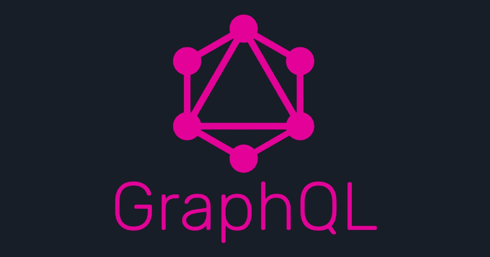

# GraphQL 是什么？

> 原文：<https://javascript.plainenglish.io/what-is-graphql-375f8f2c227f?source=collection_archive---------8----------------------->

## 创建 API 的新方法



官网是这样说的:

> GraphQL 是一种用于 API 的查询语言。

这到底是什么意思？

为此，我们需要知道什么是 API。如果你已经知道这一点，请随意跳过。

简单来说，API 是应用程序前端和后端之间的链接。每当页面请求数据时，它调用一个 API 来传递它所请求的数据。然后，API 将数据带回前端进行显示。

> 我们以 Trivago 为例，它是一个酒店预订网站。当你查找一家酒店时，它从所有不同的酒店预订网站收集数据，并将所有数据带到它自己的**前端**进行显示。它不从这些网站带来模板，并按原样显示，而只是显示数据。这是 API 的核心。

> API 只是向前端返回信息而不是模板。

## **一个 API 有哪些用例？**

1.  我们如何将 Vue.js 这样的前端框架与 Laravel 这样的后端框架一起使用，并且仍然使用 SPAs 的功能？*答案是使用 API* 。
2.  另一个用例是当您的后端需要服务许多不同的应用程序时。比方说，你有一个 iOS 应用，一个 Android 应用和一个网页。您将希望为这个场景使用一个 API，因为您不希望创建三个相似的后端来服务三个不同的平台。

> 好了，这是对 API 的简单介绍。现在回到 GraphQL。

现在，创建 API 的主要方式之一是使用 RESTful 方法，正如您所猜测的，构建的 API 被称为 REST APIs。当然，另一种方法是使用 GraphQL。

我们来看一个场景。我们必须创建一个类似于脸书的新闻源。如果你不知道什么是新闻订阅，它就是你登录脸书时看到的页面。它有各种各样的邮件。这很复杂，但对于我们的情况，让我们把它变得简单一些。

假设每个提要(或帖子)都有一个作者和提要的内容。我们如何提取存储在后端的所有信息，并在前端显示出来？ ***这里我不想采用更传统的方法，后端和前端是一个整体。这意味着你可能没有使用任何 API。***

## **第一种方法——使用 REST**

比方说，我们的 REST API 有两个路由或端点

1.  **/authors** :这个路径返回我的数据库中的所有作者。
2.  **/{authorname}/stories** :该路由返回名字为 authorname 的作者的所有故事。

> *如果你不知道什么是*终点*，它只是一个对*路线的花哨称呼。

要填充我们的新闻提要，我们必须首先点击(或转到)authors 端点(/authors)。这会给我们所有的作者。现在，对于每个作者，我们必须达到 stories 端点(/{authorname}/stories)。

如果您明智地考虑，每次用户加载新闻提要时都会有很多请求。这仍然是一个非常简单的场景。

> 一种解决方案是创建一个专用的路由或端点(/newsfeed)，但是这种解决方案有自己的注意事项。我不会在这里谈论这个。

这个问题的解决方法是什么？GraphQL 前来救援。

## 第二种方法—使用 GraphQL

我们又想做同样的事情，因为，为什么不呢？GraphQL 如何帮助降低请求的数量？

这里我们不需要创建两个独立的端点。此外，我们根本不需要调用这些端点。

GraphQL 总是命中单个端点(/graphql)。马上就会有明显的好处。此端点不是由您定义的，而是默认情况下存在的。

现在重要的问题是，GraphQL 如何从单个端点请求所有这些信息？为此，GraphQL 使用了一种叫做查询的东西。对上述内容的查询如下所示

## 询问

```
query{
    authors{
        stories{
            name 
            content
        }
    }
}
```

在后端，我们制作一个模式，而不是一个端点列表。这个查询寻找写在模式上的特定点。通过这样做，它知道返回什么，并且返回的格式与查询的格式完全相同。

因此，我们正在呼叫所有作者，对于每个作者，我们请求他/她的故事，对于每个故事，我们请求故事的名称和内容。是不是简单优雅？这就是 GraphQL 的强大之处。

如果你仔细看了，上面的查询指定了它需要什么信息。在 RESTful 方法中，您不能这样做。你的申请总是会被你不需要的信息弄脏。当然，GraphQL 不仅仅是这些。

## 变化

突变类似于查询，但是我们不是从后端请求数据，而是将数据发送到后端。例如，在脸书上注册用户时，我们会做一个突变。

```
mutation{
    createUser( 
        username: "myusername"
        password: "mypassword"
        email: "myemail@example.com"
    )
}user{
    username
}
```

在这里，我们用用户提供的用户名、密码和电子邮件地址注册了一个用户。这些是我们给函数 createUser()的参数。这个函数是在模式中定义的，所以 GraphQL 非常清楚如何使用它。后面的部分是变异会把我们带回来。在这种情况下，它返回用户及其用户名。如果您已经在模式中定义了可调用性，那么您还可以请求他的电子邮件和密码。

## 与休息相似

> REST 中的 **GET** 可以比作 GraphQL 中的**查询**。
> 
> REST 中的 **POST** 可以比作 GraphQL 中的**突变**。

我建议你浏览一下官方文档，在 YouTube 上寻找 GraphQL。

这是我对 GraphQL 的一点介绍(或者你可以说是初学者的视角)。一定要去 GraphQL 的官网结账。

[](https://graphql.org/) [## GraphQL:一种 API 查询语言。

### 学习准则社区规范行为准则基金会景观学习准则社区规范行为准则基金会…

graphql.org](https://graphql.org/) 

我用 Vue + Laravel + GraphQL 创建了一个开源项目。如果你想知道更多关于集成或项目的任何其他细节，让我知道。想看项目，这里有链接。

 [## 流动

### 编辑描述

flowwith.netlify.app](https://flowwith.netlify.app) 

如果你想用 GraphQL 搭配 Laravel，有一个很好的包叫 Lighthouse。这将使您在 Laravel 中使用 GraphQL 更加容易。

 [## 灯塔

### GraphQL server for Laravel 入门→使用 GraphQL 模式定义您的模式，无需任何样板文件…

lighthouse-php.com](https://lighthouse-php.com/) 

在前端你可以使用 Apollo GraphQL。如果你像我一样喜欢 Vue，这里有一个软件包可以让你更容易地使用 Apollo GraphQL。

[](https://vue-apollo.netlify.com/) [## 阿波罗万岁

### 🚀将 GraphQL 集成到您的 Vue.js 应用中！开始→不要考虑更新 UI 或重新提取查询…

vue-apollo.netlify.com](https://vue-apollo.netlify.com/) 

这里有一篇使用 Lighthouse 在 Laravel 上设置 GraphQL 服务器的文章。

[](https://www.toptal.com/graphql/laravel-graphql-server-tutorial) [## 用 Laravel 构建 GraphQL 服务器

### 如果你还不熟悉它，GraphQL 是一种用于与你的 API 交互的查询语言，它提供了…

www.toptal.com](https://www.toptal.com/graphql/laravel-graphql-server-tutorial) 

仅此而已。我希望你喜欢这个小小的介绍。再见..

## **用简单英语写的 JavaScript 笔记**

我们已经推出了三种新的出版物！请关注我们的新出版物:[**AI in Plain English**](https://medium.com/ai-in-plain-english)[**UX in Plain English**](https://medium.com/ux-in-plain-english)[**Python in Plain English**](https://medium.com/python-in-plain-english)**——谢谢，继续学习！**

**我们也一直有兴趣帮助推广高质量的内容。如果您有一篇文章想要提交给我们的任何出版物，请发送电子邮件至[**submissions @ plain English . io**](mailto:submissions@plainenglish.io)**，并附上您的 Medium 用户名，我们会将您添加为作者。另外，请让我们知道您想加入哪个/哪些出版物。****