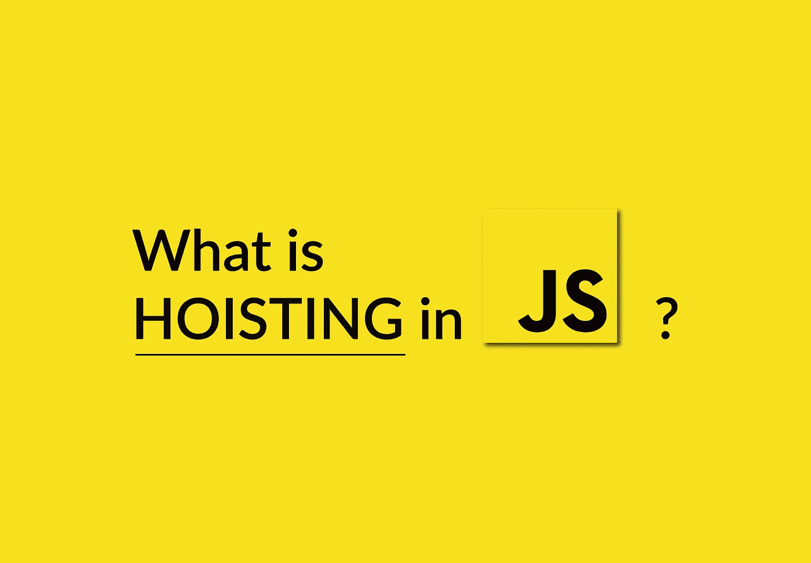
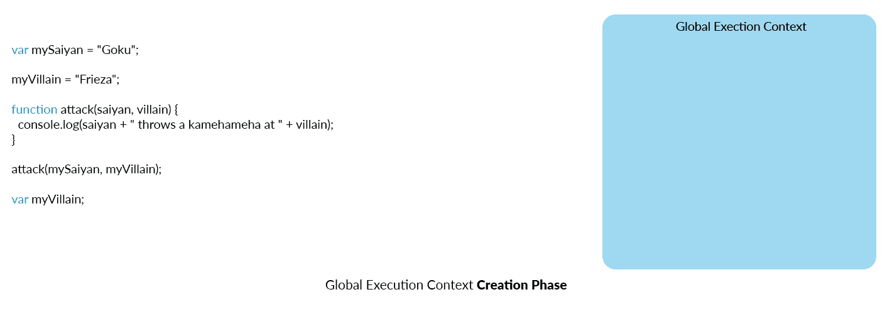
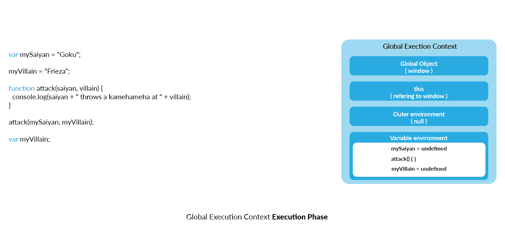

# JavaScript 中的提升是什么？

> 原文：<https://javascript.plainenglish.io/what-is-hoisting-in-javascript-7ad4f391c40e?source=collection_archive---------7----------------------->

> 对于 TL；卷轴淹死博士

提升是一个经常被误用的术语，在工作面试和技术对话中经常被抛弃，很少有人真正理解它，并抓住幕后真正发生的事情。

大多数刚接触 JavaScript 的开发人员，当被问及提升时，首先会想到 **let** vs **var** 变量，如何在声明(var)之前使用一个，而在声明(let)之前不使用另一个。他们是对的，因为在许多流行文章中发现的提升的核心定义如下:

> 提升是 JavaScript 将 var 声明移动到顶部的默认行为。

因此，在声明变量之前物理地(在我们的代码中)使用一个**变量**是可以的，但是在声明变量之前使用一个 **let** 变量(在我们的代码中)会导致错误。

嗯，不完全是…让我们倒回去看看当 JavaScript 引擎执行我们的代码时实际发生了什么。

首先让我们记住，JavaScript 中的每一行都是在执行上下文中运行的(如果代码在函数中，则是函数执行上下文，否则是全局执行上下文)。

因此，当 JavaScript 引擎执行我们的代码时，它在两个阶段设置全局执行上下文:创建阶段和执行阶段。

**创建阶段:** JavaScript 将创建全局对象(窗口，因为我们在全局级别)、用于访问全局对象的 this 变量和外部环境(将为 **null** ，因为我们在全局级别)…

然后，它将为所有变量和函数设置内存空间，或者简称为“**提升**”！JavaScript 引擎将通读我们的代码，每次在全局级别找到变量声明时，它将在内存中为它保留一个空间，将其值设置为 **undefined** ，每次找到函数声明时，它将在内存中为它保留一个空间，并完全分配它。

**执行阶段:**在使用变量环境创建了全局上下文之后，JavaScript 引擎开始逐行执行我们的代码。因此，当 JavaScript 引擎在执行阶段到达我们示例中的第二行时，它已经知道我们已经为值为 **undefined** 的**my village**变量分配了一个空间，这意味着为变量分配一个新值是完全正确的，并且不会抛出错误(你知道…因为变量已经在变量环境中定义了！).

函数也是如此，因为它们已经在变量环境中声明了，所以在代码中物理声明函数之前先调用它是没问题的，假设我们使用函数语句来声明它(稍后会详细介绍)。

> ***因此，提升简单来说就是在执行上下文的创建过程中，为变量和函数分配内存空间。***

但是等等……那么 **let** 宣言呢？既然 JavaScript 引擎抛出一个错误，如果我们试图在声明之前使用它，这是否意味着提升不包括 **let** 声明？

答案是:不会。就像 **var** 一样， **let** 声明也**在创建执行上下文的过程中被提升。我们只是在声明 **let** 变量的代码中，没有****允许**使用它们。它仍然存在于内存中，我们只是不允许使用它！所以不用，对于**功能**、**变量**、**让**和**常量**声明，提升工作是一样的。****

**以下是一些例子:**

**现在你已经掌握了提升的概念，理解了实际发生的事情，并且代码不会“*神奇地*”移动到顶部，我有一个小测验给你(对一些人来说是基本的，但对另一些人来说是棘手的)。**

**以下结果会是什么:**

**没错，抛出一个错误。但这是为什么呢？为什么下面的代码运行良好:**

**这是因为，在我们的第一个例子中，我们使用了一个函数表达式，而不是第二个例子中的函数语句(这两个术语值得另文讨论)。现在只要记住函数表达式创建一个对象并将其返回给一个**变量**，函数语句在内存中创建一个函数并不返回值。**

**所以在第一个例子中，在提升时，JavaScript 引擎会在内存中为**攻击**设置一个空间作为**变量**，并将其值设置为**未定义**，这是 JavaScript 的正常行为。记得吗？在执行上下文的创建阶段，内存空间中的每个**变量**、 **let** 和**常量**都被设置为**未定义**。**

**如果我们看看抛出的错误“*未捕获类型错误:攻击不是函数*”，它是非常不言自明的:攻击不是函数，仅仅因为它是**未定义的**。这是 JavaScript 引擎在执行阶段在其可变环境中寻找**攻击**时得到的值。**

**然而，在第二个例子中，我们使用了一个函数语句，它不会将对象返回给变量，而是在内存中创建函数。因此，JavaScript 引擎将把它提升为一个函数，可以在声明之前调用。**

# ****TL；DR****

**1- **提升**意味着在创建执行上下文期间为变量和函数分配内存空间。变量以值的形式给出**未定义**。**

**2-所有变量声明: **var** 、 **let** 和 **const** 均以吊装为准**

**3-我们不允许使用**让**和**在物理上符合代码中声明的行之前常量**变量。即使它们确实存在于内存中并且被设置为**未定义**。**

**4-当使用函数表达式时，我们创建一个返回变量的对象，它将被视为……嗯，一个变量。即被吊起，给定值**未定义**。换句话说:如果声明为函数表达式，就不能在声明之前使用函数。**

**5-另一方面，当使用函数语句时，函数在内存中被完全分配，并且它可以在我们的代码中在声明之前被调用。**

**6-是的，在 JavaScript 中，函数就是对象。**

**Kaoutar LAGDANI**

** [## Kaoutar Lagdani | Fullstack 开发人员

### Kaoutar Lagdani 个人网站

lagdani.com](http://lagdani.com) 

## **简明英语团队备注**

你知道我们有四种出版物吗？给他们一个如下的提示来表达爱意:**、[**AI**、](https://medium.com/ai-in-plain-english)、[、**UX**](https://medium.com/ux-in-plain-english)、[、**Python**、](https://medium.com/python-in-plain-english)、**、**——谢谢你，继续学习吧！**

**此外，我们总是有兴趣帮助推广好的内容。如果您有一篇文章想要提交给我们的任何出版物，请发送电子邮件至[**submissions @ plain English . io**](mailto:submissions@plainenglish.io)**，附上您的媒体用户名和您感兴趣的内容，我们将会回复您！******