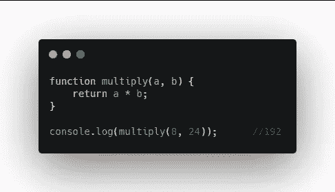
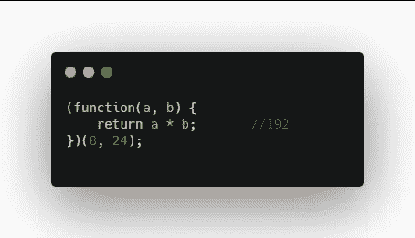
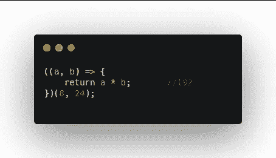
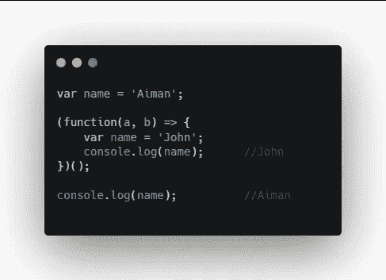
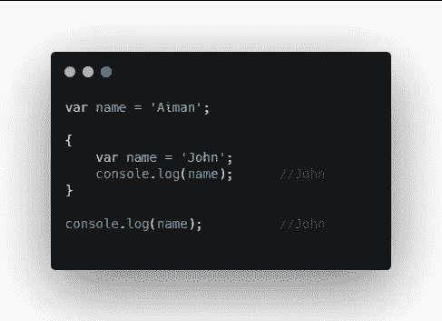
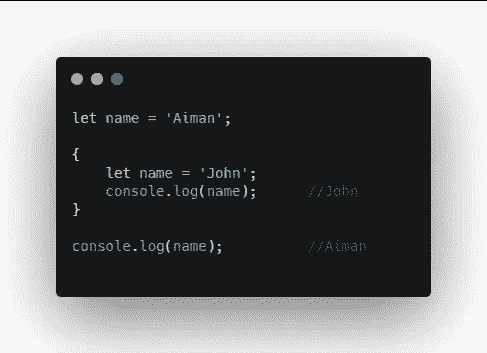

# 什么是 JavaScript IIFE？

> 原文：<https://javascript.plainenglish.io/what-is-javascript-iife-f755f899ba0c?source=collection_archive---------5----------------------->

## 立即调用的函数表达式(IIFE)

Photo by [Fabrizio Verrecchia](https://unsplash.com/@fabrizioverrecchia?utm_source=medium&utm_medium=referral) on [Unsplash](https://unsplash.com?utm_source=medium&utm_medium=referral)

IFE 代表立即调用的函数表达式。它是一个 JavaScript 函数，一旦定义好就运行。它没有名字，也不存储在变量中。

这些通常出现在整个代码库都包装在 IFFE 中的库中。这可以防止库中的变量与库外的变量发生冲突。这些通常用于避免在全局范围内声明变量和创建闭包。

A normal function

这是一个普通函数的例子。我们声明一个函数，然后调用这个函数。传递这些值，它返回这些值的乘积。

The same function as in IIFE

这与生活中的功能相同。在这里，我们删除函数名，将函数括在括号中，然后在末尾添加括号，其中包含我们要传递的值。

结束括号实际上是调用函数的部分。注意，这个函数永远不能被再次调用。

The same function as an arrow function

同样的函数也可以写成箭头函数。表达式中的任何值都不能从闭包外部访问。

这里你可以看到在生命中，名字变量是`John`，但是在生命之外，名字变量是`Aiman`。

有了 ES6，你可以使用使用块作用域的`Let`和`Const`变量来完成同样的事情。当这些在块中声明时，它们被认为是局部范围的，而不是全局范围的。

A block with curly braces

所以我们可以去掉函数，只用花括号创建一个块。首先，我们用`var`来展示不同之处。这里`var`被认为是全局范围的，甚至在块内。

Change var to let

但是当我们将`var`改为`let`时，我们可以看到块内的 name 变量是局部范围的，不能从块外访问。