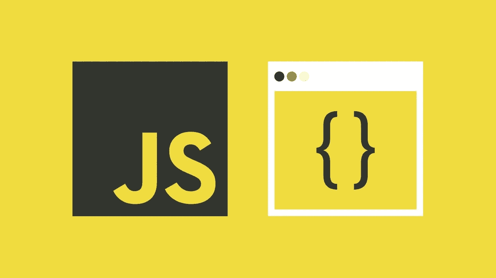
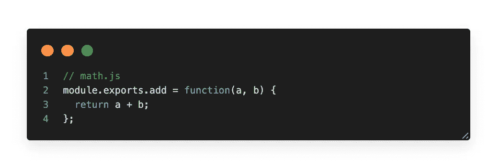
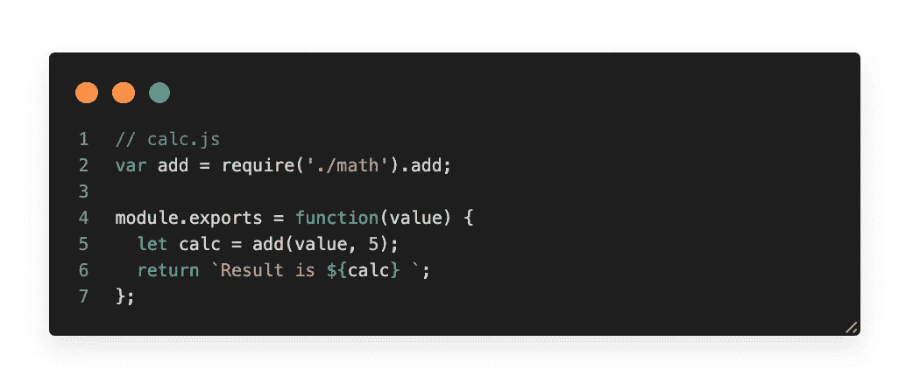
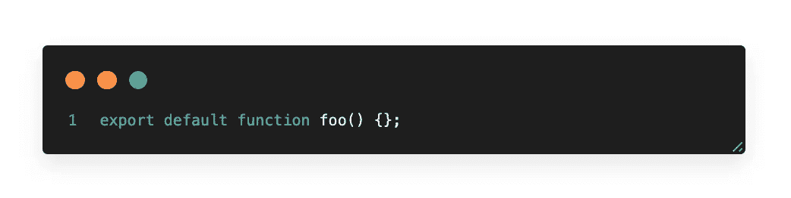
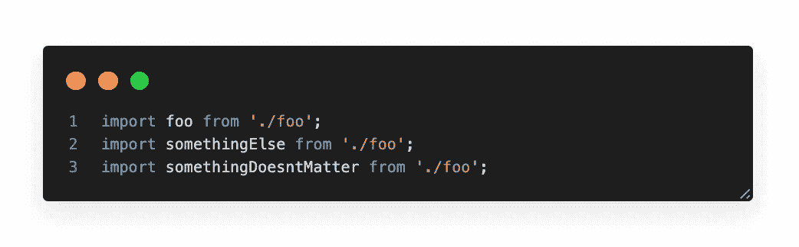
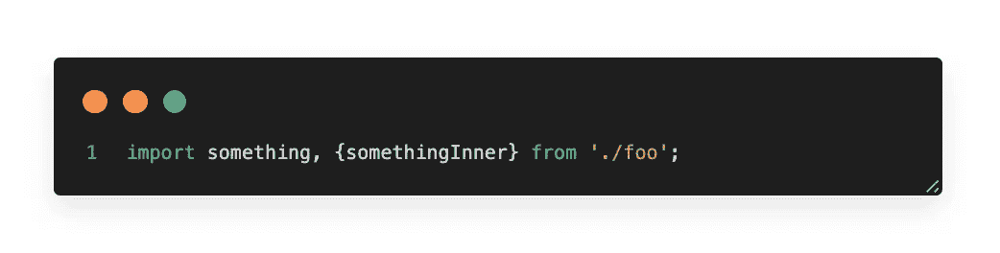
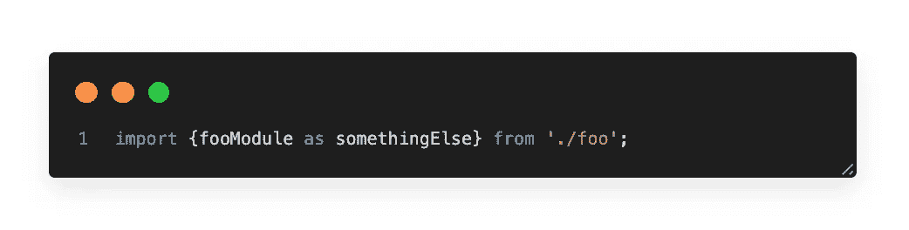

# JavaScript 中的模块是什么？

> 原文：<https://javascript.plainenglish.io/what-is-javascript-module-90d58a8290b0?source=collection_archive---------4----------------------->

JavaScript 很久以前就有模块了。然而，它们是通过库实现的，而不是内置在语言中。ES6 是 JavaScript 第一次内置模块。

# 什么是模块？

**一个模块只是一个文件。一个脚本就是一个模块。**

模块可以相互加载，并使用特殊指令`export`和`import`来交换功能

*   `export`关键字标记应该可以从当前模块外部访问的变量和函数。
*   `import`允许从其他模块导入功能。

你过去可能用过一个用户域 JavaScript 模块系统。也许你用了 Node.js 里的 [CommonJS，或者也许是](https://nodejs.org/docs/latest-v10.x/api/modules.html) [AMD](https://github.com/amdjs/amdjs-api/blob/master/AMD.md) ，或者是别的什么。所有这些模块系统都有一个共同点:它们允许你**导入**和**导出**内容。

# **普通模块**

CommonJS 是一种模块模式，旨在为依赖关系管理带来更熟悉的语法。实现 CommonJS 模块样式代码的最流行的软件包是 NodeJS。如果您以前使用过 Node，应该对以下内容非常熟悉:

math.js

calc.js

# ES6/ES2015 模块

ES6 模块可以通过 [Babel](https://babeljs.io/) 这样的 transpilers 获得。这是一种更简单、更容易理解的导入/导出代码的方式。在充分利用 ES6 模块的强大功能之前，您需要了解一些警告。

*   **默认导出**

这将导出函数 **foo** ，所以你可以这样使用它

如你所见，你可以把它命名为**，因为编译器知道从 **foo.js** 中选择默认函数**

*   **命名出口**

当您想要从一个模块中导出多个模块时，命名导出就很方便了。

您可以像这样链接命名导入:

*   **别名导入**

有时您想导入一个与导出名称不同的模块，在这种情况下，您可以使用**作为**关键字:

干净有力。ES6 模块在现代前端/后端 javascript 项目中被广泛使用，它是加载 javascript 的非官方标准方式。

> 我希望您喜欢这篇文章，并且学到了一些关于如何使用 Javascript 模块的新知识。

# 必读

 [## 模块导出和导出之间的区别

### 没有魔法。你的模块代码被夹在这个数组的两个项目之间，并被求值…

blog.tableflip.io](https://blog.tableflip.io/the-difference-between-module-exports-and-exports/)  [## javascript 模块如何工作——从过去到现在

### JavaScript 是一种有趣的语言，在过去 5 年左右的时间里，我见证了它在两个领域的加速发展…

www.penta-code.com](https://www.penta-code.com/how-javascript-modules-work-from-past-to-present/)  [## Node.js 导出模块

### 在上一节中，您学习了如何使用 module.exports 编写本地模块

www.tutorialsteacher.com](https://www.tutorialsteacher.com/nodejs/nodejs-module-exports)