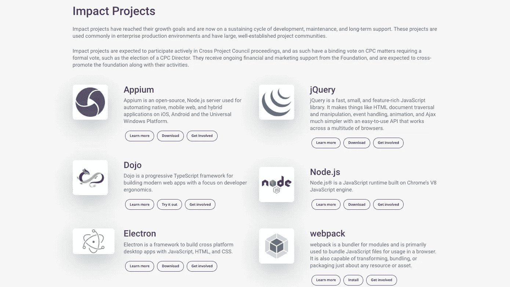
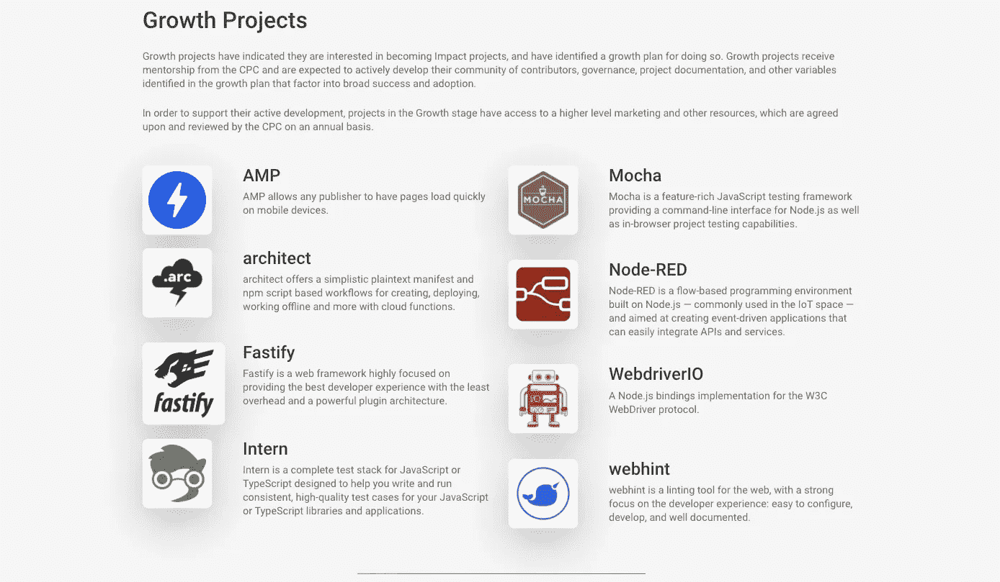
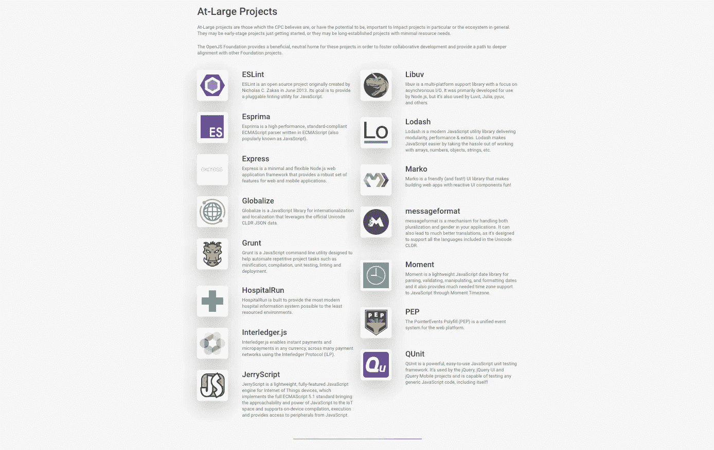
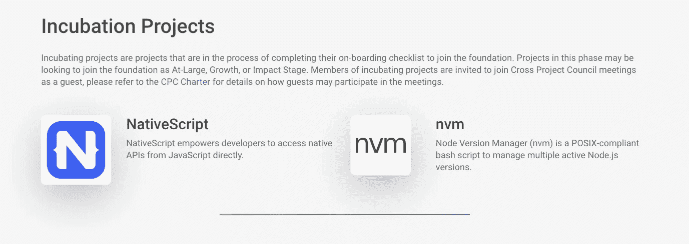
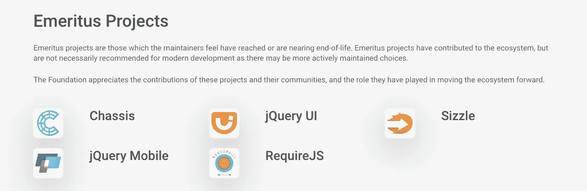

# 什么是 JavaScriptLandia？

> 原文：<https://javascript.plainenglish.io/what-is-javascriptlandia-9859367d2ec1?source=collection_archive---------2----------------------->

[OpenJS 基金会](https://openjsf.org/)，NodeJS 背后的人，电子& webpack 有公告！

> 本文的视频版本在:【https://youtu.be/GuNKg-dmXpA 

# OpenJS 基金会

如果你从未听说过 OpenJS 基金会，你可能会有两个问题，让我来回答一下:

## OpenJS 基金会的目的是什么？

促进关键 JavaScript 解决方案和相关技术的广泛采用和开发。

## 它们是从哪里来的？

*   **2006** jQuery 被创建。
*   [**2009** jQuery 加入软件自由保护组织](http://blog.jquery.com/2009/12/03/jquery-joins-the-software-freedom-conservancy/)
*   [**2012** jQuery 基金会作为一个独立的组织成立。](https://blog.jquery.com/2012/03/06/announcing-the-jquery-foundation/)
*   [**2016**Dojo Foundation 与 jQuery Foundation](https://blog.jquery.com/2015/09/01/jquery-foundation-and-dojo-foundation-to-merge/) 合并，后更名为 JS Foundation，[成为 Linux Foundation 程序](https://medium.com/r?url=https%3A%2F%2Fsdtimes.com%2Fcoding%2Flinux-foundation-takes-javascript-community-js-foundation%2F)。
*   [**2019**node . js 基金会与 JS 基金会](https://venturebeat.com/2019/03/12/node-js-and-js-foundations-are-merging-to-form-openjs/)合并，成立 [OpenJS 基金会](https://nodejs.medium.com/introducing-the-openjs-foundation-the-next-phase-of-javascript-ecosystem-growth-d4911b42664f)，促进 JavaScript 和 web 生态系统整体的健康成长。

## 哦，那么 JS 最大的项目背后的人是谁？

确切地说，OpenJS 基金会是合法的，并且已经成长为 JavaScript 开源社区的一个良好环境。

# 公告是什么？

> OpenJS 基金会刚刚创建了 JavaScriptLandia，一个热爱 JavaScript 的人的家🎉

## 它是如何工作的？

通常，基金会有复杂的方式来维持自己。然而，JavaScriptLandia 是一个易于理解的模型，看起来像今天普通内容创作者的货币化策略，便宜又有很多好处。

## 所以，它很便宜，但我会帮忙的？

确切地说，25 美元/年(每月 2 美元多一点)。

## 那么好处呢？

*   添加到您的在线档案、头像、博客和/或个人网站的数字徽章。
*   OpenJS 基金会网站上他们的[全球支持者页面上的认可。](https://openjsf.org/javascriptlandia)
*   支持者的每周时事通讯，让你了解来自 OpenJS 项目、交叉项目委员会和董事会的最新消息。您还将受邀参与关于治理和新计划的讨论。
*   [培训](https://openjsf.org/certification/)、[认证](https://openjsf.org/certification/)、会议等专属优惠折扣。

## 但是，为什么呢？

正如在[公告博客帖子](https://openjsf.org/blog/2020/12/17/introducing_javascriptlandia/)中所述，该计划背后的动机是为目前没有为其项目做出贡献但却是活跃的 JavaScripters 爱好者的人提供一个完美的程序，这是一种加入 OpenJS 基金会的方法，它不像赞助那样昂贵，并且可以帮助成员了解项目以及更多地了解内部发生的事情。

很可爱，你不觉得吗？

我一直想知道开源项目如何为自己融资，我很高兴有一个小型的模型可以贡献，没有太多的模糊，并增加了更多的额外津贴。感谢每天帮助那些在我的专业工作中帮助我的人的快乐。

# 我要使用任何基础项目吗？

我参观了开放的 JS 基金会项目，对他们目前支持的所有项目感到惊讶！

## 影响项目

从他们的影响项目，我目前使用除了 Dojo，我第一次听说它，你呢？

## 增长项目

从他们的成长项目中，我用过很多 Mocha 和 WebdriverIO，喜欢它们，也听说过 AMP。

## 网络普通用户项目

我不敢相信所有这些项目都在同一个基金会下。我认为他们有不同的支持者来维持他们所需要的巨大努力，ESLint，Libuv，Lodas，Express，Grunt 和 Moment alone 在我的职业生涯中一直很重要。

## 孵化项目

我对 NativeScript 非常兴奋，没有 nvm 我不会安装 node，所以这是 100%的兴奋。

## 荣誉退休项目

哦绝对同意荣誉退休项目的描述，jQuery UI，jQuery Mobile 和 RequireJS，在我第一次黑网页的时候帮了我不少忙，愿他们安息。

# 谢谢你🎄

你太棒了，希望你和我一样喜欢这个公告，如果你想看更多这样的内容，请加入我的简讯[💌或者订阅我的](http://eepurl.com/hg7AeP) [YouTube 频道🎥](https://www.youtube.com/channel/UCIrkqvbX0xx7Rm88kSGJ72Q?app=desktop)。