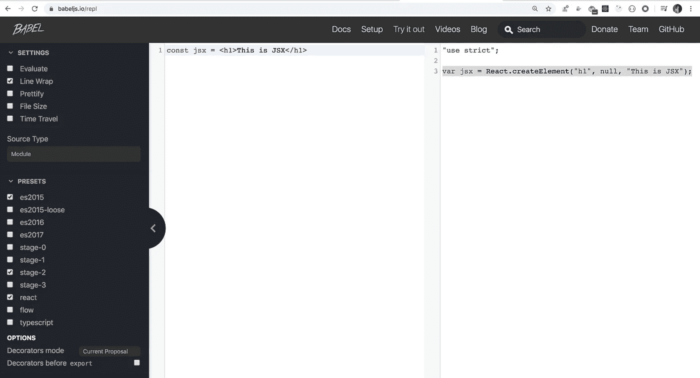

# 什么是 JSX 以及如何在 React 中使用它

> 原文：<https://javascript.plainenglish.io/what-is-jsx-and-how-to-work-with-it-in-react-4df9decda33e?source=collection_archive---------6----------------------->

## 在这篇文章中，我们将探索 JSX 的一切


> JSX 是一种 Javascript 扩展语法，用于在 React 中轻松编写 HTML 和 Javascript。

JSX 将 HTML(XHTML)和 Javascript 结合在一起，使得代码更易于管理。

```
const jsx = <h1>This is JSX</h1>
```

这是 React 中简单的 JSX 代码，但是浏览器不理解这个 JSX，因为它不是 javascript 代码。因此，为了将它转换成浏览器可理解的 Javascript，我们使用像 Babel 这样的工具。

您可以使用 webpack 设置您自己的 babel 配置，如这里的[所示](https://medium.com/javascript-in-plain-english/webpack-and-babel-setup-with-react-from-scratch-bef0fe2ae3e7)或者使用 create-react-app，它在内部使用 babel 进行 JSX 到 javascript 的转换。

上述 JSX 将被转换为

```
var jsx = React.createElement("h1", null, "This is JSX");
```

如果你想实时看到，你可以前往 https://babeljs.io/repl 的

左边是 JSX 代码，右边是浏览器可以理解的转换后的 Javascript 代码。



我们可以将 JSX 渲染到屏幕上，如下所示

```
import React from "react";
import ReactDOM from "react-dom";const jsx = <h1>This is JSX</h1>;
const rootElement = document.getElementById("root");ReactDOM.render(jsx, rootElement);
```

ReactDOM.render 方法接受 JSX 或返回 JSX 的组件。

在这里玩一下:【https://codesandbox.io/s/crazy-currying-3yi3p】T4

让我们看看如何呈现一个返回 JSX 的组件

```
import React from "react";
import ReactDOM from "react-dom";const App = () => {
 return <h1>This is JSX</h1>;
};const rootElement = document.getElementById("root");ReactDOM.render(<App />, rootElement);
```

演示:[https://codesandbox.io/s/relaxed-platform-19ndk](https://codesandbox.io/s/relaxed-platform-19ndk)

我们可以从一个函数中返回多个元素

```
import React from "react";
import ReactDOM from "react-dom";const App = () => {
 return (
  <div>
   <p>This is first JSX Element!</p>
   <p>This is another JSX Element</p>
  </div>
 );
};const rootElement = document.getElementById("root");ReactDOM.render(<App />, rootElement);
```

演示:[https://codesandbox.io/s/festive-wescoff-1g66y](https://codesandbox.io/s/festive-wescoff-1g66y)

请注意，我们已经将这两个段落包装在 div 中，div 本身包装在圆括号中。

这两个 JSX 被包装在父 div 中，因为 React 只能呈现可能包含多个子元素单个元素

如果你想知道为什么？？然后点击查看文章

现在让我们在 JSX 内部添加一些 javascript 代码

为了在 JSX 内部添加 javascript 代码，我们将它写在花括号中

```
const App = () => {
 const number = 10;
 return (
  <div>
   <p>Number: **{number}**</p>
  </div>
 );
};
```

我们写在花括号里的只是一个表达式，它的值是某个值。

这种语法通常被称为 JSX 表达式语法

**我们可以用 JSX 表达式写的是:**

*1。
类似“你好”的一串 2。像 10
3 这样的数字。类似[1，2，4，5]
4 的数组。一个对象属性，其计算结果为某个值
5。返回某个值的函数调用，该值可能是 JSX
6。map 方法总是返回一个数组
7。一个 JSX 本身*

我们不能在 JSX 表达式中写的是不为 ex 返回任何值的东西。

*1。for 循环或 while 循环或任何其他循环
2。变量声明
3。功能声明
4。如果条件
5。一个物体*

我们可以用 JSX 表达式写数组，因为

```
<p>{[1, 2, 3, 4]}</p>
```

被转换为

```
<p>{1}{2}{3}{4}</p>
```

可以毫无问题地进行渲染。

在对象的情况下，不清楚对象应该如何显示为逗号分隔的键值对，或者应该显示为 JSON，所以如果您尝试在 JSX 表达式中显示对象，您将会得到一个错误，但是我们可以使用对象属性来显示。

**另请注意，在 JSX 内部使用时，未定义、null 和 boolean 不显示。**

**JSX 表达式中的条件运算符:**

如果条件在 JSX 表达式中，我们不能写**你可能会认为这是一个问题，但是 React 允许我们写条件运算符，比如三元运算符，以及逻辑短路运算符& &比如**

```
<p>{a > b ? "Greater" : "Smaller"}</p>
<p>{shouldShow && "Shown"}</p>
```

演示:[https://codesandbox.io/s/condescending-wind-4rwtl](https://codesandbox.io/s/condescending-wind-4rwtl)

我们可以像在 html 中一样给 JSX 元素添加属性，如 id、class 等

```
const App = () => {
 const id = "some-id";
 return (
  <div>
   <h1 id={id}>This is a heading</h1>
   <h2 className="active">This is another heading</h2>
  </div>
 );
};
```

演示:[https://codesandbox.io/s/great-chandrasekhar-i48t2](https://codesandbox.io/s/great-chandrasekhar-i48t2)

注意，在 React 中，我们需要使用**类名**而不是**类**。

***在 react 中，属性名是用 camelCase。***

您可以在这里找到所有已更改和未更改的属性列表

今天到此为止。希望你今天学到了新东西。

**别忘了直接在你的收件箱** [**这里**](https://yogeshchavan.dev) **订阅我的每周简讯，里面有惊人的技巧、诀窍和文章。**