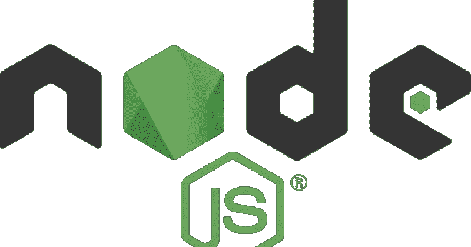
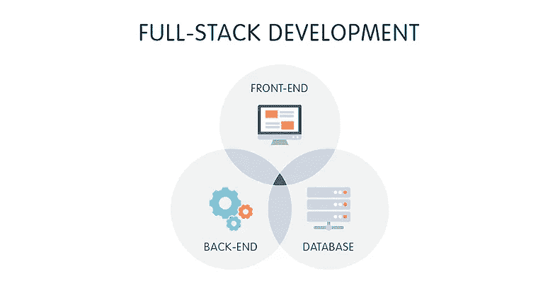
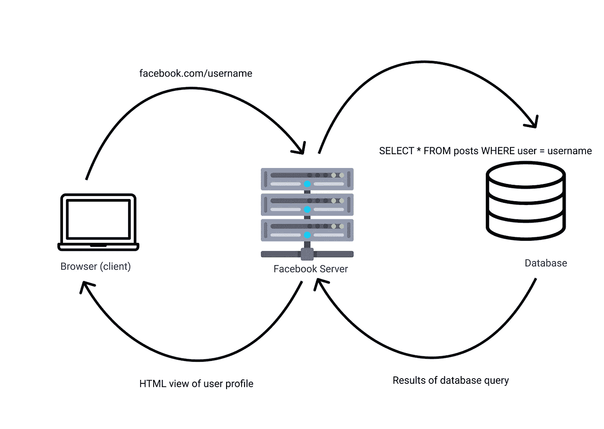
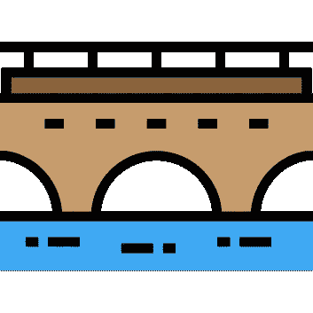
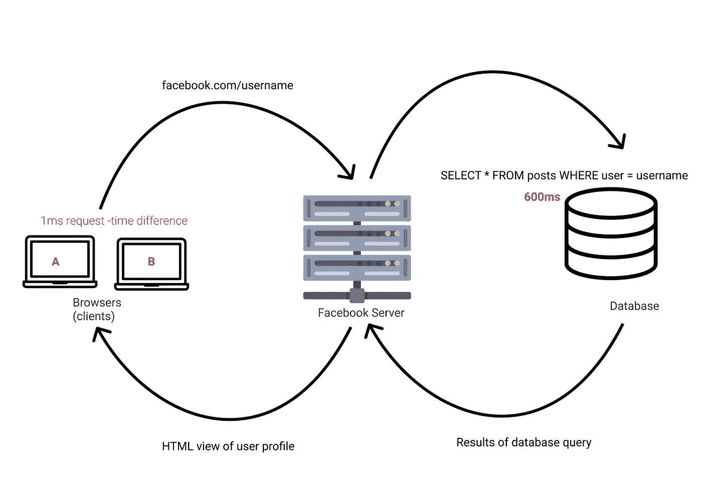
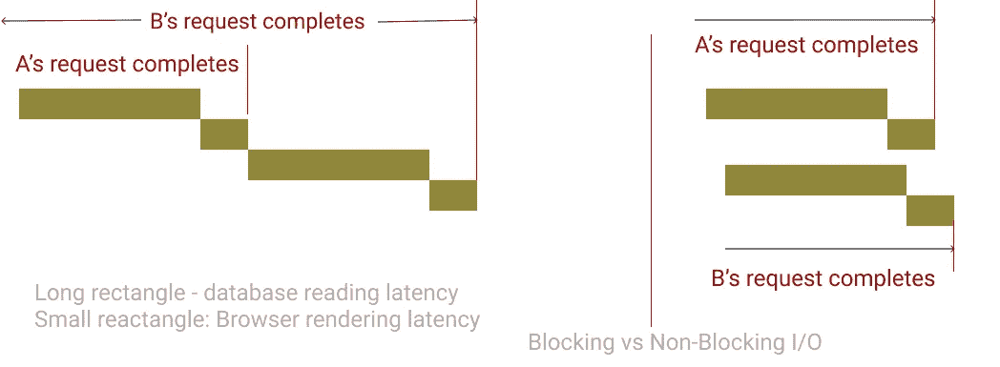
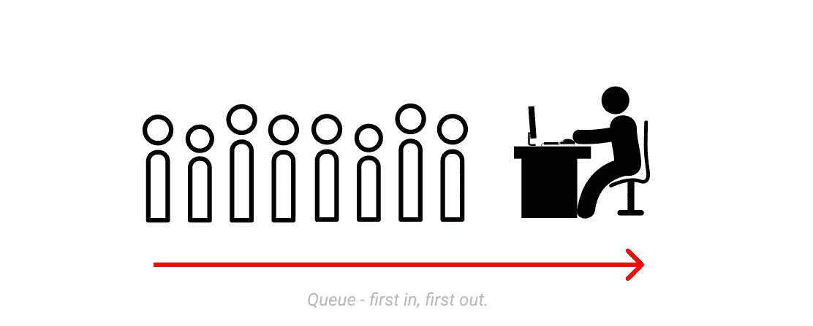

# Node.js 是什么？

> 原文：<https://javascript.plainenglish.io/what-is-node-js-5fe50e4332c8?source=collection_archive---------2----------------------->



Beautiful Node

Node.js 在 2009 年从一个不起眼的起点发展成为创建 web 应用程序最受欢迎的平台之一。如果你从事 web 开发已经有一段时间了，你会听到人们说，“Node 只是 JavaScript”。没错，要理解 node.js，了解它是为了解决什么问题以及为什么使用它会有所帮助。

# Web 应用程序的剖析



Image courtesy of medium.com

一个功能完善的网站通常由两部分组成:前端和后端。以 facebook.com 为例，前端就是你在 www.facebook.com 访问网页时所看到的一切——字体、颜色、动画——你能看到并与之互动的一切都是前端。前端使用三种基本技术创建，HTML、CSS 和 JavaScript。JavaScript 使得网站上的交互性成为可能，像输入验证、动画等通常都是用 JavaScript 实现的。

当你在 facebook 上执行创建账户等操作时，facebook 必须“记录”你的账户，并在你下次尝试登录时“记住”它。当你登录并浏览你的时间线时，你会看到来自朋友的帖子——Facebook 必须能够保留所发帖子的记录，并能够检索它们。所有这些“数据操作”都是由后端完成的。

网站的后端由服务器、应用程序和数据库组成。后端开发人员将构建和维护支持这三个组件的技术，以便它们能够协同工作。在 node.js 之前，后端应用必须用 PHP、java、C#或其他技术编写。JavaScript 无法在服务器上运行！

脸书的后台最初是用 PHP 创建的。



A simple request cycle

JavaScript 是为在前端使用而创建的——网络浏览器都内置了 JavaScript 引擎:Chrome 使用 V8 引擎，Mozilla 使用 Spidermonkey 引擎。所以，在早期，只有浏览器可以运行 JavaScript*。JavaScript 过去被称为“客户端”编程语言，因为它只在客户端——浏览器上使用。

***实际上，已经有人尝试在服务器上写 JavaScript 了**

# Node.js: JavaScript anywhere



> 任何可以用 JavaScript 编写的应用程序，最终都会用 JavaScript 编写。—杰夫·阿特伍德

我想让你想象一下生活在 5 万年前的人类。假设唯一的交通工具是公路，我们只能在公路上步行或骑动物，没有船，飞机或任何其他交通工具。早期人类是流浪者，会从一个地方到另一个地方寻找食物。

现在，一群大约 150 人的人类来到了河边。在河的对岸，他们可以看到树上结着不同种类的水果，但是他们怎么才能到达对岸呢？组长召唤萨满，并告诉他向神灵祈求帮助。

第二天团醒来的时候，唉！众神已经建造了一座桥，他们可以走在上面，穿越到另一边。现在，它们不仅能在路上走，还能在水上走！他们快乐无比。


Ryan Dahl Introducing Node.js in 2010

现在，快进到 2010 年，想象一下 Ryan 在创建 Node.js 一年后推出了它。在 node.js 之前，JavaScript 只能在浏览器上运行，也就是说，我们只能在前端使用它，但有了 Node.js，开发人员现在可以用 JavaScript 编写服务器应用程序了！

这意味着开发人员不必通过学习和使用另一种语言来改变上下文来创建一个全栈网站(一个有前端和后端的网站)，他们可以在 JavaScript 中完成所有工作！

有趣的事实是，我们可以在任何平台上安装 Node.js，我们可以用 JavaScript 为该平台编写应用程序。Node.js 甚至用于在嵌入式系统上编写应用程序！

# Node.js 的技术定义

Nodejs.org 说:

> Node.js 是基于 Chrome 的 V8 JavaScript 引擎构建的 JavaScript 运行时。

作为一个 JavaScript 运行时，它意味着 Node.js 让我们运行(执行)用 JavaScript 编写的程序(在浏览器之外)。Node.js 并不神奇，要解释 JavaScript 代码，需要一个 JavaScript 引擎，Ryan Dahl 选择了 Chrome 浏览器中的 JavaScript 引擎——V8。

**注意**:浏览器不是 JavaScript 引擎——它们有 JavaScript 引擎和其他东西，类似地，Node.js 也不是 JavaScript 引擎，它使用 JavaScript 引擎，除了引擎之外还有其他部分。

你可以在这里为你的电脑下载 Node.js 安装程序【https://nodejs.org/en/download/ 

# Node.js 的编程模型

一种语言的编程模型定义了开发者应该如何编写代码，在这种语言中什么是合法的，什么是非法的。因为 Node 是 JavaScript，所以 JavaScript 的规则也适用于它，但是 Node 有额外的约定。

Nodejs.org 继续定义节点:

> Node.js 使用事件驱动的非阻塞 I/O 模型，这使它变得轻量级和高效。

I/O 代表输入/输出。在 web 服务器中，I/O 操作包括从磁盘读取、查询数据库、与另一个 web 服务器通信等。web 服务器最终将不得不执行一些 I/O。
I/O 的问题是它很慢:

考虑访问 facebook 上的用户资料的简化示例



A simple request cycle with sample latency

假设从数据库中读取数据需要 600 毫秒，浏览器为文件提供服务需要 100 毫秒。现在，我们将考虑这样一种情况:我们有两个站点访问者正在访问用户的个人资料，他们都在请求个人资料页面。假设第二个站点访问者在第一个站点访问者之后 1 ms 发出请求

# 阻塞输入输出

如果服务器被写成阻塞代码，用户 A 在发出请求 700 毫秒后将得到结果。

用户 B 将得到结果(700+701)ms，他必须等待 A 的请求完成，然后等待他的请求也完成。想象一下，如果 facebook 的服务器遵循这种模式，其 10 亿用户必须等待对方的请求完成，用户需要等待多长时间。

# 非阻塞输入输出

如果服务器可以在等待 A 的请求完成时处理用户 B 的请求，那会怎么样呢？如果我们可以并行处理请求，而不是一个接一个地处理，会怎么样？这就是 Node.js 的工作方式(实际上，这就是 Node.js 代码的工作方式，我们仍然可以编写模块化的 Node.js 代码)。

JavaScript 和 extension 中的 Node.js 是单线程的——这是“我一次只能做一件事”的花哨名称，但 JavaScript 让我们编写异步代码——让我们看起来像在并行做事情的代码。这是 Node.js 推广的模型，它内置了编写异步代码的机制。



Blocking Vs Non-Blocking I/O

# 事件和事件循环

当用户发出一个服务器必须处理的请求时，我们说应用程序中发生了一个事件。一个事件表明一项任务即将完成。服务器请求是 Node.js 中事件的一个示例，打开/关闭 node.js 中的文件、写入文件都是 Node 中事件的其他示例。

当我们有异步任务时，即任务不能立即完成时，节点必须知道哪个事件先发生，以及它们应该以什么顺序完成。

就像在银行大厅一样，当客户进来办理银行业务时，他们被告知要排队，银行柜员按照他们进来的顺序一个一个地接待他们。类似地，当 Node.js 应用程序中发生不同的事件时，Node 使用队列数据结构按照事件被触发的顺序跟踪事件。这个队列数据结构被称为**事件循环**。Node.js 是单线程的，它在后台使用多线程来执行异步代码。



节点将在流程的整个生命周期中继续检查此事件循环，以查看是否有任何事件。当事件仍在队列中时，节点执行事件循环，事件循环的每次执行称为一个**周期* *。

我只给出了事件循环的一个简单概述，它比这个更复杂，我可能会在将来为它写一篇文章。

# 什么是 npm？

假设你想买一台新的台式电脑，你可以用不同的方法来实现。首先，如果你对电脑的运作有一些技术知识，你可以购买不同的部件——主板、硬盘、电源和其他部件，然后自己把台式电脑连接起来。或者你可以去买一整套电脑，这样可以节省一些卡路里。

同样，在编写节点应用程序时，有一些常见的问题，如输入/表单验证，有人已经为其编写了代码，您不必自己实现。你可以获取他们的代码并在你的应用中使用。NPM(节点包管理器)是一个在线注册中心，允许开发者共享代码*或*包。npm 是世界上最大的软件注册中心，可以免费使用。

好消息是，npm 是 Node 自带的，当您在机器上安装 Node.js 时，您也安装了 npm。

# 什么是节点模块？

用 Node 搭建的大型 app，肯定会包含大量代码。无论你的应用程序有多复杂，你都可以把所有的代码放在一个文件里，一切都会好的。但是一个有几千行代码的文件会很难维护和理解，把东西拆分成不同的文件不是更好吗？

节点模块是 JavaScript 库(代码),您希望将它们放在一起，但也希望将它们与代码库的其余部分分开，以便将它们完全分开。

这些模块可以导入到其他文件(模块)中，并用于设计整个项目。要在另一个文件中使用一个模块，可以使用`require`关键字。例如:

```
var http = require('http');
```

http 模块是 Node 中的内置模块，是的 Node 有一些预定义的内置模块。

当您用 npm 安装一个第三方包时，这个包会放在一个名为`node_modules`的文件夹中。

# 在 Node.js 中创建服务器

`http`模块可以用来创建一个简单的响应请求的服务器。该模块有一个`createServer`方法，该方法将一个函数作为参数，这个函数参数被称为**回调**。

在下面的示例中，可以并发处理许多到服务器的连接。对于每个到服务器的连接，回调函数被调用。

如果您的机器上安装了 node.js，将这段代码放在一个名为`index.js`的文件中:

之后，使用`node index.js`运行你的 web 服务器，访问 [http://localhost:3000](http://localhost:3000) ，你会看到一条消息‘Hello World’。

# 结论

我希望我已经帮助介绍或帮助澄清了 Node.js 是什么，记得在你的社交媒体手柄上分享这篇文章，你可以在 twitter 上关注我

如果你想了解更多，可以阅读亚历克斯·扬和马克·哈特的书《Node.js 实践》,这是关于 Node.js 的最好的书籍之一

黑客快乐！

如果你点击拍手图标 50 次，你认为会发生什么？试试吧！