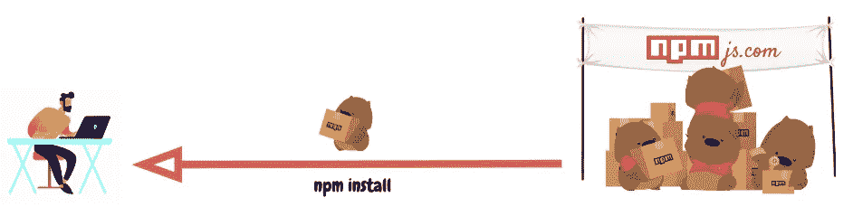
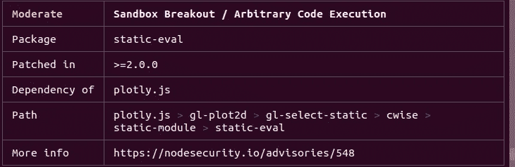

# npm(节点包管理器)初学者指南📦

> 原文：<https://javascript.plainenglish.io/what-is-npm-beginners-guide-9317c52be5bc?source=collection_archive---------7----------------------->

## java 描述语言

## *如何使用 NPM——node . js 包管理器安装、发布和测试 JavaScript 包的漏洞*

Source: [npmjs](https://www.npmjs.com/)

[**Node.js**](https://en.wikipedia.org/wiki/Node.js) 软件平台于 2009 年出现，自那以后，成千上万的应用程序建立在这个平台上。成功的原因之一是 [**npm**](https://en.wikipedia.org/wiki/Npm_(software)) ，这是一个流行的包管理器，允许 JS 开发者快速共享包。

在撰写本文时，npm 包含了**130 万个包**，总共有**160 亿次下载(！)**。

# 1.什么是 npm？

npm(节点包管理器)是由 Node.js 支持的默认 JavaScript 包管理器。

*   CLI(命令行界面) —托管和下载软件包的工具，
*   [**在线知识库**](https://www.npmjs.com/) 包含 JS 包。

您可以将[npmjs.com](https://npmjs.com/)存储库结构视为一个履行中心，它从销售者(包作者)那里接收产品(npm 包)并将这些产品分发给购买者(包用户)。

在履行中心([npmjs.com](https://npmjs.com/))，一群[袋熊](https://en.wikipedia.org/wiki/Wombat)为每个顾客充当个人经理。`npm CLI`

依赖项提供如下:

The process of installing a package through **npm install**

封装放置过程如下所示:

The process of placing a package through `**npm publish**`

现在让我们仔细看看袋熊的工作。

# 1.1.Package.json 文件

JavaScript 中的每个项目——无论是 Node.js 还是 web 应用程序——都可以被复制？作为具有自己的描述和文件的 npm 包。`package.json`

`package.json`可以认为是 npm 盒子(项目)上的贴纸(所需版本的包列表)。该文件是在使用以下元数据创建 JavaScript / Node.js 项目时由命令生成的:`npm init`

*   `name`:JS 库/项目的名称。
*   `version`:项目版本。
*   `description`:项目描述。
*   `license`:项目许可证。

# 1.2.Npm 脚本

构建自动化的`package.json`包含字段`scripts`，例如:

`eslint`、`prettier`、`ncc`、`jest`可以在`node_modules/.bin/`内全局或局部设置。

# 1.3.依赖项和开发依赖项

`dependencies`和`devdependencies`是具有 npm 库名称(key)和它们的[语义版本](https://semver.org/lang/ru/) (value)的字典。来自[类型脚本动作](https://github.com/actions/typescript-action)模板的示例:

使用命令`npm install`标志`--save`和`--save-dev`安装这些依赖项。它们分别用于生产和开发。

关于版本控制:

*   `^`:最后一个次要版本。例如，如果版本`1.3.0`是`1`主要版本系列中的最后一个次要版本，那么`^1.0.4`是否会安装该版本。
*   `~`:最新补丁发布。如果这是一系列次要版本`1.0`中的最后一个次要版本，则`~1.0.4`将设置`1.0.7`。

所有包版本将显示在生成的文件`package-lock.json`中。

# 1.4.Package-lock.json 文件

该文件描述了 JavaScript 项目中使用的包版本。如果它包括对依赖关系(产品名称)的一般描述，那么更详细的描述—整个依赖关系树。`package-lock.jsonpackage.jsonpackage-lock.json`

`package-lock.json`由命令`npm install`生成，由 npm CLI 读取，以确保项目环境通过`npm ci`播放。

# 2.安装软件包

由于用户下载软件包的频率更高(160 亿次下载对比 1300 万次发布)，所以弄清楚如何安装它们会很有帮助。

# 2.1.npm 安装

`npm install`是安装包的命令。

默认情况下`npm install <package-name>`，已签名的`^`会安装最新版本的软件包。`npm install`会根据`package.json`文件中的配置将包下载到项目文件夹`node_modules`，尽可能更新包的版本(反过来更新`package-lock.json`)。如果要全局安装包，可以指定标志`-g`。

npm 使得 JavaScript 包的安装变得如此简单，以至于该命令经常被错误地使用，关于这个主题的模因已经出现在开发人员社区中:

Sometimes you think that node_modules are super heavy!

当您添加一个标志时，`--production`只有应用程序工作所必需的依赖项才会从`dependencies`安装，而不会增加`node_modules`。

# 2.2.npm ci

如果`npm install --production`对于生产来说是最优的，是否有类似的团队进行本地开发？对，叫`npm ci`。

和前面一样，如果`package-lock.json`在项目中还不存在，那么在调用时就会生成。`npm installnpm ci`访问锁文件以下载软件包的确切版本。因此，不同机器上的软件包集将保持不变。

# 2.3.npm 审计

为了避免将[恶意包](https://medium.com/@jsoverson/how-two-malicious-npm-packages-targeted-sabotaged-one-other-fed7199099c8)添加到存储库中，npm.js 组织提出了[的想法，即](https://blog.npmjs.org/post/173719309445/npm-audit-identify-and-fix-insecure)通过创建模块`npm audit`来审计生态系统。它提供了关于软件包中的漏洞和修补版本的存在的信息。

Audit example for static-eval package

如果在软件包的下一个版本中有可用的补丁，它`npm audit fix`将自动更新受影响的依赖项的版本。

# 3.包装放置

让我们从消费包转移到放置包。

# 3.1.npm 发布

向 npmjs.com 提交一个包非常简单——只需在控制台中键入`npm publish`。作者忽略的一个重要部分是版本控制。这里有一套 semver.org 的[经验法则，用于](https://semver.org/lang/ru/)何时增加版本号:

*   **主要版本:**当向后不兼容的 API 发生变化时。
*   **次要版本:**当您添加新功能而不破坏向后兼容性时。
*   **补丁版本:**做向后兼容修复时。

在发布您自己的包时，遵循上述指导方针更为重要，以确保您不会破坏任何人的兼容性，因为 npm 默认使用版本`^`(下一个次要版本)。

# 结论

在这篇文章中，我们熟悉了国家预防机制的结构，并了解到:

*   其中文件是依赖数据(`package.json`、`package-lock.json`)。
*   如何在本地机器上安装生产包(`npm install`)、审计包(`npm audit`)。
*   如何将软件包添加到存储库()。`npm publish`

## **阅读更多:**

 [## 前端和后端—有什么区别？

### 前端和后端。你可能已经听说过网络编程领域的这些流行词汇，但是背后是什么…

medium.com](https://medium.com/@raevskymichail/frontend-and-backend-difference-797d3e975917)  [## 如何自定义 Angular 项目构建

### 可能会出现这样一种情况，在构建您的 Angular 应用程序时，出现了一个任务，它超出了构建…

medium.com](https://medium.com/javascript-in-plain-english/how-to-customize-an-angular-project-build-2e7e2c31ca6b)