# 什么是 OAuth 2.0

> 原文：<https://javascript.plainenglish.io/what-is-oauth-2-0-b2e6401d0e6e?source=collection_archive---------8----------------------->

这是在 2016 年→这是一个相当古老的图书馆→会发生什么？

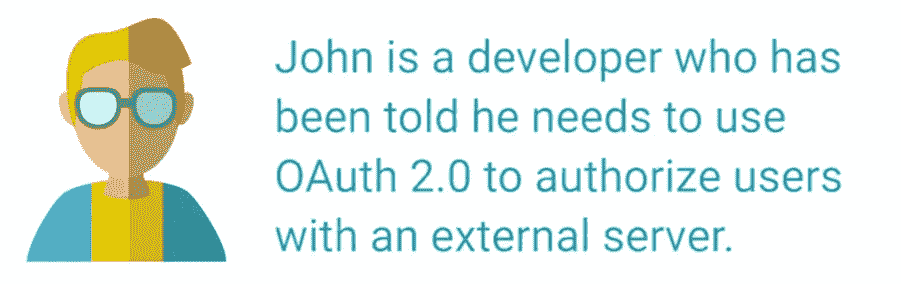

所以我们要用其他服务→三个角色，用户，API，应用。

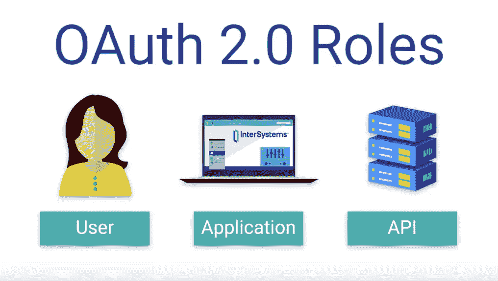

Spotify →我们将通过 facebook 或 google 登录→而不是制作整个登录系统→我们将使用其他服务。

这是如此简单和聪明。

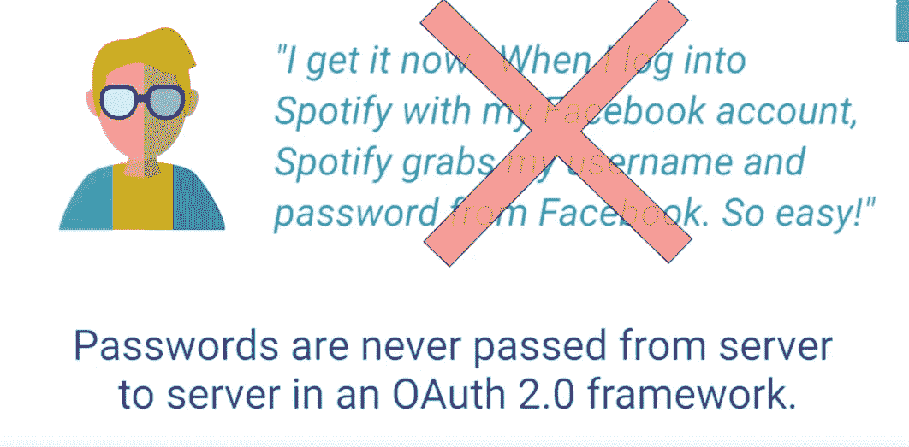

但是没有密码交易。

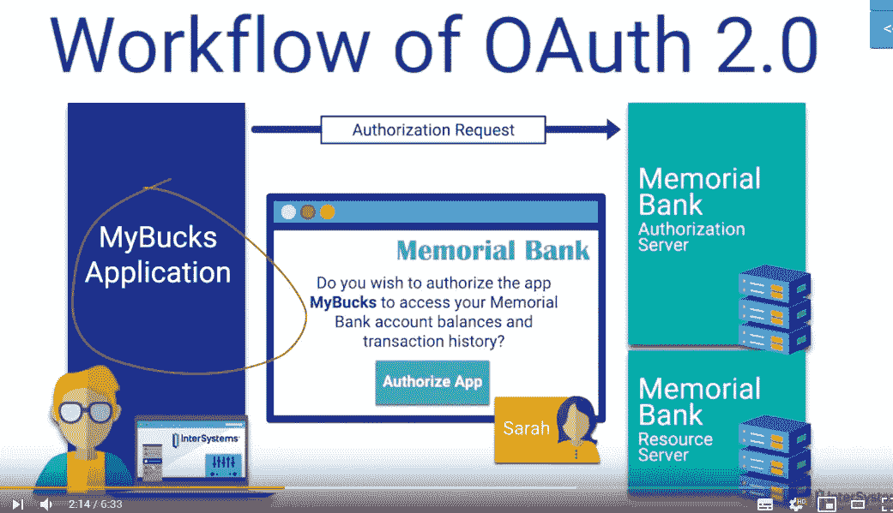

因此，在右边，我们有应用程序→用户正在尝试做一些事情，而在左边→我们有我们想要用来登录用户的服务器。

这个现在已经很标准了。

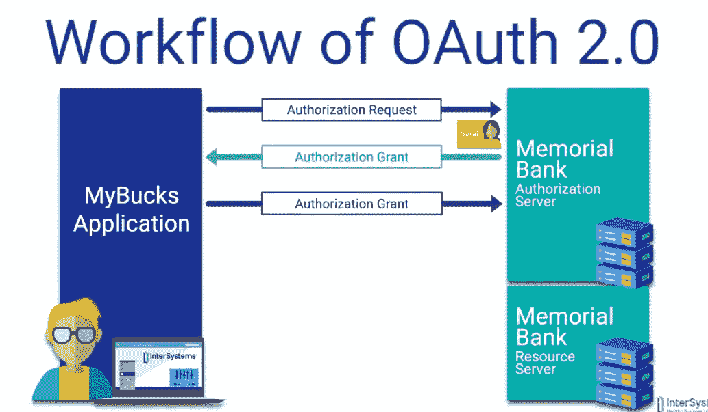

这里 Sarah 的密码或任何类型的个人信息都不会存储在任何地方→这是安全的→我们将交换访问令牌。

只看到我们能看到的两样东西→那是我们唯一能看到的东西→没有别的。(资源服务器发回其他内容)

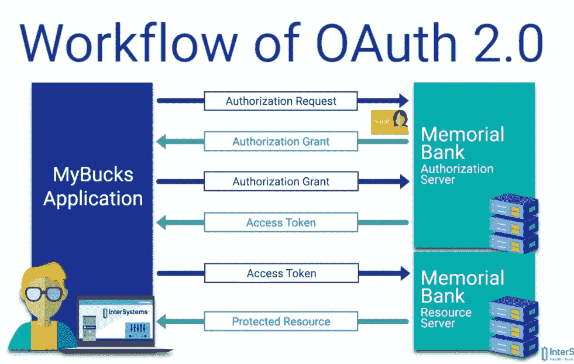

认证→通过访问令牌完成→但是开发者必须向银行提交他的申请。

有不同的授权类型→一些用于 web 服务器，另一些用于其他应用程序。(这个安全)。

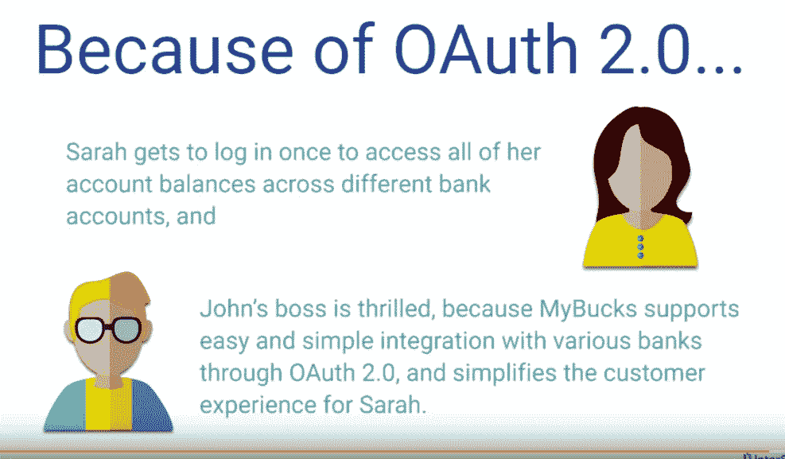

这是 2 年前的事了→现在每个人都在使用这项服务。

我们使用第三方应用程序登录一些应用程序。

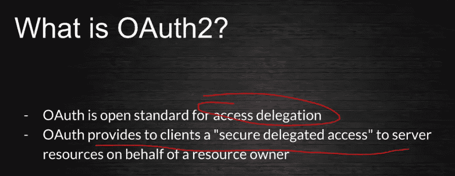

有一些谷歌帐户→我们可以访问谷歌帐户和更多。(基本上，有一个中间人来服务我们的用户登录)

虽然我们不需要处理安全问题。

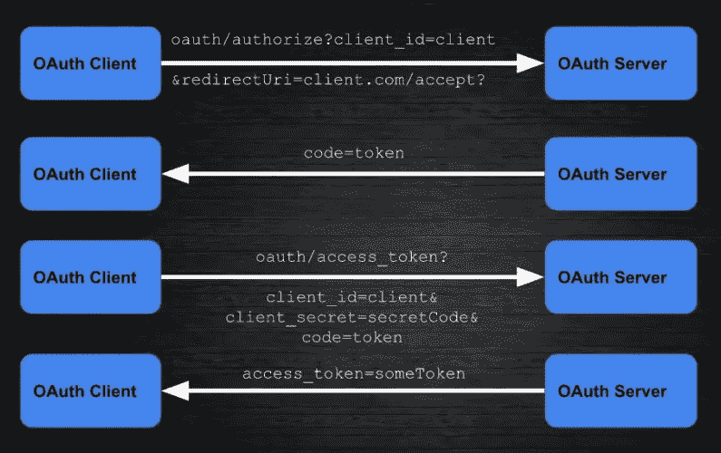

总的来说，这是一个复杂的过程→其中发生了许多握手操作。(谢天谢地，我们不必编写自己的版本)。

 [## OAuth

### 本页打印于 2019 年 12 月 3 日。有关当前版本，请访问…

help.shopify.com](https://help.shopify.com/en/api/getting-started/authentication/oauth#verification) 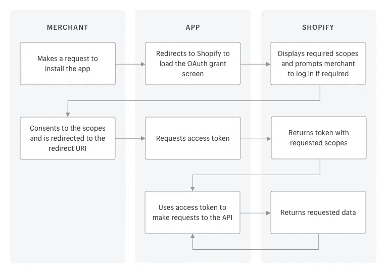

OAuth2.0 →流程复杂→正如我们上面看到的→很多当事人之间的联系。

有意思…..

但是通过这样做，我们不必实现应用程序中的所有日志。

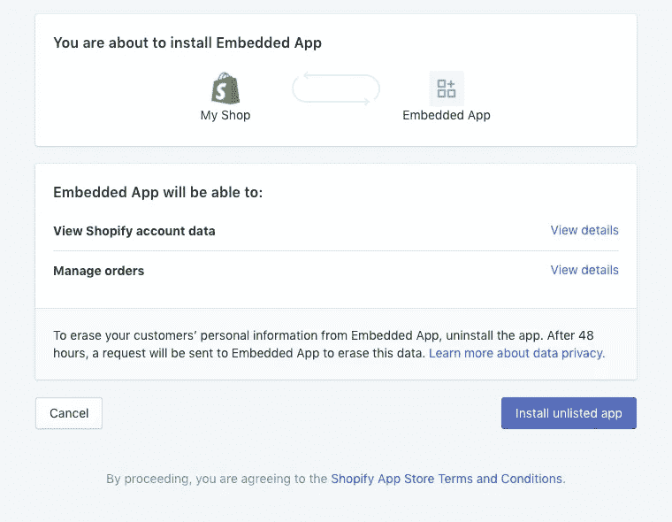

之后，→我们就可以为 Shopify 安装我们的应用程序了。

很好，这对 Shopify 应用程序来说是有意义的。

 [## OAuth 是什么？开放式授权框架如何工作

### 自从分布式个人计算机网络出现以来，最难攻克的计算机安全难题之一就是…

www.csoonline.com](https://www.csoonline.com/article/3216404/what-is-oauth-how-the-open-authorization-framework-works.html) 

双因素认证→也与 OAuth 的趣味性有关。

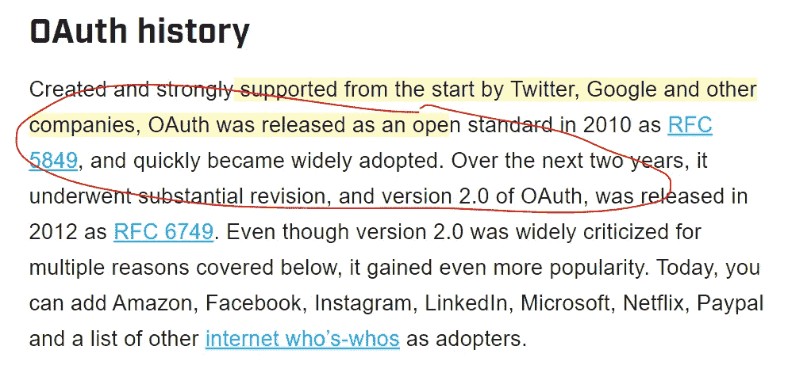

很好，许多公司都支持这一点→我们可以增加大量使用这一框架的公司。

我们能够登录→使用另一个网站→如谷歌或脸书或更多。

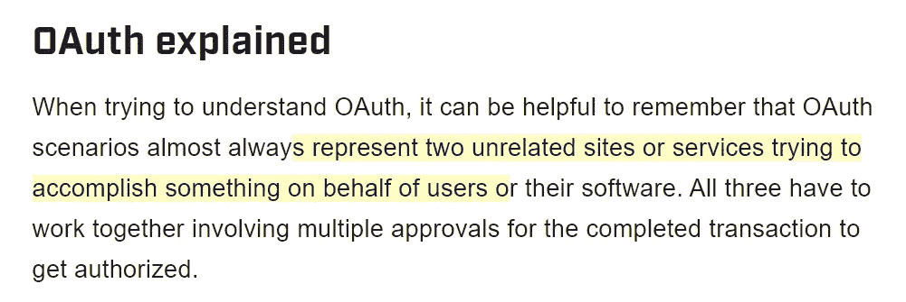

授权→与认证完全不同。(有些解释包括用车钥匙→这个有点没用)。

基本上，我们不想让用户一次又一次地登录。(所以要有一个做事情的令牌)。

OpenID → is 认证→人类登录机器。(领养失败→这不是一件好事)

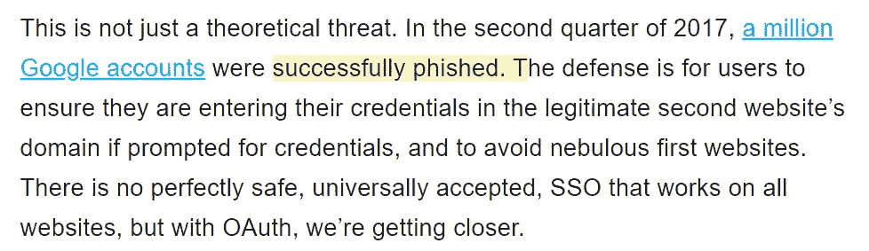

OAuth 2.0 →不是绝对安全的 LOL