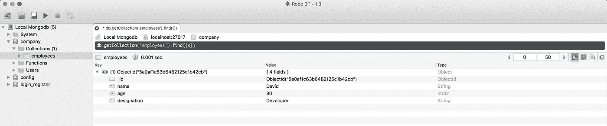
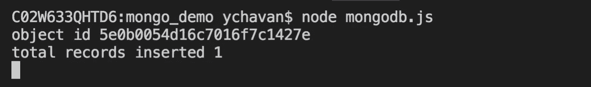
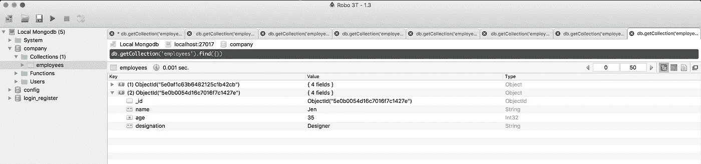

# MongoDB 中的 ObjectId 是什么，需要时如何手动生成

> 原文：<https://javascript.plainenglish.io/what-is-objectid-in-mongodb-and-how-to-generate-it-manually-when-required-923f7cf1dac8?source=collection_archive---------2----------------------->

当我们插入任何新记录/文档时，ObjectId 会自动生成


Photo by [Kevin Ku](https://unsplash.com/@ikukevk?utm_source=medium&utm_medium=referral) on [Unsplash](https://unsplash.com?utm_source=medium&utm_medium=referral)

使用 MongoDB 时，您可能已经注意到，当我们在集合中插入任何文档时，都会生成一个名为 **_id** 的额外字段。
generated _ id 的值不是任何随机数，而是一个在世界上所有 mongodb 数据库中唯一的值。

对于本文，我假设您已经在系统上安装了 MongoDB，并且已经通过运行 mongod 可执行文件启动了 MongoDB 服务器。

为了更好地理解它，我们将使用 mongodb 库而不是 mongoose 库。
使用以下命令安装 mongodb npm 软件包

```
npm install mongodb
```

创建一个新文件 mongodb.js，并在其中添加以下代码

```
const { MongoClient } = require('mongodb');
const connectionURL = "mongodb://127.0.0.1";
const databaseName = "company";MongoClient.connect(connectionURL, { useNewUrlParser: true, useUnifiedTopology: true }, (error, client) => {
 if(error) {
  return console.log('error connecting to mongodb');
 }const db = client.db(databaseName);
db.collection('employees')
 **.insertOne({ name: 'David', age: 30, designation: 'Developer' })**
 .then(result => console.log(result))
 .catch(error => console.log(error));
});
```

当您通过运行以下命令来执行上述文件时

```
node mongodb.js
```

您将看到，一个新文档被添加到公司数据库内的 employees 集合中。



正如您在上面的代码中所看到的，我们只插入了姓名、年龄和职务，但是添加了一个带有值的 extra _id 字段

```
**ObjectId("5e0af1c63b6482125c1b42cb")**
```

双引号内的值是一个 12 字节的值，包括

*   一个 4 字节的*时间戳值*，代表 ObjectId 的创建，从 1970 年 1 月 1 日午夜的 Unix 纪元开始以秒为单位测量
*   一个 5 字节的随机值
*   *3 字节*递增计数器*，初始化为随机值*

*这是特意设计的，使它在世界上所有的数据库中是唯一的，这样一个 ObjectId 将只对那个文档是唯一的。*

*在某些情况下，我们可能希望存储生成的 ObjectId 供您参考。在这种情况下，我们可以手动生成 ObjectId，并在向集合添加新文档时使用它*

```
*const { MongoClient, **ObjectID** } = require('mongodb');
const connectionURL = "mongodb://127.0.0.1";
const databaseName = "company";MongoClient.connect(connectionURL, { useNewUrlParser: true, useUnifiedTopology: true }, (error, client) => {
 if(error) {
  return console.log('error connecting to mongodb');
}const db = client.db(databaseName);
**const newObjectId = new ObjectID();****console.log('object id', newObjectId);**db.collection('employees')
 .insertOne({ **_id: newObjectId**, name: 'Jen', age: 35, designation: 'Designer' })
 .then(result => console.log('total records inserted', result.insertedCount))
 .catch(error => console.log(error));
});*
```

*从代码中可以看出，我们使用*

```
*const newObjectId = new ObjectID();*
```

*创建新的 ObjectId，并在插入文档时指定*

```
*_id: newObjectId*
```

*现在，如果您使用**节点 mongodb.js** 再次运行该文件，您将看到一个带有新生成的 id 的新文档被打印到控制台，并且与插入到数据库中的文档相同*

****

*ObjectId 还提供了 getTimestamp 方法，该方法允许我们从 ObjectId 的 12 个字节中获取时间戳值，即 *4 个字节的时间戳值**

```
*const newObjectId = new ObjectID();
console.log("timestamp value", newObjectId.getTimestamp());
// 2019-12-31T08:05:25.000Z*
```

*今天到此为止。希望你今天学到了新东西。*

***别忘了直接在你的收件箱** [**这里**](https://yogeshchavan.dev) **订阅我的每周时事通讯，里面有惊人的技巧、诀窍和文章。***