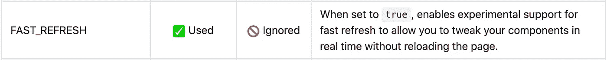

# 什么是 React 快速刷新？

> 原文：<https://javascript.plainenglish.io/what-is-react-fast-refresh-f3d1e8401333?source=collection_archive---------2----------------------->

[https://unsplash.com/photos/u2Ru4QBXA5Q](https://unsplash.com/photos/u2Ru4QBXA5Q)

如果你一直从事 React 项目，你可能听说过 [React Hot Loader](https://github.com/gaearon/react-hot-loader) ，这是一个库，当你在开发过程中修改代码时，它用于热模块替换。它从 2014 年开始出现在游戏中，被数十万开发者使用。

但是，它有自己的一套限制，不能提供真正好的开发人员体验。如果你已经开发了一个大规模的应用程序，你可能已经经历了热加载器带来的相当多的麻烦，比如代码更改、导入/导出问题、类型脚本相关的问题等等。[单击此处](https://github.com/gaearon/react-hot-loader/blob/master/docs/Troubleshooting.md)了解如何解决热加载器问题

> **React 快速刷新**是 React 热加载器的替代品。快速刷新使您的 React 应用程序在代码更改时流畅而轻松地重新加载，提供了出色的开发人员体验。

快速刷新最初是在 2019 年的 0.61 版本中与 React Native 一起推出的，但其想法是使其独立于平台。因此，一年后，快速更新将很快做出反应。

# 快速刷新有何特别之处？

*   它可以保存功能组件的**状态和重装时的挂钩**

[Happy Jennifer Aniston GIF](https://giphy.com/gifs/friends-excited-31lPv5L3aIvTi)

*   它有一个强大的热模块更换系统
*   如果进行了代码更改，而不是重新加载整个应用程序，它将只重新呈现所需的 React 组件。(如果您的组件导入只有 React 组件，而没有非 React 导入，则这种方法有效)
*   如果你有一个语法错误或运行时错误，它会自动重新加载你的应用一旦解决，避免手动重新加载。
*   有语法错误的模块被阻止运行。如果你在快速刷新过程中犯了语法错误，只要解决它并保存文件，你的应用程序就会自动重新加载。
*   如果在模块初始化期间或在组件内部出现运行时错误，快速刷新将更新模块或组件，并像以前一样继续工作。
*   快速刷新还允许您强制重置状态并重新装载组件。只需将`// @refresh reset`添加到您希望在每次代码更改时重新挂载的组件文件中。

# 快速刷新由什么组成？

*   热模块替换系统，将作为 Webpack 的一部分(尚未实施)
*   `react-refresh/babel`巴别塔插件
*   `react-refresh/runtime`你的应用入口
*   React 渲染器 16.9.0+

# 如何在 React 应用中启用快速刷新？

快速刷新是`Create React App.`中的一个实验性特性，只需在您的`.env`文件中设置`FAST_REFRESH`变量如下:

`FAST_REFRESH=true`

[CRA Documentation](https://github.com/facebook/create-react-app/blob/master/docusaurus/docs/advanced-configuration.md)

# 你应该在你的生产应用中使用它吗？

[No Way Smh GIF](https://giphy.com/gifs/DesusAndMeroOnShowtime-desus-and-mero-bodega-hive-showtime-late-night-iGAn18RZYjk7R8l0Oh)

不，还没有。它仍处于试验阶段，可能会在未来几个月作为一个稳定的功能发布。

如果你等不及正式发布，想早点试用，这里有一个与 Webpack 配合使用的库， [**React 刷新 Webpack 插件**](https://github.com/pmmmwh/react-refresh-webpack-plugin) **。但是请记住，这个库不是 100%稳定的。它的工作相当可靠，但仍有边缘情况有待发现。**

[单击此处](https://github.com/facebook/react/issues/16604#issuecomment-528663101)阅读有关快速更新、其技术实施和细微差别的更多信息。

## **用简单英语写的 JavaScript**

喜欢这篇文章吗？如果有，通过 [**订阅我们的 YouTube 频道**](https://www.youtube.com/channel/UCtipWUghju290NWcn8jhyAw) **获取更多类似内容！**