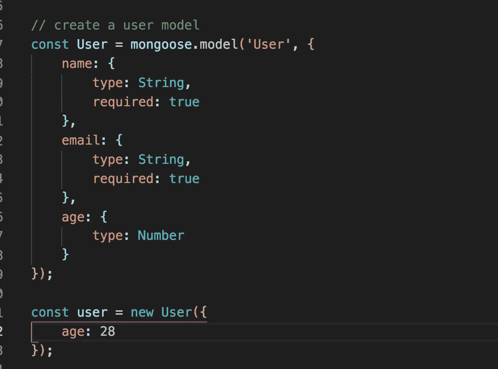
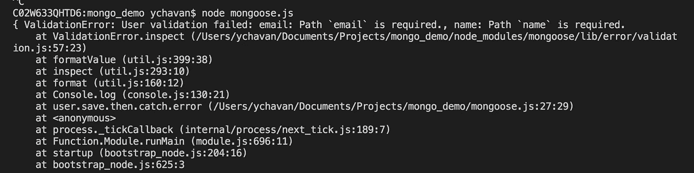
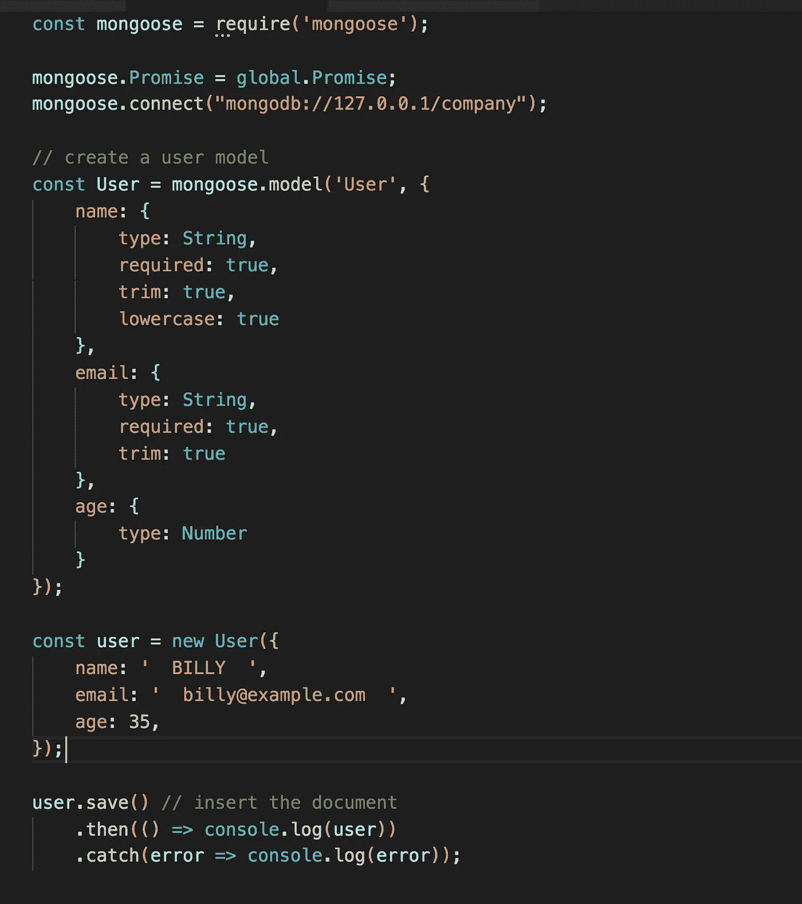
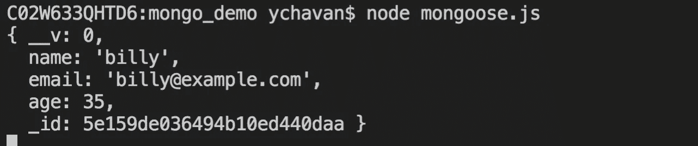
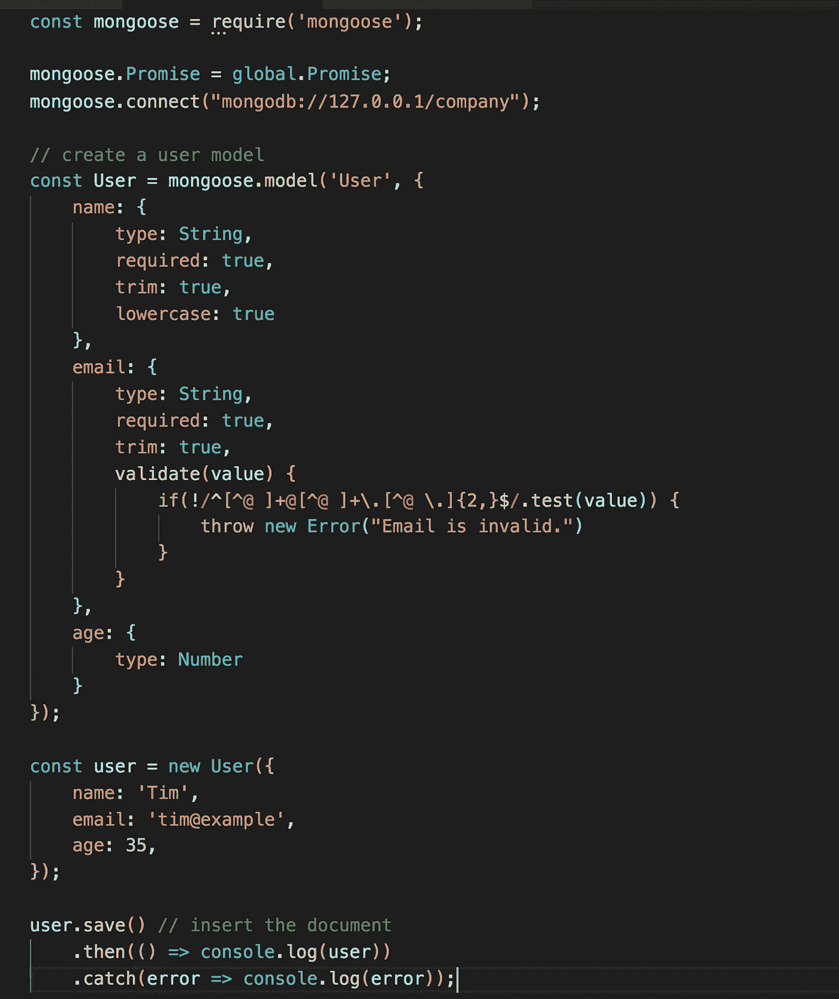

# 在使用 MongoDB 时，mongoose 库有什么特别之处

> 原文：<https://javascript.plainenglish.io/what-is-so-special-about-mongoose-library-when-working-with-mongodb-65096b97f8ae?source=collection_archive---------3----------------------->

## 从其他 npm 库中了解它受欢迎的原因


Photo by [Max Nelson](https://unsplash.com/@maxcodes?utm_source=medium&utm_medium=referral) on [Unsplash](https://unsplash.com?utm_source=medium&utm_medium=referral)

在本文中，我们将探讨为什么 mongoose 是使用 MongoDB 时的首选库，以及是什么使它流行。

所以让我们开始吧。

看看下面的 MongoDB 代码

在上面的代码中，我们将一个新文档插入到用户集合中。

插入的文档有姓名、电子邮件和年龄字段。

考虑一下，我们已经提供了一个注册表单，用户输入我们存储在 MongoDB 中的信息。

但是不能保证用户在注册时输入了有效的数据。用户可以在“年龄”字段中输入字符串，在“姓名”字段中输入数字。

如果我们想防止用户输入错误的数据，我们需要添加验证来检查每个输入字段。因此，你可能需要修剪的价值，转换成小写，因为用户可能会输入大写等数据保存到数据库之前的数据。

想象一下，您已经为所有字段添加了验证，将来如果需要向集合中添加一个新字段，比如薪水或电话号码，您需要添加另一个验证来处理它。这很麻烦，因为您需要验证验证是否处理所有场景，并修改验证函数以处理新的场景。

**mongose 通过提供内置的基本验证解决了所有这些问题。如果需要，它还允许我们编写自己的验证。因此很难弄乱要插入的数据。**

> Mongoose 还要求声明每个字段包含的数据类型，因此不可能输入错误的数据类型。

细节到此为止。让我们深入 mongoose，了解如何使用它。

安装 mongoose，使用

```
npm install mongoose@4.10.8
```

首先，我们将使用 mongoose 创建一个基本代码

创建一个新文件 mongoose.js，并添加以下代码

启动 MongoDB 服务器来监听连接。

要执行上述代码，请运行

```
node mongoose.js
```

这将使用所提供的数据在用户集合中创建一个新文档。

注意，即使我们已经提供了用户作为模型名称，mongoose 也会将其复数化，并创建一个带有名称 users 的集合。

正如您在代码中看到的，我们在创建模型时指定了文档中每个字段的类型。
现在将年龄值从数字改为字符串，并使用 ***节点 mongose . js***再次运行代码

```
const user = new User({
 name: 'David',
 email: 'david@example.com',
 age: 'John'
});
```

因此，如果您试图向集合中插入错误类型的数据，mongoose 将抛出一个错误，并且不允许您插入文档。


如果您想将某些字段标记为必填，我们可以在创建模型时将其标记为*必填:true* 。



正如你所看到的，我们已经把名字和电子邮件标记为必需的，所以如果我们试图保存没有名字或电子邮件的用户，mongoose 将抛出一个错误。



现在假设，我们想在保存文档时修剪用户输入并转换成小写值，我们可以这样做，如下所示



当我们运行代码时，我们可以看到新文档被正确插入。

尽管我们在姓名和电子邮件的前后都提供了空格，但在保存时，这两个空格都被修剪，姓名被转换为小写。



因此，只需向模型添加一个属性，mongoose 就可以轻松地进行验证，而不是为每个字段重复代码。

通过在模型中添加一个 validate 方法，我们还可以为任何字段添加我们自己的验证。用户提供的值作为 validate 方法的第一个参数传递。

对于插入到集合中的每个数据都会调用此方法，如果验证失败，数据将不会插入到集合中



在这里，我们试图保存错误的电子邮件地址 tim@example 的用户，这将因为我们添加的 validate 方法而失败。

因此，使用内置验证并允许我们添加自己的自定义验证，mongoose 使使用 MongoDB 成为一项非常简单的任务。

要了解更多关于猫鼬图书馆的信息，请导航至[https://mongoosejs.com/](https://mongoosejs.com/)

今天到此为止。希望你今天学到了新东西。

**别忘了直接在你的收件箱** [**这里**](https://yogeshchavan.dev) **订阅我的每周时事通讯，里面有惊人的技巧、诀窍和文章。**