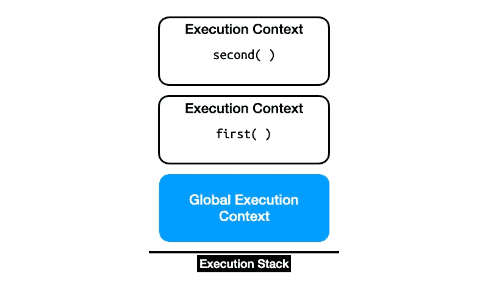
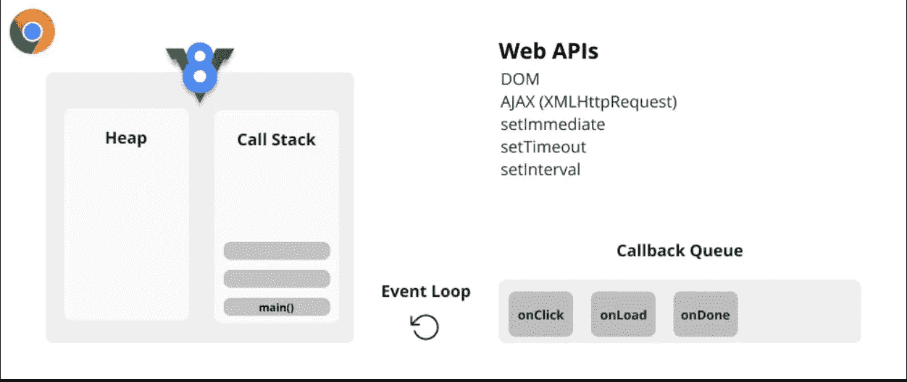

# 异步 JavaScript 和执行堆栈

> 原文：<https://javascript.plainenglish.io/what-is-synchronous-async-single-threaded-execution-context-browser-apis-256d906b186d?source=collection_archive---------5----------------------->


Photo by [Nate Grant](https://unsplash.com/@nateggrant?utm_source=unsplash&utm_medium=referral&utm_content=creditCopyText) on [Unsplash](https://unsplash.com/s/photos/coding?utm_source=unsplash&utm_medium=referral&utm_content=creditCopyText)

*JavaScript 是单线程同步语言*。这意味着运行时间长的函数会导致页面没有响应。

打开您的开发工具，跟随我的步骤，我们将演示这一点。让我们写一个名为‘hang’的函数。

```
function hang(secs){
const doneAt = Date.now() + (secs * 1000)
while( doneAt > Date.now ) {// just do nothing }}hang(50)
```

现在，当我们调用挂起函数时，我们将被阻塞 50 秒。**趁着这 50 秒；**它只是通过 while 循环，并锁定整个页面。

这是因为 JavaScript 是单线程和同步的。**然而，JavaScript 有异步运行的函数。**

首先，我们来解释一下 JavaScript 的一般结构。

## 执行堆栈

所以让我们用一种简单的方式来思考这个问题。**执行栈是**你把你的程序一个接一个的放上去，然后从下往上运行。当你完成这些作品时，从上到下把它们擦掉。

它只是一个盘子，你把饼干一个接一个地放在上面。然后当你吃这些的时候，你从最上面开始吃饼干，然后一个接一个地往下吃(JavaScript 也不能同时吃两个饼干)。这正是单线程和同步的含义。


## 执行上下文

> *形象化单词* `*Context*` *的最佳方式是，想象一个围绕你感兴趣的主题(或我们正在讨论的“上下文”)的圆圈(或包装)。语境是围绕特定事件、情况等的一系列环境或事实。(此段摘自*[blog . greenroots . info](http://blog.greenroots.info/))

**执行上下文**是 JavaScript 放在执行堆栈上的部分，帮助 JavaScript 引擎运行我们的代码。

*就像函数/模块允许我们将代码分割成小块，降低实现代码的复杂度一样，* ***执行上下文*** *允许 JavaScript 引擎降低运行代码的复杂度。*



第一个执行上下文是**“全局执行上下文”**。即使您在一个`.js`文件中没有一行代码并运行它，您也会创建全局执行上下文。

这个全局执行上下文包括两件事:

*   一个全局对象(如果在浏览器中运行 JavaScript，则为`window`，如果在节点环境中运行，则为`global`)
*   引用全局对象的名为`this` 的变量

> *在 JavaScript 中，***一个函数之外的一切都是全局的。**

## 全局对象

所有的变量，所有的函数实际上都是全局对象上的键，参数或者方法。在您的控制台上实际尝试一下，调用窗口对象，并查看其中的全局参数。

例如，如果你试图声明一个变量；

```
var x = 8;x  // outputs 8window.x // outputs 8 // same thing
```

所以当你声明一个变量时，它会自动进入窗口对象。所以你声明的每个变量都是窗口对象的一部分。

稍后，如上图所示，函数执行上下文从代码的顶部添加到堆栈中。函数执行上下文与 global 非常相似，但是很明显，它不创建全局对象，而是创建作为参数传递给函数的变量。

所以使用可视化工具有助于更好地理解这个过程。我不会详细说明这一点，但认为它是；

**全局执行上下文** → *你把你的函数放在堆栈里(像 cookies 一样)*—**first function _ you _ invoked _ in _ the _ code()**—*当这个 fnc 返回某个东西时，它从堆栈里被清除*→**middle function _ invoked()**—*当这个 fnc 返回某个东西时，它从堆栈里被清除→***last function _ invoked()**

那么当我们第一次运行代码时会发生什么呢？

1.  将创建一个全局对象。
2.  一个变量称这个引用为那个对象。
3.  JavaScript 引擎将为该代码中的所有变量和函数保留内存。函数声明将完全放在内存中。
4.  对于每个变量，引擎将设置`undefined`的值

第四步实际上叫做**吊装**，你可能听说过。这没什么好困惑的。JavaScript 实际执行我们的代码之前的第一件事，发生了 4 个步骤。我们所有的变量都赋给了 undefined。如果你想看到一个名为' a '的变量，并且在声明 a 之前做了`console.log('a: ', a)`，你将会因为这个原因得到 undefined，(如果你做了 let 或 const 你将会得到一个错误)。

现在我们有了执行堆栈的概念，让我们继续讨论异步 JavaScript

## 异步 JavaScript

问题是:

```
function printOne() {
  console.log(1)
}function printTwo() {
  console.log(2)
}function printThree() {
  console.log(3)
}setTimeout(printOne, 1000)
setTimeout(printTwo, 0)
printThree()
```

你将以什么样的顺序得到输出？

是学习这个概念时很常见的问题。通常，人们可能会回答为 2，3，1。但是，输出将是 3，2，1。

现在我们知道 JavaScript 可以一次执行一件事，但是还有三个概念可以理解为什么会这样。



1.  **浏览器 API**

基本上，这些函数不是直接内置在 Javascript 中，而是可以在浏览器中运行。浏览器有自己的 API 集，如 **setTimeout** 和 **XMLHttpRequests** ，这些 API 在 Javascript 运行时中没有指定。

**setTimeout** 是由浏览器处理的异步函数之一。(因此它不是单线程的，可以一次处理两个或更多的函数), browser 负责跟踪秒数，直到函数被执行。

那么上面的代码中发生了什么呢？setTimeout(printone)和 setTimeout(printtwo)被用于浏览器 API，因为浏览器会处理它们。**函数 printthree** 立即放入堆栈，JavaScript 引擎执行它。

所以“3”被打印出来。并从堆栈中移除。

每当堆栈为空时，JavaScript 引擎就可以寻找一个**函数队列**，如果有一个要运行的话。

1.  **功能队列**

现在浏览器会说，已经过了 0 秒了，是时候把 printtwo 函数放入函数队列了。我会记录 printone 函数的秒数。当它准备好了，我也会把它放到函数队列中。所以我们看到，函数队列只是一行，*为 API 函数队列*。

当堆栈清空后，JavaScript 引擎会进入函数队列，说，好的，给我队列中的第一个函数，我会把它放入堆栈并执行它。

所以“2”被打印出来，从堆栈中移除。1 秒钟后,“1”被打印出来，并从堆栈中删除。

您不需要担心这个过程，因为**事件循环**会处理它。

**3。事件循环**

**事件循环**在不断检查，如果栈上有东西，就先执行。

一旦堆栈清空，事件循环将队列中的第一个函数放入堆栈(如果有的话)。并将其从队列中删除。

总之，理解 JavaScript 是**同步的**是非常重要的，它会一个接一个地执行堆栈，除非它是空的。当它为空时，事件循环将查找函数队列并逐个执行它们。我这样说是因为当你在学习回调，承诺，这个 JavaScript 中的关键词时，你会理解它背后的结构，会容易很多。

例如，这个关键词有一个定义，希望在这篇文章**之后它会有意义。*这个*** *关键字指的是在创建新的执行上下文时设置的对象。(函数调用)在全局执行上下文中，这是指全局对象。如果函数作为对象的方法调用，“this”将绑定到调用该方法的对象。*

喜欢这篇文章吗？如果是这样，通过 [**订阅解码获得更多类似内容，我们的 YouTube 频道**](https://www.youtube.com/channel/UCtipWUghju290NWcn8jhyAw) **！**