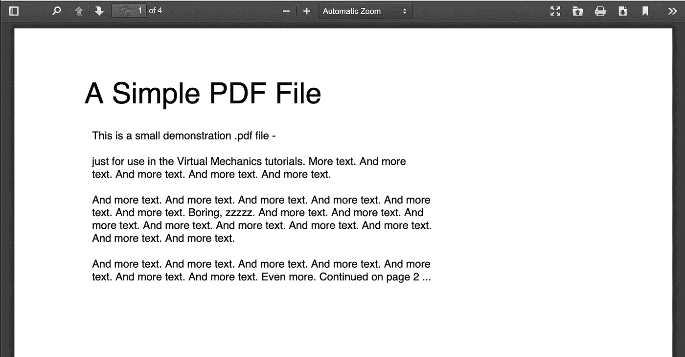
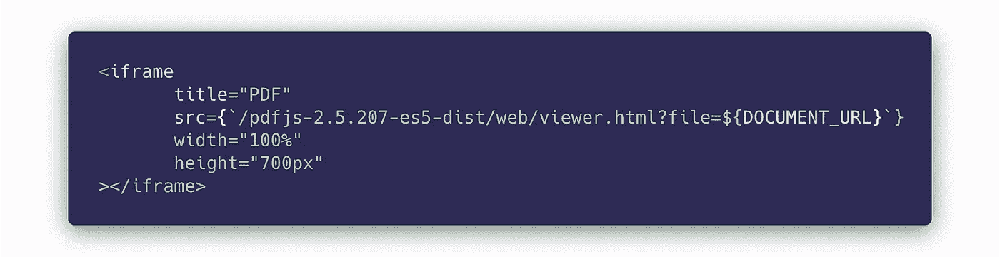

# 在 Web 应用程序中显示 PDF 的最佳方式是什么？

> 原文：<https://javascript.plainenglish.io/what-is-the-best-way-to-display-a-pdf-in-a-web-app-cb20dca3adbb?source=collection_archive---------0----------------------->

Photo by [Andre A. Xavier](https://unsplash.com/@andreamaraldg?utm_source=medium&utm_medium=referral) on [Unsplash](https://unsplash.com?utm_source=medium&utm_medium=referral)

在 web 应用程序中显示 PDF 应该非常简单。

在大多数情况下是这样的。

大多数网络浏览器*都支持本地显示 pdf，不需要第三方库。然而，行为将*而不是*总是一致的。*

让我们先看看你可以在你的 web 应用程序中显示 PDF 的一些方法，然后展示最好的技术，Mozilla 的 PDF.js 在 React 应用程序的上下文中的。

# 使用<embed>

使用`<embed>`标签可以在所有主流桌面浏览器上工作，但是在移动设备上就不行了。如果这还能满足你的需求，那就来吧:

✅在所有主流桌面浏览器上都运行良好

✅为您提供了在自己的文档结构中嵌入 PDF 的可能性(即，您可以在 PDF 文档的上方/下方/旁边拥有自己的 UI 元素)

❌在所有手机浏览器上都失败了

# 使用谷歌文档浏览器

如果你在网上搜索“如何在网络应用中显示 pdf”，你会遇到这个奇怪的解决方案。基本上，它使用一个未记录的 Google API，在一个`<iframe>`中呈现 PDF。

这在过去可能行得通，但现在不行了。更准确地说，它*在 50%的时间里都在*工作。其他时候，它会因错误而失败。 *Meh* 。不要再尝试这种方法了。

# 使用简单的链接

这是一条单线铁路。它使用一个链接到 PDF 文档的 HTML `<a>`标签。

一方面，这很棒，因为它将处理 PDF 的责任委托给了平台本身(例如，你的 Mac 或 PC 或电话)。每个设备都能以自己的方式显示 PDF。

另一方面，这意味着我们在表现行为方面完全失控。

问题是:*这是什么*行为，这*符合你的需求吗？*

桌面上的✅/❓它在浏览器的 PDF 插件的一个单独的标签中打开 PDF

移动 it 上的✅/❓下载 PDF，并使用平台的默认 PDF 查看器自动打开

✅信任平台展示 PDF 在很多情况下是一件好事。这意味着我们没有维护或风险

❌无法将此嵌入我们的文档/网页结构中

# Mozilla 的 PDF.js

Mozilla 的库 [PDF.js](https://mozilla.github.io/pdf.js/) 是显示 PDF 的一个很好的工具。基本上，它是 Firefox 用来显示 pdf 的工具，他们已经很友好地将它开源了。

为什么这是最佳方法？嗯，因为它在所有设备和平台上都是一致的。

✅在所有浏览器(手机、桌面)上都能正常工作

✅将 PDF 嵌入到您自己的文档结构中

PDF.js 的视图层附带了一个有用的工具栏(如果您使用它，Mozilla 会要求您对它进行样式化/自定义)。这是 PDF.js 默认显示 PDF 的方式:

# 在 React 或任何其他前端应用程序中使用 PDF.js

从这里随意拿走源代码:【https://github.com/adamkss/pdf-js-test[。](https://github.com/adamkss/pdf-js-test)

尽管上面的例子使用了一个 Create-React-App 项目，但是您可以很容易地将下面的方法集成到任何框架/普通的应用程序中。

1.  去[https://mozilla.github.io/pdf.js/getting_started/#download](https://mozilla.github.io/pdf.js/getting_started/#download)下载 ES5 预置版本
2.  将归档文件的内容解压到您的`public`文件夹中
3.  将一个`<iframe>`放在你的 web 应用程序中任何你想要的地方，用`src`属性指向你的 PDF.js 的`viewer.html`，用文件 URL 作为查询参数

就是这样！很简单。

你可以在这里看到现场演示:[https://pdf-js-test.netlify.app/](https://pdf-js-test.netlify.app/)。

现在您有了一个可以在所有平台上正常工作的 PDF 查看器。

干杯！🍻