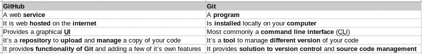

# Git 和 GitHub 有什么区别？

> 原文：<https://javascript.plainenglish.io/what-is-the-difference-between-git-and-github-23fc6ac62b13?source=collection_archive---------10----------------------->

经常有新程序员混淆 Git 和 GitHub。两者都是软件开发人员日常使用的。这两者是互补的，但并不相同。在这篇文章中，我将解释这两者之间的主要区别，这样你就不会再混淆它们了。

Photo by [Luke Chesser](https://unsplash.com/@lukechesser?utm_source=medium&utm_medium=referral) on [Unsplash](https://unsplash.com?utm_source=medium&utm_medium=referral)

## 饭桶

Git 是一个管理不同版本代码的软件。这些功能也称为版本控制或源代码管理。它作为命令行工具在您的计算机上本地运行，也就是说，您通常通过终端与它交互，即使存在大量的 Git 客户端来使使用 Git 更加方便。

Git 不是版本控制或源代码管理的唯一工具。除了 Git，你还有 Subversion (SVN)，Mercurial，CVS 等等。

这里是不同版本控制软件的[列表。](https://en.wikipedia.org/wiki/Comparison_of_version-control_software)

## 开源代码库

GitHub 是一个网络服务，你可以上传你的代码库。作为一个 web 应用程序，它提供了一个带有按钮、文本框等的 web 界面。你可以用来和它互动。它提供了 Git 的功能，也提供了它自己的一些功能。

除了 GitHub，还有其他类似的 web 服务，例如:GitLab、BitBucket、SourceForge 等。

这里是 GitHub 备选方案的[列表](https://www.tecmint.com/github-alternatives-to-host-open-source-projects/)。

## 摘要

下面我列出了 GitHub 和 Git 的主要区别

你有什么问题吗？我错过什么了吗？在下面分享你的想法和评论