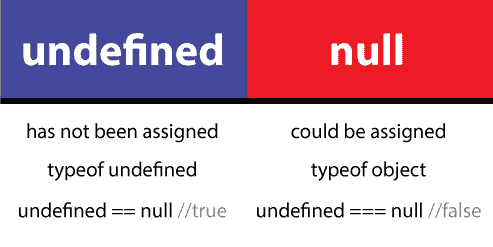
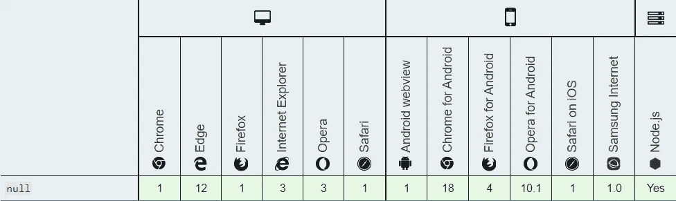

# Null 和未定义的 JavaScript 有什么区别？

> 原文：<https://javascript.plainenglish.io/what-is-the-difference-between-null-and-undefined-javascript-cb9bc29cc9ea?source=collection_archive---------1----------------------->


## 空 vs 未定义

Null 意味着故意缺少对象值。Null 表示缺少标识，表示变量没有指向任何对象。

> 简单来说，我们可以说它是一个关键字，表示“没有价值”或不存在任何价值。

它不能用作任何全局对象属性的标识符，例如在 undefined 的情况下。对于布尔运算，它被视为假。

```
var nullVariable = null;
console.log(nullVariable);**Output ->**
null
```

# 空 VS 未定义

## 赋值

*   如果一个变量已经被声明，但没有被赋值，那么这个变量被称为 ***未定义*** 。其中 as， ***null*** 是可以赋给变量的值，表示“无值”。
*   JavaScript 将未赋值的变量设置为默认值`undefined.`，它从不将值设置为`null`。程序员用它来表示一个`var`没有值。
*   `undefined`在 JSON 中无效，而`null`有效。

## 原始类型转换

在对 NULL 进行算术转换的情况下，确定的值将为 0。

```
var sum = 111 + null;
console.log(sum)**Output --> 111**
```

然而，在未定义的情况下，不会发生算术转换。如果我们给 undefined 添加任何东西，结果将是 **NaN** 或**Not-a Number**。

```
var sum = 111 + undefined;
console.log(sum)**Output -> NaN**
```

## 几个例子来说明不同之处。

```
console.log(typeof null);
console.log(typeof undefined);    
console.log(null === undefined);   
console.log(null  == undefined); 
console.log(null === null);       
console.log(null == null);       
console.log(!null);                
console.log(isNaN(1 + null));     
console.log(isNaN(1 + undefined));**Output ->** 
object
undefined
false
true
true
true
true
false
true
```



# 结论

*   Null 是 JavaScript 的原始值之一。
*   **Null** 是一个具有有效值的对象，没有属性，是不可变的，并且系统中始终只存在一个相同的实例。
*   **null** 的数据类型是 object，as **undefined** 的数据类型是 undefined。
*   `null !== undefined`而是`null == undefined`。

# 浏览器兼容性



## 参考

[Mozilla 网络文档](https://developer.mozilla.org/en-US/docs/Web/JavaScript/Reference/Global_Objects/null)

用简单的英语写的 JavaScript 的注释:我们总是对帮助推广高质量的内容感兴趣。如果你有一篇文章想用简单的英语提交给 JavaScript，用你的中级用户名发一封电子邮件到[submissions@javascriptinplainenglish.com](mailto:submissions@javascriptinplainenglish.com)，我们会把你添加为作者。